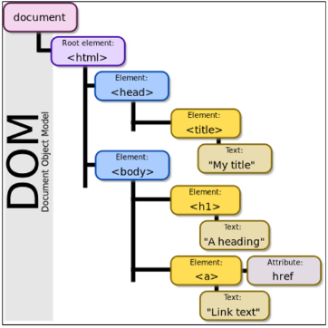

  # JavaScript

### JavaScript를 배워야 하는 이유
- Wev기술의 기반이 되는 언어
  - HTML 문서의 콘텐츠를 ```동적으로 변경```할 수 있는 언어
  - Web이라는 공간에서 채팅, 게임 등 다양한 동작을 할 수 있게 된 기반
- 다양한 분야로 확장이 가능한 언어
  - JavaScript는 Web을 위해 탄생한 언어로, 초기에는 언어의 특성상 많은 개발자에게 환영 받지 못함
  - 하지만 버전이 올라가면서 하나의 단단한 언어로 자리 매김을 한 언어
  - 단순히 Web 조작을 넘어서 서버 프로그래밍, 모바일 서비스, 컴퓨터 응용프로그래밍, 블록체인, 게임 개발 등 ```다양한 분야에서 활용이 가능한 언어```가 됨
  - 과거에는 단순히 Web Front-end를 위해서만 JavaScript 개발자를 찾았다면 이제는 그 영역이 매우 넓어져 다양한 직군에서 찾는 언어가 됨
### JavaScript 역사
- 개요
  - JavaScript의 개발 환경 전에 역사 알아보기
  - Web을 조작하기 위한 언어인 만큼 ```Web Browser와도 깊은 연관 관계가 있음```
  - 이러한 이유 때문에 JavaScript를 처음 학습할 때 다양한 용어를 접하게 되는데 역사를 통해 전체적인 그림을 그려보고자 함
- 웹 브라우저의 역할
  - URL을 통해 Web(WWW)을 탐색함
  - ```HTML/CSS/JavaScript를 이해한 뒤 해석```해서 사용자에게 하나의 화면으로 보여줌
  - 웹 서비스 이용 시 클라이언트의 역할을 함
  - 즉, 웹 페이지 코드를 이해하고, 보여주는 역할을 하는 것이 바로 웹 브라우저
- 웹 브라우저와 스크립트 언어
  - 1993, Mosaic Web Browser
    - 유저가 웹을 쉽게 탐색할 수 있게 버튼 등을 탑재한 GUI 기반의 웹 브라우저
  - 1994, Netscape Navigator
    - Mosaic Web Browser를 개선한 후속작, 시장 점유율 80% 차지
  - 이때까지만 해도 정적 웹페이지를 단순히 보여주는 용도에 그침
  - 웹 브라우저에 탑재해서 웹 페이지를 동적으로 바꿔줄 Script 언어 개발 필요
    - Script언어 
      - 소스코드를 기계어로 바꿔주는 컴파일러 없이 바로 실행 가능한 언어, 속도가 느리다는 단점이 있음
  - Netscape에서 약 10일의 개발 기간을 통해 Script언어인 Mocha 개발
  - 이후 LiveScript로 이름 변경 후 브라우저에 LiceScript를 해석해주는 Engine을 내장
  - 이후 당시 인기있던 JAVA의 명성에 기대보고자 JavaScript로 이름 변경
  - 1995, Microsoft의 Insternet Explorer
    - JavaScript를 그대로 복사한 JScript라는 언어 제작 후 이를 탑재한 Wev Browser인 Internet Explorer 출시
    - 이후 JavaScript와 JScript는 각자의 기능을 추가하기 시작
    - 개발자들은 Netscape Navigator와 Internet Explorer 각각에 대한 코드를 작성해야 하는 상황을 맞이하게 됨
  - 1996-2000, ECMA 표준 발의
    - Netscape가 정보 통신에 관한 규약을 만드는 비영리 단체 ECMA에게 JavaScript 기반의 표준안 발의 제안, ECMAScript 1 출시
    - 이후 여러가지 문법이 추가되며 ECMAScript의 버전이 올라감
    - 이 상황을 지켜보던 Microsoft
      - Windows에 Internet Explorer 기본으로 탑재
    - 결국 시장 점유율 95% 이상으로 증가, ECMAScript 표준안 지키지 않겠다 선언
  - 2001-2004, 다양한 웹 브라우저의 등장
    - ActionScript3라는 스크립트 언어를 기반으로 한 Firefox 웹 브라우저 출시
    - 개발자는 여러 브라우저를 지원하기 위해 고통받음
  - jQuert 등의 라이브러리 등장
    - 각 브라우저의 엔진에 맞는 스크립트를 여러 번 작성하는 것이 고통스러움
    - 중간에 하나의 레이어를 두고 코딩하는 것 = jQuery
      - jQuery 문법에 맞춰 작성하면 브라우저별 엔진에 맞는 스크립트 변환은 jQuert가 알아서 변환해줌
    - 이후 아주 많은 코드가 jQuery로 작성됨
  - 2008, Google의 Chrome 등장과 대통합의 시대
    - V8이라는 강력한 엔진을 탑재한 Chrome 등장
      - JavaScript 해석이 다른 웹 브라우저에 비해 월등히 빠름
      - 이로 인해 웹 브라우저가 버벅임이 없고 매우 빠르게 동작
    - Chrome의 성능 앞에서 다른 웹 브라우저 들이 함께 표준안을 만들자고 제안
  - 2009, ECMAScript5 (ES5) 표준안 제정
  - 2015, ECMAScript6 (ES6) 표준안 제정
  - 이후에도 계속해서 버전이 업데이트 되고 있으나, 큰 변화는 ```ES6에서 이루어짐```
- 정리
  - 웹 브라우저는 JavaScript를 해석하는 엔진을 가지고 있음
  - 현재의 JavaScript를 해석하는 엔진을 가지고 있음
  - 현재의 JavaScript는 이제 시장에서 자리를 잡은 언어이며, 개발에서 큰 축을 담당하는 언어
  - 더 이상 jQuery 등의 라이브러리를 사용할 필요 없음(모든 웹 브라우저가 표준안을 따름)
  - 특히 Chrome의 V8의 경우 JavaScript를 번역하는 속도가 매우 빠름
    - node.js, react.js, electron등의 내부엔진으로 사용됨
    - back-end, mobile, desktop app등을 모두 JavaScript로 개발 가능해짐


### DOM
- 개요
  - "브라우저에서의 JavaScript"
    - JavaScript는 웹 페이지에서 다양한 기능을 구현하는 스크립트 언어
    - 정적인 정보만 보여주던 웹 페이지를 데이터가 주기적으로 갱신되거나, 사용자와 상호작용을 하거나, 애니메이션 등이 동작하게 하는 것을 가능하게 함
  - [참고] 스크립트 언어(Script Language)
    - 기존에 존재하는 응용 소프트웨어를 제어하는 컴퓨터 프로그래밍
- Browser APIs
  - 웹 프라우저에 내장된 API로, 웹 브라우저가 현재 컴퓨터 환경에 관한 데이터를 제공하거나, 오디오를 재생하는 등 여러가지 유용하고 복잡한 일을 수행할 수 있게 함
  - JavaScript로 Browser API들을 사용해서 여러가지 기능을 사용할 수 있음
  - 종류
    - DOM
    - Geolocation API - 지리정보
    - WebGL - 그래픽
- DOM
  - 문서 객체 모델(Document Object Model)
  - 문서의 구조화된 표현을 제공하며 프로그래밍 언어가 DOM 구조에 접근할 수 있는 방법을 제공
    - 문서 구조, 스타일, 내용 등을 쉽게 변경할 수 있게 도움
    - HTML 콘텐츠를 추가, 제거, 변경하고, 동적으로 페이지에 스타일을 추가하는 등 HTML/CSS를 조작할 수 있음
  - HTML 문서를 구조화하여 각 요소를 객체(object)로 취급
  - 단순한 속성 접근, 메서드 활용 뿐만 아니라 프로그래밍 언어적 특성을 활용한 조작 가능
  - DOM은 문서를 논리 트리로 표현
  - DOM 메서드를 사용하면 프로그래밍적으로 트리에 접근할 수 있고 이를 통해 문서의 구조, 스타일, 컨텐츠를 변경할 수 있음
  
  - 웹 페이지는 일종의 문서(document)
  - 이 문서는 웹 브라우저를 통해 그 내용이 해석되어 웹 브라우저 화면에 나타나거나 HTML코드 자체로 나타나기도 함
  - DOM은 동일한 문서를 표현하고, 저장하고, 조작하는 방법을 제공
  - DOM은 웹 페이지의 객체 지향 표현이며, JavaScript와 같은 스크립트 언어를 이용해 DOM을 수정할 수 있음
- DOM에 접근하기
 - DOM을 사용하기 위해 특별히 해야 할 일은 없음
 - 모든 웹 브라우저는 스크립트 언어가 손쉽게 웹 페이지의 요소에 접근할 수 있도록 만들기 위해 DOM 구조를 항상 사용
 - 우리는 DOM의 주요 객체들을 활용하여 문서를 조작하거나 특정 요소들을 얻을 수 있음
  - DOM의 주요 객체
    - ```window```
      - DOM을 표현하는 창
      - 가장 최상위 객체(작성시 생략 가능)
      - 탭 기능이 있는 브라우저에서는 각각의 탭을 각각의 window 객체로 나타냄
      
      - window의 메서드 예시
      
    - ```document```
      - 브라우저가 불러온 웹 페이지
      - 페이지 컨텐츠의 진입점 역할을 하며, < body> 등과 같은 수많은 다른 요소들을 포함하고 있음
      
      - document의 속성 예시
      
      - [참고] document는 window의 속성이다.
      
      - [참고] 파싱(Parsing)
        - 구문 분석, 해석
        - 브라우저가 문자열을 해석하여 DOM Tree로 만드는 과정
        
    - navigator, location, history, screen 등
#### DOM 조작
- 개요
  - Document가 제공하는 기능을 사용해 웹 페이지 문서 조작하기
  - DOM조작 순서
    1. 선택(Select)
    2. 조작(Manipulation)
      - 생성, 추가, 삭제 등
- 선택 관련 메서드
  - document.querySelector(selector)
    - 제공한 선택자와 일치하는 element 한 개 선택
    - 제공한 CSS selector를 만족하는 첫 번째 element객체를 반환(없다면 null 반환)
  - document.querySelectorAll(selector)
    - 제공한 선택자와 일치하는 여러 element를 선택
    - 매칭할 하나 이상의 셀렉터를 포함하는 유효한 CSS selector를 인자(문자열)로 받음
    - 제공한 CSS selector를 만족하는 NodeList를 반환
  - 실습
    
    

- [참고] NodeList
  - index로만 각 항목에 접근 가능
  - 배열의 forEach 메서드 및 다양한 배열 메서드 사용 가능
  - querySelectorAll()에 의해 반환되는 NodeList는 DOM의 변경사항을 실시간으로 반영하지 않음
- 조작 관련 메서드
  - 조작 관련 메서드(생성)
    - document.createElement(tagName)
      - 작성한 tagName의 HTML 요소를 생성하여 반환
  - 조작 관련 메서드(입력)
    - Node.innerText
      - Node 객체와 그 자손의 텍스트 컨텐츠(DOMString)를 표현(해당 요소 내부의 raw text)
      - 사람이 읽을 수 있는 요소만 남김
      - 즉, 줄 바꿈을 인식하고 숨겨진 내용을 무시하는 등 최종적으로 스타일링이 적용된 모습으로 표현됨
  - 조작 관련 메서드(추가)
    - Node.appendChild()
      - 한 Node를 특정 부모 Node의 자식 NodeList중 마지막 자식으로 삽입
      - 한 번에 오직 하나의 Node만 추가할 수 있음
      - 추가된 Node 객체를 반환
      - 만약 주어진 Node가 이미 문서에 존재하는 다른 Node를 참조한다면 현재 위치에서 새로운 위치로 이동
  - 조작 관련 메서드(삭제)
    - Node.removeChild()
      - Dom에서 자식 Node를 제거
      - 제거된 Node를 반환
  - 실습
    
    
  - 조작 관련 메서드(속성 조회 및 설정)
    - Element.getAttribute(attributeName)
      - 해당 요소의 지정된 값(문자열)을 반환
      - 인자(attributeName)는 값을 얻고자 하는 속성의 이름
    - Element.setAttribute(name. value)
      - 지정된 요소의 값을 설정
      - 속성이 이미 존재하면 값을 갱신, 존재하지 않으면 지정된 이름과 값으로 새 속성을 추가
    
    
- DOM 조작 정리
  1. 선택한다
    - querySelector()
    - querySelectorAll()
  2. 조작한다
    - innerText
    - setAttribute()
    - getAttribute()
    - createElement()
    - appendChild()

### EVENT
- 개요
  - Event란 프로그래밍하고 있는 시스템에서 일어나는 사건(action) 혹은 발생(occurrence)으로, 각 이벤트에 대해 조작할 수 있도록 특정 시점을 시스템이 알려주는 것
    - 예를 들어 사용자가 웹 페이지의 버튼을 클릭한다면 클릭에 대해 이벤트가 발생하고 우리는 이벤트를 통해 클릭이라는 사건에 대한 결과를 받거나, 조작을 할 수 있음
  - 클릭 말고도 웹에서는 각양각색의 Event가 존재
    - 키보드 키 입력, 브라우저 닫기, 데이터 제출, 텍스트 복사 등
- Event object
  - 네트워크 활동이나 사용자와의 상호작용 같은 사건의 발생을 알리기 위한 객체
  - Event 발생
    - 마우스를 클릭하거나 키보드를 누르는 등 사용자 행동으로 발생할 수도 있고 특정 메서드를 호출하여 프로그래밍적으로도 만들어 낼 수 있음
  - DOM 요소는 Event를 받고('수신')
  - 받은 Event를 '처리'할 수 있음
    - Event처리는 주로 ```addEventListener()```라는 Event처리기(Event handler)를 다양한 html 요소에 '부착'해서 처리함
      - Event handler - addEventListener()
        
      - EventTarget.addEventListener(type, listener[, options])
        - 지정한 Event가 대상에 전달될 때마다 호출할 함수를 설정
        - Event를 지원하는 모든 객체(Element, Document, Window 등)를 대상(EventTarget)으로 지정 가능
        - type
          - 반응 할 Event 유형을 나타내는 대소문자 구분 문자열
          - 대표 이벤트
            - input, click, submit...
            - 다양한 이벤트 확인(https://developer.mozilla.org/en-US/docs/Web/Events)
        - listener
          - 지정된 타입의 Event를 수신할 객체
          - JavaScript function 객체(콜백 함수)여야 함
          - 콜백 함수는 발생한 Event의 데이터를 가진 Event 객체를 유일한 매개변수로 받음
        - 정리
          - ~하면 ~한다
            - 클릭하면 경고창을 띄운다
            - 특정 Event가 발생하면, 할 일(콜백 함수)을 등록한다.
    - 실습
      
      
      
      
  - Event 취소
    - event.preventDefault()
      - 현재 Event의 기본 동작을 중단
      - HTML 요소의 기본 동작을 작동하지 않게 막음
      - HTML 요소의 기본 동작 예시
        - a 태그: 클릭 시 특정 주소로 이동
        - form 태그: form 데이터 전송
    - 실습
      
      
  - Event 종합 실습
    
    
    - [참고] lodash
      - 모듈성, 성능 및 추가 기능을 제공하는 JavaScript 유틸리티 라이브러리
      - array, object등 자료구조를 다룰 때 사용하는 유용하고 간편한 유틸리티 함수들을 제공
      - 함수 예시
        - reverse, sortBy, range, random...
      - https://lodash.com/
    
    
    
### this
- 어떠한 object를 가리키는 키워드
  - java에서의 this와 python에서의 self는 인스턴스 자기자신을 가리킴
- JavaScript의 함수는 호출될 때 this를 암묵적으로 전달 받음
- JavaScript에서의 this는 일반적인 프로그래밍 언어에서의 this와 조금 다르게 동작
- JavaScript는 해당 ```함수 호출 방식```에 따라 this에 바인딩 되는 객체가 달라짐
- 즉, 함수를 선언할 때 this에 객체가 결정되는 것이 아니고, 함수를 호출할 때 ```함수가 어떻게 호출 되었는지에 따라 동적으로 결정```됨
- this Index
  1. 전역 문맥에서의 this
    - 브라우저의 전역 객체인 window를 가리킴
      - 전역객체는 모든 객체의 유일한 최상위 객체를 의미
      ```js
      console.log(this) // window
      ```
  2. 함수 문맥에서의 this
    - 함수의 this 키워드는 다른 언어와 조금 다르게 동작
      - this의 값은 **함수를 호출한 방법에 의해 결정**됨
      - 함수 내부에서 this의 값은 함수를 호출한 방법에 의해 좌우됨
    1. 단순 호출
    - 전역 객체를 가리킴
    - 전역은 브라우저에서는 window, Node.js는 global을 의미함
    
    2. Method(Function in Object, 객체의 메서드로서)
    - 메서드로 선언하고 호출한다면, 객체의 메서드이므로 해당 객체가 바인딩
    
    3. Nested(Function 키워드)
    - forEach의 콜백 함수에서의 this가 메서드의 객체를 가리키지 못하고 전역 객체 window를 가리킴
    - 단순 호출 방식으로 사용되었기 때문
    - 이를 해결하기 위해 등장한 함수 표현식이 바로 '화살표 함수'
    
    - Nested(화살표 함수)
      - 이전에 일반 function 키워드와 달리 메서드의 객체를 잘 가리킴
      - 화살표 함수에서 this는 자신을 감싼 정적 범위
      - 자동으로 한 단계 상위의 scope의 context를 바인딩
      
    - Nested(function 키워드와 화살표 함수 비교)
      
    - 화살표 함수
      - 화살표 함수는 호출의 위치와 상관 없이 상위 스코프를 가리킴 (Lexical scope this)
      - Lexical scope
        - 함수를 어디서 호출하는지가 아니라 어디에 선언하였는지에 따라 결정
        - Static scope라고도 하며 대부분의 프로그래밍 언어에서 따르는 방식
      - 따라서 함수 내의 함수 상황에서 화살표 함수를 쓰는 것을 권장
- this와 addEventListener
  - addEventListener에서의 콜백 함수는 특별하게 function 키워드의 경우 addEventListener를 호출한 대상을(event.target) 뜻함
  - 반면 화살표 함수의 경우 상위 스코프를 지칭하기 때문에 window 객체가 바인딩됨
  - 결론
    - addEventListener의 콜백 함수는 function 키워드를 사용하기
  

- this가 호출되는 순간에 결정되는 것(런타임) 장점/단점
  - 장점
    - 함수(메서드)를 하나만 만들어서 여러 객체에서 재사용할 수 있다.
  - 단점
    - 이런 유연함이 실수로 이어질 수 있다는 것
  - JS THIS가 좋은지 나쁜지는 우리가 판단하는 것이 중요한 것이 아니다.

### 동기와 비동기
- 개요
  - JavaScript에서의 비동기 처리 학습
- Intro
  - 주문 후 커피가 나올 때까지 뒷사람이 기다려야 함 (동기식)
  - 주문 후 진동벨이 울리면 커피를 가져옴 (비동기)
- 동기(Synchronous)
  - 모든 일을 순서대로 하나씩 처리하는 것
  - 순서대로 처리한다 == 이전 작업이 끝나면 다음 작업을 시작한다
  - 우리가 작성했던 Python 코드가 모두 동기식
  
  - 요청과 응답을 동기식으로 처리한다면?
    - 요청을 보내고 응답이 올때까지 기다렸다가 다음 로직 처리
  - 웹에서 동기 경험하기
  
- 비동기(Asynchronous)
  - 작업을 시작한 후 결과를 기다리지 않고 다음 작업을 처리하는 것 (병렬적 수행)
  - 시간이 필요한 작업들은 요청을 보낸 뒤 응답이 빨리 오는 작업부터 처리
  - 예시) Gmail에서 메일 전송을 누르면 목록 화면으로 전환되지만 실제로 메일을 보내는 작업은 병렬적으로 뒤에서 처리됨
  
  - 사용하는 이유
    - 사용자 경험
      - 예를 들어 아주 큰 데이터를 불러온 뒤 실행되는 앱이 있을 때, 동기로 처리한다면 데이터를 모두 불러온 뒤에야 앱의 실행 로직이 수행되므로 사용자들은 마치 앱이 멈춘 것과 같은 경험을 겪게 됨
      - 즉, 동기식 처리는 특정 로직이 실행되는 동안 다른 로직 실행을 차단하기 때문에 마치 프로그램이 응답하지 않는 듯한 사용자 경험을 만들게 됨
      - ```비동기로 처리한다면 먼저 처리되는 부분부터 보여줄 수 있으므로```, 사용자 경험에 긍정적인 효과를 볼 수 있음
    
### JavaScript의 비동기 처리
- Single Thread 언어, JavaScript
  - ```JavaScript는 한번에 하나의 일만 수행할 수 있는 Single Thread언어```로 동시에 여러 작업을 처리할 수 없음
  - [참고] Thread
    - 작업을 처리할 때 실제로 작업을 수행하는 주체로 multi thread라면 업무를 수행할 수 있는 주체가 여러개라는 의미
  - 즉, ```JavaScript는 하나의 작업을 요청한 순서대로 처리```할 수 밖에 없다. 
- JavaScript Runtime
  - JavaScript 자체는 Single Thread이므로 비동기 처리를 할 수 있도록 도와주는 환경이 필요함
  - 특정 언어가 동작할 수 있는 환경을 런타임이라고 함
  - JavaScript에서 ```비동기와 관련한 작업은 브라우저 또는 Node환경에서 처리```
  - 이중에서 브라우저 환경에서의 비동기 동작은 크게 아래의 요소들로 구성됨
    1. JavaScript Engine의 `Call Stack`
      - 요청이 들어올 때 마다 순차적으로 처리하는 Stack(LIFO) 기본적인 JavaScript의 Single Thread 작업 처리
    2. `Web API`
      - JavaScript 엔진이 아닌 브라우저에서 제공하는 런타임 환경으로 시간이 소요되는 작업을 처리 (setTimeout, DOM Event, AJAX 요청 등)
    3. `Task Queue`
      - 비동기 처리된 Callback 함수가 대기하는 Queue(FIFO)
    4. `Event Loop`
      - Call Stack과 TaskQueue를 지속적으로 모니터링
      - Call Stack이 비어있는지 확인 후 비어있다면 TaskQueue에서 대기중인 오래된 작업을 Call Stack으로 Push
- 비동기 처리 동작 방식
  - 브라우저 환경에서의 JavaScript의 비동기는 아래와 같이 처리된다.
    1. 모든 작업은 Call Stack(LIFO)으로 들어간 후 처리된다.
    2. 오래 걸리는 작업이 Call Stack으로 들어오면 Web API로 보내서 처리하도록 한다.
    3. Web API에서 처리가 끝난 작업들은 Task Queue(FIFO)에 순서대로 들어간다.
    4. Event Loop가 Call Stack이 비어있는 것을 체크하고, Task Queue에서 가장 오래된 작업을 Call Stack으로 보낸다.
  - 그림으로 보는 비동기 처리(Runtime)
  
  
  
  
  
  
  
  
  
  
  
  
  
  
  
  
  
  
  
- 정리
  - JavaScript는 한 번에 하나의 작업을 수행하는 Single Thread 언어로 동기식 처리를 하지만, 브라우저 환경에서는 Web API에서 처리된 작업이 지속적으로 Task Queue를 거쳐 Event Loop에 의해 Call Stack에 들어와 순차적으로 실행됨으로써 비동기 작업이 가능한 환경이 된다.

### Axios 라이브러리
- Axios
  - JavaScript의 HTTP 웹 통신을 위한 라이브러리
  - 확장 가능하나 인터페이스와 쉽게 사용할 수 있는 비동기 통신 기능을 제공
  - node 환경은 npm을 이용해서 설치 후 사용할 수 있고, browser 환경은 CDN을 이용해서 사용할 수 있음
  - Axios 공식문서 및 github
    - https://axios-http.com/kr/docs/intro
    - https://github.com/axios/axios
- Axios 기본 구조
  - 사용해보기
    
    - get, post 등 여러 method 사용가능
    - ```then```을 이용해서 성공하면 수행할 로직을 작성
    - ```catch```를 이용해서 실패하면 수행할 로직을 작성
  - 고양이 사진 가져오기
    - The Cat API(https://api.thecatapi.com/v1/images/search)
      - 이미지를 요청해서 가져오는 작업을 비동기로 처리
    - response 구조
      
    - 고양이 사진 가져오기(Python)
      - Python으로 요청해보기(동기)
      .JPG)
      2.JPG)
    - 고양이 사진 가져오기(JavaScript)
      - Axios로 요청해보기(비동기)
      .JPG)
      2.JPG)
    - 결과 비교
      - 동기식 코드(python)는 위에서부터 순서대로 처리가 되기 때문에 첫번째 print가 출력되고 이미지를 가져오는 처리를 기다렸다가 다음 print가 출력됨
      - 비동기식 코드(JavaScript)는 바로 처리가 가능한 작업(console.log)은 바로 처리하고, 오래 걸리는 작업인 이미지를 요청하고 가져오는 일은 요청을 보내놓고 기다리지 않고 다음 코드로 진행 후 완료가 된 시점에 결과 출력이 진행됨
    - 고양이 사진 가져오기(완성하기)
      - 작업 Flow
        1. 버튼을 누르면
        2. 고양이 이미지를 요청하고
        3. 요청이 처리되어 응답이 오면
        4. 처리된 response에 있는 url을 img태그에 넣어 보여주기
      - 현재 HTML Body
      1.JPG)
      (1) 버튼을 추가하고 이벤트 리스너 달기
      2.JPG)
      (2) 비동기 요청을 보내고, 응답이 오면 처리하기
      3.JPG)
      (3) 완성 코드(body)
      4.JPG)
    - 고양이 사진 가져오기(실행 결과)
      - 버튼을 누르면 consol.log가 먼저 출력되고 이미지 요청을 보낸다.
      - 버튼을 여러번 누르면 먼저 로딩되는 이미지부터 나오는 것을 볼 수 있다.
      .JPG)
- 정리
  - axios는 비동기로 데이터 통신을 가능하게 하는 라이브러리
  - 같은 방식으로 우리가 배운 Django REST API로 요청을 보내서 데이터를 받아온 후 처리할 수 있음

### Callback과 Promise
- 비동기 처리의 단점
  - 비동기 처리의 핵심은 Web API로 들어오는 순서가 아니라 `작업이 완료되는 순서에 따라 처리`한다는 것!
  - 그런데 이는 개발자 입장에서 코드의 실행 순서가 불명확하다는 단점이 있음
  - 이와 같은 단점은 `실행 결과를 예상하면서 코드를 작성할 수 없게 함` -> 콜백 함수를 사용하게 됨
- 콜백 함수(Callback Function)
  - 특별한 함수 아님 `다른 함수의 인자로 전달되는 함수`를 콜백 함수라고 한다.
  - 비동기에만 사용되는 함수가 아니며 동기, 비동기 상관없이 사용 가능
  - 시간이 걸리는 `비동기 작업이 완료된 후 실행할 작업을 명시하는 데 사용`되는 콜백 함수를 비동기 콜백(asynchronous callback)이라 부름
  - 예시
  
  - 사용 이유
    - 명시적인 호출이 아닌 특정한 조건 혹은 행동에 의해 호출되도록 작성할 수 있음
    - '요청이 들어오면', '이벤트가 발생하면', '데이터를 받아오면' 등의 조건으로 이후 로직을 제어할 수 있음
    - `비동기 처리를 순차적으로 동작할 수 있게 함`
    - 비동기 처리를 위해서는 콜백 함수의 형태가 반드시 필요함
  - 콜백 지옥(Callback Hell)
    - 콜백 함수는 연쇄적으로 발생하는 비동기 작업을 순차적으로 동작할 수 있게 함
    - 보통 어떤 기능의 실행 결과를 받아서 다른 기능을 수행하기 위해 많이 사용하는데, 이 과정을 작성하다 보면 비슷한 패턴이 계속 발생하게 됨
    
    - 비동기 처리를 위한 콜백을 작성할 때 마주하는 문제를 콜백 지옥이라 하며,  그 때의 코드 작성 형태가 마치 피라미드와 같다고 해서 'Pytamid of doom(파멸의 피라미드)'라고도 부름
    
  - 정리
    - 콜백 함수는 비동기 작업을 순차적으로 실행할 수 있게 하는 반드시 필요한 로직
    - 비동기 코드를 작성하다 보면 콜백 함수로 인한 콜백 지옥은 반드시 나타나는 문제
      - 코드의 가독성을 해침
      - 유지 보수가 어려워짐
- 프로미스(Promise)
  - 콜백 지옥 문제를 해결하기 위해 등장한 비동기 처리를 위한 객체
  - '작업이 끝나면 실행시켜줄게'라는 약속(promise)
  - `비동기 작업의 완료 또는 실패를 나타내는 객체`
  - Promise 기반의 클라이언트가 바로 이전에 사용한 `Axios`라이브러리
    - Promise based HTTP client for the browser and node.js
    - 성공에 대한 약속 then()
    - 실패에 대한 약속 catch()
  - `then(callback)`
    - 요청한 작업이 성공하면 callback 실행
    - callback은 **이전 작업의 성공 결과를 인자로 전달받음**
  - `catch(callback)`
    - then()이 하나라도 실패하면 callback 실행
    - callback은 **이전 작업의 실패 객체를 인자로 전달받음**
  - then과 catch 모두 항상 promise 객체를 반환 
    즉, 계속해서 chaining을 할 수 있음
  - `axios로 처리한 비동기 로직이 항상 promise객체를 반환`
    그래서 then을 계속 이어 나가면서 작성할 수 있던 것  
    
  - 비동기 콜백 VS Promise
  
    - promise 방식은 비동기 처리를 마치 우리가 일반적으로 위에서 아래로 적는 방식처럼 코드를 작성할 수 있음
  - Promise가 보장하는 것 (vs 비동기 콜백)
    - 비동기 콜백 작성 스타일과 달리 Promise가 보장하는 특징
      1. callback 함수는 JavaScript의 Event Loop가 현재 실행중인 Call Stack을 완료하기 이전에는 절대 호출되지 않음 
        - Promise callback 함수는 Event Queue에 배치되는 엄격한 순서로 호출됨
      2. 비동기 작업이 성공하거나 실패한 뒤에 .then() 메서드를 이용하여 추가한 경우에도 1번과 똑같이 동작
      3. .then()을 여러번 사용해 여러개의 callback함수를 추가할 수 있음(Chaining)
        - 각각의 callback은 주어진 순서대로 하나하나 실행하게 됨
        - Chaining은 Promise의 가장 뛰어난 장점

### AJAX
- AJAX란?
  - 비동기 통신을 이용하면 화면 전체를 새로고침 하지 않아도 서버로 요청을 보내고, 데이터를 받아 화면의 일부분만 업데이트 가능
  - 이러한 '비동기 통신 웹 개발 기술'을 Asynchronous Javascript And XML (AJAX)라 함
  - `AJAX의 특징`
    1. 페이지 새로고침 없이 서버에 요청
    2. 서버로부터 응답(데이터)을 받아 작업을 수행
  - 이러한 비동기 웹 통신을 위한 라이브러리 중 하나가 Axios
- 비동기 적용하기
  - 사전 준비
    - 마지막 Django 프로젝트 준비하기(M:N까지 진행한 프로젝트)
    - 가상 환경 생성 및 활성화, 패키지 설치
  - 팔로우 (follow)
    - 각각의 템플릿에서 script코드를 작성하기 위한 block tag 영역 작성
    
    - axios CDN 작성
    
    - form 요소 선택을 위해 id 속성 지정 및 선택
    - 불필요해진 action과 method 속성은 삭제(요청은 axios로 대체되기 때문)
    
    - form 요소에 이벤트 핸들러 작성 및 submit 이벤트 취소
    
    - axios 요청 준비
    
    - 현재 axios로 POST 요청을 보내기 위해 필요한 것
      1. url에 작성할 user pk는 어떻게 작성?
        - url에 작성할 user pk 가져오기(HTML -> JavaScript)
        
        - url 작성 마치기
        
        - data-* attrivutes
          - 사용자 지정 데이터 특성을 만들어 임의의 데이터를 HTML과 DOM사이에서 교환할 수 있는 방법
          - 사용 예시
          
          - 모든 사용자 지정 데이터는 dataset 속성을 통해 사용할 수 있음
          https://developer.mozilla.org/ko/docs/Web/HTML/Global_attributes/data-*
          - 예를 들어 data-test-value라는 이름의 특성을 지정했다면 JavaScript에서는 element.dataset.testValue로 접근할 수 있음
          - 속성명 작성 시 주의사항
            - 대소문자 여부에 상관없이 xml로 시작하면 안됨
            - 세미콜론을 포함해서는 안됨
            - 대문자를 포함해서는 안됨
      2. csrftoken은 어떻게 보내나?
        - 먼저 hidden타입으로 숨겨져있는 csrf값을 가진 input 태그를 선택해야 함
        https://docs.djangoproject.com/en/3.2/ref/csrf/
        
        
        - AJAX로 csrftoken을 보내는 방법
        https://docs.djangoproject.com/en/3.2/ref/csrf/#setting-the-token-on-the-ajax-request
        
    - 팔로우 버튼을 토글하기 위해서는 현재 팔로우가 된 상태인지 여부 확인이 필요
    - axios 요청을 통해 받는 response 객체를 활용해 view 함수를 통해서 팔로우 여부를 파악할 수 있는 변수를 담아 JSON 타입으로 응답하기
    - 팔로우 여부를 확인하기 위한 is_followed 변수 작성 및 JSON 응답
    
    - view 함수에서 응답한 is_followed를 사용해 버튼 토글하기
    
    - 결과 확인 (개발자 도구 - Network)
    
    - [참고] XHR
      - "XMLHttpRequest"
      - Ajax 요청을 생성하는 JavaScript API
      - XHR의 메서드로 브라우저와 서버 간 네트워크 요청을 전송할 수 있음
      - Axios는 손쉽게 XHR을 보내고 응답 결과를 Promise 객체로 반환해주는 라이브러리
    - 팔로워 & 팔로잉 수 비동기 적용
      - 해당 요소를 선택할 수 있도록 span 태그와 id 속성 작성
      
      - 직전에 작성한 span 태그를 각각 선택
      
      - 팔로워, 팔로잉 인원 수 연산은 view 함수에서 진행하여 결과를 응답으로 전달
      
      - view 함수에서 응답한 연산 결과를 사용해 각 태그의 인원수 값 변경하기
      
    - 최종 코드
      - HTML 코드
      
      - Python 코드
      
      - JavaScript 코드
      
  - 좋아요 (like)
    - 좋아요 비동기 적용은 "팔로우와 동일한 흐름 + `forEach()` & `querySelectorAll()`"
      - index 페이지 각 게시글에 좋아요 버튼이 있기 때문
    - 최종 코드
      - HTML 코드
      
      - Python 코드
      
      - JavaScript 코드
      
- 정리
  - 왜 비동기 방식이 필요한가
    - "human-centered design with UX"
      - 인간 중심으로 설계된 사용자 경험