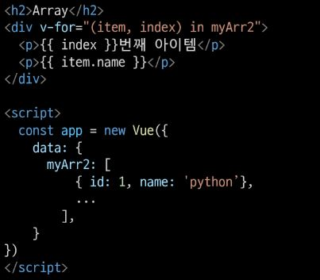

# Vue

### Front-end Development
- 개요
  - 우리가 앞으로 할 일은 JS를 이용한 Front-end 개발
  - Back-end 개발은 Django로 진행
  - Front-end 개발은 Vue.js 진행
  - Vue.js === JavaScript Front-end Framework
- Front-end Framework
  - Front-end(FE) 개발
    - 사용자에게 보여주는 화면 만들기
  - `Web App`(SPA)을 만들 때 사용하는 도구
    - SPA - Single Page Application
      - Web App과 함께 자주 등장할 용어
      - 이전까지는 사용자의 요청에 대해 적절한 페이지 별 template을 반환
      - SPA는 서버에서 최초 1장의 HTML만 전달받아 모든 요청에 대응하는 방식
        - 어떻게 한 페이지로 모든 요청에 대응?
          - CSR(Client Side Rendering) 방식으로 요청을 처리하기 때문
  - Web App이란?
    - 웹 브라우저에서 실행되는 어플리케이션 소프트웨어
    - VIBE 웹 사이트 - 개발자 도구 - 디바이스 모드
    - 웹 페이지가 그대로 보이는 것이 아닌 `디바이스에 설치된 APP`처럼 보이는 것
    - 웹 페이지가 디바이스에 맞는 적절한 UX/UI로 표현되는 형태
  - [참고] SSR(Server Side Rendering)이란?
    - 기존의 요청 처리 방식은 SSR
    - Server가 사용자의 요청에 적합한 HTML을 렌더링하여 제공하는 방식
    - 전달 받은 새 문서를 보여주기 위해 브라우저는 새로고침을 진행
    
    
  - `CSR`(Client Side REndering)이란?
    - 최초 한장의 HTML을 받아오는 것은 동일
      - 단, server로부터 최초로 받아오는 문서는 빈 html 문서
      
      - 각 요청에 대한 대응을 JS를 사용하여 필요한 부분만 다시 렌더링
        1. 새로운 페이지를 서버에 `AJAX`로 요청
        2. 서버는 화면을 그리기 위해 필요한 데이터를 JSON 방식으로 전달
        3. `JSON` 데이터를 JS로 처리. DOM트리에 반영(렌더링)
      
      
  - 왜 CSR 방식을 사용하는가?
    1. 모든 HTML 페이지를 서버로부터 받아서 표시하지 않아도 됨 
      == 클라이언트- 서버간 통신 즉, 트래픽 감소 
      == 트래픽이 감소한다 = 응답속도가 빨라진다
    2. 매번 새 문서를 받아 새로고침하는 것이 아니라 필요한 부분만 고쳐 나가므로 각 요청이 끊김없이 진행
      - SNS에서 추천을 누를 때마다 첫 페이지로 돌아간다 = 끔찍한 APP
      - 요청이 자연스럽게 진행된다 = UX 향상
    3. BE와 FE의 작업 역역을 명확히 분리할 수 있음
      - 각자 맡은 역할을 명확이 분리한다 = 협업이 용이해짐
  - CSR은 만능일까?
    - 첫 구동시 필요한 데이터가 많으면 많을수록 최초 작동 시작까지 오랜 시간이 소요
    - Naver, Netflix, Disney+ 등 모바일에 설치된 Web-App을 실행하게 되면 잠깐의 로딩 시간이 필요
    - `검색 엔진 최적화`(SEO, Search Engine Optimization)가 어려움
      - 서버가 제공하는 것은 텅 빈 HTML
      - 내용을 채우는 것은 AJAX 요청으로 얻은 JSON 데이터로 클라이언트(브라우저)가 진행
    - 대체적으로 HTML에 작성된 내용을 기반으로 하는 검색 엔진에 빈 HTML을 공유하는 SPA 서비스가 노출되기는 어려움
  - [참고] SEO(Search Engine Optimization)
    - google, bing과 같은 검색 엔진 등에 내 서비스나 제품 등이 효율적으로 검색 엔진에 노출되도록 개선하는 과정을 일컫는 작업
    - `검색` = 각 사이트가 운용하는 검색 엔진에 의해 이루어지는 작업
    - `검색 엔진` = 웹 상에 존재하는 가능한 모든 정보들을 긁어모으는 방식으로 동작
      - 정보의 대상은 주로 HTML에 작성된 내용
      - JS가 실행된 이후의 결과를 확인하는 과정이 없음
    - 최근에는 SPA, 즉 CSR로 구성된 서비스의 비중이 증가
      - SPA 서비스도 검색 대상으로 넓히기 위해 JS를 지원하는 방식으로 발전
    - 단, 단순 HTML만을 분석하는 것보다 몇 배의 리소스가 필요한 작업이기에 여전히 CSR의 검색 엔진 최적화 문제가 모두 해결된 것은 아님
  - CSR vs SSR
    - CSR과 SSR은 흑과 백이 아님
      - 내 서비스에 적합한 렌더링 방식을 적절하게 활용할 수 있어야 함
    - SPA 서비스에서도 SSR을 지원하는 Framework이 발전하고 있음
      - Vue의 Nuxt.js
      - React의 Next.js
      - Angular Universal 등
  - 여러가지 Front-end Framework
    - Frone-end Framework == HTML + CSS + JS를 더 편하게 작업하기 위한 툴
      - React, Angular, Svelte, Vue 등
    
  - 프레임 워크는 더 쉽게 개발하기 위해 사용하는 것으로 꼭 사용하지 않아도 됨
  - 실제 Github는 Front-end Framework를 사용하지 않음
  - 하지만 대부분의 기업에서는 생산성과 협업을 위해 Framework를 사용해서 개발
- Vue 사용 이유
  - 쉽다, 입문자가 시작하기에 좋다
  - 구글의 Angular 개발자 출신 Evan You가 개발
    - Vue는 타 Framework에 비해 입문자가 시작하기에 좋은 Framework
    - Angular보다 `가볍고, 간편하게 사용할 수 있는` Framework를 만들기 위해 퇴사
    - 2014년 Vue 발표
  - 구조가 매우 직관적
  - FE Framework를 빠르고 쉽게 학습하고 활용할 수 있음
  - 추후 필요하면 다른 FE Framework 학습시 빠르게 적응 가능
  
- Vue 없이 코드 작성하기
  - 입력 받은 값을 name 뒤에 출력하기
  - 02_html_only.html에서 진행
  
  1. input tag 선택
  2. P tag 선택
  3. add EventListener 추가
  
  - 입력 받은 데이터를 p tag에 추가하려고 한다면?
  - 기존에 가지고 있었던 text도 신경써야함
    - data를 관리하기 위한 추가 작업이 필요함
  
- Vue CDN
  - Vue로 작업을 시작하기 위하여 CDN을 가져와야 함
  - Django == Python Web Framework
    - pip install
  - Vue === JS Front-end Framework
    - Bootstrap에서 사용하였던 CDN 방식 제공
  - Vue CDN을 위하여 Vue2 공식 문서 접속
    - [Vue2 공식 문서](https://v2.vuejs.org/)
  1. Getting Started
  2. Installation
  3. Development version CDN 복사
  
- Vue로 코드 작성하기
  - 입력 받은 값을 name 뒤에 출력하기
  - 03_html_vue.html에서 진행
  
    1. Vue CDN 가져오기
    2. Vue instance 생성
      - Vue instance - 1개의 Object
      - 정해진 속성명을 가진 Object
    3. `el`, `data` 설정
      - data에 관리할 속성 정의
    4. 선언적 렌더링 `{{ }}`
      - Vue data를 화면에 렌더링
  
  - [참고] Dev Tools 확인
    - Vue devtools에서 data 변경 -> DOM 반영
    - 눈에 보이는 화면을 조작하는 것이 아닌 Vue가 가진 data를 조작
    
  4. input tag에 `v-model` 작성
    - input에 값 입력 -> Vue data 반영
    - Vue data -> Dom 반영
  
- Facebook 예시
  - 한명의 유저가 이름을 변경한다면 화면에서 조작해야할 영역이 매우 많음
  
  - Vanilla JS만으로 모든 데이터를 조작하면 불필요한 코드의 반복이 일어남
  
  - Vue를 통해 데이터를 관리한다면 변경사항도 한번에 반영 가능
  

### Vue2 vs Vue3
- Vue3
  - 2022년 2월부터 vue 프레임워크의 기본 버전이 3버전으로 전환
  - 대체적인 설정들이 Vue3을 기본으로 적용되어있음
    - ex) 공식문서, CDN, npm 등
- Vue2
  - 여전히 vue2가 많이 사용됨(legacy code)
  - 사용된 기간이 긴 만큼 상대적으로 많은 문서의 양, 참고자료, 질문/답변
  - 안정적인 측면에서는 아직 vue2가 우세한 편

### Vue instance
- MVVM Pattern
  - 소프트웨어 아키텍처 패턴의 일종
  - 마크업 언어로 구현하는 그래픽 사용자 인터페이스(view)의 개발을 Back-end(model)로부터 분리시켜 view가 어느 특정한 모델 플랫폼에 종속되지 않도록 함
  
  
  - `View` - 우리 눈에 보이는 부분 = DOM
  - `Model` - 실제 데이터 = JSON
  - `View Model` (Vue)
    - View를 위한 Model
    - View와 연결(binding)되어 Action을 주고 받음
    - Model이 변경되면 View Model도 변경되고 바인딩된 View도 변경됨
    - View에서 사용자가 데이터를 변경하면 View Model의 데이터가 변경되고 바인딩된 다른 View도 변경됨
  - 정리
    - MVC 패턴에서 Controller를 제외하고 View Model을 넣은 패턴
    - View는 Model을 몰라요, Model도 View를 몰라요 (독립성 증가, 적은 의존성)
      - DOM은 Data를 몰라요, Data도 DOM을 몰라요
    - View 에서 데이터를 변경하면 View Model의 데이터가 변경되고, 연관된 다른 View도 함께 변경된다
- Vue instance
  - 04_vue_start.html에서 작업 진행
  1. Vue CDN 가져오기
  2. `new` 연산자를 사용한 생성자 함수 호출
      - vue instance 생성
  3. 인스턴스 출력 및 확인
  
  
  - Vue instance === 1개의 객체
  - 아주 많은 속성과 메서드를 이미 가지고 있고, 이러한 기능들을 사용하는 것
- [참고] 생성자 함수
  - 05_constructor_func.js에서 진행
  - JS에서 객체를 하나 생성한다고 한다면?
    - 하나의 객체를 선언하여 생성
  - 동일한 형태의 객체를 또 만든다면?
    - 또 다른 객체를 선언하여 생성
  
  - 동일한 구조의 객체를 여러개 만들고 싶다면?
  - 생성자 함수는 특별한 함수를 의미하는 것이 아님
  - `new` 연산자로 사용하는 함수
  
  - 함수 이름은 반드시 대문자로 시작
  - 생성자 함수를 사용할 때는 반드시 `new` 연산자를 사용
- el(element)
  - Vue instance와 DOM을 mount(연결)하는 옵션
    - View와 Model을 연결하는 역할
    - HTML id 혹은 class와 마운트 가능
  - Vue instance와 **연결되지 않은 DOM 외부는 Vue의 영향을 받지 않음**
    - Vue 속성 및 메서드 사용 불가
  - 04_vue_start.html에서 작업 진행
  - 새로운 Vue instance 생성
  - 생성자 함수 첫번째 인자로 `Object` 작성
  - el 옵션에 `#app` 작성 = DOM 연결
  - 인스턴스 출력
  
  
  - Vue와 연결되지 않은 div 생성
    - 두 div 모두에 `{{ message }}`작성
    - 결과 확인
  - `message` 속성이 정의 되지 않았나는 경고와 `{{ message }}`가 그대로 출력되는 차이
  
  
- data
  - Vue instance의 `데이터 객체` 혹은 `인스턴스 속성`
  - 데이터 객체는 반드시 기본 객체 `{}(Object)`여야 함
  - 객체 내부의 아이템들은 value로 모든 타입의 객체를 가질 수 있음
  - 정의된 속성은 `interpolation{{}}`을 통해 view에 렌더링 가능함
  - Vue instance에 `data` 객체 추가
  - data 객체에 `message`값 추가
  - 결과 확인
  - 추가된 객체의 각 값들은 `this.message`형태로 접근 가능
  
- methods
  - Vue instance의 `method`들을 정의하는 곳
  - `methods` 객체정의
    - 객체 내 print method 정의
    - print method 실행 시 Vue instance의 data내 message 출력
  - 콘솔창에서 app.print() 실행
  
  
  - method를 호출하여 data 변경 가능
    - 객체 내 **bye method**정의
    - print method 실행 시 Vue instance의 data내 message 변경
  - 콘솔창에서 app.bye() 실행
    - DOM에 바로 변경된 결과 반영
    - Vue의 강력한 반응성(reactivity)
  
  
  - [주의] methods with Arrow Function
    - ```메서드를 정의할 때, Arrow Function을 사용하면 안됨```
    - Arrow Function의 this는 함수가 선언될 때 상위 스코프를 가리킴
    - 즉 this가 상위 객체 window를 가리킴
    - 호출은 문제 없이 가능하나 this로 Vue의 data를 변경하지 못함
    
    

### Basic of Syntax
- Template Syntax
  - Vue2 guide > template syntax 참고
  - `렌더링 된 DOM`을 기본 Vue instance의 data에 `선언적으로 바인딩`할 수 있는 `HTML기반 template syntax를 사용`
    - 렌더링 된 DOM - 브라우저에 의해 보기 좋게 그려질 HTML 코드
    - HTML기반 template syntax - HTML 코드에 직접 작성할 수 있는 문법 제공
    - 선언적으로 바인딩 - Vue instance와 DOM을 연결
- Template Interpolation
  - 06_basic_of_sytax.html에서 진행
  - 가장 기본적인 바인딩(연결)방법
  - 중괄호 2개로 표기
  - DTL과 동일한 형태로 작성
  - Template interpolation 방법은 HTML을 `일반 텍스트`로 표현
  
- RAW HTML
  - `v-html` directive을 사용하여 data와 바인딩
  - directive - HTML 기반 template syntax
  - HTML의 기본 속성이 아닌 Vue가 제공하는 특수 속성의 값으로 data를 작성
  
- [참고] JS 표현식
  - 표현식 형태로 작성 가능
  

### Directives
- 기본 구성
  - v-접두사가 있는 특수 속성에는 값을 할당할 수 있음
    - 값에는 JS 표현식을 작성할 수 있음
  - directive의 역할은 **표현식의 값이 변경될 때 반응적**으로 DOM에 적용하는 것
  
  - `:`을 통해 전달인자를 받을 수 있음
  - `.`으로 표시되는 특수 접미사 - directive를 특별한 방법으로 바인딩 해야함
- 새 Vue instance 생성
  - 06_basic_of_sytax.html에서 진행
  - 각각의 instance들은 연결된 DOM element에만 영향을 미침
  - 연결되지 않은 DOM이 Vue의 영향을 받지 않았던 것과 동일한 상황
  
- v-text
  - Template Interpolation과 함께 가장 기본적인 바인딩 방법
  - {{}}와 동일한 역할(정확히 동일한 역할은 아님)
  
- v-html
  - RAW HTML을 표현할 수 있는 방법
  - 단, 사용자가 입력하거나 제공하는 컨텐츠에는 절대 사용 금지(XSS공격 참고)
  
- v-show
  - 표현식에 작성된 값에 따라 element를 보여 줄 것인지 결정
    - boolean 값이 변경 될 때 마다 반응
  - 대상 element의 display 속성을 기본 속성과 none으로 toggle
  - 요소 자체는 항상 DOM에 렌더링 됨
  
  - 바인딩 된 isActive의 값이 false이므로 첫 방문 시 p tag는 보이지 않음
    - vue dev tools에서 isActive 변경 시 화면에 출력
    - 값을 false로 변경 시 다시 사라짐
  - 화면에서만 사라졌을 뿐, DOM에는 존재한다.
    - display 속성이 변경되었을 뿐
  
- v-if
  - v-show와 사용방법은 동일
  - isActive의 값이 변경될 때 반응
  - 단, 값이 false인 경우 `DOM에서 사라짐`
  - v-if v-else-if v-else 형태로 사용
  
- v-show vs v-if
  - v-show(Expensive initial load, cheap toggle)
    - 표현식 결과와 관계 없이 렌더링 되므로 초기 렌더링에 필요한 비용은 v-if보다 높을 수 있음
    - display 속성 변경으로 표현 여부를 판단하므로 렌더링 후 toggle 비용은 적음
  - v-if(Cheap initial load, expensive toggle)
    - 표현식 결과가 false인 경우 렌더링조차 되지 않으므로 초기 렌더링 비용은 v-show보다 낮을 수 있음
    - 단, 표현식 값이 자주 변경되는 경우 잦은 재 렌더링으로 비용이 증가할 수 있음
- v-for
  - 07_basic_of_sytax_2.html에서 진행
  - `for ... in ...`형식으로 작성
  - 반복한 데이터 타입에 모두 사용 가능
  - index를 함께 출력하고자 한다면 `(char, index)`형태로 사용 가능
  
  - 배열 역시 문자열과 동일하게 사용 가능
  - 각 요소가 객체라면 `dot notation`으로 접근할 수 있음
  
  - 객체 순회 시 value가 할당되어 출력
  - 2번째 변수 할당시 key 출력 가능
  
  - [참고] 특수 속성 key
    - `"v-for사용 시 반드시 key 속성을 각 요소에 작성"`
    - 주로 **v-for direcrive** 작성 시 사용
    - vue 화면 구성 시 이전과 달라진 점을 확인하는 용도로 활용
      - 따라서 key가 중복되어서는 안됨
    - 각 요소가 고유한 값을 가지고 있지 않다면 생략할 수 있음
    
- v-on
  - 08_basic_of_sytax_3.html에서 진행
  - `:`을 통해 전달받은 인자를 확인
  - 값으로 JS 표현식 작성
  - addEventListener의 첫 번째 인자와 동일한 값들로 구성
  - 대기하고 있던 이벤트가 발생하면 할당된 표현식 실행
  
  - method를 통한 data 조작도 가능
  - method에 인자를 넘기는 방법은 일반 함수를 호출할 때와 동일한 방식
  - `:`을 통해 전달된 인자에 따라 특별한 modifiers(수식어)가 있을 수 있음
    - ex) v-on:keyup.enter 등
    - vue2 가이드 > api > v-on 파트 참고
  - `@`shortcut 제공
    - ex) @keyup.click
- v-bind
  - HTML 기본 속성에 Vue data를 연결
  - class의 경우 다양한 형태로 연결 가능
    - `조건부 바인딩`
      - {'class Name': '조건 표현식'}
      - 삼항 연산자도 가능
    - `다중 바인딩`
      - ['JS 표현식','JS 표현식',...]
  
  - Vue data의 변화에 반응하여 DOM에 반영하므로 상황에 따라 유동적 할당 가능
  - `:` shortcut 제공
    - ex) :class 등
    - v-for에서 사용하였던 :key는 v-bind의 shortcut을 활용한 것
- v-model
  - 09_basic_of_sytax_4.html에서 진행
  - Vue instance와 DOM의 `양방향 바인딩`
  - Vue data 변경 시 v-model로 연결된 사용자 입력 element에도 적용
  

### Vue advanced
- computed
  - Vue instance가 가진 options 중 하나
  - computed 객체에 정의한 함수를 페이지가 최초로 렌더링 될 때 호출하여 계산
    - 계산 결과가 변하기 전까지 함수를 재호출하는 것이 아닌 계산된 값을 반환
  - 10_computed.html에서 methods와의 차이 확인
- method vs computed
  - method
    - 호출될 때마다 함수를 실행
    - 같은 결과여도 매번 새롭게 계산
  - computed
    - 함수의 종속 대상의 변화에 따라 계산 여부가 결정됨
    - 종속 대상이 변하지 않으면 항상 저장(캐싱)된 값을 반환
- watch
  - 11_watch.html에서 결과 확인
  - 특정 데이터의 변화를 감지하는 기능
    1. watch 객체를 정의
    2. 감시할 대상 data를 지정
    3. data가 변할 시 실행할 함수를 정의
  - 첫 번째 인자는 변동 전 data
  - 두 번째 인자는 변동 후 data
  
  - 실행 함수를 Vue method로 대체 가능
    1. 감시 대상 data의 이름으로 객체 생성
    2. 실행하고자 하는 method를 handler에 문자열 형태로 할당
  - Array, Object의 내부 요소 변경을 감지하기 위해서 `deep`속성 추가 필요
- filters
  - 텍스트 형식화를 적용할 수 있는 필터
  - interpolation 혹은 v-bind를 이용할 때 사용 가능
  - 필터는 자바스크립트 표현식 마지막에 `|`(파이프)와 함께 추가되어야 함
  - 이어서 사용(chaining)가능
  - 12_filters.html에서 결과 확인