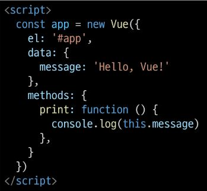
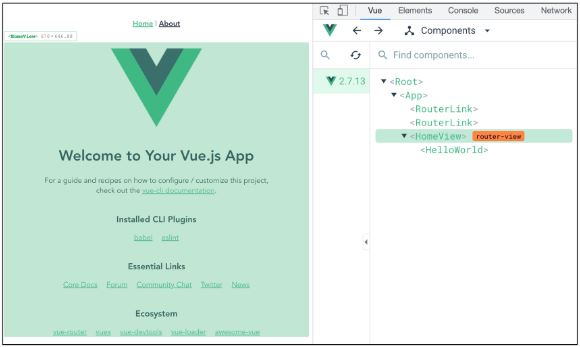

# Vue

## vue2 한글판 문서 https://vue2.hphk.io/

### Front-end Development

- 개요
  - 우리가 앞으로 할 일은 JS를 이용한 Front-end 개발
  - Back-end 개발은 Django로 진행
  - Front-end 개발은 Vue.js 진행
  - Vue.js === JavaScript Front-end Framework
- Front-end Framework
  - Front-end(FE) 개발
    - 사용자에게 보여주는 화면 만들기
  - `Web App`(SPA)을 만들 때 사용하는 도구
    - SPA - Single Page Application
      - Web App과 함께 자주 등장할 용어
      - 이전까지는 사용자의 요청에 대해 적절한 페이지 별 template을 반환
      - SPA는 서버에서 최초 1장의 HTML만 전달받아 모든 요청에 대응하는 방식
        - 어떻게 한 페이지로 모든 요청에 대응?
          - CSR(Client Side Rendering) 방식으로 요청을 처리하기 때문
  - Web App이란?
    - 웹 브라우저에서 실행되는 어플리케이션 소프트웨어
    - VIBE 웹 사이트 - 개발자 도구 - 디바이스 모드
    - 웹 페이지가 그대로 보이는 것이 아닌 `디바이스에 설치된 APP`처럼 보이는 것
    - 웹 페이지가 디바이스에 맞는 적절한 UX/UI로 표현되는 형태
  - [참고] SSR(Server Side Rendering)이란?
    - 기존의 요청 처리 방식은 SSR
    - Server가 사용자의 요청에 적합한 HTML을 렌더링하여 제공하는 방식
    - 전달 받은 새 문서를 보여주기 위해 브라우저는 새로고침을 진행
      
      
  - `CSR`(Client Side REndering)이란?
    - 최초 한장의 HTML을 받아오는 것은 동일
      - 단, server로부터 최초로 받아오는 문서는 빈 html 문서
        
      - 각 요청에 대한 대응을 JS를 사용하여 필요한 부분만 다시 렌더링
        1. 새로운 페이지를 서버에 `AJAX`로 요청
        2. 서버는 화면을 그리기 위해 필요한 데이터를 JSON 방식으로 전달
        3. `JSON` 데이터를 JS로 처리. DOM트리에 반영(렌더링)
           
           
  - 왜 CSR 방식을 사용하는가?
    1. 모든 HTML 페이지를 서버로부터 받아서 표시하지 않아도 됨
       == 클라이언트- 서버간 통신 즉, 트래픽 감소
       == 트래픽이 감소한다 = 응답속도가 빨라진다
    2. 매번 새 문서를 받아 새로고침하는 것이 아니라 필요한 부분만 고쳐 나가므로 각 요청이 끊김없이 진행
    - SNS에서 추천을 누를 때마다 첫 페이지로 돌아간다 = 끔찍한 APP
    - 요청이 자연스럽게 진행된다 = UX 향상
    3. BE와 FE의 작업 역역을 명확히 분리할 수 있음
    - 각자 맡은 역할을 명확이 분리한다 = 협업이 용이해짐
  - CSR은 만능일까?
    - 첫 구동시 필요한 데이터가 많으면 많을수록 최초 작동 시작까지 오랜 시간이 소요
    - Naver, Netflix, Disney+ 등 모바일에 설치된 Web-App을 실행하게 되면 잠깐의 로딩 시간이 필요
    - `검색 엔진 최적화`(SEO, Search Engine Optimization)가 어려움
      - 서버가 제공하는 것은 텅 빈 HTML
      - 내용을 채우는 것은 AJAX 요청으로 얻은 JSON 데이터로 클라이언트(브라우저)가 진행
    - 대체적으로 HTML에 작성된 내용을 기반으로 하는 검색 엔진에 빈 HTML을 공유하는 SPA 서비스가 노출되기는 어려움
  - [참고] SEO(Search Engine Optimization)
    - google, bing과 같은 검색 엔진 등에 내 서비스나 제품 등이 효율적으로 검색 엔진에 노출되도록 개선하는 과정을 일컫는 작업
    - `검색` = 각 사이트가 운용하는 검색 엔진에 의해 이루어지는 작업
    - `검색 엔진` = 웹 상에 존재하는 가능한 모든 정보들을 긁어모으는 방식으로 동작
      - 정보의 대상은 주로 HTML에 작성된 내용
      - JS가 실행된 이후의 결과를 확인하는 과정이 없음
    - 최근에는 SPA, 즉 CSR로 구성된 서비스의 비중이 증가
      - SPA 서비스도 검색 대상으로 넓히기 위해 JS를 지원하는 방식으로 발전
    - 단, 단순 HTML만을 분석하는 것보다 몇 배의 리소스가 필요한 작업이기에 여전히 CSR의 검색 엔진 최적화 문제가 모두 해결된 것은 아님
  - CSR vs SSR
    - CSR과 SSR은 흑과 백이 아님
      - 내 서비스에 적합한 렌더링 방식을 적절하게 활용할 수 있어야 함
    - SPA 서비스에서도 SSR을 지원하는 Framework이 발전하고 있음
      - Vue의 Nuxt.js
      - React의 Next.js
      - Angular Universal 등
  - 여러가지 Front-end Framework
    - Frone-end Framework == HTML + CSS + JS를 더 편하게 작업하기 위한 툴
      - React, Angular, Svelte, Vue 등
        
  - 프레임 워크는 더 쉽게 개발하기 위해 사용하는 것으로 꼭 사용하지 않아도 됨
  - 실제 Github는 Front-end Framework를 사용하지 않음
  - 하지만 대부분의 기업에서는 생산성과 협업을 위해 Framework를 사용해서 개발
- Vue 사용 이유
  - 쉽다, 입문자가 시작하기에 좋다
  - 구글의 Angular 개발자 출신 Evan You가 개발
    - Vue는 타 Framework에 비해 입문자가 시작하기에 좋은 Framework
    - Angular보다 `가볍고, 간편하게 사용할 수 있는` Framework를 만들기 위해 퇴사
    - 2014년 Vue 발표
  - 구조가 매우 직관적
  - FE Framework를 빠르고 쉽게 학습하고 활용할 수 있음
  - 추후 필요하면 다른 FE Framework 학습시 빠르게 적응 가능
    
- Vue 없이 코드 작성하기
  - 입력 받은 값을 name 뒤에 출력하기
  - 02_html_only.html에서 진행
    
  1. input tag 선택
  2. P tag 선택
  3. add EventListener 추가
     
  - 입력 받은 데이터를 p tag에 추가하려고 한다면?
  - 기존에 가지고 있었던 text도 신경써야함
    - data를 관리하기 위한 추가 작업이 필요함
      
- Vue CDN
  - Vue로 작업을 시작하기 위하여 CDN을 가져와야 함
  - Django == Python Web Framework
    - pip install
  - Vue === JS Front-end Framework
    - Bootstrap에서 사용하였던 CDN 방식 제공
  - Vue CDN을 위하여 Vue2 공식 문서 접속
    - [Vue2 공식 문서](https://v2.vuejs.org/)
  1. Getting Started
  2. Installation
  3. Development version CDN 복사
     
- Vue로 코드 작성하기

  - 입력 받은 값을 name 뒤에 출력하기
  - 03_html_vue.html에서 진행
    

    1.  Vue CDN 가져오기
    2.  Vue instance 생성

        - Vue instance - 1개의 Object
        - 정해진 속성명을 가진 Object

    3.  `el`, `data` 설정

        - data에 관리할 속성 정의

    4.  선언적 렌더링 `{{ }}`

            - Vue data를 화면에 렌더링

        

  - [참고] Dev Tools 확인
    - Vue devtools에서 data 변경 -> DOM 반영
    - 눈에 보이는 화면을 조작하는 것이 아닌 Vue가 가진 data를 조작
      
      - root: view가 가지고 있는 최상위 컴포넌트

  4. input tag에 `v-model` 작성

  - input에 값 입력 -> Vue data 반영
  - Vue data -> Dom 반영
    

- Facebook 예시
  - 한명의 유저가 이름을 변경한다면 화면에서 조작해야할 영역이 매우 많음
    
  - Vanilla JS만으로 모든 데이터를 조작하면 불필요한 코드의 반복이 일어남
    
  - Vue를 통해 데이터를 관리한다면 변경사항도 한번에 반영 가능
    

### Vue2 vs Vue3

- Vue3
  - 2022년 2월부터 vue 프레임워크의 기본 버전이 3버전으로 전환
  - 대체적인 설정들이 Vue3을 기본으로 적용되어있음
    - ex) 공식문서, CDN, npm 등
- Vue2
  - 여전히 vue2가 많이 사용됨(legacy code)
  - 사용된 기간이 긴 만큼 상대적으로 많은 문서의 양, 참고자료, 질문/답변
  - 안정적인 측면에서는 아직 vue2가 우세한 편

### Vue instance

- MVVM Pattern
  - 소프트웨어 아키텍처 패턴의 일종
  - 마크업 언어로 구현하는 그래픽 사용자 인터페이스(view)의 개발을 Back-end(model)로부터 분리시켜 view가 어느 특정한 모델 플랫폼에 종속되지 않도록 함
    
    
  - `View` - 우리 눈에 보이는 부분 = DOM
  - `Model` - 실제 데이터 = JSON
  - `View Model` (Vue)
    - View를 위한 Model
    - View와 연결(binding)되어 Action을 주고 받음
    - Model이 변경되면 View Model도 변경되고 바인딩된 View도 변경됨
    - View에서 사용자가 데이터를 변경하면 View Model의 데이터가 변경되고 바인딩된 다른 View도 변경됨
  - 정리
    - MVC 패턴에서 Controller를 제외하고 View Model을 넣은 패턴
    - View는 Model을 몰라요, Model도 View를 몰라요 (독립성 증가, 적은 의존성)
      - DOM은 Data를 몰라요, Data도 DOM을 몰라요
    - View 에서 데이터를 변경하면 View Model의 데이터가 변경되고, 연관된 다른 View도 함께 변경된다
- Vue instance
  - 04_vue_start.html에서 작업 진행
  1. Vue CDN 가져오기
  2. `new` 연산자를 사용한 생성자 함수 호출
     - vue instance 생성
  3. 인스턴스 출력 및 확인
     
     
  - Vue instance === 1개의 객체
  - 아주 많은 속성과 메서드를 이미 가지고 있고, 이러한 기능들을 사용하는 것
- [참고] 생성자 함수
  - 05_constructor_func.js에서 진행
  - JS에서 객체를 하나 생성한다고 한다면?
    - 하나의 객체를 선언하여 생성
  - 동일한 형태의 객체를 또 만든다면?
    - 또 다른 객체를 선언하여 생성
      
  - 동일한 구조의 객체를 여러개 만들고 싶다면?
  - 생성자 함수는 특별한 함수를 의미하는 것이 아님
  - `new` 연산자로 사용하는 함수
    
  - 함수 이름은 반드시 대문자로 시작
  - 생성자 함수를 사용할 때는 반드시 `new` 연산자를 사용
- el(element)
  - Vue instance와 DOM을 mount(연결)하는 옵션
    - View와 Model을 연결하는 역할
    - HTML id 혹은 class와 마운트 가능
  - Vue instance와 **연결되지 않은 DOM 외부는 Vue의 영향을 받지 않음**
    - Vue 속성 및 메서드 사용 불가
  - 04_vue_start.html에서 작업 진행
  - 새로운 Vue instance 생성
  - 생성자 함수 첫번째 인자로 `Object` 작성
  - el 옵션에 `#app` 작성 = DOM 연결
  - 인스턴스 출력
    
    
  - Vue와 연결되지 않은 div 생성
    - 두 div 모두에 `{{ message }}`작성
    - 결과 확인
  - `message` 속성이 정의 되지 않았나는 경고와 `{{ message }}`가 그대로 출력되는 차이
    
    
- data
  - Vue instance의 `데이터 객체` 혹은 `인스턴스 속성`
  - 데이터 객체는 반드시 기본 객체 `{}(Object)`여야 함
  - 객체 내부의 아이템들은 value로 모든 타입의 객체를 가질 수 있음
  - 정의된 속성은 `interpolation{{}}`을 통해 view에 렌더링 가능함
  - Vue instance에 `data` 객체 추가
  - data 객체에 `message`값 추가
  - 결과 확인
  - 추가된 객체의 각 값들은 `this.message`형태로 접근 가능
    
- methods
  - Vue instance의 `method`들을 정의하는 곳
  - `methods` 객체정의
    - 객체 내 print method 정의
    - print method 실행 시 Vue instance의 data내 message 출력
  - 콘솔창에서 app.print() 실행
    
    
  - method를 호출하여 data 변경 가능
    - 객체 내 **bye method**정의
    - print method 실행 시 Vue instance의 data내 message 변경
  - 콘솔창에서 app.bye() 실행
    - DOM에 바로 변경된 결과 반영
    - Vue의 강력한 반응성(reactivity)
      
      
  - [주의] methods with Arrow Function
    - `메서드를 정의할 때, Arrow Function을 사용하면 안됨`
    - Arrow Function의 this는 함수가 선언될 때 상위 스코프를 가리킴
    - 즉 this가 상위 객체 window를 가리킴
    - 호출은 문제 없이 가능하나 this로 Vue의 data를 변경하지 못함
      
      

### Basic of Syntax

- Template Syntax
  - Vue2 guide > template syntax 참고
  - `렌더링 된 DOM`을 기본 Vue instance의 data에 `선언적으로 바인딩`할 수 있는 `HTML기반 template syntax를 사용`
    - 렌더링 된 DOM - 브라우저에 의해 보기 좋게 그려질 HTML 코드
    - HTML기반 template syntax - HTML 코드에 직접 작성할 수 있는 문법 제공
    - 선언적으로 바인딩 - Vue instance와 DOM을 연결
- Template Interpolation(보간법)
  - 06_basic_of_sytax.html에서 진행
  - 가장 기본적인 바인딩(연결)방법
  - 중괄호 2개로 표기
  - DTL과 동일한 형태로 작성
  - Template interpolation 방법은 HTML을 `일반 텍스트`로 표현
    
- RAW HTML
  - `v-html` directive을 사용하여 data와 바인딩
  - directive - HTML 기반 template syntax
  - HTML의 기본 속성이 아닌 Vue가 제공하는 특수 속성의 값으로 data를 작성
    
- [참고] JS 표현식
  - 표현식 형태로 작성 가능
    

### Directives

- 기본 구성
  - v-접두사가 있는 특수 속성에는 값을 할당할 수 있음
    - 값에는 JS 표현식을 작성할 수 있음
  - directive의 역할은 **표현식의 값이 변경될 때 반응적**으로 DOM에 적용하는 것
    
  - `:`을 통해 전달인자를 받을 수 있음
  - `.`으로 표시되는 특수 접미사 - directive를 특별한 방법으로 바인딩 해야함
- 새 Vue instance 생성
  - 06_basic_of_sytax.html에서 진행
  - 각각의 instance들은 연결된 DOM element에만 영향을 미침
  - 연결되지 않은 DOM이 Vue의 영향을 받지 않았던 것과 동일한 상황
    
- v-text
  - Template Interpolation과 함께 가장 기본적인 바인딩 방법
  - {{}}와 동일한 역할(정확히 동일한 역할은 아님)
    
- v-html
  - RAW HTML을 표현할 수 있는 방법
  - 단, 사용자가 입력하거나 제공하는 컨텐츠에는 절대 사용 금지(XSS공격 참고)
    
- v-show
  - 표현식에 작성된 값에 따라 element를 보여 줄 것인지 결정
    - boolean 값이 변경 될 때 마다 반응
  - 대상 element의 display 속성을 기본 속성과 none으로 toggle
  - 요소 자체는 항상 DOM에 렌더링 됨
    
  - 바인딩 된 isActive의 값이 false이므로 첫 방문 시 p tag는 보이지 않음
    - vue dev tools에서 isActive 변경 시 화면에 출력
    - 값을 false로 변경 시 다시 사라짐
  - 화면에서만 사라졌을 뿐, DOM에는 존재한다.
    - display 속성이 변경되었을 뿐
      
- v-if
  - v-show와 사용방법은 동일
  - isActive의 값이 변경될 때 반응
  - 단, 값이 false인 경우 `DOM에서 사라짐`
  - v-if v-else-if v-else 형태로 사용
    
- v-show vs v-if
  - v-show(Expensive initial load, cheap toggle)
    - 표현식 결과와 관계 없이 렌더링 되므로 초기 렌더링에 필요한 비용은 v-if보다 높을 수 있음
    - display 속성 변경으로 표현 여부를 판단하므로 렌더링 후 toggle 비용은 적음
  - v-if(Cheap initial load, expensive toggle)
    - 표현식 결과가 false인 경우 렌더링조차 되지 않으므로 초기 렌더링 비용은 v-show보다 낮을 수 있음
    - 단, 표현식 값이 자주 변경되는 경우 잦은 재 렌더링으로 비용이 증가할 수 있음
- v-for
  - 07_basic_of_sytax_2.html에서 진행
  - `for ... in ...`형식으로 작성
  - 반복한 데이터 타입에 모두 사용 가능
  - index를 함께 출력하고자 한다면 `(char, index)`형태로 사용 가능
    
  - 배열 역시 문자열과 동일하게 사용 가능
  - 각 요소가 객체라면 `dot notation`으로 접근할 수 있음
    
  - 객체 순회 시 value가 할당되어 출력
  - 2번째 변수 할당시 key 출력 가능
    
  - [참고] 특수 속성 key
    - `"v-for사용 시 반드시 key 속성을 각 요소에 작성"`
    - 주로 **v-for direcrive** 작성 시 사용
    - vue 화면 구성 시 이전과 달라진 점을 확인하는 용도로 활용
      - 따라서 key가 중복되어서는 안됨
    - 각 요소가 고유한 값을 가지고 있지 않다면 생략할 수 있음
      
- v-on
  - 08_basic_of_sytax_3.html에서 진행
  - `:`을 통해 전달받은 인자를 확인
  - 값으로 JS 표현식 작성
  - addEventListener의 첫 번째 인자와 동일한 값들로 구성
  - 대기하고 있던 이벤트가 발생하면 할당된 표현식 실행
    
  - method를 통한 data 조작도 가능
  - method에 인자를 넘기는 방법은 일반 함수를 호출할 때와 동일한 방식
  - `:`을 통해 전달된 인자에 따라 특별한 modifiers(수식어)가 있을 수 있음
    - ex) v-on:keyup.enter 등
    - vue2 가이드 > api > v-on 파트 참고
  - `@`shortcut 제공
    - ex) @keyup.click
- v-bind
  - HTML 기본 속성에 Vue data를 연결
  - class의 경우 다양한 형태로 연결 가능
    - `조건부 바인딩`
      - {'class Name': '조건 표현식'}
      - 삼항 연산자도 가능
    - `다중 바인딩` - ['JS 표현식','JS 표현식',...]
      
  - Vue data의 변화에 반응하여 DOM에 반영하므로 상황에 따라 유동적 할당 가능
  - `:` shortcut 제공
    - ex) :class 등
    - v-for에서 사용하였던 :key는 v-bind의 shortcut을 활용한 것
- v-model
  - 09_basic_of_sytax_4.html에서 진행
  - Vue instance와 DOM의 `양방향 바인딩`
  - Vue data 변경 시 v-model로 연결된 사용자 입력 element에도 적용
    

### Vue advanced

- computed
  - Vue instance가 가진 options 중 하나
  - computed 객체에 정의한 함수를 페이지가 최초로 렌더링 될 때 호출하여 계산
    - 계산 결과가 변하기 전까지 함수를 재호출하는 것이 아닌 계산된 값을 반환
  - 10_computed.html에서 methods와의 차이 확인
- method vs computed
  - method
    - 호출될 때마다 함수를 실행
    - 같은 결과여도 매번 새롭게 계산
  - computed
    - 함수의 종속 대상의 변화에 따라 계산 여부가 결정됨
    - 종속 대상이 변하지 않으면 항상 저장(캐싱)된 값을 반환
- watch
  - 11_watch.html에서 결과 확인
  - 특정 데이터의 변화를 감지하는 기능
    1. watch 객체를 정의
    2. 감시할 대상 data를 지정
    3. data가 변할 시 실행할 함수를 정의
  - 첫 번째 인자는 변동 전 data
  - 두 번째 인자는 변동 후 data
    
  - 실행 함수를 Vue method로 대체 가능
    1. 감시 대상 data의 이름으로 객체 생성
    2. 실행하고자 하는 method를 handler에 문자열 형태로 할당
  - Array, Object의 내부 요소 변경을 감지하기 위해서 `deep`속성 추가 필요
- filters
  - 텍스트 형식화를 적용할 수 있는 필터
  - interpolation 혹은 v-bind를 이용할 때 사용 가능
  - 필터는 자바스크립트 표현식 마지막에 `|`(파이프)와 함께 추가되어야 함
  - 이어서 사용(chaining)가능
  - 12_filters.html에서 결과 확인

### [참고] this

- 일반적으로 this는 내가 속한 객체를 가리킴
- 하지만 화살표 함수에서 this를 쓰면 하나 상위의 객체를 가리킴
- vue의 method함수를 만들 때 화살표 함수를 쓰면 vue의 상위 객체를 가리켜 this가 window를 가리켜 인식 불가. 따라서 method 함수를 만들 떄는 화살표 함수를 쓰면 안됨

### Node.js

- 자바스크립트는 브라우저를 조작하는 유일한 언어
  - 하지만 브라우저 밖에서는 구동할 수 없었음
- JS를 구동하기 위한 런타임 환경인 Node.js로 인해 브라우저가 아닌 환경에서도 구동할 수 있게 됨
  - Chrome V8 엔진을 제공하여 여러 OS환경에서 실행할 수 있는 환경을 제공
  - Browser만 조작이 가능했으나 지금은 Server-Side-Programming도 가능
- NPM(Node Package Manage)
  - JS 패키지 관리자
    - Python에 pip가 있다면 Node.js에는 npm
    - pip와 마찬가지로 다양한 의존성 패키지를 관리
  - Node.js의 기본 패키지 관리자
  - Node.js 설치 시 함께 설치됨

### Vue CLI

- Vue 개발을 위한 표준 도구
- 프로젝트의 구성을 도와주는 역할
- 확장 플러그인, GUI, Babel등 다양한 tool 제공
- Vue CLI Quick Start
  - 설치
  ```bash
  $ npm install -g @vue/cli
  ```
  - 프로젝트 생성
    - vscode terminal에서 진행
    ```bash
    $ vue create vue-cli
    ```
  - vue 버전 선택 (Vue 2)
    
  - 프로젝트 생성 성공
    
  - 출력된 명령어 실행
    - 프로젝트 디렉토리로 이동
    ```bash
    $ cd vue-cli
    ```
    - 프로젝트 실행
    ```bash
    $ npm run serve
    ```
    - 클론 받은 후 node_modules을 받기(requirement.txt를 install 하는 것과 같음)
    ```
    $ npm install
    ```
  - 주소 ctrl + 클릭
    
  - 프로젝트 메인 페이지
    

### Vue CLI 프로젝트 구조


- node_modules
  - node.js 환경의 여러 의존성 모듈
  - pyhton의 venv와 비슷한 역할을 함
    - 따라서 .gitignore에 넣어주어야 하며, Vue 프로젝트를 생성하면 자동으로 추가됨
      
- node_modules - `Babel`
  - JavaScript compiler
  - JS의 ES6+ 코드를 구버전으로 번역/ 변환 해주는 도구
  - JS의 파편화, 표준화의 영향으로 작성된 코드의 스펙트럼이 매우 다양
    - 최신 문법을 사용해도 브라우저의 버전 별로 동작하지 않는 상황이 발생
    - 버전에 따른 같은 의미의 다른 코드를 작성하는 등의 대응이 필요해졌고, 이러한 문제를 해결하기 위한 도구
    - 원시 코드(최신 버전)를 목적 코드(구 버전)으로 옮기는 번역기가 등장하면서 더 이상 코드가 특정 브라우저에서 동작하지 않는 상황에 대해 크게 고민하지 않을 수 있게 됨
  - Babel 동작 예시
    
    
- node_modules - `Webpack`
  - static module bundler
  - 모듈 간의 의존성 문제를 해결하기 위한 도구
  - 프로젝트에 필요한 모든 모듈을 매핑하고 내부적으로 종속성 그래프를 빌드함
    
  - `Module`
    - 개발하는 애플리케이션의 크기가 커지고 복잡해지면 파일 하나에 모든 기능을 담기가 어려워짐
    - 따라서 자연스럽게 파일을 여러개로 분리하여 관리하게 되었고, 이때 분리된 파일 각각이 모듈 즉, js파일 하나가 하나의 모듈
    - 모듈은 대개 기능 단위로 분리하며, 클래스 하나 혹은 특정한 목적을 가진 복수의 함수로 구성된 라이브러리 하나로 구성됨
    - 여러 모듈 시스템
      - ESM(ECMA Script Module), AMD, CommonJS, UMD
    - Module 의존성 문제
      - 모듈의 수가 많아지고 라이브러리 혹은 모듈간의 의존성(연결성)이 깊어지면서 특정한 곳에서 발생한 문제가 어떤 모듈간의 문제인지 파악하기 어려움
        - Webpack은 이 모듈 간의 의존성 문제를 해결하기 위해 등장
  - `Bundler`
    - 모듈 의존성 문제를 해결해주는 작업이 Bundling
    - 이러한 일을 해주는 도구가 Bundler이고, Webpack은 다양한 Bundler중 하나
    - 모듈들을 하나로 묶어주고 묶인 파일은 하나(혹은 여러개)로 만들어짐
    - Bundling된 결과물은 개별 모듈의 실행 순서에 영향을 받지 않고 동작하게 됨
    - snowpack, parcel, rollup.js 등의 webpack 이외에도 다양한 모듈 번들러 존재
    - `Vue CLI는 이러한 Babel, Webpack에 대한 초기 설정이 자동으로 되어있음`
- node_modules의 의존성 깊이
  
- Webpack - static module bundler
  
  
  - 의존성을 Webpack이 담당해 주므로 개발자는 npm install을 사용해 다양한 모듈을 한번에 설치하고 각 모듈을 사용해 개발에 집중할 수 있음(무겁긴 하다.)
- package.json
  - 프로젝트의 종속성 목록과 지원되는 브라우저에 대한 구성 옵션을 포함
    
- package-lock.json
  - node_modules에 설치되는 모듈과 관련된 모든 의존성을 설정 및 관리
  - 협업 및 배포 환경에서 정확히 동일한 종속성을 설치하도록 보장하는 표현
  - 사용할 패키지의 버전을 고정
  - 개발 과정 간의 의존성 패키지 충돌 방지
  - python의 requirements.txt 역할
    
- public/index.html
  - Vue 앱의 뼈대가 되는 html 파일
  - Vue 앱과 연결될 요소가 있음
    
    
- src/
  - src/asstes
    - 정적 파일을 저장하는 디렉토리
  - src/components
    - 하위 컴포넌트들이 위치
  - src/App.vue
    - 최상위 컴포넌트
    - public/index.html과 연결됨
  - src/main.js
    - webpack이 빌드를 시작할 때 가장 먼저 불러오는 entry point
    - public/index.html과 src/App.vue를 연결시키는 작업이 이루어지는 곳
    - Vue 전역에서 활용 할 모듈을 등록할 수 있는 파일

### SFC

- Component
  - UI를 독립적이고 재사용 가능한 조각들로 나눈 것
    - 즉, 기능별로 분화한 코드 조각
  - CS에서는 다시 사용할 수 있는 범용성을 위해 개발된 소프트웨어 구성 요소를 의미
  - 하나의 app을 구성할 때 중첩된 컴포넌트들의 tree로 구성하는 것이 보편적임
    - Web시간에 배운 HTML 요소들의 중첩을 떠올려보자
      - Body tag를 root node로 하는 tree의 구조이다.
      - 마찬가지로, Vue에서는 src/App.vue를 root node로 하는 tree의 구조를 가짐
    - 컴포넌트는 유지보수를 쉽게 만들어 줄 뿐만 아니라 재사용성의 측면에서도 매우 강력한 기능을 제공
      
  - 우리가 사용하는 웹 서비스도 여러개의 컴포넌트로 이루어져 있음
  - 하나의 컴포넌트를 만들어주면 반복되는 UI를 쉽게 처리할 수 있음
    
- Django에서의 예시
  - 우리는 base.html과 index.html을 분리하여 작성하였지만, 하나의 화면으로 볼 수 있다.
    - 즉, 한 화면은 여러개의 컴포넌트로 이루어질 수 있음
      
  - base.html을 변경하면 이를 extends하는 모든 화면에 영향을 미침
    - 유지 보수를 쉽게 해줌
      
  - index.html에서 for문을 통해 여러 게시글들을 하나의 형식에 맞추어서 출력해줌
    - 형식을 재사용하고 있었음 -> 우리는 너무 자연스럽게 컴포넌트 기반으로 개발을 진행하고 있었다.
      
- Component based architecture 특징
  - 관리가 용이
    - 유지/보수 비용 감소
  - 재사용성
  - 확장 가능
  - 캡슐화
  - 독립적
- Component in Vue
  - Vue에서 말하는 component -> 이름이 있는 재사용 가능한 Vue instance
  - Vue instance란?
    - 앞서 수업에서 사용한 `new Vue()`로 만든 인스턴스
- SFC(Single File Component)
  - 하나의 `.vue` 파일이 하나의 `Vue instance`이고, 하나의 `컴포넌트`이다
    - 즉 Single File Component
  - Vue instance에서는 HTML, CSS, JS 코드를 한번에 관리
    - 이 Vue instanve를 기능 단위로 작성하는 것이 핵심
  - 컴포넌트 기반 개발의 핵심 기능
- 정리
  - HTML, CSS, JS를 .vue라는 확장자를 가진 파일 안에서 관리하며 개발
  - 이 파일을 Vue instance, 또는 Vue component라고 하며, 기능 단위로 작성
  - Vue CLI가 Vue를 Component based하게 사용하도록 도와줌

### Vue component

- Vue component 구조
  
  - 템플릿(HTML)
    - HTML의 body 부분
    - 눈으로 보여지는 요소 작성
    - 다른 컴포넌트를 HTML 요소처럼 추가 가능
  - 스크립트(JS)
    - JS코드가 작성되는 곳
    - 컴포넌트 정보, 데이터, 메서드 등 vue 인스턴스를 구성하는 대부분이 작성됨
  - 스타일(CSS)
    - CSS가 작성되며 컴포넌트의 스타일을 담당
  - 정리
    - 컴포넌트들이 tree 구조를 이루어 하나의 페이지를 만듦
    - root에 해당하는 최상단의 component가 `App.vue`
    - 이 App.vue를 index.html과 연결
    - 결국 index.html 파일 하나만을 rendering - 이게 바로 SPA
      
- 실습

  - 현재 구조
    - Vue CLI를 실행하면 이미 HelloWorld.vue라는 컴포넌트가 생성되어 있고 App.vue에 등록되어 사용되고 있음
    - npm run serve 명령어를 진행했을 때 나온 화면의 대부분이 HelloWorld.vue
      
  - MyComponent.vue
    1. src/components/ 안에 생성
    - vue 입력 후 엔터 누르면 기본 틀 잡아줌
    2. script에 이름 등록
    - export default에 키밸류 형태로 이름 등록해야 함
    3. template에 요소 추가
    - div태그 등 하나의 최상단 태그가 필요
    - 주의) templates안에는 반드시 하나의 요소만 추가 가능
      - 비어 있어도 안됨
      - 해당 요소 안에 추가 요소를 작성해야 함
        
  - component 등록 3단계
    
    1. 불러오기
    - import {instance name} from {위치}
    - instance name은 instance 생성 시 작성한 name
    - `@`는 src의 shortcut
    - `.vue` 생략 가능
      
    2. 등록하기
       
    3. 보여주기
    - 닫는 태그만 있는 요소처럼 사용
      
      - 로고의 기존 컴포넌트 사이에 위치
  - compopnent 등록 결과
    
  - 자식 컴포넌트 작성
    - 이제 MyComponent의 자식 컴포넌트를 만들어보자
    - 자식 관계를 표현하기 위해 기존 MyComponent에 간단한 border를 추가
      
    - src/components/ 안에 MyChild.vue 생성(실습과 이름만 다름)
      
    - MyComponent에 MyChild 등록
      
    - component의 재사용성
      
      
  - Vue component 마무리
    - 다음 실습을 위해 컴포넌트 정리
      

- 컴포넌트 이름 스타일 규칙
  [컴포넌트 이름 스타일 규칙 한글 문서](https://vue2.hphk.io/v2/style-guide/#%EC%8B%B1%EA%B8%80-%EC%9D%B8%EC%8A%A4%ED%84%B4%EC%8A%A4-%EC%BB%B4%ED%8F%AC%EB%84%8C%ED%8A%B8-%EC%9D%B4%EB%A6%84-%EB%A7%A4%EC%9A%B0-%EC%B6%94%EC%B2%9C%ED%95%A8) 참고

## Pass Props & Emit Events

- Data in components
  - 우리는 정적 웹페이지가 아닌, 동적 웹페이지를 만들고 있음
    - 즉, 웹페이지에서 다뤄야 할 데이터가 등장
    - User data, 게시글 data, 등등
  - 한 페이지 내에서 같은 데이터를 공유해야 함
    - 하지만 페이지들은 component로 구분이 되어있음
      
  - MyComponent에 정의된 data를 MyChild에서 사용하려면 어떻게 해야할까
  - MyChild에도 똑같은 data를 정의해야 하는가?
    - MyComponent의 data와 MyChild의 데이터가 동일한 data가 맞는가?
    - MyComponent의 data가 변경된다면 MyChild도 같이 변경이 될까?
    - 아니다. 각 Component는 독립적이므로 서로 다른 data를 갖게 될 것이다.
    - 그렇다면 완전히 동일한 data를 서로 다른 Component에서 보여주려면 어떻게 해야하는가?
    - 필요한 컴포넌트들끼리 데이터를 주고받으면 될까?
      - 데이터의 흐름을 파악하기 힘듦
      - 개발 속도 저하
      - 유지보수 난이도 증가
        
    - 컴포넌트는 부모-자식 관계를 가지고 있으므로, 부모-자식 관계만 데이터를 주고 받게 하자
      - 데이터의 흐름을 파악하기 용이
      - 유지보수하기 쉬워짐
        
  - pass props & emit event
    - 부모 -> 자식으로의 데이터의 흐름
      - pass **props**의 방식
    - 자식 -> 부모로의 데이터의 흐름
      - **emit** event의 방식

#### Pass Props

- 요소의 속성(property)을 사용하여 데이터 전달
- props는 부모(상위) 컴포넌트의 정보를 전달하기 위한 사용자 지정 특성
- 자식(하위) 컴포넌트는 props 옵션을 사용하여 수신하는 props를 명시적으로 선언해야 함
- props in HelloWorld
  - 사실 우리의 Vue app은 이미 props를 사용하고 있었다.
  - Vue CLI를 설치할 때 만들어 주었던 App.vue의 HelloWorld 컴포넌트를 살펴보면 msg라는 property가 작성되어 있음
    
  - HelloWorld.vue에서 msg를 사용한 것을 확인할 수 있음
  - App.vue에서 property로 넘긴 msg가 출력되는 것을 확인할 수 있음
    
  - 정리
    - App.vue의 <HelloWorld/> 요소에 `msg="~"`라는 property를 설정하였고, 하위 컴포넌트인 HelloWorld는 자신에게 부여된 msg property를 template에서 {{ msg }}의 형태로 사용한 것
  - 실습
    - msg property의 value를 바꾸면 화면에 보이는 문장이 달라짐
      
- 이렇게 부모 -> 자식으로의 data 전달 방식을 pass props라고 함
- 정적인 데이터를 전달하는 경우 static props라고 명시하기도 함
- 요소에 속성을 작성하듯이 사용 가능하여, `prop-data-name="value"`의 형태로 데이터를 전달
  - 이때 속성의 키 값은 kebab-case를 사용
    - 보낼 때는 html이라 kebab-case, 받을 때는 JS라 camelcase로 선언해줘야 함
- Prop 명시
- 데이터를 받는 쪽, 즉 하위 컴포넌트에서도 props에 대해 병시적으로 작성 해주어야 함
- 전달받은 props를 type과 함께 명시
- 컴포넌트를 문서화할 뿐만 아니라, 잘못된 타입이 전달하는 경우 브라우저의 자바스크립트 콘솔에서 사용자에게 경고
  
- https://v2.vuejs.org/v2/guide/components-props.html#Prop-Validation
- MyComponent to Mychild
  
  
  
- Pass Props convention
  - 부모에서 넘겨주는 props
    - `kebab-case` (HTML 속성명은 대소문자를 구분하지 않기 때문)
  - 자식에서 받는 props
    - `camelCase`
  - 부모 템플릿(html)에서 kebab-case로 넘긴 변수를 자식의 스크립트(vue)에서 자동으로 camelCase로 변환화여 인식함
- Dynamic props
  - 변수를 props로 전달할 수 있음
  - v-bind directive를 사용해 데이터를 동적으로 바인딩
  - 부모 컴포넌트의 데이터가 업데이트 되면 자식 컴포넌트로 전달되는 데이터 또한 업데이트 됨
  - 실습
    
- 컴포넌트의 data 함수
  - 각 vue 인스턴스는 같은 data 객체를 공유하므로 새로운 data 객체를 반환(return)하여 사용해야 함
    
  - https://v2.vuejs.org/v2/guide/components.html#data-Must-Be-a-Function
- Pass Props
  - :dynamic-props="dynamicProps"는 앞의 key값(dynamic-props)이란 이름으로 뒤의 ""안에 오는 데이터(dynamicProps)를 전달하겠다는 뜻
  - 즉, :my-props="dynamicProps"로 데이터를 넘긴다면, 자식 컴포넌트에서 myProps로 데이터를 받아야 함
    
  - v-bind로 묶여있는 " "안의 구문은 JS의 구문으로 볼 수 있음
    - 따라서 dynamicProps라고 하는 변수에 대한 data를 전달할 수 있는 것
  - 그렇다면, 숫자를 props로 전달하기 위해서 어떤 방법이 맞을까?
    
    - 첫 번째 방식은 static props로 string으로써의 "1"을 전달
    - 두 번째 방식은 dynamic props로 숫자로써의 1을 전달
    - 위는 static(문자열 '1'), 아래는 dynamic(숫자 1)
- `단방향 데이터 흐름`
  - 모든 props는 부모에서 자식으로 즉 아래로 단방향 바인딩을 형성
  - 부모 속성이 업데이트되면 자식으로 흐르지만 반대방향은 아님
    - 부모 컴포넌트가 업데이트될 때마다 자식 컴포넌트의 모든 prop들이 최신 값으로 새로고침 됨
  - 목적
    - 하위 컴포넌트가 실수로 상위 컴포넌트 상태를 변경하여 앱의 데이터 흐름을 이해하기 힘들게 만드는 것을 방지
  - 하위 컴포넌트에서 prop를 변경하려고 시도해서는 안되며 그렇게 하면 Vue는 콘솔에서 경고를 출력함

#### Emit Event

- 부모 컴포넌트에서 자식 컴포넌트로 데이터를 전달할 때는 `이벤트를 발생 시킴`
- 이벤트를 발생시키는게 어떻게 데이터를 전달하는 것이냐?
  1. 데이터를 이벤트 리스너의 **콜백함수의 인자로 전달**
  2. 상위 컴포넌트는 해당 **이벤트를 통해 데이터를 받음**
- $emit
  - $emit 메서드를 통해 부모 컴포넌트에 이벤트를 발생
    - `$emit('event-name')` 형식으로 사용하며 부모 컴포넌트에 `event-name`이라는 이벤트가 발생했다는 것을 알림
    - 마치 사용자가 마우스 클릭을 하면 click 이벤트가 발생하는 것처럼 $emit('event-name')가 실행되면 event-name 이벤트가 발생하는 것
  - 참고) `$`
    - JS는 변수에 \_, $ 두 개의 특수문자를 사용 가능
    - 이때, 기존에 사용하던 변수, 메서드들과 겹치지 않게 하기 위해서 vue는 $emit를 이벤트 전달을 위한 방식으로 택하였다.
- Emit Event
  1. 자식 컴포넌트에 버튼을 만들고 클릭 이벤트를 추가
  2. $emit을 통해 부모 컴포넌트에게 child-to-parent 이벤트를 트리거
     
  - emit된 이벤트를 상위 컴포넌트에서 청취 후 핸들러 함수 실행
    
    
  - Emit Event 흐름 정리
    1. 자식 컴포넌트에 있는 버튼 클릭 이벤트를 청취하여 연결된 핸들러 함수(childToParent)호출
    2. 호출된 함수에서 $emit을 통해 상위 컴포넌트에 이벤트(child-to-parent)발생
    3. 상위 컴포넌트는 자식 컴포넌트가 발생시킨 이벤트(child-to-parent)를 청취하여 연결된 핸들러 함수(parentGetEvent) 호출
  - emit with data
    - 이벤트를 발생(emit)시킬 때 인자로 데이터를 전달 가능
      
    - 이렇게 전달한 데이터는 이벤트와 연결된 부모 컴포넌트의 핸들러 함수의 인자로 사용 가능
      
      
    - 흐름 정리
      1. 자식 컴포넌트에 있는 버튼 클릭 이벤트를 청취하여 연결된 핸들러 함수(ChildToParent)호출
      2. 호출된 함수에서 $emit을 통해 부모 컴포넌트에 이벤트(child-to-parent)를 발생
      - 이벤트에 데이터(child data)를 함께 전달
      3. 부모 컴포넌트는 자식 컴포넌트의 이벤트(child-to-parent)를 청취하여 연결된 핸들러 함수(parentGetEvent) 호출, 함수의 인자로 전달된 데이터(child data)가 포함되어 있음
      4. 호출된 함수에서 console.log(`~child data~`) 실행
  - emit with dynamic data
    - pass props와 마찬가지로 동적인 데이터도 전달 가능
    - 자식 컴포넌트에서 입력받은 데이터를 부모 컴포넌트에게 전달하여 출력해보자!
      
      
      
    - 흐름 정리
      1. 자식컴포넌트에 있는 keyup.enter 이벤트를 청취하여 연결된 핸들러 함수(ChildInput)호출
      2. 호출된 함수에서 $emit을 통해 부모 컴포넌트에 이벤트(child-input)를 발생
      - 이벤트에 v-model로 바인딩 된 입력받은 데이터를 전달
      3. 상위 컴포넌트는 자식 컴포넌트의 이벤트(child-input)를 청취하여 연결된 핸들러 함수(getDynamicData) 호출, 함수의 인자로 전달된 데이터가 포함되어 있음
      4. 호출된 함수에서 console.log(`~입력받은 데이터~`) 실행
- 정리
  - 자식 컴포넌트에서 부모 컴포넌트로 이벤트를 발생시킴
    - 이벤트에 데이터를 담아 전달 가능
  - 부모 컴포넌트에서는 자식 컴포넌트의 이벤트를 청취
    - 전달받은 데이터는 이벤트 핸들러 함수의 인자로 사용
- pass props / emit event 컨벤션
  - HTML 요소에서 사용할 때는 kebab-case
  - JS에서 사용할 때는 camleCase
  - props
    - 상위 -> 하위 흐름에서 HTML 요소로 내려줌 : kebab-case
    - 하위에서 받을 때 JS에서 받음 : camleCase
  - emit
    - emit 이벤트를 발생시키면 HTML 요소가 이벤트를 청취함 : kebab-case
    - 메서드, 변수명 등은 JS에서 사용함 : camleCase

### Vuex

- 개요
  - 상태 관리(State Management)가 무엇인지 이해하기
  - Vuex가 무엇인지, 왜 필요한지 이해하기
  - Vuex 기본 문법 알아보기
- State Management
  - 상태 관리
    - 상태란?
      - `현재에 대한 정보`
    - WebApplication에서의 상태
      - `현재 App이 가지고 있는 Data로 표현`
    - 우리는 여러 개의 component를 조합해서 하나의 App을 만들고 있음
    - 각 component는 독립적이기 때문에 각각의 상태(data)를 가짐
    - 하지만 결국 이러한 component들이 모여서 하나의 App을 구성할 예정 즉, `여러개의 component가 같은 상태(data)를 유지할 필요가 있음` -> 상태 관리 필요!
  - Pass Props & Emit Event
    - 지금까지 우리는 props와 event를 이용해서 상태 관리를 하고 있음
    - 각 컴포넌트는 독립적으로 데이터를 관리
    - `같은 데이터를 공유하고 있으므로`, 각 컴포넌트가 동일한 상태를 유지하고 있음
    - 데이터의 흐름을 직관적으로 파악 가능
      
    - 그러나 component의 중첩이 깊어지면 데이터 전달이 쉽지 않음
    - 공통의 상태를 유지해야 하는 component가 많아지면 데이터 전달 구조가 복잡해짐
    - 만약 A에서 B로 데이터를 전달해야 한다면? -> 어떻게 쉽게 해결할 수 있을까
      
  - Centralized Store
    - `중앙 저장소(store)에 데이터를 모아서 상태 관리`
    - 각 component는 중앙 저장소의 데이터를 사용
    - component의 계층에 상관 없이 중앙 저장소에 접근해서 데이터를 얻거나 변경할 수 있음
    - 중앙 저장소의 데이터가 변경되면 각각의 component는 해당 데이터의 변화에 반응하여 새로 변경된 데이터를 반영함
    - 규모가 크거나 컴포넌트 중첩이 깊은 프로젝트의 관리가 매우 편리
      
  - Vuex
    - "state management pattern + Library" for vue.js(상태 관리 패턴 + 라이브러리)
    - 중앙 저장소를 통해 상태 관리를 할 수 있도록 하는 라이브러리
    - 데이터가 예측 가능한 방식으로만 변경될 수 있도록 하는 `규칙을 설정하며, Vue의 반응성을 효율적으로 사용하는 상태 관리 기능`을 제공
    - Vue의 공식 도구로써 다양한 기능을 제공
- Vuex 시작하기
  - 프로젝트 with vuex
    
    
  - src / stroe / index.js가 생성됨
  - vuex의 핵심 컨셉 4가지
    1. State - data 역할
    - vue 인스턴스의 data에 해당
    - `중앙에서 관리하는 모든 상태 정보`
    - 개별 component는 state에서 데이터를 가져와서 사용
      - 개별 component가 관리하던 data를 중앙 저장소(Vuex Store의 state)에서 관리하게 됨
    - state의 데이터가 변화하면 해당 데이터를 사용(공유)하는 component도 자동으로 다시 렌더링
    - `$store.state`로 state 데이터에 접근
    2. Getters - computed 역할
    - vue 인스턴스의 computed에 해당
    - `state를 활용하여 계산된 값을 얻고자 할 때 사용` state의 원본 데이터를 건들지 않고 계산된 값을 얻을 수 있음
    - computed와 마찬가지로 getters의 결과는 캐시(cache)되며, 종속된 값이 변경된 경우에만 재계산됨
    - getters에서 계산된 값은 state에 영향을 미치지 않음
    - 첫번째 인자로 `state`, 두번째 인자로 `getter`를 받음
    3. Mutations - methods 역할
    - `실제로 state를 변경하는 유일한 방법`
    - vue 인스턴스의 methods에 해당하지만 Mutations에서 호출되는 핸들러 함수는 반드시 `동기적`이어야 함
      - 비동기 로직으로 mutations를 사용해서 state를 변경하는 경우, state의 변화의 시기를 특정할 수 없기 때문
    - 첫번째 인자로 `state`를 받으며, component 혹은 Actions에서 `commit()`메서드로 호출됨
    - mutation, action에서 호출되는 함수를 handler함수라고 함
    4. Actions - methods 역할
    - mutations와 비슷하지만 `비동기`작업을 포함할 수 있다는 차이가 있음
    - `state를 직접 변경하지 않고 commit()메서드로 mutations를 호출해서 state를 변경함`
    - context 객체를 인자로 받으며, 이 객체를 통해 store.js의 모든 요소와 메서드에 접근할 수 있음 (== 즉 state를 직접 변경할 수 있지만 하지 않아야 함)
    - component에서 `dispatch()`메서드에 의해 호출됨
    - Mutations & Actions
      - vue component의 methods 역할이 vuex에서는 아래와 같이 분화됨
      - Mutations
        - state를 변경
      - Actions
        - state 변경을 제외한 나머지 로직
          
  - Vue와 Vuex 인스턴스 비교
    
  - 그럼 이제 모든 데이터를 Vuex에서 관리해아하나?
    - Vuex를 사용한다고 해서 보든 데이터를 state에 넣어야 하는 것은 아님
    - Vuex에서도 여전히 pass props, emit event를 사용하여 상태를 관리할 수 있음
    - 개발 환경에 따라 적절하게 사용하는 것이 필요함
  - 정리
    - state
      - 중앙에서 관리하는 `모든 상태 정보`
    - mutations
      - `state를 변경`하기 위한 methods
    - actions
      - `비동기 작업이 포함될 수 있는(외부 API와의 소통 등)` methods
      - state를 변경하는 것 외의 모든 로직 진행
    - getters
      - state를 활용해 `계산한 새로운 변수 값`
    - component에서 데이터를 조작하기 위한 데이터의 흐름
      - component -> (actions) -> mutations -> state
    - component에서 데이터를 사용하기 위한 데이터의 흐름
      - state -> (getters) -> component
- Vuex 실습
  - 시작하기 전 - Object method shorthand
    - 이제부터는 객체 메서드 축약형을 사용할 것
      
  - src / stroe / index.js
  - vuex의 핵심 컨셉 4가지
    1. state
    - 중앙에서 관리하는 모든 상태 정보
    - `$store.state`로 접근 가능
    - store의 state에 message 데이터 정의
      
    - component에서 state 사용
      
    - $store.state로 바로 접근하기 보다 `computed`에 정의 후 접근하는 것을 권장
      
    - Vue 개발자 도구에서 Vuex
    - 관리 화면을 Vuex로 변경
    - 관리되고 있는 state 확인 가능
      
    2. getters
    - "getters 사용해 보기"
    - `getters는 state를 활용한 새로운 변수`
    - getters 함수의 첫번째 인자는 **state** 두번째 인자는 **getters**
      
    - "getters의 다른 함수 사용해 보기"
      
    - "getters 출력하기"
    - getters 역시 state와 마찬가지로 computed에 정의해서 사용하는 것을 권장
      
      
    3. mutations
    - "actions에서 commit()을 통해 mutations 호출하기"
    - mutations는 state를 변경하는 유일한 방법
    - component 또는 actions에서 `commit()에 의해 호출됨`
    - commit(A, B)
      - A : 호출하고자하는 mutations 함수
      - B : payload
        
    - "mutations 함수 작성하기"
    - mutations는 state를 변경하는 유일한 방법
    - mutations 함수의 첫번째 인자는 **state** 두번째 인자는 **payload**
      
    4. actions
    - state를 변경할 수 있는 `mutations 호출`
    - component에서 `dispatch()에 의해 호출됨`
    - `dispatch(A, B)`
      - A : 호출하고자 하는 actions 함수
      - B : 넘겨주는 데이터(payload)
    - actions에 정의된 change Message 함수에 데이터 전달하기
    - component에서 actions는 `dispatch()`에 의해 호출됨
      
    - actions의 첫 번째 인자는 `context`
      - context는 store의 전반적인 속성을 모두 가지고 있으므로 context.state와 context.getters를 통해 mutations를 호출하는 것이 모두 가능
      - dispatch()를 사용해 다른 actions도 호출할 수 있음
      - 단, actions에서 state를 직접 조작하는 것은 삼가야 함
    - actions의 두번째 인자는 `payload`
      - 넘겨준 데이터를 받아서 사용
        

### Lifecycle Hooks

- Lifecycle Hooks
  - 각 Vue 인스턴스는 생성과 소멸의 과정 중 단계별 초기화 과정을 거침
    - Vue 인스턴스가 생성된 경우, 인스턴스를 DOM에 마운트하는 경우, 데이터가 변경되어 DOM을 업데이트 하는 경우 등
  - 각 단계가 트리거가 되어 특정 로직을 실행할 수 있음
  - 이를 Lifecycle Hooks이라고 함
    
  - 맛보기
    - 제공된 스켈레톤 코드를 기반으로 진행
      
      
      
  - created
    - Vue instance가 생성된 후 호출됨
    - data, computed 등의 설정이 완료된 상태
    - 서버에서 받은 데이터를 vue instance의 data에 할당하는 로직을 구현하기 적합
    - 단, mount되지 않아 요소에 접근할 수 없음
    - JS에서 학습한 Dog API 활용 실습의 경우 버튼을 누르면 강아지 사진을 보여줌
    - 버튼을 누르지 않아도 첫 실행 시 기본 사진이 출력되도록 하고 싶다면? -> created 함수에 강아지 사진을 가져오는 함수를 추가
      
  - mounted
    - Vue instance가 요소에 mount된 후 호출됨
    - mount된 요소를 조작할 수 있음
      
    - created의 경우, mount되기 전이기 때문에 DOM에 접근할 수 없으므로 동작하지 않음
    - mounted는 주석 처리
      
  - updated
    - 데이터가 변경되어 DOM에 변화를 줄 때 호출됨
      
  - Lifecycle Hooks 특징
    - instance마다 각각의 Likecycle을 가지고 있음
      
    - Lifecycle Hooks는 컴포넌트별로 정의할 수 있음
    - 현재 해당 프로젝트는 App.vue 생성 -> ChildComponent 생성 -> ChildComponent 부착 -> App.vue 부착 -> ChildComponent 업데이트 순으로 동작한 것
      
    - 부모 컴포넌트의 mounted hook이 실행 되었다고 해서 자식이 mount 된 것이 아니고, 부모 컴포넌트의 updated hook이 실행 되었다고 해서 자식이 updated 된 것이 아님
      - 부착 여부가 부모-자식 관계에 따라 순서를 가지고 있지 않은 것
    - `instance마다 각각의 Lifecycle을 가지고 있기 때문`

### Todo with Vuex

- 개요
  - Vuex를 사용한 Todo 프로젝트 만들기
  - 구현 기능
    - Todo CRUD
    - Todo 개수 계산
      - 전체 Todo
      - 완료된 Todo
      - 미완료된 Todo
  - 컴포넌트 구성
    
  - 완성 화면
    
- 사전 준비
  - Init Project
    1. 프로젝트 생성 및 vuex 플러그인 추가
       
    2. HelloWorld 컴포넌트 및 관련 코드 삭제
    - App.vue의 CSS 코드는 남김
  - 컴포넌트 작성
    - TodoListItem.vue
      
    - TodoList.vue
      
    - TodoForm.vue
      
    - App.vue
      
    - 페이지 확인
      
- Read Todo
  - State 세팅
    - 출력을 위한 기본 todo 작성
      
    - Vue 개발자 도구에서 state 데이터 확인
      
  - state 데이터 가져오기
    - 컴포넌트에서 Vuex Store의 state에 접근(`$store.state`)
    - computed로 계산된 todo 목록을 가져올 수 있도록 설정
    - v-for의 key는 배열의 각 요소 간의 유일한 식별자 값을 사용해야 하지만 vuex 흐름에 집중하기 위해 index를 key로 사용하도록 함
      
  - Pass Props
    - TodoList.vue -> TodoListItem.vue
    - todo 데이터 내려받기
    - 출력 확인
- Create Todo
  - TodoForm
    - todoTitle을 입력 받을 input 태그 생성
    - todoTitle을 저장하기 위해 data를 정의하고 input과 v-model을 이용해 양방향 바인딩
    - enter 이벤트를 사용해 createTodo 메서드 출력 확인
      
    - 출력 확인
      
  - Actions
    - createTodo 메서드에서 actions을 호출(`dispatch`)
    - todoTitle까지 함께 전달하기
      
    - actions에는 보통 비동기 관련 작업이 진행되지만 현재 별도의 비동기 관련 작업이 불필요하기 때문에 입력받은 todo 제목(todoTitle)을 todo 객체(todoItem)로 만드는 과정을 Actions에서 작성할 예정
    - create Todo에서 보낸 데이터를 수신 후 todoItem object를 생성
      
    - actions 동작 확인
      
  - Mutations
    - CREATE_TODO mutations 메서드에 todoItem을 전달하며 호출(`commit`)
      
    - mutations에서 state의 todos에 접근해 배열에 요소를 추가
      
    - Todo 작성 후 확인
      
    - Todos의 기존 dummy 데이터를 삭제
    - 빈 배열로 수정
      
  - 공백 문자가 입력되지 않도록 처리하기
    - `v-model.trim` & `if (this.todoTitle)`
      - 좌우 공백 삭제
      - 빈 문자열이 아닐 경우만 작성
        
  - 중간 정리
    - Vue 컴포넌트의 method에서 `dispatch()`를 사용해 actions 메서드를 호출
    - Actions에 정의된 함수는 `commit()`을 사용해 mutations 호출
    - Mutations에 정의된 함수가 최종적으로 state를 변경
- Delete Todo
  - TodoListItem
    - TodoListItem 컴포넌트에 삭제 버튼 및 deleteTodo 메서드 작성
      
    - deleteTodo 메서드 동작 확인
      
  - Actions
    - deleteTodo 메서드에서 deleteTodo actions 메서드 호출(`dispatch`)
    - 삭제되는 todo를 함께 전달
      
    - deleteTodo actions 메서드에서 DELETE_TODO mutations 메서드 호출(`commit`)
      
  - Mutations
    - DELETE_TODO 메서드 작성
      
    - Vue Dev Tools를 통해 Action 및 Mutation 동작 확인
      
    - 전달된 todoItem에 해당하는 todo 삭제
    - 작성 후 삭제 테스트
      
- Update Todo
  - TodoListItem
    - todo를 클릭하면 완료 표시의 의미로 취소선 스타일을 적용하는 기능 구현
      - 즉 todo의 isCompleted 값 토글하기
    - TodoListItem 컴포넌트에 클릭 이벤트를 추가 후 관련 actions 메서드 호출
      
  - Actions
    - updateTodoStatus 메서드 작성
    - 관련 mutations 메서드 호출
      
  - Mutations
    - UPDATE_TODO_STATUS 메서드 작성
      
    - Vue Dev Tools를 통해 Action 및 Mutation 동작 확인
      
    - map 메서드를 활용해 선택된 todo의 isCompleted를 반대로 변경 후 기존 배열 업데이트
      
    - 특정 todo 선택 후 isCompleted 값이 변경되는 것을 확인
      
    - 취소선 스타일링
      - CSS 작성
        
      - v-bind를 활용해 isCompleted 값에 따라 css 클래스가 토글 방식으로 적용되도록 작성하기
        
      - 동작 확인
        
- 상태별 todo 개수 계산
  - 전체 todo 개수
    - allTodosCount getters 작성
    - state에 있는 todos 배열의 길이 계산
      
    - getters에 계산된 값을 각 컴포넌트의 computed에서 사용하기
      
    - 동작 확인
      
  - 완료된 todo 개수
    - completedTodosCount getters 작성
    - isCompleted가 true인 todo들만 필터링한 배열을 만들고 길이 계산
    - filter를 활용하여 완료 여부에 따른 새로운 객체 목록을 작성 후 길이 반환
      
    - getters에 계산된 값을 각 컴포넌트의 computed에서 사용하기
      
    - 동작 확인
      
  - 미완료된 todo 개수
    - 미완료된 todo 개수 === 전체 개수 - 완료된 개수
    - getters가 두번째 인자로 getters를 받는 것을 활용하기
    - unCompletedTodosCount getters 작성
      
    - getters에 계산된 값을 각 컴포넌트의 computed에서 사용하기
      
    - 동작 확인
      

### Local Storage

- 개요
  - 브라우저의 `Local Storage`에 todo 데이터를 저장하여 브라우저를 종료하고 다시 실행해도 데이터가 보존될 수 있도록 하기
- Window.`localStorage`
  - 브라우저에서 제공하는 저장공간 중 하나인 Local Storage에 관련된 속성
  - 만료되지 않고 브라우저를 종료하고 다시 실행해도 데이터가 보존됨
  - 데이터가 문자열 형태로 저장됨
  - 관련 메서드
    - `setItem(key, value)` - key, value 형태로 데이터 저장
    - `getItem(key)` - key에 해당하는 데이터 조회
  - https://developer.mozilla.org/ko/docs/Web/API/Window/localStorage
- Local Storage 실습
  - todos 배열을 Local Storage에 저장하기
  - 데이터가 문자열 형태로 저장되어야 하기 때문에 `JSON.stringify`를 사용해 문자열로 변환해주는 과정 필요
  - state를 변경하는 작업이 아니기 때문에 mutations가 아닌 actions에 작성
    
  - todo 생성, 삭제, 수정시에 모두 saveTodosToLocalStorage action 메서드가 실행 되도록 함
    
  - 개발자도구 -> Application -> Storage -> Local Storage에서 todos가 저장된 것을 확인
    
  - 하지만 아직 Local Storage에 있는 todo목록을 불러오는 것이 아니기 때문에 페이지 새로고침 이후 목록이 모두 사라짐
  - 불러오기 버튼을 누르면 Local Storage에 저장된 데이터를 가져오도록 할 것
    1. 불러오기 버튼 작성
       
    2. loadTodos 메서드 작성
       
    3. loadTodos action 메서드 작성
       
    4. LOAD_TODOS mutation 메서드 작성
    - 문자열 데이터를 다시 object 타입으로 변환(`JSON.parse`)하여 저장
      
  - 동작 확인
    
- vuex-persistedstate
  - Vuex state를 자동으로 브라우저의 Local Storage에 저장해주는 라이브러리 중 하나
  - 페이지가 새로고침 되어도 Vuex state를 유지시킴
  - Local Storage에 저장된 data를 자동으로 state로 불러옴
  - https://github.com/robinvdvleuten/vuex-persistedstate
  - 설치
    ```bash
    $ npm i vuex-persistedstate
    ```
  - 적용
    
  - 이전에 작성한 localStorage 관련 코드를 모두 주석 처리하기
    - App.vue
      - 불러오기 버튼
      - loadTodos 메서드
    - index.js
      - LOAD_TODOS mutation 메서드
      - saveTodosToLocalStarage action 메서드
      - loadTodos action 메서드
      - context.dispatch('saveTodosToLocalStorage')코드 3줄
  - 이제는 불러오기 버튼 없이 자동으로 저장된 데이터를 불러올 수 있음
    

#### 마무리

- 그냥 mutations으로만 state를 변경할 수 있다.
- 하지만, 저장소의 각 컨셉(state, getters, mutations, actions)은 각자의 역할이 존재하도록 설계되어 있음
- 물론 우리가 작성한 todo app처럼 actions의 로직이 특별한 작업 없이 단순히 mutations만을 호출하는 경우도 있으나 이 경우는 Vuex 도입의 적절성을 판단해 볼 필요가 있음
- Vuex는 공유된 상태 관리를 처리하는데 유용하지만, 개념에 대한 이해와 시작하는 비용이 큼
- 애플리케이션이 단순하다면 Vuex가 없는 것이 더 효율적일 수 있음
- 그러나 중대형 규모의 SPA를 구축하는 경우 Vuex는 자연스럽게 선택할 수 있는 단계가 오게 됨
- 결과적으로 역할에 적절한 상황에서 활용했을 때 Vuex 라이브러리 효용을 극대화 할 수 있음
- 즉, 필요한 순간이 왔을 때 사용하는 것을 권장

### UX & UI

- 개요
  - 두 개의 같은 기능을 하는 웹사이트가 있을 때, 어느 웹사이트가 더 사용하기 편할까?
  - 만약 선택을 했다면 왜 그럴까?
    
  - 우리는 비슷한 것끼리 묶거나 내용을 구성해서 인지하는 것이 편하다는 것을 알고 있다. 만약 그렇지 않을 경우 불편하다는 느낌을 받거나 의사결정을 하는데 많은 시간이 걸리기도 한다.
  - 이러한 요소들은 유저와 밀접한 부분이기에 매우 중요하며 모든 서비스에서 반드시 고려되어야 한다.
  - 단순한 느낌이나 심미적인 부분만 고려하는 것이 아닌 `체계적인 설계를 통해 기획`해야 한다.
- UX & UI
  - UX(USer Experience)
    `데이터를 보니 사람들이 여기 있는 메뉴바를 잘 사용하지 않는 것 같아. 차라리 크기를 확 줄이거나 위치를 조정해보면 어떨까?`
    - 유저와 가장 가까이에 있는 분야, 데이터를 기반으로 유저를 조사하고 분석해서 개발자, 디자이너가 이해할 수 있게 소통
    - 유저가 느끼는 느낌, 태도 그리고 행동을 디자인
      - 백화점 1층에서 느껴지는 좋은 향수 향기
      - 러쉬 매장 근처만 가도 맡을 수 있는 러쉬 향기
      - 로딩이 너무 길어서 사용하고 싶지 않았던 사이트 등
    - 좋은 UX를 설계하기 위해서는
      - 사람들의 마음과 생각을 이해하고 정리해서 우리 제품에 녹여내는 과정이 필요
      - 유저 리서치, 데이터 설계 및 정제, 유저 시나리오, 프로토타입 설계 등이 필요
  - UI(USer Interface)
    `메뉴바의 위치는 다른 구성 요소 배치와 함께 생각했을 때 여기가 좋겠어. 유저는 위에서부터 내려와서 여기에서 결정하는 시나리오를 따를 것 같아`
    - 유저에게 보여지는 화면을 디자인
    - UX를 고려한 디자인을 반영, 이 과정에서 기능 개선 혹은 추가가 필요한 경우 Front-end 개발자와 가장 많이 소통
    - [참고] Interface
      - 서로 다른 두 개의 시스템, 장치 사이에서 정보나 신호를 주고받는 경우의 접점
        - 즉, 사용자가 기기를 쉽게 동작 시키는데 도움을 주는 시스템
      - 우리 일상 속에 인터페이스 예시
        - CLI(command-line interface)나 GUI(Graphic User Interface)를 사용해서 컴퓨터를 조작
    - 좋은 UI를 설계하기 위해서는
      - 예쁜 디자인 즉 심미적인 부분만 중요하다기보다는 사용자가 보다 쉽고 편리하게 사용할 수 있도록 하는 부분까지 고려되어야 함
      - 통일된 디자인을 위한 디자인 시스템, 소통을 위한 중간 산출물, 프로토타입 등이 필요
      - UI 디자인에 있어 가장 중요한 것은 `협업`
  - 디자이너와 기획자, 개발자
    - 많은 회사에서 UX/UI 디자인을 함께하는 디자이너를 채용하거나 UX는 기획자, UI는 디자이너릐 역할로 채용하기도 함
    - UX (직무 : UX Researcher, User Researcher)
      - (구글) 사용자의 경험을 이해하기 위한 통계 모델을 설계
      - (MS) 리서치를 기획하고 사용자에 대한 지표를 정의
      - (Meta) 정성적인 방법과 정량적인 방법을 사용해서 사용자 조사를 실시
    - UI (직무 : Product Designer, Interaction Designer)
      - (구글) 다양한 디자인 프로토타이핑 툴을 사용해서 개발 가이드를 제공
      - (MS) 시각 디자인을 고려해서 체계적인 디자인 컨셉을 보여줌
      - (Meta) 제품을 이해하고 더 나은 UI Flow와 사용자 경험을 디자인
    - 개발자는 단순히 기능 개발만 하는 사람이 아니며 제품에 대해 고민하고 소통하는 능력이 반드시 필요
    - 즉 다양한 분야와의 협업이 필수적이기에 기본적인 UX/UI에 대한 이해가 있어야 함
- 생각하는 UX & UI 디자인
  - 만약 유저에 대한 이해없이 기능만 생각한다면
    - UI디자인은 깔끔하게 되어있으나 UX를 고려하지 않아 유저들은 잔디밭 위로 지름길을 만들어 다녔고, 심지어 너무 많이 다녀서 잔디마저 모두 사라져 버림
    - UX/UI를 디자인 하는 것은 굉장히 섬세하면서 어려운 작업
      
  - [참고] Can't Unsee
    - 더 나은 UX/UI를 고민해 볼 수 있는 웹사이트(게임 형태)
      - https://cantunsee.space/
  - 학문으로서의 UX & UI
    - UX와 UI는 단순히 누군가의 직감에 의해 결정되는 것이 아님
    - 하나의 학문으로서 연구되고 있는 분야이며 심리학과도 밀접한 연관이 있음
    ```
    UX/UI 그리고 HCI
    - GUI: 유저가 보는 일반적인 시각적인 디자인
    - UI: 유저가 보거나 듣는 등 비시각적인 부분까지 포함한 디자인
    - UX: 유저가 겪는 모든 경험(컴퓨터와 관련이 없는 부분까지도 포함)
    - HCI(Human Computer Interaction): 인간과 컴퓨터 사이의 상호작용에 대한 학문
    ```
    - 점점 더 복잡해지는 기술과 반대로 점점 더 단순하고 대중화 되어야 하는 유저에 대한 경험으로 인해 계속해서 연구되는 중요한 분야
    - 예술에 정답이 없듯, 디자인에도 정답이 정해져 있지 않음
    - 전세계의 많은 디자이너 또는 연구자들이 데이터에 기반해서 연구한 다양한 가이드 존재
    - 예시) Apple의 UI 디자인 원칙(https://developer.apple.com/kr/design/tips/)
      

### Prototyping

- Software prototyping
  - 애플리케이션의 프로토타입을 만드는 것
  - 즉 개발 중인 소프트웨어 프로그램의 완성되기 전 버전을 만드는 것
  - 한 번에 완성 버전이 나올 수 없기에 중간마다 현재 상태를 체크하는 과정
- Prototyping Tool 시장
  - UI/UX 디자인을 prototyping 하기 위한 도구는 굉장히 많고 빠른 패러다임의 변화로 인해 치열한 경쟁이 계속되고 있음
  - 이전까지는 Sketch라는 툴이 많이 사용되었지만, 현재는 `Figma`라는 툴이 약 70%의 시장 점유율을 보이고 있음
  - Figma
    - 인터페이스 디자인을 위한 협업 웹 애플리케이션(2012년 출시)
    - 협업에 중점을 두면서 UI/UX 설계에 초점을 맞춤
    - 웹 기반 시스템을 가짐(웹 환경에서 동작)
      - 매우 가벼운 환경에서 실행 가능, 모든 작업 내역이 웹에 저장됨
    - `실시간으로 팀원들이 협업`할 수 있는 기능 제공
    - 직관적이고 다양한 디자인 툴 제공
    - Figma 사용자들이 만든 다양한 플러그인 존재(VSCode의 확장 프로그램 등)
    - `대부분의 기능을 무료로 사용`할 수 있음
    - 성공 이유
      - 성능의 희생을 일부 감수하고 웹 기반으로 원활한 협업이 이루어지도록 함
      - 기존 서비스들의 모든 불필요한 과정을 생략하고 `디자인` 그 자체에만 집중할 수 있게 함
      - 이를 따라잡기 위해 시장 업계 1위 Adobe도 Adobe XD라는 프로그램을 앞세우며 노력했으나 경쟁이 불가함을 인정한 Adobe는 결국 Figma를 28조원에 인수함
- 프로젝트 시작 전
  - 개발부터 시작하지 말고 반드시 충분한 기획을 거칠 것
  - 우리가 완성하고자 하는 대략적인 모습을 그려보는 과정이 필요(프로토타입)
  - 이러한 과정을 통해서 기획에서 빠진 화면이나 API등을 확인할 수 있음
  - 설계와 기획이 끝난 후 개발을 시작해야 체계적인 진행이 가능함
- 프로젝트와 협업
  - 협업은 프로젝트와 팀이 성공하기 위한 토대
  - 어떻게 효과적으로 잘 협업할 수 있는지 다양한 방법과 도구를 찾아보고 학습하며 여러 프로젝트를 경험하는 과정이 반드시 필요

### Vue Router

#### Routing

- Routing
  - 네트워크에서 경로를 선택하는 프로세스
  - 웹 서비스에서의 라우팅
    - 유저가 방문한 URL에 대해 적절한 결과를 응답하는 것
  - 예시
    - /articles/index/에 접근하면 articles의 index에 대한 결과를 보내줌
- Routing in SSR
  - Server가 모든 라우팅을 통제
  - URL로 요청이 들어오면 응답으로 완성된 HTML 제공
    - Django로 보낸 요청의 응답 HTML은 완성본 인 상태였음
  - 결론적으로, Routing(URL)에 대한 결정권은 서버가 가짐
- Routing in SPA / CSR
  - 서버는 하나의 HTML(index.html)만을 제공
  - 이후 모든 동작은 하나의 HTML 문서 위에서 JS 코드를 활용
    - DOM을 그리는데 필요한 추가적인 데이터가 있다면 axios와 같은 AJAX 요청을 보낼 수 있는 도구를 사용하여 데이터를 가져오고 처리
  - 즉, `하나의 URL만 가질 수 있음`
- 왜 필요한가
  - 그럼 동작에 따라 URL이 반드시 바뀌어야하나?
    - 그렇진 않다. 단, 유저의 사용성 관점에서는 필요함
  - Routing이 없다면
    - 유저가 URL을 통한 페이지의 변화를 감지할 수 없음
    - 페이지가 무엇을 렌더링 중인지에 대한 상태를 알 수 없음
      - 새로고침 시 처음 페이지로 돌아감
      - 링크를 공유할 시 처음 페이지만 공유 가능
    - 브라우저의 뒤로가기 기능을 사용할 수 없음

#### Vue Router

- Vue Router
  - Vue의 공식 라우터
  - SPA상에서 라우팅을 쉽게 개발할 수 있는 기능을 제공
  - 라우트(routes)에 컴포넌트를 매핑한 후, 어떤 URL에서 렌더링할지 알려줌
    - 즉, SPA를 MPA처럼 URL을 이동하면서 사용 가능
    - SPA의 단점 중 하나인 `URL이 변경되지 않는다`를 해결
  - [참고] MPA(Multiple Page Application)
    - 여러개의 페이지로 구성된 애플리케이션
    - SSR 방식으로 렌더링
  - 시작하기
    - Vuex와 마찬가지의 방식으로 설치 및 반영
      
    - history mode 사용여부 -> Yes
      
      - history mode
        - 브라우저의 History API를 활용한 방식
          - 새로고침 없이 URL 이동기록을 남길 수 있음
        - 우리에게 익숙한 URL 구조로 사용 가능
          - 예시) http://localhost:8080/index
        - [참고] History mode를 사용하지 않으면
          - Default값인 hash mode로 설정됨 ('#'을 통해 URL을 구분하는 방식)
            - 예시) http://localhost:8080#index
    - App.vue
      - router-link 요소 및 router-view가 추가됨
        
    - router/index.js 생성
    - views 폴더 생성
      
    - 서버 실행하기
      
- `router-link`
  - a태그와 비슷한 기능 -> URL을 이동시킴
    - routes에 등록된 컴포넌으와 매핑됨
    - 히스토리 모드에서 router-link는 클릭 이벤트를 차단하여 a태그와 달리 브라우저가 페이지를 다시 로드하지 않도록 함
  - 목표 경로는 `'to'`속성으로 지정됨
  - 기능에 맞게 HTML에서 a태그로 rendering 되지만, 필요에 따라 다른 태그로 바꿀 수 있음
  - 개발자 도구 확인
    
- `router-view`
  - 주어진 URL에 대해 일지하는 컴포넌트를 렌더링 하는 컴포넌트
  - 실제 component가 DOM에 부착되어 보이는 자리를 의미
  - router-link를 클릭하면 routes에 매핑된 컴포넌트를 렌더링
  - Django에서의 block tag와 비슷함
    - App.vue는 base.html의 역할
    - router-view는 block 태그로 감싼 부분
  - 개발자 도구 확인
    
- src/router/index.js
  - 라우터에 관련된 정보 및 설정이 작성되는 곳
  - Django에서의 urls.py에 해당
  - routes에 URL과 컴포넌트를 매핑
    
  - Django와의 비교
    
- src/Views
  - router-view에 들어갈 component작성
  - 기존에 컴포넌트를 작성하던 곳은 components 폴더 뿐이었지만 이제 두 폴더로 나뉘어짐
  - 각 폴더 안의 .vue파일들이 기능적으로 다른 것은 아님
  - 이제 폴더별 컴포넌트 배치는 다음과 같이 진행(규약은 아님)
  - views/
    - routes에 매핑되는 컴포넌트, 즉 < router-view>의 위치에 렌더링 되는 컴포넌트를 모아두는 폴더
    - 다른 컴포넌트와 구분하기 위해 View로 끝나도록 만드는 것을 권장
    - ex) App 컴포넌트 내부의 AboutView & HomeView 컴포넌트
  - components/
    - routes에 매핑된 컴포넌트의 하위 컴포넌트를 모아두는 폴더
    - ex) HomeView 컴포넌트 내부의 HelloWorld 컴포넌트

#### Vue Router 실습

- 주소를 이동하는 2가지 방법
  1. 선언적 방식 네비게이션
  - router-link의 `'to'`속성으로 주소 전달
    - routes에 등록된 주소와 매핑된 컴포넌트로 이동
      
      - Name Routes
        - 이름을 가지는 routes
          - Django에서 path 함수의 name인자의 활용과 같은 방식
            
    - 동적인 값을 사용하기 때문에 v-bind를 사용해야 정상적으로 작동
      
  2. 프로그래밍 방식 네비게이션
  - Vue 인스턴스 내부에서 라우터 인스턴스에 `$router`로 접근할 수 있음
  - 다른 URL로 이동하려면 `this.$router.push`를 사용
    - history stack에 이동할 URL을 넣는(push) 방식
    - history stack에 기록이 남기 때문에 사용자가 브라우저의 뒤로 가기 버튼을 클릭하면 이전 URL로 이동할 수 있음
  - 결국 < router-link :tp="">를 클릭하는 것과 $router.push()를 호출하는 것은 같은 동작
  - 동작 원리는 선언적 방식과 같음
    
