# 알고리즘

## 배열 1 (Array 1)

### 알고리즘
- 유한한 단계를 통해 문제를 해결하기 위한 절차나 방법이다. 주로 컴퓨터 용어로 쓰이며, 컴퓨터가 어떤 일을 수행하기 위한 단계적 방법을 말한다.
- 간단하게 다시 말하면 어떠한 문제를 해결하기 위한 절차라고 볼 수 있다.

- 컴퓨터 분야에서 알고리즘을 표현하는 방법은 크게 두가지가 있다. 
    - 의사코드(슈도코드, Pseudocode)와 순서도(요즘은 순서도 잘 안씀 슈도코드를 사용할 것)


#### 알고리즘의 성능 측정
- APS 과정의 목표 중의 하나는 보다 좋은 알고리즘을 이해하고 활용하는 것이다.
- 좋은 알고리즘이란?
    - 정확성 : 얼마나 정확하게 동작하는가
    - 작업량 : 얼마나 적은 연산으로 원하는 결과를 얻어내는가
    - 메모리 사용량 : 얼마나 적은 메모리를 사용하는가
    - 단순성 : 얼마나 단순한가
    - 최적성 : 더이상 개선할 여지없이 최적화 되었는가
- 주어진 문제를 해결하기 위해 여러 개의 다양한 알고리즘이 가능 -> 어떤 알고리즘을 사용해야 하는가?
- 알고리즘의 성능 분석 필요
    - 많은 문제에서 성능 분석의 기준으로 알고리즘의 작업량을 비교한다.
- 알고리즘의 작업량을 표현할 때 시간복잡도로 표현한다.
- 시간 복잡도(Time Complexity)
    - 실제 걸리는 시간을 측정 - 실제로 측정하긴 어려움
    - 실행되는 명령문의 개수를 계산 - 대략 비교
- 시간 복잡도 = 빅-오(O) 표기법
    - 빅-오 표기법(Big-Oh Notation)
    - 시간 복잡도 함수 중에서 가장 큰 영향력을 주는 n에 대한 항만을 표시
    - 계수(Coefficient)는 생략하여 표시
- 요소 수가 증가함에 따라 각기 다른 시간 복잡도의 알고리즘은 아래와 같은 연산 수를 보인다.


### 배열
- 일정한 자료형의 변수들을 하나의 이름으로 열가하여 사용하는 자료구조
- 아래의 예는 6개의 변수를 사용해야 하는 경우, 이를 배열로 바꾸어 사용하는 것이다.


#### 배열의 필요성
- 프로그램 내에서 여러 개의 변수가 필요할 때, 일일이 다른 변수명을 이용하여 자료에 접근하는 것은 매우 비효율적일 수 있다.
- 배열을 사용하면 하나의 선언을 통해 둘 이상의 변수를 선언할 수 있다.
- 단순히 다수의 변수 선언을 의마하는 것이 아니라, 다수의 변수로는 하기 힘든 작업을 배열을 활용해 쉽게 할 수 있다.

- 1차원 배열의 선언
    - 별도의 선언 방법이 없으면 변수에 처음 값을 할당할 때 생성
    - 이름: 프로그램에서 사용할 배열의 이름
    ```
    Arr = list(), Arr=[] -> 1차원 배열 선언의 예
    Arr = [1, 2, 3], Arr = [0] * 10
    ```
- 1차원 배열의 접근
    ```
    Arr[0] = 10 # 배열 Arr의 0번 원소에 10을 저장하라
    Arr[idx] = 20 # 배열 Arr의 idx번 원소에 20을 저장하라
    ```

### 정렬
- 2개 이상의 자료를 특정 기준에 의해 작은 값부터 큰 값(오름차순: ascending), 혹은 그 반대의 순서대로(내림차순: descending) 재배열 하는것
- 키
    - 자료를 정렬하는 기준이 되는 특정 값
- 대표적인 정렬 방식의 종류
    - 버블 정렬(Bubble Sort)
        - 인접한 두 개의 원소를 비교하며 자리를 계속 교환하는 방식
        - 정렬 과정
            - 첫 번째 원소부터 인접한 원소끼리 계속 자리를 교환하면서 맨 마지막 자리까지 이동한다.
            - 한 단계가 끝나면 가장 큰 원소가 마지막 자리로 정렬된다.
            - 교환하며 자리를 이동하는 모습이 물 위에 올라오는 거품 모양과 같다고 하여 버블 정렬이라고 함
        - 시간 복잡도
            - O(n^2)
    
    
    
    
    
    - 카운팅 정렬(Counting Sort)
        - 항목들의 순서를 결정하기 위해 집합에 각 항목이 몇 개씩 있는지 세는 작업을 하여, 선형 시간에 정렬하는 효율적인 알고리즘
        - 제한 사항
            - 정수나 정수로 표현할 수 있는 자료에 대해서만 적용 가능 : 각 항목의 발생 회수를 기록하기 위해, 정수 항목으로 인덱스 되는 카운트들의 배열을 사용하기 때문이다.
            - 카운트들을 위한 충분한 공간을 할당하려면 집합 내의 가장 큰 정수를 알아야 한다.
        - 시간 복잡도
            - O(n + k) : n은 리스트 길이, k는 정수의 최대값
    
    
    
    
    …
    
    
            - 뒤에서부터 정렬하는 이유는 안정정렬(stable sort) 때문
            - 안정정렬은 같은 값이면 먼저 나온 순서로 정렬하는 것
    - 선택 정렬(Selection Sort)
    - 퀵 정렬(Quick Sort)
    - 삽입 정렬(Insertion Sort)
    - 병합 정렬(Merge Sort)
- 정렬 알고리즘 비교


### 완전 검색(Exaustive Search)
- 문제의 해법으로 생각할 수 있는 모든 경우의 수를 나열해보고 확인하는 기법
- Brute-force 혹은 generate-and-test기법이라고도 불림
- 모든 경우의 수를 테스트하고, 최종 해법을 도출한다.
- 일반적으로 경우의 수가 상대적으로 작을 때 유용하다.
- 수행속도는 느리지만, 해답을 찾지 못할 확률이 작다.
- 자격검정평가 등에서 주어진 문제를 풀 때, 우선 완전 검색으로 접근하여 해답을 도출한 후, 성능 개선을 위해 다른 알고리즘을 사용하고 해답을 확인하는 것이 바람직하다.

### 순열
- 서로 다른 것들 중 몇 개를 뽑아서 한 줄로 나열하는 것
- 서로 다른 n개 중 r개를 택하는 순열은 nPr로 표현
    - nPr = n * (n-1) * (n-2) * ... * (n-r+1)
    - nPn = n! = n * (n-1) * (n-2) * ... * 2 * 1 (팩토리얼(Factorial))

### 탐욕(Greedy) 알고리즘
- 최적해를 구하는 데 사용되는 근시안적인 방법
- 여러 경우 중 하나를 결정해야 할 때마다 그 순간에 최적이라고 생각되는 것을 선택해 나가는 방식으로 진행하여 최종적인 해답에 도달한다.
- 각 선택의 시점에서 이루어지는 결정은 지역적으로는 최적이지만, 그 선택들을 계속 수집하여 최종적인 해답을 만들었다고 하여, 그것이 최적이라는 보장은 없다.
- 일반적으로, 머릿속에 떠오르는 생각을 검증 없이 바로 구현하면 Greedy 접근이 된다.
- 1) 해 선택 : 현재 상태에서 부분 문제의 최적 해를 구한 뒤, 이를 부분해 집합(Soulution Set)에 추가한다.
- 2) 실행 가능성 검사 : 새로운 부분해 집합이 실행 가능한지를 확인한다. 곧, 문제의 제약 조건을 위반하지 않는지 검사한다.
- 3) 해 검사 : 새로운 부분해 집합이 문제의 해가 되는지를 확인한다. 아직 전체 문제의 해가 완성되지 않았다면, 1)의 해선택부터 다시 시작한다.

### 2차원 배열
- 2차원 배열의 선언
    - 1차원 List를 묶어놓은 List
    - 2차원 이상의 다차원 List는 차원에 따라 Index를 선언
    - 2차원 List의 선언 : 세로길이(행의 개수), 가로길이(열의 개수)를 필요로 함
    - Python에서는 데이터 초기화를 통해 변수 선언과 초기화가 가능함
- 2차원 배열의 접근
    - 배열 순회
        - n × m 배열의 n*m개의 모든 원소를 빠짐없이 조사하는 방법
    - 행 우선 순회
    ```py
    # i행의 좌표
    # j열의 좌표
    for i in range(n):
        for j in range(m):
            Array[i][j] # 필요한 연산 수행
    ```
    - 열 우선 순회
    ```py
    # i행의 좌표
    # j열의 좌표
    for j in range(m):
        for i in range(n):
            Array[i][j] # 필요한 연산 수행
    ```
    - 지그재그 순회
    ```py
    # i행의 좌표
    # j열의 좌표
    for i in range(n):
        for j in range(m):
            Array[i][j +    (m-1-2*j) * (i%2)] # 필요한 연산 수행
    ```
    - 델타를 이용한 2차 배열 탐색
        - 2차 배열의 한 좌표에서 4방향의 인접 배열 요소를 탐색하는 방법
        ```
        arr[0...N-1][0...N-1] # N×N 배열
        di[] <- [0, 0, -1, 1] # 상하좌우
        dj[] <- [-1, 1, 0, 0]
        for i : 0 -> N-1 :
            for j : 0 -> N-1 :
                for k in range(4):
                    ni <- i + di[k]
                    nj <- j + dj[k]
                    if 0<=ni<N and 0<=nj<N # 유효한 인덱스면
                        test(arr[ni][nj])
        ```
- 2차원 배열의 활용
    - 전치 행렬
    
### 부분집합 합 문제
- 유한 개의 정수로 이루어진 집합이 있을 때, 이 집합의 부분집합 중에서 그 집합의 원소를 보두 더한 값이 0이 되는 경우가 있는지를 알아내는 문제
- ex) [-7, -3, -2, 5, 8]이라는 집합이 있을 떄, [-3, -2, 5]는이 집합의 부분집합이면서 합이 0이므로 답이 참이 된다.
- 완전 검색 기법으로 부분집합 합 문제를 풀기 위해서는 집합의 모든 부분집합을 생성한 후 각 부분집합의 합을 계산해야 한다.
- 부분집합 생성 
    - 부분집합의 수
        - 집합의 원소가 n개일 때, 공집합을 포함한 부분집합의 수는 2^n개이다.
        - 이는 각 원소를 부분집합에 포함시키거나 포함시키지 않는 2가지 경우를 모든 원소에 적용한 경우의 수와 같다.
        - ex) {1, 2, 3, 4} -> 2 × 2 × 2 × 2 = 16개
    - 각 원소가 부분집합에 포함되었는지를 loop를 이용하여 확인하고 부분집합을 생성하는 방법
    ```py
    bit = [0, 0, 0, 0]
    for i in range(2):
        bit[0] = i # 0번째 원소
        for j in range(2):
            bit[1] = j # 1번째 원소
                for k in range(2):
                    bit[2] = k # 2번째 원소
                    for l in range(2):
                        bit[3] = l # 3번째 원소
                        print_subset(bit) # 생성된 부분집합 출력
    ```
- 비트 연산자
    ```
    & : 비트 단위로 AND 연산을 한다.
    | : 비트 단위로 OR 연산을 한다.
    << : 피연산자의 비트 열을 왼쪽으로 이동시킨다.
    >> : 피연산자의 비트 열을 오른쪽으로 이동시킨다.
    ```
- << 연산자
    - 1 << n : 2^n 즉, 원소가 n개일 경우의 모든 부분집합의 수를 의미한다.
- & 연산자
    - i & (1 << j) : i의 j번째 비트가 1인지 아닌지를 검사한다.
- 보다 간결하게 부분집합을 생성하는 방법
```py
arr = [3, 6, 7, 1, 5, 4]
n = len(arr) # n : 원소의 개수
for i in range(1<<n): # 1<<n : 부분 집합의 개수
    for j in range(n): # 원소의 수만큼 비트를 비교함
        if i & (1<<j): # i의 j번 비트가 1인 경우
            print(arr[j], end = ", ") # j번 원소 출력
    print()
print()
```

### 검색(Search)
- 저장되어 있는 자료 중에서 원하는 항목을 찾는 작업
- 목적하는 탐색 키를 가진 항목을 찾는 것
    - 탐색 키(search key) : 자료를 구별하여 인식할 수 있는 키
- 검색의 종류
    - 순차 검색(sequential search)
        - 일렬로 되어 있는 자료를 순서대로 검색하는 방법
            - 가장 간단하고 직관적인 검색 방법
            - 배열이나 연결 리스트 등 순차구조로 구현된 자료구조에서 원하는 항목을 찾을 때 유용
            - 알고리즘이 단순하여 구현이 쉽지만, 검색 대상의 수가 많은 경우에는 수행시간이 급격히 증가하여 비효율적임
        - 2가지 경우
            1. 정렬되어 있지 않은 경우
                - 검색 과정
                    1. 첫 번째 원소부터 순서대로 검색 대상과 키 값이 같은 원소가 있는지 비교하며 찾는다.
                    2. 키 값이 동일한 원소를 찾으면 그 원소의 인덱스를 반환한다.
                    3. 자료구조의 마지막에 이를 때까지 검색 대상을 찾지 못하면 검색 실패
                - 찾고자 하는 원소의 순서에 따라 비교회수가 결정됨
                    - 첫 번째 원소를 찾을 때는 1번 비교, 두 번째 원소를 찾을 때는 2번 비교...
                    - 정렬되지 않은 자료에서의 순차 검색의 평균 비교 회수
                        - (1/n)*(1+2+3+...+n) = (n+1)/2
                    - 시간 복잡도 : O(n)
            2. 정렬되어 있는 경우
                - 검색 과정
                    1. 자료가 오름차순으로 정렬된 상태에서 검색을 실시한다고 가정
                    2. 자료를 순차적으로 검색하면서 키 값을 비교하여, 원소의 키 값이 검색 대상의 키 값보다 크면 찾는 원소가 없다는 것이므로 더 이상 검색하지 않고 검색을 종료
                - 찾고자 하는 원소의 순서에 따라 비교회수가 결정됨
                    - 정렬되어 있으므로, 검색 실패를 반환하는 경우 평균 비교 회수가 반으로 줄어든다.
                    - 시간복잡도 : O(n)
    - 이진 검색(binary search)
        - 자료의 가운데에 있는 항목의 키 값과 비교하여 다음 검색의 위치를 결정하고 검색을 계속 진행하는 방법
            - 목적 키를 찾을 때까지 이진 검색을 순환적으로 반복 수행함으로써 검색 범위를 반으로 줄여가면서 보다 빠르게 검색을 수행함
        - 이진 검색을 하기 위해서는 자료가 정렬된 상태여야 한다.
        - 검색 과정
            1. 자료의 중앙에 있는 원소를 고른다.
            2. 중앙 원소의 값과 찾고자 하는 목표 값을 비교한다.
            3. 목표 값이 중앙 원소값보다 작으면 자료의 왼쪽 반에 대해 새로 검색을 수행하고, 크다면 자료의 오른쪽 반에 대해서 새로 검색을 수행한다.
            4. 찾고자 하는 값을 찾을 때까지 1~3의 과정을 반복한다.
        - 구현
            - 검색 범위의 시작점과 종료점을 이용하여 검색을 반복 수행한다.
            - 이진 검색의 경우, 자료에 삽입이나 삭제가 발생했을 때 배열의 상태를 항상 정렬 상태로 유지하는 추가 작업이 필요하다.
        - 재귀 함수 이용
            - 아래와 같이 재귀 함수를 이용하여 이진 검색을 구현할 수도 있다.
            - **더 효율적인 방법은 반복구조이용**
            - 재귀 함수에 대해서는 나중에 더 자세히 배움
    - 해쉬(hash)

### 인덱스
- 인덱스라는 용어는 Database에서 유래했으며, 테이블에 대한 동작 속도를 높여주는 자료 구조를 일컫는다. Database 분야가 아닌 곳에서는 Lock up table등의 용어를 사용하기도 한다.
- 인덱스를 저장하는데 필요한 디스크 공간은 보통 테이블을 저장하는데 필요한 디스크 공간보다 작다. 왜냐하면 보통 인덱스는 키-필드만 갖고 있고, 테이블의 다른 세부 항목들은 갖고 있지 않기 때문이다.
- 배열을 사용한 인덱스
    - 대량의 데이터를 매번 정렬하면, 프로그램의 반응은 느려질 수 밖에 없다. 이러한 대량 데이터의 성능 저하 문제를 해결하기 위해 배열 인덱스를 사용할 수 있다.
- 다음 예에서 원본 데이터 배열과 별개로, 배열 인덱스를 추가한 예를 보여주고 있다.
    - 원본 데이터에 데이터가 삽입 될 경우 상대적으로 크기가 작은 인덱스 배열을 정렬하기 때문에 속도가 빠르다.
    

### 선택 정렬(Selection Sort)
- 주어진 자료들 중 가장 작은 값의 원소부터 차례대로 선택하여 위치를 교환하는 방식
    - 앞서 살펴본 셀렉션 알고리즘을 전체 자료에 적용한 것이다.
- 정렬 과정
    1. 주어진 리스트 중에서 최소값을 찾는다.
    2. 그 값을 리스트의 맨 앞에 위치한 값과 교환한다.
    3. 맨 처음 위치를 제외한 나머지 리스트를 대상으로 위의 과정을 반복한다.
    
    
    
    


- 시간 복잡도
    - O(n^2)

### 셀렉션 알고리즘(Selection Algorithm)
- 저장되어 있는 자료로부터 k번째로 큰 혹은 작은 원소를 찾는 방법
    - 최소값, 최대값 혹은 중간값을 찾는 알고리즘을 의미하기도 한다.
- 선택 과정
    - 셀렉션은 아래와 같은 과정을 통해 이루어짐
        1. 정렬 알고리즘을 이용하는 자료 정렬하기
        2. 원하는 순서에 있는 원소 가져오기
- 정렬알고리즘 비교


### 문자열
- 대부분의 컴퓨터는 아스키 형식을 사용
    - 아스키는 미국에서 정보를 교환할 때 사용하기 위해 처음 만듦
- 한글은 유니코드(다국어 처리를 위한 표준) 사용 (UTF-8) - 파이썬
- 파이썬에서 문자열 처리
    - char 타입 없음
    - 텍스트 데이터의 취급방법이 통일되어 있음
    - 문자열 기호
        - '(홑따옴표), "(쌍따옴표), '''(홑따옴표 3개), """(쌍따옴표 3개)
        - + : 연결(Concatenatrion)
            - 문자열 + 문자열 : 이어 붙여주는 역할
        - * : 반복
            - 문자열 * 수 : 수만큼 문자열이 반복
    - 문자열은 시퀀스 자료형으로 분류되고, 시퀀스 자료형에서 사용할 수 있는 인덱싱, 슬라이싱 연산들을 사용할 수 있음
    - 문자열 클래스에서 제공되는 메서드 
    ```
    replace(), split(), isalpha(), find()
    ```
    - 문자열은 튜플과 같이 요소값을 변경할 수 없음(immutable)
    
## 패턴 매칭
- 패턴 매칭에 사용되는 알고리즘
    - 고지식한 패턴 검색 알고리즘
        - 브루트 포스(Brute Force)
            - 본문 문자열을 처음부터 끝까지 차례대로 순회하면서 패턴 내의 문자들을 일일이 비교하는 방식으로 동작
    
    
    - 고지식한 패턴 검색 알고리즘의 시간 복잡도
        - 최악의 경우 시간 복잡도는 텍스트의 모든 위치에서 패턴을 비교해야 하므로 O(MN)이 됨
    - 카프-라빈 알고리즘
    - KMP 알고리즘
        - 불일치가 발생한 텍스트 스트링의 앞 부분에 어떤 문자가 있는지를 미리 알고 있으므로, 불일치가 발생한 앞 부분에 대하여 다시 비교하지 않고 매칭을 수행
        - 패턴을 전처리하여 배열 next[M]을 구해서 잘못된 시작을 최소화함
            - next[M] : 불일치가 발생했을 경우 이동할 다음 위치
        - 시간 복잡도 : O(M+N)
        - 아이디어 설명
            - 텍스트에서 abcdabc까지는 매치되고, e에서 실패한 상황 패턴의 맨 앞의 abc와 실패 직전의 abc는 동일함을 이용할 수 있다.
            - 실패한 텍스트 문자와 P[4]를 비교한다.
        
        
    - 보이어-무어 알고리즘
        - 오른쪽에서 왼쪽으로 비교
        - 대부분의 상용 소프트웨어에서 채택하고 있는 알고리즘
        - 보이어-무어 알고리즘은 패턴에 오르쪽 끝에 있는 문자가 불일치 하고 이 문자가 패턴 내에 존재하지 않는 경우, 이동 거리는 무려 패턴의 길이만큼이 된다.
        
        
        
        - 앞의 두 매칭 알고리즘들의 공통점 텍스트 문자열의 문자를 적어도 한번씩 훑는다는 것이다. 따라서 최선의 경우에도 Ω(n)
        - 보이어-무어 알고리즘은 텍스트 문자를 다 보지 않아도 된다.
        - 발상의 전환: 패턴의 오른쪽부터 비교한다.
        - 최악의 경우 수행시간 : Θ(mn)
        - 입력에 따라 다르지만 일반적으로 Θ(n)보다 시간이 덜 든다.
    - 문자열 매칭 알고리즘 비교
        - 찾고자 하는 문자열 패턴의 길이 m, 총 문자열 길이 n
        - 고지식한 패턴 검색 알고리즘 : 수행시간 O(mn)
        - 카프-라빈 알고리즘 : 수행시간 Θ(n)
        - KMP알고리즘 : 수행시간 Θ(n)
        - 보이어-무어 알고리즘 : 수행시간 최악의 경우 Θ(mn)이나 일반적으로 Θ(n)보다 적음

## 파이참 디버거
빨간 점 찍고 디버깅, f8누르면 한단계씩 다음단계로 이동

## 스택
### 스택
#### 특성
- 물건을 쌓아 올리듯 자료를 쌓아 올린 형태의 자료구조
- 스택에 저장된 자료는 선형구조를 갖는다
    - 선형구조 : 자료 간의 관계가 1대1의 관계를 갖는다.
    - 비선형구조 : 자료 간의 관계가 1대N의 관계를 갖는다(예: 트리)
- 스택에 자료를 삽입하거나 스택에서 자료를 꺼낼 수 있다.
- 마지막에 삽입한 자료를 가장 먼저 꺼낸다. 후입선출(LIFO, Last-In-First-Out)이라 부른다.
    - 예를 들어 스택에 1, 2, 3 순으로 자료를 삽입한 후 꺼내면 역순으로 즉, 3, 2, 1 순으로 꺼낼 수 있다. 
#### 구현
- 스택을 프로그램에서 구현하기 위해서 필요한 자료구조와 연산
    - 자료구조 자료를 선형으로 저장할 저장소
        - 배열을 사용할 수 있다.
        - 저장소 자체를 스택이라 부르기도 한다.
        - 스택에서 마지막 삽입된 원소의 위치를 top이라 부른다.
    - 연산
        - 삽입 : 저장소에 자료를 저장한다. 보통 push라고 부른다.
            스택의 push 알고리즘
            - append 메소드를 통해 리스트의 마지막에 데이터를 삽입
            ```py
            def push(item):
                s.append(item)
            ```
        - 삭제 : 저장소에서 자료를 꺼낸다. 꺼낸 자료는 삽입한 자료의 역순으로 꺼낸다. 보통 pop이라고 부른다.
            스택의 pop 알고리즘
            ```py
            def pop():
                if len(s) == 0:
                    # underflow
                    return
                else:
                    return s.pop(-1)
            ```
        - 스택이 공백인지 아닌지를 확인하는 연산. isEmpty
        - 스택의 top에 있는 item(원소)을 반환하는 연산. peek
        - 스택의 삽입/삭제 과정
            - 빈 스택에 원소 A, B, C를 차례로 삽입한 후 한번 삭제하는 연산과정
            
- 고려사항
    - 1차원 배열을 사용하여 구현할 경우 구현이 용이하다는 장점이 있지만 스택의 크기를 변경하기가 어렵다는 단점이 있다.
    - 이를 해결하기 위한 방법으로 저장소를 동적으로 할당하여 스택을 구현하는 방법이 있다. 동적 연결리스트를 이용하여 구현하는 방법을 의미한다. 구현이 복잡하다는 단점이 있지만 메모리를 효율적으로 사용한다는 장점을 가진다. 스택의 동적 구현은 생략한다.
- 스택의 응용1. 괄호검사
    - 괄호의 종류 : 대괄호 ('[',']'), 중괄호('{','}'), 소괄호 ('(',')')
    - 조건
        1. 왼쪽 괄호의 개수와 오른쪽 괄호의 개수가 같아야 한다.
        2. 같은 괄호에서 왼쪽 괄호는 오른쪽 괄호보다 먼저 나와야 한다.
        3. 괄호 사이에는 포함 관계만 존재한다.
    - 잘못된 괄호 사용의 예
    ```
    (a(b) 
    a(b)c) 
    a{b(c[d]e}f)
    ```
    
    - 괄호를 조사하는 알고리즘 개요
        - 문자열에 있는 괄호를 차례대로 조사하면서 왼쪽 괄호를 만나면 스택에 삽입하고, 오른쪽 괄호를 만나면 스택에서 top 괄호를 삭제한 후 오른쪽 괄호와 짝이 맞는지를 검사한다.
        - 이 때, 스택이 비어 있으면 조건 1 또는 조건 2에 위배되고 괄호의 짝이 맞지 않으면 조건 3에 위배된다.
        - 마지막 괄호까지를 조사한 후에도 스택에 괄호가 남아있으면 조건 1에 위배된다.
- 스택의 응용2. function call
    - Function call
        - 프로그램에서의 함수 호출과 복귀에 따른 수행 순서를 관리
            - 가장 마지막에 호출된 함수가 가장 먼저 실행을 완료하고 복귀하는 후입선출 구조이므로, 후입선출 구조의 스택을 이용하여 수행순서 관리
            - 함수 호출이 발생하면 호출한 함수 수행에 필요한 지역변수, 매개변수 및 수행 후 복귀할 주소 등의 정보를 스택 프레임(stack frame)에 저장하여 시스템 스택에 삽입
            - 함수의 실행이 끝나면 시스템 스택의 top원소(스택 프레임)를 삭제(pop)하면서 프레임에 저장되어 있던 복귀주소를 확인하고 복귀
            - 함수 호출과 복귀에 따라 이 과정을 반복하여 전체 프로그램 수행이 종료되면 시스템 스택은 공백 스택이 된다.
    

## 재귀 호출
- 자기 자신을 호출하여 순환 수행되는 것
- 함수에서 실행해야 하는 작업의 특성에 따라 일반적인 호출방식보다 재귀호출방식을 사용하여 함수를 만들면 프로그램의 크기를 줄이고 간단하게 작성
    - 재귀 호출의 예) factorial
        - n에 대한 factorial : 1부터 n까지의 모든 자연수를 곱하여 구하는 연산
        ```
        n! = n × (n-1)!
            (n-1)! = (n-1) × (n-2)!
            (n-1)! = (n-2) × (n-3)!
        ...
            2! = 2 × 1!
            1! = 1
        ```
        - 마지막에 구한 하위 값을 이용하여 상위 값을 구하는 작업을 반복
        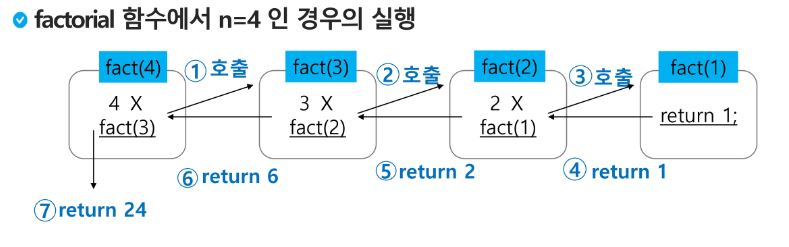
    - 0과 1로 시작하고 이전의 두 수 합을 다음 항으로 하는 수열을 피보나치라 한다.
        - 0, 1, 1, 2, 3, 5, 8, 13, ...
    - 피보나치 수열의 i번 째 값을 계산하는 함수 F를 정의 하면 다음과 같다.
        - F0 = 0, F1 = 1
        - Fi = Fi-1 + Fi-2 for i >= 2
    - 위의 정의로부터 피보나치 수열의 i번째 항을 반환하는 함수를 재귀함수로 구현할 수 있다.
    ```py
    def fibo(n):
        if n< 2 :
            return n
        else:
            return fibo(n-1) + fibo(n-2)
    ```
    - 앞의 예에서 피보나치 수를 구하는 함수를 재귀함수로 구현한 알고리즘은 **엄청난 중복호출이 존재한다**는 문제점이 있다.
    
### Memoization
- 메모이제이션은 컴퓨터 프로그램을 실행할 때 이전에 계산한 값을 메모리에 저장해서 매번 다시 계산하지 않도록 하여 전체적인 실행속도를 빠르게 하는 기술이다. 동적 계획법의 핵심이 되는 기술이다.
- 메모이제이션은 글자 그대로 해석하면 '메모리에 넣기(to put in memory)'라는 의미이며 '기억되어야 할 것'이라는 뜩의 라틴어 memorandum에서 파생되었다. 흔히 '기억하기', '암기하기'라는 뜻의 memorization과 혼동하지만, 정확한 단어는 memoization이다. 동사형은 memoize이다.
- 앞의 예에서 피보나치 수를 구하는 알고리즘에서 fibo(n)의 값을 계산하자마자 저장하면(memoize), 실행시간을 Θ(n)으로 줄일 수 있다.
- Memoization방법을 적용한 알고리즘은 다음과 같다.
```py
# memo를 위한 배열을 할당하고, 모두 0으로 초기화한다
# memo[0]을 0으로 memo[1]는 1로 초기화 한다.
def fibo1(n):
    global memo
    if n >= 2 and len(memo) <= n:
        memo.append(fibo(n-1) + fibo1(n-2))
    return memo[n]

memo = [0, 1]
```

## DP(Dynamic Programming)
- 동적 계획(DP)알고리즘은 그리디 알고리즘과 같이 최적화 문제를 해결하는 알고리즘
- 동적 계획 알고리즘은 먼저 입력 크기가 작은 부분 문제들을 모두 해결한 후에 그 해들을 이용하여 보다 큰 크기의 부분 문제들을 해결하여, 최종적으로 원래 주어진 입력의 문제를 해결하는 알고리즘이다.
- 피보나치 수 DP적용
    - 피보나치 수는 부분 문제의 답으로부터 본 문제의 답을 얻을 수 있으므로 최적 부분 구조로 이루어져 있다.
    1. 문제를 부분 문제로 분할한다.
    
    2. 부분 문제를 나누는 일을 끝냈으면 가장 작은 부분 문제부터 해를 구한다.
    3. 그 결과는 테이블에 저장하고, 테이블에 저장된 부분 문제의 해를 이용하여 상위 문제의 해를 구한다.
    
    - 피보나치 수 DP적용 알고리즘
    ```py
    def fibo2(n):
        f = [0, 1]
        for i in range(2, n + 1):
            f.append(f[i-1] + f[i-2])
        return f[n]
    ```
- DP의 구현 방식
    - recursive 방식 : fib1()
    - iterative 방식 : fib2()
    - memoization을 재귀적 구조에 사용하는 것보다 반복적 구조로 DP를 구현한 것이 성능 면에서 보다 효율적이다.
    - 재귀적 구조는 내부에 시스템 호출 스택을 사용하는 오버헤드가 발생하기 때문이다.

## DFS(깊이우선탐색)
- 비선형구조인 그래프 구조는 그래프로 표현된 모든 자료를 빠짐없이 검색하는 것이 중요함.
- 두 가지 방법
    - 깊이 우선 탐색(Depth First Search, DFS)
    - 너비 우선 탐색(Breadth First Search, BFS)
- 시작 정점의 한 방향으로 갈 수 있는 경로가 있는 곳까지 깊이 탐색해 가다가 더이상 갈 곳이 없게 되면, 가장 마지막에 만났던 갈림길 간선이 있는 정점으로 되돌아와서 다른 방향의 정점으로 탐색을 계속 반복하여 결국 모든 정점을 방문하는 순회방법
- 가장 마지막에 만났던 갈림길의 정점으로 되돌아가서 다시 깊이 우선 탐색을 반복해야 하므로 후입선출 구조의 스택 사용
- DFS 알고리즘
    1. 시작 정점 v를 결정하여 방문한다.
    2. 정점 v에 인접한 정점 중에서
        ① 방문하지 않은 정점 w가 있으면, 정점 v를 스택에 push하고 정점 w를 방문한다. 그리고 w를 v로 하여 다시 2. 을 반복한다.
        ② 방문하지 않은 정점이 없으면, 탐색의 방향을 바꾸기 위해서 스택을 pop하여 받은 가장 마지막 방문 정점을 v로 하여 다시 2.을 반복한다.
    3. 스택이 공백이 될 때 까지 2.을 반복한다.

- DFS 예
    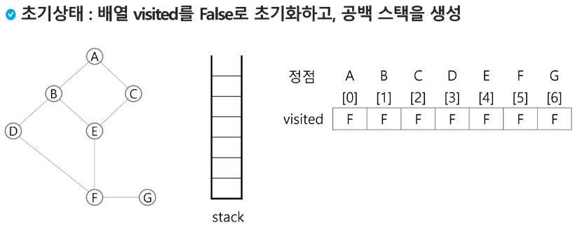
    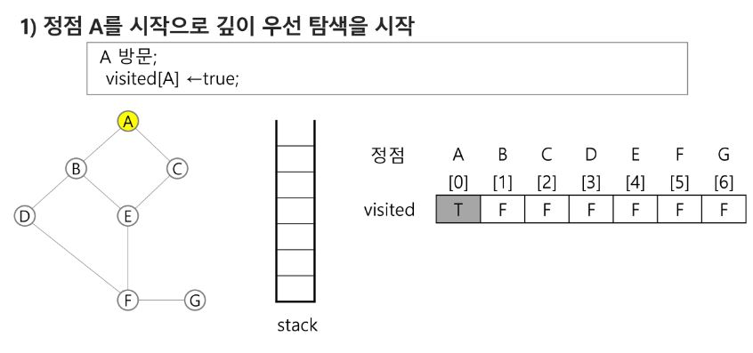
    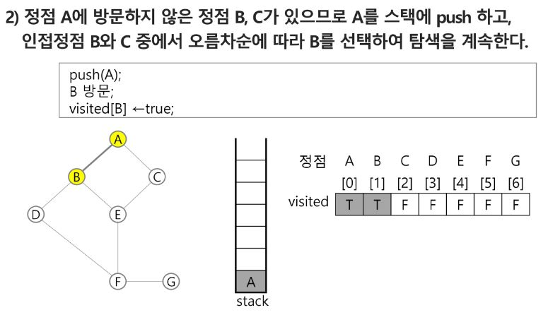
    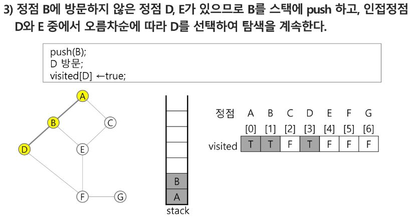
    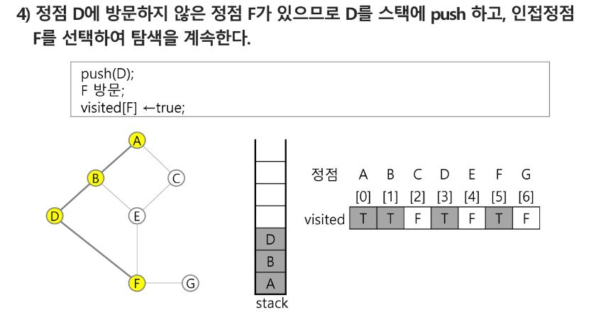
    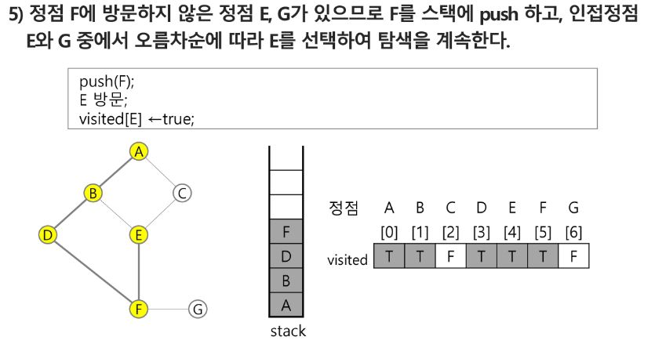
    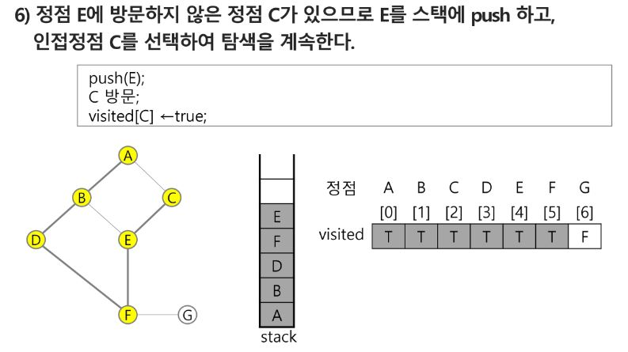
    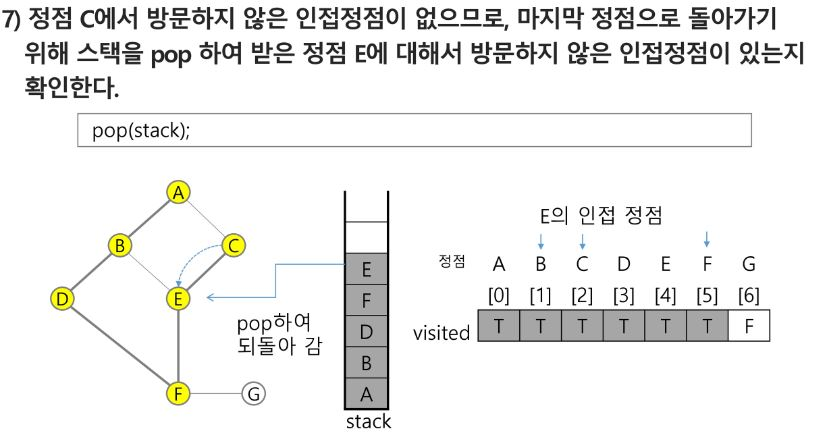
    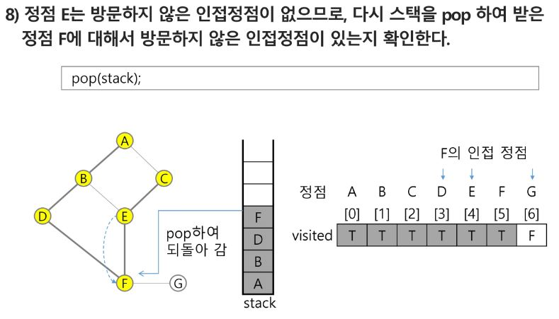
    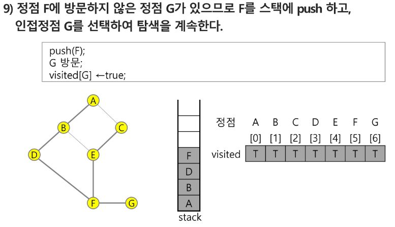
    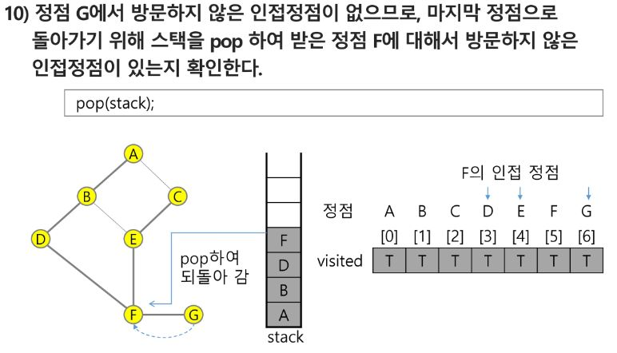
    
    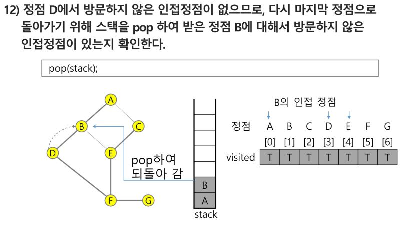
    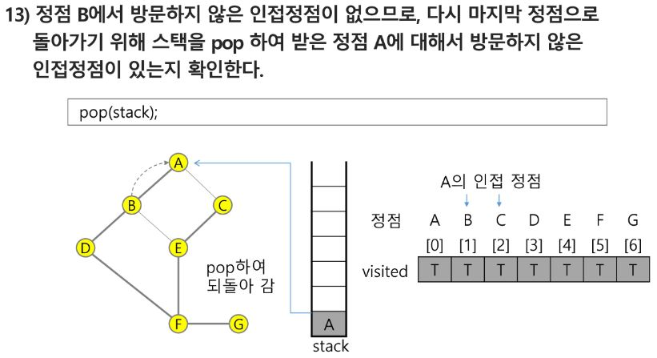
    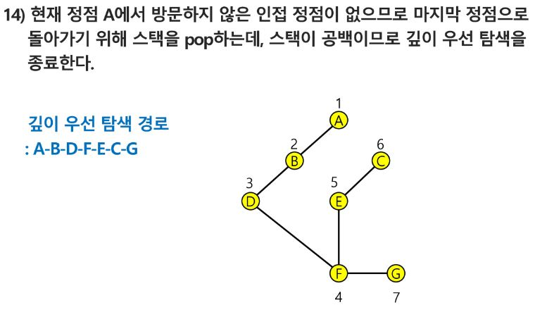

### 계산기 1
- 문자열로 된 계산식이 주어질 때, 스택을 이용하여 이 계산식의 값을 계산할 수 있다.
- 문자열 수식 계산의 일반적 방법
    1. 중위 표기법의 수식을 후위 표기법으로 변경한다.(스택을 이용)
    2. 후위 표기법의 수식을 스택을 이용해 계산한다.
    ```
    중위 표기법(infix notation)
    - 연산자를 피 연산자의 가운데 표기하는 방법
    ex) A+B
    후위 표기법(postfix notation)
    - 연산자를 피연산자 뒤에 표기하는 방법
    ex) AB+
    ```
step 1. 중위 표기식의 후위 표기식 변환 방법1
    - 수식의 각 연산자에 대해 우선순위에 따라 괄호를 사용해 다시 표현
    - 각 연산자를 그에 대응하는 오른쪽 괄호의 뒤로 이동
    - 괄호 제거
    
-  중위 표기법에서 후위 표기법으로의 변환 알고리즘2 (스택이용)
    1. 입력 받은 중위 표기식에서 토큰(피연산자와 연산자)을 읽는다.
    2. 토큰이 피연산자이면 토큰을 출력한다.
    3. 토큰이 연산자(괄호 포함)일 때, 이 토큰이 스택의 top에 저장되어 있는 연산자보다 우선순위가 높으면 스택에 push하고, 그렇지 않으면 스택 top의 연산자의 우선순위가 토큰의 우선순위보다 작을 때까지 스택에서 pop한 후 토큰의 연산자를 push한다. 만약 top에 연산자가 없으면 push한다.
    4. 토큰이 오른쪽 괄호')'이면 스택 top에 왼쪽 괄호'('가 나올 때까지 스택에 pop연산을 수행하고 pop한 연산자를 출력한다. 왼쪽 괄호를 만나면 pop만 하고 출력하진 않는다.
    5. 중위 표기식에 더 읽을 것이 없다면 중지하고, 더 읽을 것이 있다면 1부터 다시 반복한다.
    6. 스택에 남아 있는 연산자를 모두 pop하여 출력한다.
        - 스택 밖의 왼쪽 괄호는 우선 순위가 가장 높으며, 스택 안의 왼쪽 괄호는 우선 순위가 가장 낮다.
    
    
    
    
    
    
    
    ...
    
    
    
    
    
    
step 2. 후위 표기법의 수식을 스택을 이용하여 계산
    1. 피연산자를 만나면 스택에 push
    2. 연산자를 만나면 필요한 만큼의 피연산자를 스택에서 pop하여 연산하고, 연산결과를 다시 스택에 push한다.
    3. 수식이 끝나면, 마지막으로 스택을 pop하여 출력
     기법은 해를 찾는 도중에 '막히면'(즉, 해가 아니면) 되돌아가서 다시 해를 찾아 가는 기법이다.
- 백트래킹 기법은 최적화(optimization) 문제와 결정(decision) 문제를 해결할 수 있다.
- 결정 문제: 문제의 조건을 만족하는 해가 존재하는지의 여부를 'yes' 또는 'no'가 답하는 문제
    - 미로찾기
    
    
    
    
    - n-Queen 문제
        
        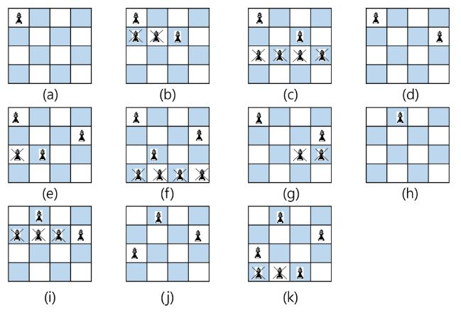
        
        - 깊이 우선검색을 하면 155개의 노드 필요, 백트래킹을 하면 27개 노드 필요
    - Map coloring
    - 부분 집합의 합(Subset Sum) 문제
        - 어떤 집합의 공집합과 자기자신을 포함한 모든 부분집합을 powerset이라고 하며, 구하고자 하는 어떤 집합의 원소 개수가 n일 경우 부분집합의 개수는 2^n개 이다.
        - 백트래킹으로 powerset 구하기
            - 앞에서 설명한 일반적인 백트래킹 접근 방법 이용
            - n개의 원소가 들어있는 집합의 2^n개의 부분집합을 만들 때는, true 또는 false값을 가지는 항목들로 구성된 n개의 배열을 만드는 방법을 이용.
            - 여기서 배열의 i번째 항목은 i번째의 원소가 부분집합의 값인지 아닌지를 나타내는 값이다.
        
        
        
        
        
    - 순열 구하기 문제
        
        
        
        

- 백트래킹과 깊이우선탐색과의 차이
    - 어떤 노드에서 출발하는 경로가 해결책으로 이어질 것 같지 않으면 더 이상 그 경로를 따라가지 않음으로써 시도의 횟수를 줄임.(Prunning 가지치기)
    - 깊이우선탐색이 모든 경로를 추적하는데 비해 백트래킹은 불필요한 경로를 조기에 차단.
    - 깊이우선탐색을 가하기에는 경우의 수가 너무나 많음. 즉, N!가지의 경우의 수를 가진 문제에 대해 깊이우선탐색을 가하면 당연히 처리 불가능한 문제.
    - 백트래킹 알고리즘을 적용하면 일반적으로 경우의 수가 줄어들지만 이 역시 최악의 경우에는 여전히 지수함수 시간을 요하므로 처리 불가능
- 백터래킹 기법
    - 모든 후보를 검사하는 방법이 아님
    - 어떤 노드의 유망성을 점검한 후에 유망(promising)하지 않다고 결정되면 그 노드의 부모를 되돌아가(backtracking) 다음 자식 노드로 감
    - 어떤 노드를 방문하였을 때 그 노드를 포함한 경로가 해답이 될 수 없으면 그 노드는 유망하지 않다고 하며, 반대로 해답의 가능성이 있으면 유망하다고 함
    - 가지치기(prunning) : 유망하지 않는 노드가 포함되는 경로는 더이상 고려하지 않는다.
- 백트래킹을 이용한 알고리즘의 절차
    1. 상태 공간 트리의 깊이우선검색을 실시
    2. 각 노드가 유망한지 점검
    3. 만일 그 노드가 유망하지 않으면, 그 노드의 부모 노드로 돌아가서 검색을 계속 함

