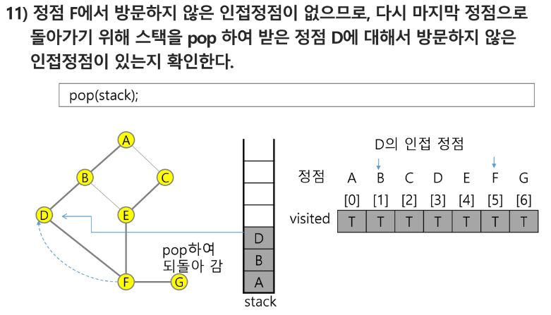

# 알고리즘

## 배열 1 (Array 1)

### 알고리즘
- 유한한 단계를 통해 문제를 해결하기 위한 절차나 방법이다. 주로 컴퓨터 용어로 쓰이며, 컴퓨터가 어떤 일을 수행하기 위한 단계적 방법을 말한다.
- 간단하게 다시 말하면 어떠한 문제를 해결하기 위한 절차라고 볼 수 있다.

- 컴퓨터 분야에서 알고리즘을 표현하는 방법은 크게 두가지가 있다. 
    - 의사코드(슈도코드, Pseudocode)와 순서도(요즘은 순서도 잘 안씀 슈도코드를 사용할 것)


#### 알고리즘의 성능 측정
- APS 과정의 목표 중의 하나는 보다 좋은 알고리즘을 이해하고 활용하는 것이다.
- 좋은 알고리즘이란?
    - 정확성 : 얼마나 정확하게 동작하는가
    - 작업량 : 얼마나 적은 연산으로 원하는 결과를 얻어내는가
    - 메모리 사용량 : 얼마나 적은 메모리를 사용하는가
    - 단순성 : 얼마나 단순한가
    - 최적성 : 더이상 개선할 여지없이 최적화 되었는가
- 주어진 문제를 해결하기 위해 여러 개의 다양한 알고리즘이 가능 -> 어떤 알고리즘을 사용해야 하는가?
- 알고리즘의 성능 분석 필요
    - 많은 문제에서 성능 분석의 기준으로 알고리즘의 작업량을 비교한다.
- 알고리즘의 작업량을 표현할 때 시간복잡도로 표현한다.
- 시간 복잡도(Time Complexity)
    - 실제 걸리는 시간을 측정 - 실제로 측정하긴 어려움
    - 실행되는 명령문의 개수를 계산 - 대략 비교
- 시간 복잡도 = 빅-오(O) 표기법
    - 빅-오 표기법(Big-Oh Notation)
    - 시간 복잡도 함수 중에서 가장 큰 영향력을 주는 n에 대한 항만을 표시
    - 계수(Coefficient)는 생략하여 표시
- 요소 수가 증가함에 따라 각기 다른 시간 복잡도의 알고리즘은 아래와 같은 연산 수를 보인다.


### 배열
- 일정한 자료형의 변수들을 하나의 이름으로 열가하여 사용하는 자료구조
- 아래의 예는 6개의 변수를 사용해야 하는 경우, 이를 배열로 바꾸어 사용하는 것이다.


#### 배열의 필요성
- 프로그램 내에서 여러 개의 변수가 필요할 때, 일일이 다른 변수명을 이용하여 자료에 접근하는 것은 매우 비효율적일 수 있다.
- 배열을 사용하면 하나의 선언을 통해 둘 이상의 변수를 선언할 수 있다.
- 단순히 다수의 변수 선언을 의마하는 것이 아니라, 다수의 변수로는 하기 힘든 작업을 배열을 활용해 쉽게 할 수 있다.

- 1차원 배열의 선언
    - 별도의 선언 방법이 없으면 변수에 처음 값을 할당할 때 생성
    - 이름: 프로그램에서 사용할 배열의 이름
    ```
    Arr = list(), Arr=[] -> 1차원 배열 선언의 예
    Arr = [1, 2, 3], Arr = [0] * 10
    ```
- 1차원 배열의 접근
    ```
    Arr[0] = 10 # 배열 Arr의 0번 원소에 10을 저장하라
    Arr[idx] = 20 # 배열 Arr의 idx번 원소에 20을 저장하라
    ```

### 정렬
- 2개 이상의 자료를 특정 기준에 의해 작은 값부터 큰 값(오름차순: ascending), 혹은 그 반대의 순서대로(내림차순: descending) 재배열 하는것
- 키
    - 자료를 정렬하는 기준이 되는 특정 값
- 대표적인 정렬 방식의 종류
    - 버블 정렬(Bubble Sort)
        - 인접한 두 개의 원소를 비교하며 자리를 계속 교환하는 방식
        - 정렬 과정
            - 첫 번째 원소부터 인접한 원소끼리 계속 자리를 교환하면서 맨 마지막 자리까지 이동한다.
            - 한 단계가 끝나면 가장 큰 원소가 마지막 자리로 정렬된다.
            - 교환하며 자리를 이동하는 모습이 물 위에 올라오는 거품 모양과 같다고 하여 버블 정렬이라고 함
        - 시간 복잡도
            - O(n^2)
    
    
    
    
    
    - 카운팅 정렬(Counting Sort)
        - 항목들의 순서를 결정하기 위해 집합에 각 항목이 몇 개씩 있는지 세는 작업을 하여, 선형 시간에 정렬하는 효율적인 알고리즘
        - 제한 사항
            - 정수나 정수로 표현할 수 있는 자료에 대해서만 적용 가능 : 각 항목의 발생 회수를 기록하기 위해, 정수 항목으로 인덱스 되는 카운트들의 배열을 사용하기 때문이다.
            - 카운트들을 위한 충분한 공간을 할당하려면 집합 내의 가장 큰 정수를 알아야 한다.
        - 시간 복잡도
            - O(n + k) : n은 리스트 길이, k는 정수의 최대값
    
    
    
    
    …
    
    
            - 뒤에서부터 정렬하는 이유는 안정정렬(stable sort) 때문
            - 안정정렬은 같은 값이면 먼저 나온 순서로 정렬하는 것
    - 선택 정렬(Selection Sort)
    - 퀵 정렬(Quick Sort)
    - 삽입 정렬(Insertion Sort)
    - 병합 정렬(Merge Sort)
- 정렬 알고리즘 비교


### 완전 검색(Exaustive Search)
- 문제의 해법으로 생각할 수 있는 모든 경우의 수를 나열해보고 확인하는 기법
- Brute-force 혹은 generate-and-test기법이라고도 불림
- 모든 경우의 수를 테스트하고, 최종 해법을 도출한다.
- 일반적으로 경우의 수가 상대적으로 작을 때 유용하다.
- 수행속도는 느리지만, 해답을 찾지 못할 확률이 작다.
- 자격검정평가 등에서 주어진 문제를 풀 때, 우선 완전 검색으로 접근하여 해답을 도출한 후, 성능 개선을 위해 다른 알고리즘을 사용하고 해답을 확인하는 것이 바람직하다.

### 순열
- 서로 다른 것들 중 몇 개를 뽑아서 한 줄로 나열하는 것
- 서로 다른 n개 중 r개를 택하는 순열은 nPr로 표현
    - nPr = n * (n-1) * (n-2) * ... * (n-r+1)
    - nPn = n! = n * (n-1) * (n-2) * ... * 2 * 1 (팩토리얼(Factorial))

### 탐욕(Greedy) 알고리즘
- 최적해를 구하는 데 사용되는 근시안적인 방법
- 여러 경우 중 하나를 결정해야 할 때마다 그 순간에 최적이라고 생각되는 것을 선택해 나가는 방식으로 진행하여 최종적인 해답에 도달한다.
- 각 선택의 시점에서 이루어지는 결정은 지역적으로는 최적이지만, 그 선택들을 계속 수집하여 최종적인 해답을 만들었다고 하여, 그것이 최적이라는 보장은 없다.
- 일반적으로, 머릿속에 떠오르는 생각을 검증 없이 바로 구현하면 Greedy 접근이 된다.
- 1) 해 선택 : 현재 상태에서 부분 문제의 최적 해를 구한 뒤, 이를 부분해 집합(Soulution Set)에 추가한다.
- 2) 실행 가능성 검사 : 새로운 부분해 집합이 실행 가능한지를 확인한다. 곧, 문제의 제약 조건을 위반하지 않는지 검사한다.
- 3) 해 검사 : 새로운 부분해 집합이 문제의 해가 되는지를 확인한다. 아직 전체 문제의 해가 완성되지 않았다면, 1)의 해선택부터 다시 시작한다.

### 2차원 배열
- 2차원 배열의 선언
    - 1차원 List를 묶어놓은 List
    - 2차원 이상의 다차원 List는 차원에 따라 Index를 선언
    - 2차원 List의 선언 : 세로길이(행의 개수), 가로길이(열의 개수)를 필요로 함
    - Python에서는 데이터 초기화를 통해 변수 선언과 초기화가 가능함
- 2차원 배열의 접근
    - 배열 순회
        - n × m 배열의 n*m개의 모든 원소를 빠짐없이 조사하는 방법
    - 행 우선 순회
    ```py
    # i행의 좌표
    # j열의 좌표
    for i in range(n):
        for j in range(m):
            Array[i][j] # 필요한 연산 수행
    ```
    - 열 우선 순회
    ```py
    # i행의 좌표
    # j열의 좌표
    for j in range(m):
        for i in range(n):
            Array[i][j] # 필요한 연산 수행
    ```
    - 지그재그 순회
    ```py
    # i행의 좌표
    # j열의 좌표
    for i in range(n):
        for j in range(m):
            Array[i][j +    (m-1-2*j) * (i%2)] # 필요한 연산 수행
    ```
    - 델타를 이용한 2차 배열 탐색
        - 2차 배열의 한 좌표에서 4방향의 인접 배열 요소를 탐색하는 방법
        ```
        arr[0...N-1][0...N-1] # N×N 배열
        di[] <- [0, 0, -1, 1] # 상하좌우
        dj[] <- [-1, 1, 0, 0]
        for i : 0 -> N-1 :
            for j : 0 -> N-1 :
                for k in range(4):
                    ni <- i + di[k]
                    nj <- j + dj[k]
                    if 0<=ni<N and 0<=nj<N # 유효한 인덱스면
                        test(arr[ni][nj])
        ```
- 2차원 배열의 활용
    - 전치 행렬
    
### 부분집합 합 문제
- 유한 개의 정수로 이루어진 집합이 있을 때, 이 집합의 부분집합 중에서 그 집합의 원소를 보두 더한 값이 0이 되는 경우가 있는지를 알아내는 문제
- ex) [-7, -3, -2, 5, 8]이라는 집합이 있을 떄, [-3, -2, 5]는이 집합의 부분집합이면서 합이 0이므로 답이 참이 된다.
- 완전 검색 기법으로 부분집합 합 문제를 풀기 위해서는 집합의 모든 부분집합을 생성한 후 각 부분집합의 합을 계산해야 한다.
- 부분집합 생성 
    - 부분집합의 수
        - 집합의 원소가 n개일 때, 공집합을 포함한 부분집합의 수는 2^n개이다.
        - 이는 각 원소를 부분집합에 포함시키거나 포함시키지 않는 2가지 경우를 모든 원소에 적용한 경우의 수와 같다.
        - ex) {1, 2, 3, 4} -> 2 × 2 × 2 × 2 = 16개
    - 각 원소가 부분집합에 포함되었는지를 loop를 이용하여 확인하고 부분집합을 생성하는 방법
    ```py
    bit = [0, 0, 0, 0]
    for i in range(2):
        bit[0] = i # 0번째 원소
        for j in range(2):
            bit[1] = j # 1번째 원소
                for k in range(2):
                    bit[2] = k # 2번째 원소
                    for l in range(2):
                        bit[3] = l # 3번째 원소
                        print_subset(bit) # 생성된 부분집합 출력
    ```
- 비트 연산자
    ```
    & : 비트 단위로 AND 연산을 한다.
    | : 비트 단위로 OR 연산을 한다.
    << : 피연산자의 비트 열을 왼쪽으로 이동시킨다.
    >> : 피연산자의 비트 열을 오른쪽으로 이동시킨다.
    ```
- << 연산자
    - 1 << n : 2^n 즉, 원소가 n개일 경우의 모든 부분집합의 수를 의미한다.
- & 연산자
    - i & (1 << j) : i의 j번째 비트가 1인지 아닌지를 검사한다.
- 보다 간결하게 부분집합을 생성하는 방법
```py
arr = [3, 6, 7, 1, 5, 4]
n = len(arr) # n : 원소의 개수
for i in range(1<<n): # 1<<n : 부분 집합의 개수
    for j in range(n): # 원소의 수만큼 비트를 비교함
        if i & (1<<j): # i의 j번 비트가 1인 경우
            print(arr[j], end = ", ") # j번 원소 출력
    print()
print()
```

### 검색(Search)
- 저장되어 있는 자료 중에서 원하는 항목을 찾는 작업
- 목적하는 탐색 키를 가진 항목을 찾는 것
    - 탐색 키(search key) : 자료를 구별하여 인식할 수 있는 키
- 검색의 종류
    - 순차 검색(sequential search)
        - 일렬로 되어 있는 자료를 순서대로 검색하는 방법
            - 가장 간단하고 직관적인 검색 방법
            - 배열이나 연결 리스트 등 순차구조로 구현된 자료구조에서 원하는 항목을 찾을 때 유용
            - 알고리즘이 단순하여 구현이 쉽지만, 검색 대상의 수가 많은 경우에는 수행시간이 급격히 증가하여 비효율적임
        - 2가지 경우
            1. 정렬되어 있지 않은 경우
                - 검색 과정
                    1. 첫 번째 원소부터 순서대로 검색 대상과 키 값이 같은 원소가 있는지 비교하며 찾는다.
                    2. 키 값이 동일한 원소를 찾으면 그 원소의 인덱스를 반환한다.
                    3. 자료구조의 마지막에 이를 때까지 검색 대상을 찾지 못하면 검색 실패
                - 찾고자 하는 원소의 순서에 따라 비교회수가 결정됨
                    - 첫 번째 원소를 찾을 때는 1번 비교, 두 번째 원소를 찾을 때는 2번 비교...
                    - 정렬되지 않은 자료에서의 순차 검색의 평균 비교 회수
                        - (1/n)*(1+2+3+...+n) = (n+1)/2
                    - 시간 복잡도 : O(n)
            2. 정렬되어 있는 경우
                - 검색 과정
                    1. 자료가 오름차순으로 정렬된 상태에서 검색을 실시한다고 가정
                    2. 자료를 순차적으로 검색하면서 키 값을 비교하여, 원소의 키 값이 검색 대상의 키 값보다 크면 찾는 원소가 없다는 것이므로 더 이상 검색하지 않고 검색을 종료
                - 찾고자 하는 원소의 순서에 따라 비교회수가 결정됨
                    - 정렬되어 있으므로, 검색 실패를 반환하는 경우 평균 비교 회수가 반으로 줄어든다.
                    - 시간복잡도 : O(n)
    - 이진 검색(binary search)
        - 자료의 가운데에 있는 항목의 키 값과 비교하여 다음 검색의 위치를 결정하고 검색을 계속 진행하는 방법
            - 목적 키를 찾을 때까지 이진 검색을 순환적으로 반복 수행함으로써 검색 범위를 반으로 줄여가면서 보다 빠르게 검색을 수행함
        - 이진 검색을 하기 위해서는 자료가 정렬된 상태여야 한다.
        - 검색 과정
            1. 자료의 중앙에 있는 원소를 고른다.
            2. 중앙 원소의 값과 찾고자 하는 목표 값을 비교한다.
            3. 목표 값이 중앙 원소값보다 작으면 자료의 왼쪽 반에 대해 새로 검색을 수행하고, 크다면 자료의 오른쪽 반에 대해서 새로 검색을 수행한다.
            4. 찾고자 하는 값을 찾을 때까지 1~3의 과정을 반복한다.
        - 구현
            - 검색 범위의 시작점과 종료점을 이용하여 검색을 반복 수행한다.
            - 이진 검색의 경우, 자료에 삽입이나 삭제가 발생했을 때 배열의 상태를 항상 정렬 상태로 유지하는 추가 작업이 필요하다.
        - 재귀 함수 이용
            - 아래와 같이 재귀 함수를 이용하여 이진 검색을 구현할 수도 있다.
            - **더 효율적인 방법은 반복구조이용**
            - 재귀 함수에 대해서는 나중에 더 자세히 배움
    - 해쉬(hash)

### 인덱스
- 인덱스라는 용어는 Database에서 유래했으며, 테이블에 대한 동작 속도를 높여주는 자료 구조를 일컫는다. Database 분야가 아닌 곳에서는 Lock up table등의 용어를 사용하기도 한다.
- 인덱스를 저장하는데 필요한 디스크 공간은 보통 테이블을 저장하는데 필요한 디스크 공간보다 작다. 왜냐하면 보통 인덱스는 키-필드만 갖고 있고, 테이블의 다른 세부 항목들은 갖고 있지 않기 때문이다.
- 배열을 사용한 인덱스
    - 대량의 데이터를 매번 정렬하면, 프로그램의 반응은 느려질 수 밖에 없다. 이러한 대량 데이터의 성능 저하 문제를 해결하기 위해 배열 인덱스를 사용할 수 있다.
- 다음 예에서 원본 데이터 배열과 별개로, 배열 인덱스를 추가한 예를 보여주고 있다.
    - 원본 데이터에 데이터가 삽입 될 경우 상대적으로 크기가 작은 인덱스 배열을 정렬하기 때문에 속도가 빠르다.
    

### 선택 정렬(Selection Sort)
- 주어진 자료들 중 가장 작은 값의 원소부터 차례대로 선택하여 위치를 교환하는 방식
    - 앞서 살펴본 셀렉션 알고리즘을 전체 자료에 적용한 것이다.
- 정렬 과정
    1. 주어진 리스트 중에서 최소값을 찾는다.
    2. 그 값을 리스트의 맨 앞에 위치한 값과 교환한다.
    3. 맨 처음 위치를 제외한 나머지 리스트를 대상으로 위의 과정을 반복한다.
    
    
    
    


- 시간 복잡도
    - O(n^2)

### 셀렉션 알고리즘(Selection Algorithm)
- 저장되어 있는 자료로부터 k번째로 큰 혹은 작은 원소를 찾는 방법
    - 최소값, 최대값 혹은 중간값을 찾는 알고리즘을 의미하기도 한다.
- 선택 과정
    - 셀렉션은 아래와 같은 과정을 통해 이루어짐
        1. 정렬 알고리즘을 이용하는 자료 정렬하기
        2. 원하는 순서에 있는 원소 가져오기
- 정렬알고리즘 비교


### 문자열
- 대부분의 컴퓨터는 아스키 형식을 사용
    - 아스키는 미국에서 정보를 교환할 때 사용하기 위해 처음 만듦
- 한글은 유니코드(다국어 처리를 위한 표준) 사용 (UTF-8) - 파이썬
- 파이썬에서 문자열 처리
    - char 타입 없음
    - 텍스트 데이터의 취급방법이 통일되어 있음
    - 문자열 기호
        - '(홑따옴표), "(쌍따옴표), '''(홑따옴표 3개), """(쌍따옴표 3개)
        - + : 연결(Concatenatrion)
            - 문자열 + 문자열 : 이어 붙여주는 역할
        - * : 반복
            - 문자열 * 수 : 수만큼 문자열이 반복
    - 문자열은 시퀀스 자료형으로 분류되고, 시퀀스 자료형에서 사용할 수 있는 인덱싱, 슬라이싱 연산들을 사용할 수 있음
    - 문자열 클래스에서 제공되는 메서드 
    ```
    replace(), split(), isalpha(), find()
    ```
    - 문자열은 튜플과 같이 요소값을 변경할 수 없음(immutable)
    
## 패턴 매칭
- 패턴 매칭에 사용되는 알고리즘
    - 고지식한 패턴 검색 알고리즘
        - 브루트 포스(Brute Force)
            - 본문 문자열을 처음부터 끝까지 차례대로 순회하면서 패턴 내의 문자들을 일일이 비교하는 방식으로 동작
    
    
    - 고지식한 패턴 검색 알고리즘의 시간 복잡도
        - 최악의 경우 시간 복잡도는 텍스트의 모든 위치에서 패턴을 비교해야 하므로 O(MN)이 됨
    - 카프-라빈 알고리즘
    - KMP 알고리즘
        - 불일치가 발생한 텍스트 스트링의 앞 부분에 어떤 문자가 있는지를 미리 알고 있으므로, 불일치가 발생한 앞 부분에 대하여 다시 비교하지 않고 매칭을 수행
        - 패턴을 전처리하여 배열 next[M]을 구해서 잘못된 시작을 최소화함
            - next[M] : 불일치가 발생했을 경우 이동할 다음 위치
        - 시간 복잡도 : O(M+N)
        - 아이디어 설명
            - 텍스트에서 abcdabc까지는 매치되고, e에서 실패한 상황 패턴의 맨 앞의 abc와 실패 직전의 abc는 동일함을 이용할 수 있다.
            - 실패한 텍스트 문자와 P[4]를 비교한다.
        
        
    - 보이어-무어 알고리즘
        - 오른쪽에서 왼쪽으로 비교
        - 대부분의 상용 소프트웨어에서 채택하고 있는 알고리즘
        - 보이어-무어 알고리즘은 패턴에 오르쪽 끝에 있는 문자가 불일치 하고 이 문자가 패턴 내에 존재하지 않는 경우, 이동 거리는 무려 패턴의 길이만큼이 된다.
        
        
        
        - 앞의 두 매칭 알고리즘들의 공통점 텍스트 문자열의 문자를 적어도 한번씩 훑는다는 것이다. 따라서 최선의 경우에도 Ω(n)
        - 보이어-무어 알고리즘은 텍스트 문자를 다 보지 않아도 된다.
        - 발상의 전환: 패턴의 오른쪽부터 비교한다.
        - 최악의 경우 수행시간 : Θ(mn)
        - 입력에 따라 다르지만 일반적으로 Θ(n)보다 시간이 덜 든다.
    - 문자열 매칭 알고리즘 비교
        - 찾고자 하는 문자열 패턴의 길이 m, 총 문자열 길이 n
        - 고지식한 패턴 검색 알고리즘 : 수행시간 O(mn)
        - 카프-라빈 알고리즘 : 수행시간 Θ(n)
        - KMP알고리즘 : 수행시간 Θ(n)
        - 보이어-무어 알고리즘 : 수행시간 최악의 경우 Θ(mn)이나 일반적으로 Θ(n)보다 적음

## 파이참 디버거
빨간 점 찍고 디버깅, f8누르면 한단계씩 다음단계로 이동

## 스택
### 스택
#### 특성
- 물건을 쌓아 올리듯 자료를 쌓아 올린 형태의 자료구조
- 스택에 저장된 자료는 선형구조를 갖는다
    - 선형구조 : 자료 간의 관계가 1대1의 관계를 갖는다.
    - 비선형구조 : 자료 간의 관계가 1대N의 관계를 갖는다(예: 트리)
- 스택에 자료를 삽입하거나 스택에서 자료를 꺼낼 수 있다.
- 마지막에 삽입한 자료를 가장 먼저 꺼낸다. 후입선출(LIFO, Last-In-First-Out)이라 부른다.
    - 예를 들어 스택에 1, 2, 3 순으로 자료를 삽입한 후 꺼내면 역순으로 즉, 3, 2, 1 순으로 꺼낼 수 있다. 
#### 구현
- 스택을 프로그램에서 구현하기 위해서 필요한 자료구조와 연산
    - 자료구조 자료를 선형으로 저장할 저장소
        - 배열을 사용할 수 있다.
        - 저장소 자체를 스택이라 부르기도 한다.
        - 스택에서 마지막 삽입된 원소의 위치를 top이라 부른다.
    - 연산
        - 삽입 : 저장소에 자료를 저장한다. 보통 push라고 부른다.
            스택의 push 알고리즘
            - append 메소드를 통해 리스트의 마지막에 데이터를 삽입
            ```py
            def push(item):
                s.append(item)
            ```
        - 삭제 : 저장소에서 자료를 꺼낸다. 꺼낸 자료는 삽입한 자료의 역순으로 꺼낸다. 보통 pop이라고 부른다.
            스택의 pop 알고리즘
            ```py
            def pop():
                if len(s) == 0:
                    # underflow
                    return
                else:
                    return s.pop(-1)
            ```
        - 스택이 공백인지 아닌지를 확인하는 연산. isEmpty
        - 스택의 top에 있는 item(원소)을 반환하는 연산. peek
        - 스택의 삽입/삭제 과정
            - 빈 스택에 원소 A, B, C를 차례로 삽입한 후 한번 삭제하는 연산과정
            
- 고려사항
    - 1차원 배열을 사용하여 구현할 경우 구현이 용이하다는 장점이 있지만 스택의 크기를 변경하기가 어렵다는 단점이 있다.
    - 이를 해결하기 위한 방법으로 저장소를 동적으로 할당하여 스택을 구현하는 방법이 있다. 동적 연결리스트를 이용하여 구현하는 방법을 의미한다. 구현이 복잡하다는 단점이 있지만 메모리를 효율적으로 사용한다는 장점을 가진다. 스택의 동적 구현은 생략한다.
- 스택의 응용1. 괄호검사
    - 괄호의 종류 : 대괄호 ('[',']'), 중괄호('{','}'), 소괄호 ('(',')')
    - 조건
        1. 왼쪽 괄호의 개수와 오른쪽 괄호의 개수가 같아야 한다.
        2. 같은 괄호에서 왼쪽 괄호는 오른쪽 괄호보다 먼저 나와야 한다.
        3. 괄호 사이에는 포함 관계만 존재한다.
    - 잘못된 괄호 사용의 예
    ```
    (a(b) 
    a(b)c) 
    a{b(c[d]e}f)
    ```
    
    - 괄호를 조사하는 알고리즘 개요
        - 문자열에 있는 괄호를 차례대로 조사하면서 왼쪽 괄호를 만나면 스택에 삽입하고, 오른쪽 괄호를 만나면 스택에서 top 괄호를 삭제한 후 오른쪽 괄호와 짝이 맞는지를 검사한다.
        - 이 때, 스택이 비어 있으면 조건 1 또는 조건 2에 위배되고 괄호의 짝이 맞지 않으면 조건 3에 위배된다.
        - 마지막 괄호까지를 조사한 후에도 스택에 괄호가 남아있으면 조건 1에 위배된다.
- 스택의 응용2. function call
    - Function call
        - 프로그램에서의 함수 호출과 복귀에 따른 수행 순서를 관리
            - 가장 마지막에 호출된 함수가 가장 먼저 실행을 완료하고 복귀하는 후입선출 구조이므로, 후입선출 구조의 스택을 이용하여 수행순서 관리
            - 함수 호출이 발생하면 호출한 함수 수행에 필요한 지역변수, 매개변수 및 수행 후 복귀할 주소 등의 정보를 스택 프레임(stack frame)에 저장하여 시스템 스택에 삽입
            - 함수의 실행이 끝나면 시스템 스택의 top원소(스택 프레임)를 삭제(pop)하면서 프레임에 저장되어 있던 복귀주소를 확인하고 복귀
            - 함수 호출과 복귀에 따라 이 과정을 반복하여 전체 프로그램 수행이 종료되면 시스템 스택은 공백 스택이 된다.
    

## 재귀 호출
- 자기 자신을 호출하여 순환 수행되는 것
- 함수에서 실행해야 하는 작업의 특성에 따라 일반적인 호출방식보다 재귀호출방식을 사용하여 함수를 만들면 프로그램의 크기를 줄이고 간단하게 작성
    - 재귀 호출의 예) factorial
        - n에 대한 factorial : 1부터 n까지의 모든 자연수를 곱하여 구하는 연산
        ```
        n! = n × (n-1)!
            (n-1)! = (n-1) × (n-2)!
            (n-1)! = (n-2) × (n-3)!
        ...
            2! = 2 × 1!
            1! = 1
        ```
        - 마지막에 구한 하위 값을 이용하여 상위 값을 구하는 작업을 반복
        
    - 0과 1로 시작하고 이전의 두 수 합을 다음 항으로 하는 수열을 피보나치라 한다.
        - 0, 1, 1, 2, 3, 5, 8, 13, ...
    - 피보나치 수열의 i번 째 값을 계산하는 함수 F를 정의 하면 다음과 같다.
        - F0 = 0, F1 = 1
        - Fi = Fi-1 + Fi-2 for i >= 2
    - 위의 정의로부터 피보나치 수열의 i번째 항을 반환하는 함수를 재귀함수로 구현할 수 있다.
    ```py
    def fibo(n):
        if n< 2 :
            return n
        else:
            return fibo(n-1) + fibo(n-2)
    ```
    - 앞의 예에서 피보나치 수를 구하는 함수를 재귀함수로 구현한 알고리즘은 **엄청난 중복호출이 존재한다**는 문제점이 있다.
    
### Memoization
- 메모이제이션은 컴퓨터 프로그램을 실행할 때 이전에 계산한 값을 메모리에 저장해서 매번 다시 계산하지 않도록 하여 전체적인 실행속도를 빠르게 하는 기술이다. 동적 계획법의 핵심이 되는 기술이다.
- 메모이제이션은 글자 그대로 해석하면 '메모리에 넣기(to put in memory)'라는 의미이며 '기억되어야 할 것'이라는 뜩의 라틴어 memorandum에서 파생되었다. 흔히 '기억하기', '암기하기'라는 뜻의 memorization과 혼동하지만, 정확한 단어는 memoization이다. 동사형은 memoize이다.
- 앞의 예에서 피보나치 수를 구하는 알고리즘에서 fibo(n)의 값을 계산하자마자 저장하면(memoize), 실행시간을 Θ(n)으로 줄일 수 있다.
- Memoization방법을 적용한 알고리즘은 다음과 같다.
```py
# memo를 위한 배열을 할당하고, 모두 0으로 초기화한다
# memo[0]을 0으로 memo[1]는 1로 초기화 한다.
def fibo1(n):
    global memo
    if n >= 2 and len(memo) <= n:
        memo.append(fibo(n-1) + fibo1(n-2))
    return memo[n]

memo = [0, 1]
```

## DP(Dynamic Programming)
- 동적 계획(DP)알고리즘은 그리디 알고리즘과 같이 최적화 문제를 해결하는 알고리즘
- 동적 계획 알고리즘은 먼저 입력 크기가 작은 부분 문제들을 모두 해결한 후에 그 해들을 이용하여 보다 큰 크기의 부분 문제들을 해결하여, 최종적으로 원래 주어진 입력의 문제를 해결하는 알고리즘이다.
- 피보나치 수 DP적용
    - 피보나치 수는 부분 문제의 답으로부터 본 문제의 답을 얻을 수 있으므로 최적 부분 구조로 이루어져 있다.
    1. 문제를 부분 문제로 분할한다.
    
    2. 부분 문제를 나누는 일을 끝냈으면 가장 작은 부분 문제부터 해를 구한다.
    3. 그 결과는 테이블에 저장하고, 테이블에 저장된 부분 문제의 해를 이용하여 상위 문제의 해를 구한다.
    
    - 피보나치 수 DP적용 알고리즘
    ```py
    def fibo2(n):
        f = [0, 1]
        for i in range(2, n + 1):
            f.append(f[i-1] + f[i-2])
        return f[n]
    ```
- DP의 구현 방식
    - recursive 방식 : fib1()
    - iterative 방식 : fib2()
    - memoization을 재귀적 구조에 사용하는 것보다 반복적 구조로 DP를 구현한 것이 성능 면에서 보다 효율적이다.
    - 재귀적 구조는 내부에 시스템 호출 스택을 사용하는 오버헤드가 발생하기 때문이다.

## DFS(깊이우선탐색)
- 비선형구조인 그래프 구조는 그래프로 표현된 모든 자료를 빠짐없이 검색하는 것이 중요함.
- 두 가지 방법
    - 깊이 우선 탐색(Depth First Search, DFS)
    - 너비 우선 탐색(Breadth First Search, BFS)
- 시작 정점의 한 방향으로 갈 수 있는 경로가 있는 곳까지 깊이 탐색해 가다가 더이상 갈 곳이 없게 되면, 가장 마지막에 만났던 갈림길 간선이 있는 정점으로 되돌아와서 다른 방향의 정점으로 탐색을 계속 반복하여 결국 모든 정점을 방문하는 순회방법
- 가장 마지막에 만났던 갈림길의 정점으로 되돌아가서 다시 깊이 우선 탐색을 반복해야 하므로 후입선출 구조의 스택 사용
- DFS 알고리즘
    1. 시작 정점 v를 결정하여 방문한다.
    2. 정점 v에 인접한 정점 중에서
        ① 방문하지 않은 정점 w가 있으면, 정점 v를 스택에 push하고 정점 w를 방문한다. 그리고 w를 v로 하여 다시 2. 을 반복한다.
        ② 방문하지 않은 정점이 없으면, 탐색의 방향을 바꾸기 위해서 스택을 pop하여 받은 가장 마지막 방문 정점을 v로 하여 다시 2.을 반복한다.
    3. 스택이 공백이 될 때 까지 2.을 반복한다.

- DFS 예
    
    
    
    
    
    
    
    
    
    
    
    
    
    
    

### 계산기 1
- 문자열로 된 계산식이 주어질 때, 스택을 이용하여 이 계산식의 값을 계산할 수 있다.
- 문자열 수식 계산의 일반적 방법
    1. 중위 표기법의 수식을 후위 표기법으로 변경한다.(스택을 이용)
    2. 후위 표기법의 수식을 스택을 이용해 계산한다.
    ```
    중위 표기법(infix notation)
    - 연산자를 피 연산자의 가운데 표기하는 방법
    ex) A+B
    후위 표기법(postfix notation)
    - 연산자를 피연산자 뒤에 표기하는 방법
    ex) AB+
    ```
step 1. 중위 표기식의 후위 표기식 변환 방법1
    - 수식의 각 연산자에 대해 우선순위에 따라 괄호를 사용해 다시 표현
    - 각 연산자를 그에 대응하는 오른쪽 괄호의 뒤로 이동
    - 괄호 제거
    
-  중위 표기법에서 후위 표기법으로의 변환 알고리즘2 (스택이용)
    1. 입력 받은 중위 표기식에서 토큰(피연산자와 연산자)을 읽는다.
    2. 토큰이 피연산자이면 토큰을 출력한다.
    3. 토큰이 연산자(괄호 포함)일 때, 이 토큰이 스택의 top에 저장되어 있는 연산자보다 우선순위가 높으면 스택에 push하고, 그렇지 않으면 스택 top의 연산자의 우선순위가 토큰의 우선순위보다 작을 때까지 스택에서 pop한 후 토큰의 연산자를 push한다. 만약 top에 연산자가 없으면 push한다.
    4. 토큰이 오른쪽 괄호')'이면 스택 top에 왼쪽 괄호'('가 나올 때까지 스택에 pop연산을 수행하고 pop한 연산자를 출력한다. 왼쪽 괄호를 만나면 pop만 하고 출력하진 않는다.
    5. 중위 표기식에 더 읽을 것이 없다면 중지하고, 더 읽을 것이 있다면 1부터 다시 반복한다.
    6. 스택에 남아 있는 연산자를 모두 pop하여 출력한다.
        - 스택 밖의 왼쪽 괄호는 우선 순위가 가장 높으며, 스택 안의 왼쪽 괄호는 우선 순위가 가장 낮다.
    
    
    
    
    
    
    
    ...
    
    
    
    
    
    
step 2. 후위 표기법의 수식을 스택을 이용하여 계산
    1. 피연산자를 만나면 스택에 push
    2. 연산자를 만나면 필요한 만큼의 피연산자를 스택에서 pop하여 연산하고, 연산결과를 다시 스택에 push한다.
    3. 수식이 끝나면, 마지막으로 스택을 pop하여 출력
     기법은 해를 찾는 도중에 '막히면'(즉, 해가 아니면) 되돌아가서 다시 해를 찾아 가는 기법이다.
- 백트래킹 기법은 최적화(optimization) 문제와 결정(decision) 문제를 해결할 수 있다.
- 결정 문제: 문제의 조건을 만족하는 해가 존재하는지의 여부를 'yes' 또는 'no'가 답하는 문제
    - 미로찾기
    
    
    
    
    - n-Queen 문제
        
        
        
        - 깊이 우선검색을 하면 155개의 노드 필요, 백트래킹을 하면 27개 노드 필요
    - Map coloring
    - 부분 집합의 합(Subset Sum) 문제
        - 어떤 집합의 공집합과 자기자신을 포함한 모든 부분집합을 powerset이라고 하며, 구하고자 하는 어떤 집합의 원소 개수가 n일 경우 부분집합의 개수는 2^n개 이다.
        - 백트래킹으로 powerset 구하기
            - 앞에서 설명한 일반적인 백트래킹 접근 방법 이용
            - n개의 원소가 들어있는 집합의 2^n개의 부분집합을 만들 때는, true 또는 false값을 가지는 항목들로 구성된 n개의 배열을 만드는 방법을 이용.
            - 여기서 배열의 i번째 항목은 i번째의 원소가 부분집합의 값인지 아닌지를 나타내는 값이다.
        
        
        
        
        
    - 순열 구하기 문제
        
        
        
        

- 백트래킹과 깊이우선탐색과의 차이
    - 어떤 노드에서 출발하는 경로가 해결책으로 이어질 것 같지 않으면 더 이상 그 경로를 따라가지 않음으로써 시도의 횟수를 줄임.(Prunning 가지치기)
    - 깊이우선탐색이 모든 경로를 추적하는데 비해 백트래킹은 불필요한 경로를 조기에 차단.
    - 깊이우선탐색을 가하기에는 경우의 수가 너무나 많음. 즉, N!가지의 경우의 수를 가진 문제에 대해 깊이우선탐색을 가하면 당연히 처리 불가능한 문제.
    - 백트래킹 알고리즘을 적용하면 일반적으로 경우의 수가 줄어들지만 이 역시 최악의 경우에는 여전히 지수함수 시간을 요하므로 처리 불가능
- 백터래킹 기법
    - 모든 후보를 검사하는 방법이 아님
    - 어떤 노드의 유망성을 점검한 후에 유망(promising)하지 않다고 결정되면 그 노드의 부모를 되돌아가(backtracking) 다음 자식 노드로 감
    - 어떤 노드를 방문하였을 때 그 노드를 포함한 경로가 해답이 될 수 없으면 그 노드는 유망하지 않다고 하며, 반대로 해답의 가능성이 있으면 유망하다고 함
    - 가지치기(prunning) : 유망하지 않는 노드가 포함되는 경로는 더이상 고려하지 않는다.
- 백트래킹을 이용한 알고리즘의 절차
    1. 상태 공간 트리의 깊이우선검색을 실시
    2. 각 노드가 유망한지 점검
    3. 만일 그 노드가 유망하지 않으면, 그 노드의 부모 노드로 돌아가서 검색을 계속 함


## 큐
### 큐(Queue)의 특성
- 스택과 마찬가지로 삽입과 삭제의 위치가 제한적인 자료구조
    - 큐의 뒤에서는 삽입만 하고, 큐의 앞에서는 삭제만 이루어지는 구조
- 선입선출구조(FIFO : First In First Out)
    - 큐에 삽입된 순서대로 원소가 저장되어, 가장 먼저 삽입된 원소는 가장 먼저 삭제된다.
- 큐의 선입선출 구조
    - 머리(front)
        - 저장된 원소 중 첫번째 원소(또는 삭제된 위치)
    - 꼬리(Rear)
        - 저장된 원소 중 마지막 원소
    
- 큐의 기본 연산
    - 삽입 : enQueue
    - 삭제 : deQueue
- 큐의 주요 연산
    - 큐의 사용을 위해 필요한 주요 연산들
    - enQueue(item) : 큐의 뒤쪽(rear 다음)에 원소를 삽입
    - dnQueue() : 큐의 앞쪽(front)에서 원소를 삭제하고 반환
    - createQueue() : 공백 상태의 큐를 생성
    - isEmpty() : 큐가 공백상태인지 확인
    - isFull : 큐가 포화상태인지 확인
    - Qpeek() : 큐의 앞쪽(front)에서 원소를 삭제 없이 반환
        

- 큐의 연산 과정
    1) 공백 큐 생성 : create Queue();
        - front, rear를 -1로 초기화
    2) 원소 A 삽입 : enQueue(A);
        - rear증가, 저장
    3) 원소 B 삽입 : enQueue(B);
        - rear증가, 저장
    
    4) 원소 반환/삭제 : deQueue();
        - front 증가, 반환(front는 마지막으로 꺼낸 자리, rear는 마지막 저장 위치)
    5) 원소 C 삽입 : enQueue(C);
        - rear증가, 저장
    6) 원소 반환/삭제 : deQueue();
        - front 증가, 반환
    7) 원소 반환/삭제 : deQueue();
        - front 증가, 반환 'front == rear'이면 큐가 비어있는 상태
    
- 큐의 구현
    - 선형 큐
        - 1차원 배열을 이용한 큐
            - 큐의 크기 = 배열의 크기
            - front : 저장된 첫 번째 원소의 인덱스
            - rear : 저장된 마지막 원소의 인덱스
    - 상태 표현
        - 초기 상태 : front == rear = -1
        - 공백 상태 : front == rear
        - 포화 상태 : rear = n-1 (n : 배열의 크기, n-1 : 배열의 마지막 인덱스)
    - 초기 공백 큐 생성
        - 크기 n인 1차원 배열 생성
        - front와 rear를 -1로 초기화
    - 삽입 : enQueue(item)
        - 마지막 원소 뒤에 새로운 원소를 삽입하기 위해
            1) rear값을 하나 증가시켜 새로운 원소를 삽입할 자리를 마련
            2) 그 인덱스에 해당하는 배열원소 Q[rear]에 item을 저장
            ```py
            def enQueue(item):
                global rear
                if isFull() : print("Queue_Full")
                else:
                    rear += 1
                    Q[rear] = item
            ```
    - 삭제 : deQueue()
        - 가장 앞에 있는 원소를 삭제하기 위해
            1) front값을 하나 증가시켜 큐에 남아있게 될 첫 번째 원소 이동
            2) 새로운 첫 번째 원소를 리턴 함으로써 삭제와 동일한 기능함
            ```py
            def deQueue():
                global front
                if isEmpty():
                    Queue_Empty()
                else:
                    front += 1
                    return Q[front]
    - 공백상태 및 포화상태 검사 : isEmpty(), isFull()
        - 공백상태 : front == rear
        - 포화상태 : rear = n-1 (n : 배열의 크기, n-1 : 배열의 마지막 인덱스)
        ```py
        def isEmpty():
            return front == rear
        def Full():
            return rear == len(Q) - 1
        ```
    - 검색 : Qpeek()
        - 가장 앞에 있는 원소를 검색하여 반환하는 연산
        - 현재 front의 한자리 뒤(front+1)에 있는 원소, 즉 큐의 첫 번째에 있는 원소를 반환
        ```py
        def Qpeek():
            if isEmpty():
                print("Queue_Empty")
            else:
                return Q[front+1]
        ```
    - 선형 큐 이용시 문제점
        - 잘못된 포화상태 인식
            - 선형 큐를 이용하여 원소의 삽입과 삭제를 계속할 경우, 배열의 앞부분에 활용할 수 있는 공간이 있음에도 불구하고, rear=n-1 인 상태 즉, 포화상태로 인식하여 더이상의 삽입을 수행하지 않게 됨
            
        - 해결방법 1
            - 매 연산이 이뤄질 때마다 저장된 원소들을 배열의 앞부분으로 모두 이동
            
            - 원소 이동에 많은 시간이 소요되어 큐의 효율성이 급격히 떨어짐
        - 해결방법 2
            - 1차원 배열을 사용하되, 논리적으로는 배열의 처음과 끝이 연결되어 원형 형태의 큐를 이룬다고 가정하고 사용
            
- 원형 큐의 구조
    - 초기 공백 상태
        - front = rear = 0
    - Index의 순환
        - front와 rear의 위치가 배열의 마지막 인덱스인 n-1을 가리킨 후, 그 다음에는 논리적 순환을 이루어 배열의 처음 인덱스인 0으로 이동해야 함
        - 이를 위해 나머지 연산자 mod를 사용함
    - front변수
        - 공백 상태와 포화상태 구분을 쉽게 하기 위해 front가 있는 자리는 사용하지 않고 항상 빈자리로 둠
    - 삽입 위치 및 삭제 위치
        
- 원형 큐의 연산 과정
    1) 공백 큐 생성 : create Queue();
        - front, rear를 -1로 초기화
    2) 원소 A 삽입 : enQueue(A);
        - rear증가, 저장
    
    3) 원소 B 삽입 : enQueue(B);
        - rear증가, 저장
    4) 원소 반환/삭제 : deQueue();
        - front 증가, 반환(front는 마지막으로 꺼낸 자리, rear는 마지막 저장 위치)
    
    5) 원소 C 삽입 : enQueue(C);
        - rear증가, 저장
    6) 원소 D 삽입 : enQueue(D);
        - rear증가(다시 0으로), 저장
        - Queue는 Full인 상태
    
- 원형 큐의 구현
    - 초기 공백 큐 생성
        - 크기 n인 1차원 배열 생성
        - front와 rear를 0으로 초기화
        ```py
        Q = [0] * n
        front = 0
        rear = 0
        ```
    - 공백 상태 및 포화상태 검사 : isEmpty(), isFull()
        - 공백상태 : front == rear
        - 포화상태 : 삽입할 rear의 다음 위치 == 현재 front
            - (rear+1) mod n == front
        ```py
        def isEmpty():
            return front == rear
        def isFull():
            return (rear+1) % len(cQ) == front
        ```
    - 삽입 : enQueue(item)
        - 마지막 원소 뒤에 새로운 원소를 삽입하기 위해
            1) rear값을 조정하여 새로운 원소를 삽입할 자리를 마련함 : rear <- (rear + 1) mod n;
            2) 그 인덱스에 해당하는 배열 원소 cQ[rear]에 item을 저장
            ```py
            def enQueue(item):
                global rear
                if isFull():
                    print("Queue_Full")
                else:
                    rear = (rear + 1) % len(cQ)
                    cQ[rear] = item
            ```
    - 삭제 : deQueue(), delete()
        - 가장 앞에 있는 원소를 삭제하기 위해
            1) front값을 조정하여 삭제할 자리를 준비함
            2) 새로운 front원소를 리턴함으로써 삭제와 동일한 기능함
            ```py
            def deQueue():
                global front
                if isEmpty():
                    print("Queue_Empty")
                else:
                    front = (front + 1) % len(cQ)
                    return cQ[front] 
            ```

- 우선순위 큐(Priority Queue)
    - 우선순위 큐의 특성
        - 우선순위를 가진 항목들을 저장하는 큐
        - FIFO 순서가 아니라 우선순위가 높은 순서대로 먼저 나가게 된다.
    - 우선순위 큐의 적용분야
        - 시뮬레이션 시스템
        - 네트워크 트래픽 제어
        - 운영체제의 테스크 스케줄링
    - 우선순위 큐의 구현
        - 배열을 이용한 우선순위 큐
        - 리스트를 이용한 우선순위 큐
    - 우선순위 큐의 기본연산
        - 삽입 : enQueue
        - 삭제 : deQueue
        
    - 배열을 이용하여 우선순위 큐 구현
        - 배열을 이용하여 자료 저장
        - 원소를 삽입하는 과정에서 우선순위를 비교하여 적절한 위치에 삽입하는 구조
        - 가장 앞에 최고 우선순위의 원소가 위치하게 됨
    - 문제점
        - 배열을 사용하므로, 삽입이나 삭제 연산이 일어날 때 원소의 재배치가 발생
        - 이에 소요된느 시간이나 메모리 낭비가 큼
    
- 큐의 활용 : 버퍼(Buffer)
    - 버퍼
        - 데이터를 한 곳에서 다른 한 곳으로 전송하는 동안 일시적으로 그 데이터를 보관하는 메모리의 영역
        - 버퍼링 : 버퍼를 활용하는 방식 또는 버퍼를 채우는 동작을 의미
    - 버퍼의 자료 구조
        - 버퍼는 일반적으로 입출력 및 네트워크와 관련된 기능에서 이용된다.
        - 순서대로 입력 / 출력 / 전달되어야 하므로 FIFO 방식의 자료구조인 큐가 활용된다.

    - 키보드 버퍼는 아래와 같이 수행된다.
    


## BFS(Breadth First Search)
- 그래프를 탐색하는 방법에는 크게 두 가지가 있음
    - 깊이 우선 탐색(Depth First Search, DFS) - 재귀 또는 반복구조로 이뤄져 있음, 스택 혹은 재귀의 단계 이용
    - 너비 우선 탐색(Breadth First Search, BFS) - 반복구조로 이뤄져있음, 큐를 이용
- 너비 우선 탐색은 탐색 시작점의 인접한 정점들을 먼저 모두 차례로 방문한 후에, 방문했던 정점을 시작점으로 하여 다시 인접한 정점들을 차례로 방문하는 방식
- 인접한 정점들에 대해 탐색한 후 차례로 다시 너비 우선 탐색을 진행해야 하므로, 선입선출 형태의 자료구조인 큐를 활용함
- BFS는 예제 그래프를 아래와 같은 순서로 탐색함

- BFS 알고리즘
    - 입력 파라미터 : 그래프 G와 탐색 시작점 v
    ```py
    def BFS(G, v): # 그래프 G, 탐색 시작점 v
        visited = [0] * (n+1) # n : 정점의 개수
        queue = [] # 큐 생성
        queue.append(v) # 시작점 v를 큐에 삽입
        while queue: # 큐가 비어있지 않은 경우
            t = queue.pop(0) # 큐의 첫번째 원소 반환
            if not visited[t]: # 방문되지 않은 곳이라면
                visited[t] = True # 방문한 것으로 표시
                visit(t) # 정점 t에서 할 일
                for i in G[t]: # t와 연결된 모든 정점에 대해
                    if not visited[i]: # 방문되지 않은 곳이라면
                        queue.append(i) # 큐에 넣기
    ```
- BFS 예제
    - 초기상태
        - visited 배열 초기화
        - Q 생성
        - 시작점 enqueue
    
    - A점부터 시작
        - dequeue : A
        - A 방문한 것으로 표시
        - A의 인접점 enqueue
    
    - 탐색 진행
        - dequeue : B
        - B 방문한 것으로 표시
        - B의 인접점 enqueue
    
    - 탐색 진행
        - dequeue : C
        - C 방문한 것으로 표시
        - C의 인접점 enqueue
    
    - 탐색 진행
        - dequeue : D
        - D 방문한 것으로 표시
        - D의 인접점 enqueue
    
    - 탐색 진행
        - dequeue : E
        - E 방문한 것으로 표시
        - E의 인접점 enqueue
    
    - 탐색 진행
        - dequeue : F
        - F 방문한 것으로 표시
        - F의 인접점 enqueue
    
    - 탐색 진행
        - dequeue : G
        - G 방문한 것으로 표시
        - G의 인접점 enqueue
    
    - 탐색 진행
        - dequeue : H
        - H 방문한 것으로 표시
        - H의 인접점 enqueue
    
    - 탐색 진행
        - dequeue : I
        - I 방문한 것으로 표시
        - I의 인접점 enqueue
    
    - Q가 비었으므로 탐색 종료
    

### DFS, BFS 알아둬야 할 것들


## 트리
- 개념
    - 비선현 구조
    - 원소들 간에 1:n 관계를 가지는 자료구조
    - 원소들 간에 계층관게를 가지는 계층형 자료구조
    - 상위 원소에서 하위 원소로 내려가면서 확장되는 트리(나무)모양의 구조
- 정의
    - 한 개 이상의 노드로 이루어진 유한 집함이며 다음 조건을 만족한다.
        - 노드 중 최상위 노드를 루트(root)라 한다.
        - 나머지 노드들은 n(>=0)개의 분리 집합 T1,...,TN으로 분리될 수 있다.
    - 이들 T1,...,TN은 각각 하나의 트리가 되며(재귀적 정의) 루트의 부 트리(subtree)라 한다.
    
- 용어 정리
    
    - 노드(node) - 트리의 원소
        - 트리 T의 노드 - A, B, C, D, E, F, G, H, I, J, K
    - 간선(edge) - 노드를 연결하는 선. 부모 노드와 자식 노드를 연결
    - 루트 노드(root node) - 트리의 시작 노드
        - 트리 T의 루트노드 - A
    - 형제 노드(sibling node) - 같은 부모 노드의 자식 노드들
        - B, C, D는 형제 노드
    - 조상 노드 - 간선을 따라 루트 노드까지 이르는 경로에 있는 모든 노드들
        - K의 조상 노드 : F, B, A
        - 공통 조상 노드 - 선택한 노드들의 조상 노드 중 겹치는 것
    - 서브 트리(subtree) - 부모 노드와 연결된 간선을 끊었을 때 생성되는 트리
    - 자손 노드 - 서브 트리에 있는 하위 레벨의 노드들
        - B의 자손 노드 - E, F, K
    - 차수(degree)
        - 노드의 차수 : 노드에 연결된 자식 노드의 수
            - B의 차수 = 2, C의 차수 = 1
        - 트리의 차수 : 트리에 있는 노드의 차수 중에서 가장 큰 값
            - 트리 T의 차수 = 3
        - 단말 노드(리프 노드) : 차수가 0인 노드. 자식 노드가 없는 노드
    - 높이
        - 노드의 높이 : 루트에서 노드에 이르는 간선의 수. 노드의 레벨
            - B의 높이 = 1, F의 높이 = 2
        - 트리의 높이 : 트리에 있는 노드의 높이 중에서 가장 큰 값. 최대 레벨
            - 트리 T의 높이 = 3
- 이진 트리
    - 모든 노드들이 2개의 서브트리를 갖는 특별한 형태의 트리
    - 각 노드가 자식 노드를 최대한 2개 까지만 가질 수 있는 트리
        - 왼쪽 자식 노드(left child node)
        - 오른쪽 자식 노드(right child node)
    - 이진 트리의 예
        
    - 특성
        - 레벨 i에서의 노드의 최대 개수는 2^i개
        - 높이가 h인 이진 트리가 가질 수 있는 노드의 최소 개수는 (h+1)개가 되며, 최대 개수는 (2^(h+1)-1)개가 된다.
        
    - 종류
        - 포화 이진 트리(Full Binary Tree)
            - 모든 레벨에 노드가 포화 상태로 차 있는 이진 트리
            - 높이가 h일 때, 최대의 노드 개수인 (2^(h+1)-1)의 노드를 가진 이진 트리
                - 높이가 3일 때 (2^(3+1)-1) = 15개의 노드
            - 루트를 1번으로 하여 (2^(h+1)-1)까지 정해진 위치에 대한 노드 번호를 가짐
            
        - 완전 이진 트리(complete Binary Tree)
            - 높이가 h이고 노드 수가 n개일 때 (단, h+1 <= n < 2^(h+1)-1), 포화 이진 트리의 노드 번호 1번부터 n번까지 빈 자리가 없는 이진 트리
            - 예) 노드가 10개인 완전 이진 트리
            
        - 편향 이진 트리(Skewed Binary Tree)
            - 높이 h에 대한 최소 개수의 노드를 가지면서 한쪽 방향의 자식 노드만을 가진 이진 트리
                - 왼쪽 편향 이진 트리
                - 오른쪽 편향 이진 트리
                
    - 순회(traversal)
        - 순회란 트리의 각 노드를 중복되지 않게 전부 방문하는 것을 말하는데 트리는 비 선형 구조이기 때문에 선형구조에서와 같이 선후 연결 관계를 알 수 없다.
        - 따라서 특별한 방법이 필요하다.
        - 순회: 트리의 노드들을 체계적으로 방문하는 것
        - 3가지 기본적인 순회방법
            - 전위순회(preorder traversal) : VLR
                - 부모노드 방문 후, 자식노드를 좌, 우 순서로 방문한다.
                - 수행 방법
                    1. 현재 노드 n을 방문하여 처리한다. -> V
                    2. 현재 노드 n의 왼쪽 서브트리로 이동한다. -> L
                    3. 현재 노드 n의 오른쪽 서브트리로 이동한다. -> R 
                - 전위 순회 알고리즘
                    
                - 전위 순회 예
                    
            - 중위순회(inorder traversal) : LVR
                - 왼쪽 자식노드, 부모노드, 오른쪽 자식노드 순으로 방문한다.
                - 수행 방법
                    1. 현재 노드 n의 왼쪽 서브트리로 이동한다. -> L
                    2. 현재 노드 n을 방문하여 처리한다. -> V
                    3. 현재 노드 n의 오른쪽 서브트리로 이동한다. -> R 
                - 중위 순회 알고리즘
                    
                - 중위 순회 예
                    
            - 후위순회(postorder traversal) : LRV
                - 자식노드를 좌우 순서로 방문한 후, 부모노드로 방문한다.
                - 수행 방법
                    1. 현재 노드 n의 왼쪽 서브트리로 이동한다. -> L
                    2. 현재 노드 n의 오른쪽 서브트리로 이동한다. -> R 
                    3. 현재 노드 n을 방문하여 처리한다. -> V
                - 후위 순회 알고리즘
                    
                - 후위 순회 예
                    
            
        - 연습문제
            - 이진트리의 순회
                
                - 전위 순회는? A B D H I E J C F K G L M
                - 중위 순회는? H D I B J E A K F C L G M
                - 후위 순회는? H I D J E B K F L M G C A
    - 표현
        - 배열
            - 배열을 이용한 이진트리의 표현(포화, 완전 이진트리)
                - 이진 트리에 각 노드 번호를 다음과 같이 부여
                - 루트의 번호를 1로 함
                - 레벨 n에 있는 노드에 대하여 왼쪽부터 오른쪽으로 2^n 부터 2^(n+1)-1까지 번호를 차례로 부여
                
            - 배열을 이용한 이진트리의 표현(포화, 완전 이진트리)
                - 노드 번호의 성질
                    - 노드 번호가 i인 노드의 부모 노드 번호? i//2(└i/2┘)
                    - 노드 번호가 i인 노드의 왼쪽 자식 노드 번호? 2*i
                    - 노드 번호가 i인 노드의 오른쪽 자식 노드 번호? 2*i+1
                    - 레벨 n의 노드 번호 시작 번호는? 2^n
                    
                    
                - 노드 번호를 배열의 인덱스로 사용
                - 높이가 h인 이진 트리를 위한 배열의 크기는?
                    - 레벨 i의 최대 노드 수는 2^i
                    - 따라서 1 + 2 + 4 + 8 ... + 2^i = ∑2^i = 2^(h+1)-1
                    
                    
                - 포화나 완전 이진 트리가 아니더라도 나타낸다면? - 낭비되는 공간이 많음
                    
                    - 참고) 이진트리의 저장
                        - 부모 번호를 인덱스로 자식 번호를 저장
                        
                        - 자식 번호를 인덱스로 부모 번호를 저장
                        
                        - 루트 찾기, 조상 찾기
                        
            - 배열을 이용한 이진트리의 표현의 단점
                - 편향 이진 트리의 경우에 사용하지 않는 배열 원소에 대한 메모리 공간 낭비 발생
                - 트리의 중간에 새로운 노드를 삽입하거나 기존의 노드를 삭제할 경우 배열의 크기 변경 어려워 비효율적
        - 연결리스트
            - 배열을 이용한 이진 트리의 표현의 단점을 보완하기 위해 연결리스트를 이용하여 트리를 표현할 수 있다.
            - 연결 자료구조를 이용한 이진트리의 표현
                - 이진 트리의 모든 노드는 최대 2개의 자식 노드를 가지므로 일정한 구조의 단순 연결리스트 노드를 사용하여 구현
                
            - 완전 이진 트리의 연결리스트 표현
                
    - 연습문제
    
- 수식 트리
    - 수식을 표현하는 이진 트리
    - 수식 이진 트리(Expression Binary Tree)라고 부르기도 함.
    - 연산자는 루트 노드이거나 가지 노드
    - 피연산자는 모두 잎 노드
    
    - 순회
        - 중위 순회 : A / B * C * D + E (식의 중위 표기법)
        - 후위 순회 : A B / C * D * E (식의 후위 표기법)
        - 전위 순회 : + * * / A B C D E (식의 전위 표기법)

### 이진 탐색 트리
- 탐색작업을 효율적으로 하기 위한 자료구조
- 모든 원소는 서로 다른 유일한 키를 갖는다.
- key(왼쪽 서브트리) < key(루트 노드) < key(오른쪽 서브트리)
- 왼쪽 서브트리와 오른쪽 서브트리도 이진 탐색 트리다.
- 중위 순회하면 오름차순으로 정렬된 값을 얻을 수 있다.


- 연산
    - 탐색 연산
        - 루트에서 시작한다.
        - 탐색할 키 값 x를 루트 노드의 키 값과 비교한다.
            - (키 값 x = 루트노드의 키 값)인 경우 : 원하는 원소를 찾았으므로 탐색연산 성공
            - (키 값 x < 루트노드의 키 값)인 경우 : 루트노드의 왼쪽 서브트리에 대해서 탐색연산 수행
            - (키 값 x > 루트노드의 키 값)인 경우 : 루트노드의 오른쪽 서브트리에 대해서 탐색연산 수행
        - 서브트리에 대해서 순환적으로 탐색 연산을 반복한다.
        - 13 탐색
            
    - 삽입 연산
        1. 먼저 탐색 연산을 수행
            - 삽입할 원소와 같은 원소가 트리에 있으면 삽입할 수 없으므로, 같은 원소가 트리에 있는지 탐색하여 확인한다.
            - 탐색에서 탐색 실패가 결정되는 위치가 삽입 위치가 된다.
        2. 탐색 실패한 위치에 원소를 삽입한다.
        - 5를 삽입하는 예
            
    - 삭제 연산
        - 삭제연산은 어떻게 알고리즘 구현해야하나
        
        
- 성능
    - 탐색(seraching), 삽입(insertion), 삭제(deletion) 시간은 트리의 높이 만큼 시간이 걸린다.
        - O(h), h : BST의 깊이(height)
    - 평균의 경우
        - 이진 트리가 균형적으로 생성되어 있는 경우
        - O(log n)
    - 최악의 경우
        - 한쪽으로 치우친 경사 이진트리의 경우
        - O(n)
        - 순차탐색과 시간복잡도가 같다.
    - 검색 알고리즘의 비교
        - 배열에서의 순차 검색 : O(N)
        - 정렬된 배열에서의 순차 검색 : O(N)
        - 정렬된 배열에서의 이진검색 : O(logN)
            - 고정 배열 크기와 삽입, 삭제 시 추가 연산 필요
        - 이진 탐색트리에서의 평균 : O(logN)
            - 최악의 경우 : O(N)
            - 완전 이진 트리 또는 균형 트리로 바꿀 수 있다면 최악의 경우를 없앨 수 있다.
                - 새로운 원소를 삽입할 때 삽입 시간을 줄인다.
                - 평균과 최악의 시간이 같다. O(logn)
        - 해쉬검색 : O(1)
            - 추가 저장 공간이 필요
    - 상용에서 검색을 위해 어떤 알고리즘을 사용할까?
- 참고) 힙(heap)
    - 완전 이진 트리에 있는 노드 중에서 키값이 가장 큰 노드나 키값이 가장 작은 노드를 찾기 위해서 만든 자료구조
    - 최대 힙(max heap)
        - 키 값이 가장 큰 노드를 찾기 위한 **완전 이진 트리**
        - {부모노드의 키값 > 자식노드의 키값}
        - 루트 노드 : 키값이 가장 큰 노드
    - 최소 힙(min heap)
        - 키 값이 가장 작은 노드를 찾기 위한 **완전 이진 트리**
        - {부모노드의 키값 < 자식노드의 키값}
        - 루트 노드 : 키값이 가장 작은 노드
    - 힙의 예
        
    - 힙이 아닌 이진 트리의 예
        - 아닌 이유를 설명해 보세요
            
            1. 완전 이진 트리가 아님
            2. 최대, 최소 힙이 아님
    - 힙 연산 - 삽입
        - 17 삽입
        
        - 23 삽입
        
    - 힙 연산 - 삭제
        - 힙에서는 루트 노드의 원소만을 삭제 할 수 있다.
        - 루트 노드의 원소를 삭제하여 반환한다.
        - 힙의 종류에 따라 최대값 또는 최소값을 구할 수 있다.
        - 힙에서의 삭제 예
        
    - 힙을 이용한 우선순위 큐
        - 완전 이진 트리로 구현된 자료구조로서, 키값이 가장 큰 노드나 가장 작은 노드를 찾기에 용이한 자료구조
        - 아래의 예는 최소 힙(min heap)으로서, 가장 작은 키값을 가진 노드가 항상 루트에 위치한다.
        
        - 힙의 키를 우선순위로 활용하여 우선순위 큐를 구현할 수 있다.
        - [관련 링크](https://pages.cs.wisc.edu/~vernon/cs367/notes/11.PRIORITY-Q.html)

### Computational Thinking
[학습사이트](https://swexpertacademy.com/main/learn/course/courseList.do)
학습사이트 참고

### Start
- 학습 목표
    - SW 문제 해결 역량이 무엇인지를 이해하고 역량을 강화하는 방법을 이해
    - 효율적인 알고리즘의 필요성을 이해하고 알고리즘의 성능 측정 방법 중 하나인 시간복잡도에 대해 이해
    - 프로그램을 작성하기 위한 기본 중 표준 입출력 방법에 대해 이해
    - 비트 수준의 연산과 알고리즘에 대해 이해
    - 컴퓨터에서의 실수 표현 방법에 대해 이해
- SW 문제 해결 역량이란?
    - 프로그램을 하기 위한 많은 제약 조건과 요구사항을 이해하고 최선의 방법을 찾아내는 능력
    - 프로그래머가 사용하는 언어나 라이브러리, 자료구조, 알고리즘에 대한 지식을 적재적소에 퍼즐을 배치하듯 이들을 연결하여 큰 그림을 만드는 능력
    - 문제 해결 역량은 추상적인 기술이다.
        - 프로그래밍 언어, 알고리즘처럼 명확히 정의된 실체가 없다.
        - 무작정 알고리즘을 암기하고 문제를 풀어본다고 향상되지 않는다.
    - 문제 해결 역량을 향상시키기 위해서 훈련이 필요
- 문제 해결 능력을 훈련하기 위해서는?
    - 일부 새로운 언어, 프레임워크, 개발 방법론만을 배워나가는 것만으로 충분하지 않다. 이들을 조합해 나가는 방법을 배워야 하지만 쉽지 않다.
    - 경험을 통해 나아지리라 막연히 짐작만 한다. 그러나 경험에서는 문제 해결 능력을 개발할 수 있는 상황이 항상 주어지는 것이 아니며 또한 그런 상황에서 자기 개발을 하기는 쉽지 않다.
    - 상황을 인위적으로 만들어 훈련해야 한다. 즉 잘 정제된 추상적인 문제를 제시하고 이를 해결해 가면서 문제 해결 능력을 향상 시킬 수 있는 훈련이 필요하다.
- 문제 해결 과정
    1. 문제를 읽고 이해한다.
    2. 문제를 익숙한 용어로 재정의한다.
    3. 어떻게 해결할지 계획을 세운다.
    4. 계획을 검증한다.
    5. 프로그램으로 구현한다.
    6. 어떻게 풀었는지 돌아보고, 개선할 방법이 있는지 찾아본다.
- 문제 해결 전략
    - 직관과 체계적인 접근
        - 체계적인 접근을 위한 질문들
            - 비슷한 문제를 풀어본 적이 있던가?
            - 단순한 방법에서 시작할 수 있을까?
            - 문제를 단순화 할 수 있을까?
            - 그림으로 그려 볼 수 있을까?
            - 수식으로 표현 할 수 있을까?
            - 문제를 분해 할 수 있을까?
            - 뒤에서부터 생각해서 문제를 풀 수 있을까?
            - 특정 형태의 답만을 고려할 수 있을까?

### 복잡도 분석
- 알고리즘?
    - (명사)알고리즘 : 유한한 단계를 통해 문제를 해결하기 위한 절차나 방법이다. 주로 컴퓨터 용어로 쓰이며, 컴퓨터가 어떤 일을 수행하기 위한 단계적 방법을 말한다.
    - 간단하게 말하면 어떠한 문제를 해결하기 위한 절차라고 볼 수 있다.
    - 예를 들어 1부터 100까지의 합을 구하는 문제를 생각해보자
        - 예) 1 + 2 + 3 + ... + 100 = 5050, 100*(1+100)/2 = 5050
- 알고리즘의 효율
    - 공간적 효율성과 시간적 효율성
        - 공간적 효율성은 연산량 대비 얼마나 적은 메모리 공강을 요하는 가를 말한다.
        - 시간적 효율성은 연산량 대비 얼마나 적은 시간을 요하는 가를 말한다.
        - 효율성을 뒤집어 표현하면 복잡도(Complexity)가 된다. 복잡도가 높을수록 효율성은 저하된다.
    - 시간적 복잡도 분석
        - 하드웨어 환경에 따라 처리시간이 달라진다.
            - 부동소수 처리 프로세서 존재유무, 나눗셈 가속기능 유무
            - 입출력 장비의 성능, 공유여부
        - 소프트웨어 환경에 따라 처리시간이 달라진다.
            - 프로그램 언어의 종류
            - 운영체제, 컴파일러의 종류
        - 이러한 환경적 차이로 인해 분석이 어렵다.
- 복잡도의 점근적 표기
    - 시간 (또는 공간)복잡도는 입력 크기에 대한 함수로 표기하는데, 이 함수는 주로 여러 개의 항을 가지는 다항식이다.
    - 이를 단순한 함수로 표현하기 위해 점근적 표기(Asymptotic Notation)를 사용한다.
    - 입력 크기 n이 무한대로 커질 때의 복잡도를 간단히 표현하기 위해 사용하는 표기법이다.
        - O(Big-O)-표기
            - O-표기는 복잡도의 **점근적 상한**을 나타낸다.
            - 복잡도가 f(n) = 2n^2 - 7n + 4 이라면, f(n)의 O-표기는 O(n^2)이다.
            - 먼저 f(n)의 단순화된 표현은 n^2이다.
            - 단순화된 함수 n^2에 임의의 상수 c를 곱한 cn^2이 n이 증가함에 따라 f(n)의 상한이 된다. (단,c>0)
            - 단순히 " 실행시간이 n^2에 비례하는 알고리즘이라고 말함.
            
            - 복잡도 f(n)과 O-표기를 그래프로 나타내고 있다.
            - n이 증가함에 따라 O(g(n))이 점근적 상한이라는 것(즉, g(n)이 n_0보다 큰 모든 n에 대해서 항상 f(n)보다 크다는 것)을 보여준다.
            
        - 자주 사용하는 O-표기
            - O(1)      상수 시간(Constant time)
            - O(logn)   로그(대수) 시간(Logarithmic time)
            - O(n)      선형 시간(Linear time)
            - O(nlogn)  로그 선형 시간(Log-linear time)
            - O(n^2)    제곱 시간(Quadratic time)
            - O(n^3)    세제곱 시간(Cubic time)
            - O(2^n)    지수 시간(Exponential time)
        - Ω(Big-Omega)-표기
            - 복잡도의 **점근적 하한**을 의미한다.
            - 복잡도가 f(n) = 2n^2 - 7n + 4 이라면, Ω-표기는 Ω(n^2)이다.
            - f(n) =  Ω(n^2)은 "n이 증가함에 따라 2n^2 - 7n + 4이 cn^2보다 작을 수 없다"라는 의미이다. 이때 상수 c=1로 놓으면 된다.
            - O-표기 때와 마찬가지로, Ω-표기도 복잡도 다항식의 최고차항만 계수 없이 취하면 된다.
            - "최소한 이만한 시간은 걸린다"
            - 복잡도 f(n)과 Ω-표기를 그래프로 나타낸 것인데, n이 증가함에 따라 Ω(g(n))이 점근적 하한이라는 것(즉, g(n)이 n_0보다 큰 모든 n에 대해서 항상 f(n)보다 작다는 것)을 보여준다.
            
        - Θ(Big-Theta)-표기
            - O-표기와 Ω-표기가 같은 경우에 사용한다.
            - f(n) = 2n^2 + 8n + 3 = O(n^2) = Ω(n^2)이므로, f(n) = Θ(n^2)이다.
            - f(n)은 n이 증가함에 따라 **n^2과 동일한 증가율을 가진다**라는 의미이다.
            
    - 왜 효율적인 알고리즘이 필요한가
        - 10억개의 숫자를 정렬하는데 PC에서 O(n^2) 알고리즘은 300여년이 걸리는 반면 O(logn)알고리즘은 5분만에 정렬한다.
        
        - 효율적인 알고리즘은 슈퍼컴퓨터보다 더 큰 가치가 있다.
        - 값 비싼 H/W의 기술 개발보다 효율적인 알고리즘 개발이 훨씬 더 경제적이다.

### 표준 입출력 방법
- Python3 표준 입출력
    - 입력
        - Raw 값이 입력 : input()
            - 받은 입력값을 문자열로 취급
        - Evaluated된 값 입력 : eval(input())
            - 받은 입력값을 평가된 데이터 형으로 취급
    - 출력
        - print()
            - 표준 출력 함수. 출력값의 마지막에 개행 문자 포함
        - print('text', end='')
            - 출력 시 마지막에 개행문자 제외할 시
        - print('%d' % number)
            - Formatting된 출력
    - 문제 제시 : 다음 내용을 표준 입력으로 읽어 들여 변수에 저장 후 출력
    
    - 파일의 내용을 표준 입력으로 읽어오는 방법
        - import sys
        - sys.stdin = open("a.txt","r")
        
- Python3 소스 코드


### 비트 연산
- 비트 연산자

- bit & 0 -> 무조건 0 특정 비트를 0으로 만듦
- bit & 1 -> 원래 bit 그대로
- bit | 0 -> 원래 bit 그대로
- bit | 1 -> 무조건 1 특정 비트를 1로 만듦
- bit ^ 0 -> 원래 bit 그대로
- bit ^ 1 -> 특정 bit 반전
- ~bit -> 모든 bit 반전

- 1 << n
    - 2^n의 값을 갖는다.
    - 원소가 n개일 경우의 모든 부분집합의 수를 의미한다.
    - Power set(모든 부분 집합)
    - 각 원소가 포함되거나 포함되지 않는 2가지 경우의 수를 계산하면 모든 부분집합의 수가 계산된다.
- i & (1 << j)
    - 계산 결과는 i의 j번째 비트가 1인지 아닌지를 의미한다.


- 엔디안(Endianness)
    - 컴퓨터의 메모리와 같은 1차원의 공간에 여러 개의 연속된 대상을 배열하는 방법을 의미하며 HW 아키텍처마다 다르다.
    - 주의 : 속도 향상을 위해 바이트 단위와 워드 단위를 변환하여 연산할 때 올바로 이해하지 않으면 오류를 발생 시킬 수 있다.
    - 엔디안은 크게 두 가지로 나뉨
        - 빅 엔디안(Big-endian)
            - 보통 큰 단위가 앞에 나옴. 네트워크
        - 리틀 엔디안(Little-endian)
            - 작은 단위가 앞에 나옴. 대다수 데스크탑 컴퓨터
        
    - 엔디안 확인 코드
    ```py
    import sys
    print(sys.byteorder)
    ```


- 비트 연산자 ^를 두 번 연산하면 처음 값을 반환한다.


### 진수
- 2진수, 8진수, 10진수, 16진수
- 10진수 -> 타 진수로 변환
    - 원하는 타진법의 수로 나눈 뒤 나머지를 거꾸로 읽는다.
    - 예) (149)_10 = (10010101)_2 = (225)_8 = (95)_16
    
- 타 진수 -> 10진수로 변환
    - 예) (135)_8 = 1*8^2 + 3*8^1 +5*8^0 = 93_10
    - 소수점이 있을 때의 예)
        (135.12)_8 = 1*8^2 + 3*8^1 + 5*8^0 + 1*8^-1 + 2*8^-2 = 93.15625_10
- 2진수, 8진수, 16진수간 변환

- 컴퓨터에서의 음의 정수 표현 방법
    - 1의 보수: 부호와 절대값으로 표현된 값을 부호 비트를 제외한 나머지 비트들을 0은 1로, 1은 0로 변환한다.
        - -6: 1 0 0 0 0 0 0 0 0 0 0 0 0 1 1 0 : 부호와 절대값 표현
        - -6: 1 1 1 1 1 1 1 1 1 1 1 1 1 0 0 1 : 1의 보수 표현
    - 2의 보수: 1의 보수방법으로 표현된 값의 최하위 비트에 1을 더한다.
        - -6: 1 1 1 1 1 1 1 1 1 1 1 1 1 0 1 0 : 2의 보수 표현

### 실수
- 실수의 표현
    - 소수점 이하 4자리를 10진수로 나타내보면
    
    - 2진 실수를 10진수로 변환하는 방법
        - 예) 1001.0011
        
    - 컴퓨터는 실수를 표현하기 위해 부동 소수점(floating-point)표기법을 사용한다.
    - 부동 소수점 표기 방법은 소수점의 위치를 고정시켜 표현하는 방식이다.
        - 소수점의 위치를 왼쪽의 가장 유효한 숫자 다음으로 고정시키고 밑수의 지수 승으로 표현
        ```1001.0011 -> 1.0010011 * 2^3```
- 실수를 저장하기 위한 형식
    - 단정도 실수(32비트)
    - 배정도 실수(64비트)
    
        - 가수부(mantissa) : 실수의 유효 자릿수들을 부호화된 고정 소수점으로 표현한 것
        - 지수부(exponent) : 실제 소수점의 위치를 지수 승으로 표현한 것
    - 단정도 실수의 가수 부분을 만드는 방법
        - 예 : 1001.0011
            - 정수부의 첫 번째 자리가 1이 되도록 오른쪽으로 시프트
            - 소수점 이하를 23비트로 만든다
            - 소수점 이하만을 가수 부분에 저장
            - 지수 부분은 시프트 한 자릿수 만큼 증가 또는 감소
            
    - 단정도 실수의 지수 부분을 만드는 방법
        - 지수부에는 8비트가 배정(256개의 상태를 나타낼 수 있음)
        - 숫자로는 0-255까지 나타낼 수 있지만, 음수 값을 나타낼 수 있어야 하므로 익세스(excess) 표현법을 사용
            - 익세스 표현법 : 지수부의 값을 반으로 나누어 그 값을 0으로 간주하여 음수 지수와 양수 지수를 표현하는 방법
        - 단정도 표현에서의 지수부 익세스 표현
        
            - 예) 1001.0011을 단정도 실수로 표현한 예
            
- 컴퓨터는 실수를 근사적으로 표현한다.
    - 이진법으로 표현할 수 없는 형태의 실수는 정확한 값이 아니라 근사 값으로 저장되는데 이때 생기는 작은 오차가 계산 과정에서 다른 결과를 가져온다.
- 실수 자료형의 유효 자릿수를 알아두자
    - 32비트 실수 유효자릿수(십진수) -> 6
    - 64비트 실수 유효자릿수(십진수) -> 15
- 파이썬에서의 실수 표현 범위
    - 파이썬에서는 내부적으로 더 많은 비트를 사용해서 훨씬 넓은 범위의 실수를 표현할 수 있다.
    - 최대로 표현할 수 있는 값은 약 1.8 * 10^308 이고 이 이상은 inf로 표현
    - 최소로 표현할 수 있는 값은 약 5.0 * 10^-324 이고 이 이상은 0로 표현


### 완전 검색 & 그리디
- 반복(Iteration)과 재귀(Recursion)
    - 반복과 재귀는 유사한 작업을 수행할 수 있다.
    - 반복은 수행하는 작업이 완료될 때 까지 계속 반복
        - 루프(for, while 구조)
    - 재귀는 주어진 문제의 해를 구하기 위한 동일하면서 더 작은 문제의 해를 이용하는 방법
        - 하나의 큰 문제를 해결할 수 있는(해결하기 쉬운) 더 작은 문제로 쪼개고 결과들을 결합한다.
        - 재귀 함수로 구현
    - 반복구조
        - 초기화
            - 반복되는 명령문을 실행하기 전에(한번만) 조건 검사에 사용할 변수의 초기값 설정
        - 조건검사 (check control expression)
        - 반복할 명령문 실행 (action)
        - 업데이트 (loop update)
            - 무한 루프(infinite loop)가 되지 않게 조건이 거짓(false)이 되게 한다.
        
    - 반복을 이용한 선택정렬
        
    - 재귀적 알고리즘
        - 재귀적 정의는 두 부분으로 나뉜다.
        - 하나 또는 그 이상의 기본 경우(basis case or rule)
            - 집합에 포함되어 있는 원소로 induction을 생성하기 위한 시드(seed) 역할
        - 하나 또는 그 이상의 유도된 경우(inductive case or rule)
            - 새로운 집합의 원소를 생성하기 위해 결합되어지는 방법
    - 재귀 함수(recursive function)
        - 함수 내부에서 직접 혹은 간접적으로 자기 자신을 호출하는 함수.
        - 일반적으로 재귀적 정의를 이용해서 재귀 함수를 구현한다.
        - 따라서, 기본 부분(basis part)와 유도 부분(inductive part)로 구성된다.
        - 재귀적 프로그램을 작성하는 것은 반복 구조에 비해 간결하고 이해하기 쉽다.
            - 그러나, 재귀에 대해 익숙하지 않은 개발자들은 재귀적 프로그램이 어렵다고 느낀다.
        - 함수 호출은 프로그램 메모리 구조에서 스택을 사용한다. 따라서 재귀 호출은 반복적인 스택의 사용을 의미하며 메모리 및 속도에서 성능저하가 발생한다.
    - 팩토리얼 재귀 함수
        - 재귀적 정의
            - Basis rule:
                    N <= 1 경우, n = 1
            - Inductive rule:
                    N > 1, n! = n*(n-1)!
        - n!에 대한 재귀함수
            
        - 팩토리얼 재귀 함수의 호출
            
    - 반복 또는 재귀?
        - 해결할 문제를 고려해서 반복이나 재귀의 방법을 선택
        - 재귀는 문제 해결을 위한 알고리즘 설계가 간단하고 자연스럽다.
            - 추상 자료형(List, tree 등)의 알고리즘은 재귀적 구현이 간단하고 자연스러운 경우가 많다.
        - 일반적으로, 재귀적 알고리즘은 반복(Iterative) 알고리즘보다 더 많은 메모리와 연산을 필요로 한다.
        - 입력 값 n이 커질수록 재귀 알고리즘은 반복에 비해 비효율적일 수 있다.
    - 반복과 재귀의 비교
        
    - 2^k 연산에 대한 재귀와 반복
        

### 완전검색기법
- 고지식한 방법(brute-force)
    - brute-force는 문제를 해결하기 위한 간단하고 쉬운 접근법이다.
        - Just do it
        - force의 의미는 사람보다 컴퓨터의 force를 의미한다.
    - brute-force 방법은 대부분의 문제에 적용 가능하다.
    - 상대적으로 빠른 시간에 문제 해결(알고리즘 설계)을 할 수 있다.
    - 문제에 포함된 자료(요소, 인스턴스)의 크기가 작다면 유용하다.
    - 학술적 또는 교육적 목적을 위해 알고리즘의 효율성을 판단하기 위한 척도로 사용된다.
    - Brute-force 탐색 (sequential search)
        - 자료들의 리스트에서 키 값을 찾기 위해 첫 번째 자료부터 비교하면서 진행한다.
        - 결과
            - 탐색 성공
            - 탐색 실패
        
    - 모든 경우의 수를 생성하고 테스트하기 때문에 수행 속도는 느리지만, 해답을 찾아내지 못할 확률이 작다.
        - 완전검색은 입력의 크기를 작게 해서 간편하고 빠르게 답을 구하는 프로그램을 작성한다.
    - 이를 기반으로 그리디 기법이나 동적 계획법을 이용해서 효율적인 알고리즘을 찾을 수 있다.
    - 검정 등에서 주어진 문제를 풀 때, 우선 완전 검색으로 접근하여 해답을 도출한 후, 성능 개선을 위해 다른 알고리즘을 사용하고 해답을 확인하는 것이 바람직하다.
    - 완전 검색을 통한 Baby-gin 접근
    - 고려할 수 있는 모든 경우의 수 생성하기
        - 6개의 숫자로 만들 수 있는 모든 숫자 나열(중복 포함)
        - 예) 입력으로 {2, 3, 5, 7, 7, 7}을 받았을 때, 아래와 같이 순열 생성 가능
        
        - 해답 테스트하기
            - 앞의 3자리와 뒤의 3자리를 잘라, run와 triplet 여부를 테스트하고 최종적으로 baby-gin을 판단한다.
            - 예) 
    - 완전 검색
        - 많은 종류의 문제들이 특정 조건을 만족하는 경우나 요소를 찾는 것이다.
        -   또한 이들은 전형적으로 순열(permutation), 조합(combination), 그리고 부분집합(subsets)과 같은 조합적 문제들(Combinatorial Problems)과 연관된다.
        - 완전 검색은 조합적 문제에 대한 brute-force 방법이다.

### 순열

- 서로 다른 것들 중 몇 개를 뽑아서 한 줄로 나열하는 것
- 서로 다른 n개 중 r개를 택하는 순열은 아래와 같이 표현한다.
    
- 그리고 nPr은 다음과 같은 식이 성립한다.
    - nPr = n×(n-1)×(n-2)×...×(n-r+1)
- nPn = n!이라고 표기하며 Factorial이라 부른다.
    n! = n×(n-1)×(n-2)×...×2×1
- 다수의 알고리즘 문제들은 순서화된 요소들의 집합에서 최선의 방법을 찾는 것과 관련있다.
    - 예) TSP(Traveling Salesman Problem)
- N개의 요소들에 대해서 n!개의 순열들이 존재한다.
    - 12! = 479,001,600
    - n>12인 경우, 시간 복잡도 폭잘적으로 상승
- 10 <= N <= 20
    
- 단순하게 순열을 생성하는 방법
    - 예) {1, 2, 3}을 포함하는 모든 순열을 생성하는 함수
        - 동일한 숫자가 포함되지 않았을 때, 각 자리수 별로 loop을 이용해 아래와 같이 구현할 수 있다.
        
        - 사전적 순서(Lexicographic-Order)
            - {1, 2, 3}, n = 3인 경우 다음과 같이 생성됨
            - [1 2 3] [1 3 2] [2 1 3] [2 3 1] [3 1 2] [3 2 1]
        - 최소 변경을 통한 방법(Minimum-exchange requirement)
            - 각각의 순열들은 이전의 상태에서 단지 두 개의 요소들 교환을 통해 생성
            - 
            - 최소한의 변경을 통해 다음 순열을 생성하는 방법
                - 1950년대의 교회의 종소리 패턴과 유사
                - Johnson-Trotter 알고리즘
                
        - 참고) 1,2,3으로 구성된 순열
            
            
            
    - 재귀 호출을 통한 순열 생성
    

### 부분 집합
- 집합에 포함된 원소들을 선택하는 것이다.
- 다수의 중요 알고리즘들이 원소들의 그룹에서 최적의 부분 집합을 찾는 것이다.
    - 예) 배낭 짐싸기(knapsack)
- N개의 원소를 포함한 집합
    - 자기 자신과 공집합 포함한 모든 부분집합(power set)의 개수가 2^n 개
    - 원소의 수가 증가하면 부분집합의 개수는 지수적으로 증가
- 단순하게 모든 부분집합 생성하는 방법
    - 4개 원소를 포함한 집합에 대한 power set 구하기
    
- 바이너리 카운팅을 통한 사전적 순서(Lexicographic Order)
    - 부분집합을 생성하기 위한 가장 자연스러운 방법이다.
    - 바이너리 카운팅(Binary Counting)은 사전적 순서로 생성하기 위한 가장 간단한 방법이다.
    - 바이너리 카운팅(Binary Counting)
        - 원소 수에 해당하는 N개의 비트열을 이용한다.
        - n번째 비트값이 1이면 n번째 원소가 포함되었음을 의미한다.
        
        - 바이너리 카운팅을 통한 부분집합 생성코드 예)
        

### 조합
- 서로 다른 n개의 원소 중 r개를 순서 없이 골라낸 것을 조합(combination)이라고 부른다.
- 조합의 수식
    
- 재귀 호출을 이용한 조합 생성 알고리즘
    
    
- 참고)
    - 10개의 원소 중 3개를 고르는 조합
        - i < j < k 라고 하면,
        
    - n개의 원소 중 r개를 고르는 조합(재귀)
        

### 탐욕 알고리즘

- 탐욕 알고리즘은 최적해를 구하는데 사용되는 근시안적인 방법
- 일반적으로 머리속에 떠오르는 생각을 검증 없이 바로 구현하면 Greedy 접근이 된다.
- 여러 경우 중 하나를 선택할 때마다 그 순간에 최적이라고 생각되는 것을 선택해 나가는 방식으로 진행하여 최종적인 해답에 도달한다.
- 각 선택 시점에서 이루어지는 결정은 지역적으로는 최적이지만, 그 선택들을 계속 수집하여 최종적인 해답을 만들었다고 하여, 그것이 최적이라는 보장은 없다.
- 일단, 한번 선택된 것은 번복하지 않는다. 이런 특성 때문에 대부분의 탐욕 알고리즘들은 단순하며, 또한 제한적인 문제들에 적용된다.
- 최적화 문제(optimization)란 가능한 해들 중에서 가장 좋은(최대 또는 최소) 해를 찾는 문제이다.
- 탐욕 알고리즘의 동작 과정
    1. 해 선택 : 현재 상태에서 부분 문제의 최적 해를 구한 뒤, 이를 부분해 집합(Solution Set)에 추가한다.
    2. 실행 가능성 검사 : 새로운 부분 해 집합이 실행가능한지를 확인한다. 곧, 문제의 제약 조건을 위반하지 않는 지를 검사한다.
    3. 해 검사 : 새로운 부분 해 집합이 문제의 해가 되는지를 확인한다. 아직 전체 문제의 해가 완성되지 않았다면 1의 해 선택부터 다시 시작한다.
    - 탐욕 기법을 적용한 거스름돈 줄이기
        1. 해 선택 : 여기에서는 멀리 내다볼 것 없이 가장 좋은 해를 선택한다. 단위가 큰 동전으로만 거스름돈을 만들면 동전의 개수가 줄어드므로 현재 고를 수 있는 가장 단위가 큰 동전을 하나 골라 거스름돈에 추가한다.
        2. 실행 가능성 검사 : 거스름돈이 손님에게 내드려야 할 액수를 초과하는지 확인한다. 초과한다면 마지막에 추가한 동전을 거스름돈에서 빼고, 1로 돌아가서 현재보다 한 단계 작은 단위의 동전을 추가한다.
        3. 해 검사 : 거스름돈 문제의 해는 당연히 거스름돈이 손님에게 내드려야 하는 액수와 일치하는 셈이다. 더 드려도, 덜 드려도 안되기 때문에 거스름돈을 확인해서 액에 모자라면 다시 1로 돌아가서 거스름돈에 추가할 동전을 고른다.
        - 최적해를 반드시 구한다는 보장이 없다.
        
- 배낭 짐싸기(Knapsack)
    
    - Knapsack 문제의 정형적 정의
        - S = {item1, item2, ... ,itemn}, 물건들의 집합
        - wi : itemi의 무게, Pi = itemi의 값
        - W : 배낭이 수용 가능한 총 무게
        - 문제 정의
            
    - Knapsack 문제 유형
        - 0-1 Knapsack
            - 배낭에 물건을 통째로 담아야 하는 문제
            - 물건을 쪼갤 수 없는 경우
            - 완전 검색 방법
                - 완전 검색으로 물건들의 집합 S에 대한 모든 부분집합을 구한다.
                - 부분집합의 총 무게가 W를 초과하는 집합들은 버리고, 나머지 집합에서 총 값이 가장 큰 집합을 선택할 수 있다.
                - 물건의 개수가 증가하면 시간 복잡도가 지수적으로 증가한다.
                    - 크기 n인 부분합의 수 2^n
            - 탐욕적 방법 1
                - 값이 비싼 물건부터 채운다
                
                - W = 30kg
                - 탐욕적 방법의 결과
                    - 물건1, 25kg, 10만원
                - 최적해
                    - 물건2, 3, 20kg, 14만원
                - 최적이 아니다.
            - 탐욕적 방법 2
                - 무게가 가벼운 물건부터 채운다
                
                - W = 30kg
                - 탐욕적 방법의 결과
                    - 물건2, 3, 25kg, 14만원
                - 최적해
                    - 물건1, 15만원
                - 역시 최적이 아니다.
            - 탐욕적 방법 3
                - 무게 당(kg당) 값이 높은 순서로 물건을 채운다
                
                - W = 30kg
                - 탐욕적 방법의 결과
                    - 물건1, 3, 190만원
                - 최적해
                    - 물건2, 3, 200만원
                - 역시 최적이 아니다.
        - Fractional Knapsack
            - 물건을 부분적으로 담는 것이 허용되는 문제
            - 물건을 쪼갤 수 있는 경우
            - 물건의 일부를 잘라서 담을 수 있다.
                
            - 탐욕적인 방법
                - 물건1, 3, 2의 절반, 30kg, 220만원
                - 최적이다.

### 활동 선택 문제
- 회의실 배정하기
    
    
    - 탐욕 기법의 적용
        
        
    - 탐욕 기법을 적용한 반복 알고리즘
        
    - 예제) 종료 시간으로 정렬된 10개의 회의들
        
        
        
        
    - 재귀 알고리즘
        
- 탐욕 알고리즘의 필수 요소
    - 탐욕적 선택 속성(greedy choice property)
        - 탐욕적 선택은 최적해로 갈 수 있음을 보여라.
            - 즉 탐욕적 선택은 항상 안전하다.
    - 최적 부분 구조(optimal substructure property)
        - 최적화 문제를 정형화하라
            - 하나의 선택을 하면 풀어야 할 하나의 하위 문제가 남는다.
    - **[원문제의 최적해 = 탐욕적 선택 + 하위 문제의 최적해]** 임을 증명하라
- 탐욕 기법과 동적 계획법의 비교
    
- 대표적인 탐욕 기법의 알고리즘들
    

### 분할 정복 기법
- 문제 제시
    
- 유래
    - 1805년 12월 2일 아우스터리츠 전투에서 나폴레옹이 사용한 전략
    - 전력이 우세한 연합군을 공격하기 위해 나폴레옹은 연합군의 중앙부로 쳐들어가 연합군을 둘로 나눔
    - 둘로 나뉜 연합군을 한 부분씩 격파함
- 설계 전략
    - 분할(Divide) : 해결할 문제를 여러 개의 작은 부분으로 나눈다.
    - 정복(Conquer) : 나눈 작은 문제를 각각 해결한다.
    - 통합(Combine) : (필요하다면) 해결된 해답을 모은다.
- Top-down approach
    
- 반복(Iterative) 알고리즘 : O(n)
    
- 분할 정복 기반의 알고리즘 : O(logn)
    
- 병합 정렬(Merge Sort)
    - 여러 개의 정렬된 자료의 집합을 병합하여 한 개의 정렬된 집합으로 만드는 방식
    - 분할 정복 알고리즘 활용
        - 자료를 최소 단위의 문제까지 나눈 후에 차례대로 정렬하여 최종 결과를 얻어냄
        - top-down 방식
    - 시간 복잡도
        - O(nlogn)
    - 병합 정렬 과정
        - {69, 10, 30, 2, 16, 8, 31, 22}를 병합 정렬하는 과정
        - 분할 단계 : 전체 자료 집합에 대해 최소 크기의 부분집합이 될 때까지 분할 작업을 계속한다.
            
        - 병합 단계 : 2개의 부분집합을 정렬하면서 하나의 집합으로 병합
        - 8개의 부분집합이 1개로 병합될 때까지 반복함
            
    - 알고리즘 : 분할 과정
        
    - 알고리즘 : 병합 과정
        

### 퀵정렬
- 주어진 배열을 두 개로 분할하고, 각각을 정렬한다.
    - 병합 정렬과 비슷
- 다른 점 1 : 병합 정렬은 그냥 두 부분으로 나누는 반면에, 퀵 정렬은 분할할 때, 기준 아이템(pivot item) 중심으로, 이보다 작은 것은 왼편, 큰 것은 오른편에 위치시킨다.
- 다른 점 2 : 각 부분 정렬이 끝난 후, 병합정렬은 "병합"이라는 후처리 작업이 필요하나, 퀵 정렬은 필요로 하지 않는다.
- 알고리즘 : 퀵 정렬
    
- 알고리즘 : Hoare-partition
    
- 아이디어
    - P(피봇)값들 보다 큰 값은 오른쪽, 작은 값들은 왼쪽 집합에 위치하도록 한다.
        
    - 피봇을 두 집합의 가운데에 위치시킨다.
        
    - 피봇 선택
        - 왼쪽 끝/ 오른쪽 끝/ 임의의 세개 값 중에 중간값
        
    - 퀵정렬 과정
        
        
        
        
        
- 알고리즘 : Lomuto partition
    
    