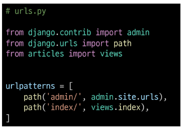
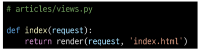
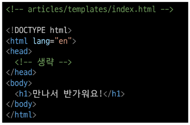
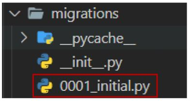
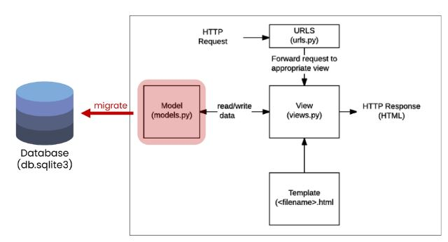
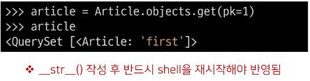

# Django(장고)

### Django 시작하기
- '웹 서비스 개발'에 필요한 것
  - 로그인, 로그아웃, 회원관리, 데이터베이스, 서버, 클라이언트, 보안 등 너무 많은 기술들이 필요
  - 모든것 직접 만들 필요 없음 잘 만들어진 것들을 가져다가 좋은 환경에서 잘 쓰기만 하면 됨
  - Django는 프론트엔드, 백엔드 둘다 가능한 풀스택 프레임워크지만 백엔드로만 쓰임, (프론트엔드 업데이트를 못따라가서 뒤쳐짐) 프론트엔드는 뷰 이용
- Framework 이해하기
  - 누군가 만들어놓은 코드를 재사용 하는 것은 이미 익숙한 개발 문화
  - 웹 서비스도 누군가 개발해 놓은 코드를 재사용하면 된다.
  - 전 세계의 수많은 개발자들이 이미 수없이 많이 개발해 봤고, 그 과정에서 자주 사용되는 부분들을 재사용 할 수 있게 좋은 구조의 코드로 만들어 두었음
  - 그러한 코드들을 모아 놓은 것, 즉 **서비스 개발에 필요한 기능들을 미리 구현해서 모아 놓은 것 = 프레임워크(Framework)**
  - Frame(뼈대, 틀) + Work(일하다)
    - 일정한 뼈대, 틀을 가지고 일하다
    - 제공받은 도구들과 뼈대, 규약을 가지고 무언가를 만드는 일
    - 특정 프로그램을 개발하기 위한 여러 도구들과 규약을 제공하는 것
  - "소프트웨어 프레임워크"는 복잡한 문제를 해결하거나 서술하는 데 사용되는 기본 개념 구조
  - 따라서, Framework를 잘 사용하기만 하면 웹 서비스 개발에 있어서 모든 것들을 하나부터 열까지 직접 개발할 필요 없이, 내가 만들고자 하는 본질(로직)에 집중해 개발할 수 있음
  - 소프트웨어의 생산성과 품질을 높임

### 장고를 배워야하는 이유
1. Python으로 작성된 프레임워크
  - Python이라는 언어의 강력함과 거대한 커뮤니티
2. 수많은 여러 유용한 기능들
3. 검증된 웹 프레임워크
  - 화해, Toss, 두나무, 당근 마켓, 요기요 등
  - 유명한 많은 서비스들이 사용한다는 것 == 안정적으로 서비스를 할 수 있다는 검증

### Web 이해하기
- WWW (World Wide Web)
  - 인터넷이란?
    - 우리가 구글에 접속할 때
      1. 웹 브라우저를 켠다
      2. 주소창에 주소를 입력한다
    - www, 즉 World Wide Web는 **'전 세계에 퍼져있는 거미줄 같은 연결망'**
- 연결 되어 있는 세계
  - 우리가 구글 홈페이지에 접속할 수 있는 이유는, 구글 본사 컴퓨터와 우리의 컴퓨터 간의 통신이 연결 되어 있기 때문
  - 전세계는 아주 두껍고 튼튼한 해저케이블로 연결 되어있음
  
  - 해양 생물로 인해 문제가 생긴다면 인터넷이 잠시 느려지거나, 마비가 될 수 있음
  - 이렇게 전 세계는 촘촘하고 거대한 유선으로 연결 되어있고, 이러한 연결로 부터 시작해 아주 많은 전봇대를 거쳐 우리집으로 인터넷이 연결됨
  - 하지만 이러한 유선 연결은 한계가 있음
    - 히말라야 정상이나, 아마존 밀림까지 케이블을 까는 것은 매우 어려운 일
    - 오지가 아니어도 개발 도상국 같은 나라에서는 충분한 인프라를 기대하기 어려움
    - "정보의 빈곤"
- 전 세계를 무선으로 연결하기
  - 스타링크 프로젝트 - Space X
    - 지구를 아주 많은 소형 위성으로 감싸서, 케이블이 아닌 위성끼리 데이터를 교환
    - 문제점
      1. Strlink Train(별 사진을 찍을 때 위성이 계속 지나가 깔끔한 사진을 찍을 수 없음)
      2. 우주 쓰레기
- 정리
  - 결국 우리가 인터넷을 이용한다는 건, 전세계의 컴퓨터가 연결되어 있는 하나의 인프라를 이용하는 것

### 클라이언트와 서버
- 클라이언트-서버 구조
  - 오늘날 우리가 사용하는 대부분의 웹 서비스는 **클라이언트-서버** 구조를 기반으로 동작
  - **클라이언트**와 **서버** 역시 하나의 컴퓨터이며 이들이 어떻게 상호작용하는지에 대한 간소화된 다이어그램은 다음과 같음
  
  - 클라이언트
    - 웹 사용자의 인터넷에 연결된 장치(예를 들어 wi-fi에 연결된 컴퓨터 또는 모바일)
    - Chrome 또는 Firefox와 같은 웹 브라우저
    - 서비스를 요청하는 주체
  - 서버
    - 웹 페이지, 사이트 또는 앱을 저장하는 컴퓨터
    - 클라이언트가 웹 페이지에 접근하려고 할 때 서버에서 클라이언트 컴퓨터로 웹 페이지 데이터를 응답해 사용자의 웹 브라우저에 표시됨
    - 요청에 대해 서비스를 응답하는 주체
  - 상호작용 예시
    - 예를 들어, 우리가 구글 홈페이지에 접속한다는 것은 무엇을 뜻하는지 알아보자
    1. 결론적으로 인터넷에 연결된 전세계 어딘가에 있는 구글 컴퓨터에게 'Google 홈페이지.html' 파일을 달라고 요청하는 것
    2. 그러면 구글 컴퓨터는 우리의 요청을 받고 'Google 홈페이지.html'파일을 인터넷을 통해서 우리 컴퓨터에게 응답해줌
    3. 그렇게 전달받은 Google 홈페이지.html 파일을 웹 브라우저가 우리가 볼 수 있도록 해석해주는 것
  - 여기서 'Google 홈페이지.html'을 달라고 요청한 컴퓨터, 웹 브라우저를 **클라이언트**라고 하고 'Google 홈페이지.html'파일을 제공한 컴퓨터, 프로그램을 **서버**라고 함
  - 어떠한 자원(resource)을 달라고 요청(request)하는 쪽을 클라이언트, 제공해주는 쪽을 서버(server)라고 함
  - **정리**
    - 우리가 사용하는 웹은 클라이언트-서버 구조로 이루어져 있음
    - 앞으로 우리가 배우는 것도 이 클라이언트-서버 구조를 만드는 방법을 배우는 것
    - 이 중에서 Django는 서버를 구현하는 웹 프레임워크

### Web browser와 Web page
- 웹 브라우저란?
  - 웹에서 페이지를 찾아 보여주고, 사용자가 하이퍼링크를 통해 다른 페이지로 이동할 수 있도록 하는 프로그램
  - 웹 페이지 파일을 우리가 보는 화면으로 바꿔주는(렌더링, rendering) 프로그램
- 웹 페이지란?
  - 웹에 있는 문서
    - 우리가 보는 화면 각각 한 장 한 장이 웹 페이지
  - 웹 페이지 종류
    1. 정적 웹 페이지
      - Static Web page
      - 있는 그대로를 제공하는 것(served as-is)을 의미
      - 우리가 지금까지 작성한 웹 페이지이며 한 번 작성된 HTML 파일의 내용이 변하지 않고 모든 사용자에게 동일한 모습으로 전달되는 것 == 서버에 미리 저장된 HTML 파일 그대로 전달된 웹 페이지 == 같은 상황에서 모든 사용자에게 동일한 정보를 표시
    2. 동적 웹 페이지
      - Dynamic Web page
      - 사용자의 요청에 따라 웹 페이지에 추가적인 수정이 되어 클라이언트에게 전달되는 웹 페이지
      - 웹 페이지의 내용을 바꿔주는 주체 == **서버**
        - 서버에서 동작하고 있는 프로그램이 웹 페이지를 변경해줌
        - 이렇게 사용자의 요청을 받아서 적절한 응답을 만들어주는 프로그램을 쉽게 만들 수 있게 도와주는 프레임워크가 바로 우리가 배울 **Django**
      - 다양한 서버 사이드 프로그래밍 언어(python, java, c++ 등) 사용 가능
      - 파일을 처리하고 데이터베이스와의 상호작용이 이루어짐
      - 이 중에서 Python을 이용해서 개발할 수 있는 프레임워크인 Django를 학습하는 것 

### Django 구조 이해하기(MTV Design Pattern)
- Design Pattern 이란?
  - 부산의 명물이라는 광안대교 같은 다리를 현수교(Suspension Bridge)라고 함
  - 교량의 양쪽 끝과 가운데 솟아있는 주탑에 케이블을 두고 상판을 메다는 형식의 공법
  - 이와 같은 방식을 사용해 인천대교, 이순신대교 등이 만들어짐
  - 여러번 짓다보니 **자주 사용되는 구조가 있다는 것**을 알게 되었고 **이를 일반화해서 하나의 공법**으로 만들어 둔 것
  - 소프트웨어에서의 관점
    - 각기 다른 기능을 가진 다양한 응용 소프트웨어를 개발할 때 공통적인 설계 문제가 존재하며, 이를 처리하는 해결책 사이에도 공통점이 있다는 것을 발견
    - 이러한 유사점을 패턴이라고 함

#### 소프트웨어 디자인 패턴
- 소프트웨어도 수십년간 전 세계의 개발자들이 계속 만들다 보니 자주 사용되는 구조와 해결책이 있다는 것을 알게 됨
- 앞서 배웠던 클라이언트-서버 구조도 소프트웨어 디자인 패턴 중 하나
- 자주 사용되는 소프트웨어의 구조를 소수의 뛰어난 엔지니어가 마치 건축의 공법처럼 일반적인 구조화를 해둔 것
- 목적
  - 특정 문맥에서 공통적으로 발생하는 문제에 대해 재사용 가능한 해결책을 제시
  - 프로그래머가 어플리케이션이나 시스템을 디자인할 때 발생하는 공통된 문제들을 해결하는데 형식화 된 가장 좋은 관행
- 장점
  - 디자인 패턴을 알고 있다면 서로 복잡한 커뮤니케이션이 매우 간단해짐
  - **다수의 엔지니어들이 일반화된 패턴으로 소프트웨어 개발을 할 수 있도록 한 규칙, 커뮤니케이션의 효율성을 높이는 기법**

#### Django에서의 디자인 패턴
- Django에도 이러한 디자인 패턴이 적용이 되어 있는데, 이 패턴을 **MTV 패턴** 이라고 함
- MTV 패턴은 **MVC 디자인 패턴**을 기반으로 조금 변형된 패턴이다.
- MVC 소프트웨어 디자인 패턴
  - MVC는 Model - View - Controller의 준말
  - 데이터 및 논리 제어를 구현하는데 널리 사용되는 소프트웨어 디자인 패턴
  - 하나의 큰 프로그램을 세가지 역할로 구분한 개발 방법론
  1. Model : 데이터와 관련된 로직을 관리
  2. View : 레이아웃과 화면을 처리
  3. Controller : 명령을 model과 view 부분으로 연결
  - 목적
    - "관심사 분리"
    - 더 나은 업무의 분리와 향상된 관리를 제공
    - 각 부분을 독맂벅으로 개발할 수 있어, 하나를 수정하고 싶을 때 모두 건들지 않아도 됨 == 개발 효율성 및 유지보수가 쉬워짐 == 다수의 멤버로 개발하기 용이함
- Django에서의 디자인 패턴
  - Django는 MVC 패턴을 기반으로 한 MTV 패턴을 사용
  - 두 패턴은 서로 크게 다른 점이 없으며 일부 역할에 대해 부르는 이름이 다름
  
  - Model
    - MVC 패턴에서 Model의 역할에 해당
    - 데이터와 관련된 로직을 관리
    - 응용프로그램의 데이터 구조를 정의하고 데이터 베이스의 기록을 관리
  - Template
    - 레이아웃과 화면을 처리
    - 화면상의 사용자 인터페이스 구조와 레이아웃을 정의
    - MVC 패턴에서 View의 역할에 해당
  - View
    - Model & Template과 관련한 로직을 처리해서 응답을 반환
    - 클라이언트의 요청에 대해 처리를 분기하는 역할
    - 동작 예시
      - 데이터가 필요하다면 model에 접근해서 데이터를 가져오고 -> 가져온 데이터를 template로 보내 화면을 구성하고 -> 구성된 화면을 응답으로 만들어 클라이언트에게 반환
    - MVC 패턴에서 Controller의 역할에 해당
  
  - **정리**
    - Django는 MTV 디자인 패턴을 가지고 있음
      - Model : 데이터 관련
      - Template : 화면 관련
      - View : Model & Template 중간 처리 및 응답 반환

### 가상환경 
```
python -m venv venv (가상환경 설정)
source ./venv/Scripts/activate (가상환경 활성화)
pip install django==3.2.13 (가상환경에 장고 설치 3.2.13(LTS)이 우리가 쓰는 버전)
pip freeze > requirements.txt (패키지 목록 생성)
pip install -r requirements.txt (파일을 이용해 패키지 한번에 설치)
```
- LTS
  - Long Term Support(장기 지원 버전)
  - 일반적인 경우보다 장기간에 걸쳐 지원하도록 고안된 소프트웨어의 버전
  - 컴퓨터 소프트웨어의 제품 수명주기 관리 정책
  - 배포자는 LTS 확정을 통해 장기적이고 안정적인 지원을 보장함

### django 프로젝트 생성
```bash
django-admin startproject firstpjt(프로젝트 이름) 
# 새로운 장고 프로젝트 생성
django-admin startproject firstpjt . 
# 해당 디렉토리에 장고 프로젝트 생성(디렉토리가 한커풀 벗겨짐)
# Project 이름에는 Python이나 Django에서 사용 중인 키워드 및 '-'(하이픈) 사용 불가
# '.'(dot)을 붙이지 않을 경우 현재 디렉토리에 프로젝트 디렉토리를 새로 생성함
python manage.py runserver (서버 실행)
# 이후 터미널 창에서 창에 있는 (http://127.0.0.1:8000/)과 같은 http파일을 열면 메인페이지 확인 가능
python manage.py startapp articles (앱 생성) 
# articles 는 앱 이름, 일반적으로 이름은 복수형으로 작성하는 것을 권장
```
#### 장고 프로젝트 구조

- __init\_\_.py
  - Python에게 이 디렉토리를 하나의 Python 패키지로 다루도록 지시
  - 별도로 추가 코드를 작성하지 않음
- ashi.py
  - Asynchronous Server Gateway Interface
  - Django 애플리케이션이 비동기식 웹 서버와 연결 및 소통하는 것을 도움
  - 추후 배포시에 사용하며 지금은 수정하지 않음
- settings.py
  - Django 프로젝트 설정을 관리
- urls.py
  - 사이트의 url과 적절한 views의 연결을 지정
- wsgi.py
  - Web Server Gateway Interface
  - Django 애플리케이션이 웹 서버와 연결 및 소통하는 것을 도움
  - 추후 배포시에 사용하며 지금은 수정하지 않음
- manage.py
  - Django 프로젝트와 다양한 방법으로 상호작용 하는 커맨드라인 유틸리티
  ```bash
  # manage.py Usage
  $ python manage.py <command> [options]
#### 애플리케이션 구조

- admin.py
  - 관리자용 페이지를 설정 하는 곳
- apps.py
  - 앱의 정보가 작성된 곳
  - 별도로 추가 코드를 작성하지 않음
- models.py
  - 애플리케이션에서 사용하는 Model을 정의하는 곳
  - MTV 패턴의 M에 해당
- test.py
  - 프로젝트의 테스트 코드를 작성하는 곳
- views.py
  - view 함수들이 정의되는 곳
  - MTV 패턴의 V에 해당
#### 애플리케이션 등록

settings.py - INSTALLED_APPS(33번째 줄)에 앱 이름 등록
- 프로젝트에서 앱을 사용하기 위해서는 반드시 INSTALLED_APPS 리스트에 추가해야 함
- INSTALLED_APPS 
  - Django installation에 활성화 된 모든 앱을 지정하는 문자열 목록

migrations - 커밋의 히스토리와 동일함, 데이터베이스의 변경 목록을 migrations에 모아둠
수업에서는 articles에서는 models와 views만 사용, firstpjt에서는 settings와 urls만 사용

### Project & Application
- Project
  - "collection of apps"
  - 프로젝트는 앱의 집합
  - 프로젝트에는 여러 앱이 포함될 수 있음
  - 앱은 여러 프로젝트에 있을 수 있음
- Application
  - 앱은 실제 요청을 처리하고 페이지를 보여주는 등의 역할을 담당
  - 일반적으로 앱은 하나의 역할 및 기능 단위로 작성하는 것을 권장함
  - **주의사항**
    - **반드시 생성 후 등록**
      - INSTALLED_APPS에 먼저 작성(등록)하고 생성하려면 앱이 생성되지 않음
    
    - 해당 순서를 지키지 않아도 문제는 없지만 추후 advanced한 내용을 대비하기 위해 지키는 것을 권장

### 요청과 응답
- URL -> VIEW -> TEMPLATE 순의 작성 순서로 코드를 작성해보고 데이터의 흐름을 이해하기
- URLs

  - URL -> VIEW -> TEMPLATE 기초 과정을 작성해보고 데이터의 흐름을 이해하기
- View

  - HTTP 요청을 수신하고 HTTP 응답을 반환하는 함수 작성
  - Template에게 HTTP 응답 서식을 맡김
- render()
```render(request, template_name, context)```
  - 주어진 템플릿을 주어진 컨텍스트 데이터와 결합하고 렌더링 된 텍스트와 함께 HttpResponse(응답) 객체를 반환하는 함수
  1. request
      - 응답을 생성하는 데 사용되는 요청 객체
  2. template_name
      - 템플릿의 전체 이름 또는 템플릿 이름의 경로
  3. context
      - 템플릿에서 사용할 데이터(딕셔너리 타입으로 작성)
- Templates

  - 실제 내용을 보여주는데 사용되는 파일
  - 파일의 구조나 레이아웃을 정의
  - Template 파일의 기본 경로
    - app 폴더 안의 templates폴더
    - app_name/templates/
  - **템플릿 폴더 이름은 반드시 templates라고 지정해야 함**
- 코드 작성 순서
  - 앞으로 Django에서의 코드 작성은 URL -> View -> Template 순으로 작성
  - 데이터의 흐름 순서
  

### Django Template
- **```데이터 표현을 제어하는 도구이자 표현에 관련된 로직```**
- Django Template을 이용한 HTML 정적 부분과 동적 컨텐츠 삽입
- Template System의 기본 목표를 숙지
- **Django Template System**
  - 데이터 표현을 제어하는 도구이자 표현에 관련된 로직을 담당
- **Django Template Language(DTL)**
  - Django Template에서 사용하는 built-in template system
  - 조건, 반복, 변수 치환, 필터 등의 기능을 제공
    - Python처럼 일부 프로그래밍 구조(if, for 등)를 사용할 수 있지만 이것은 **Python 코드로 실행되는 것이 아님**
    - Django 템플릿 시스템은 단순히 Python이 HTML에 포함된 것이 아니니 주의할 것
  - 프로그래밍적 로직이 아니라 프레젠테이션을 표현하기 위한 것임을 명심할 것
- DTL Stntax
  1. Variable
    ```py
    {{ variable }}
    ```
    - 변수 명은 영어, 숫자와 밑줄(_)의 조합으로 구성될 수 있으나 밑줄로는 시작할 수 없음
      - 공백이나 구두점 문자 또한 사용할 수 없음
    - dot(.)을 사용하여 변수 속성에 접근할 수 있음
    - render()의 세번째 인자로 {'key':value}와 같이 딕셔너리 형태로 넘겨주며, 여기서 정의한 key에 해당하는 문자열이 template에서 사용 가능한 변수명이 됨
    
    - context 데이터가 많아질 경우를 생각하면 아래와 같이 작성하는 것이 바람직함
    - context라는 이름은 다른 이름으로 사용 가능하나 관행적으로 context를 사용
    
  2. Filters
    ```py
    {{ variable|filter }}
    ```
    - 표시할 변수를 수정할 때 사용
    - 예시)
      - name 변수를 모두 소문자로 출력
      ```py
      {{ name|lower }}
      ```
    - 60개의 built-in template filters를 제공
    - chained가 가능하며 일부 필터는 인자를 받기도 함
    ```py
    {{ name|truncatewords:30 }}
    ```
    
    
  3. Tags
    ```py
    
    ```
    - 출력 텍스트를 만들거나, 반복 또는 논리를 수행하여 제어 흐름을 만드는 등 변수보다 복잡한 일들을 수행
    - 일부 태그는 시작과 종료 태그가 필요
    ```py
    
    ```
    - 일부 태그는 시작과 종료 태그가 필요
    - 약 24개의 built-in template tags를 제공
  4. Comments
    ```py
    {# #}
    ```
    - Django template에서 라인의 주석을 표현하기 위해 사용
    - 아래처럼 유효하지 않은 템플릿 코드가 포함될 수 있음
    ```py
    {#  text  #}
    ```
    - 한 줄 주석에만 사용할 수 있음 (줄 바꿈이 허용되지 않음)
    - 여러 줄 주석은 와 사이에 입력
    ```py
    
      여러 줄
      주석
    
    ```
    

### Template ingeritance
- 템플릿 상속
  - 템플릿 상속은 기본적으로 코드의 재사용성에 초점을 맞춤
  - 템플릿 상속을 사용하면 사이트의 모든 공통 요소를 포함하고, 하위 템플릿이 재정의(override)할 수 있는 블록을 정의하는 기본 'skeleton'템플릿을 만들 수 있음
  - 모든 템플릿에 부트스트랩을 적용하려면 모든 템플릿에 부트스트랩 CDN을 작성할 필요는 없음
- 템플릿 상속에 관련된 태그
  ```py
  
  ```
  - 자식(하위)템플릿이 부모 템플릿을 확장한다는 것을 알림
  - **반드시 템플릿 최상단에 작성되어야 함 (즉, 2개 이상 사용할 수 없음)**
  ```py
  
  ```
  - 하위 템플릿에서 재지정(overridden)할 수 있는 블록을 정의
  - 즉, 하위 템플릿이 채울 수 있는 공간
  - 가독성을 높이기 위해 선택적으로 endblock 태그에 이름을 지정할 수 있음(endblock 태그에 content를 빼도 똑같음)
- 예시
  - base라는 이름의 skeleton 템플릿을 작성
  - Bootstrap CDN 작성
  
  - index 템플릿에서 base 템플릿을 상속받음
  - Bootstrap이 적용되었는지 확인
  


### Namespace
- 개체를 구분할 수 있는 범위를 나타내는 이름공간에 대한 이해
- 필요성
  - 두번째 app pages의 index 페이지를 작성해보고 어떤 문제가 발생하는지 확인해보기
  
  
  - 2가지 문제 발생
    1. articles app index 페이지에 작성한 두번째 앱 index로 이동하는 하이퍼 링크를 클릭시 현재 페이지로 다시 이동
      - URL namespace
        - URL namespace를 사용하면 서로 다른 앱에서 동일한 URL이름을 사용하는 경우에도 이름이 지정된 URL을 고유하게 사용할 수 있음
        - **app_name** attribute를 작성해 URL namespace를 설정
        
        ```
         -> 
        ```
        
        - URL 참조
          - ":"연산자를 사용하여 지정
            - 예를 들어, app_name이 articles이고 URL name이 index인 주소 참조는 **articles:index**가 됨
    2. pages app의 index url로 직접 이동해도 articles app의 index페이지가 출력됨
      - Template namespace
        - Django는 기본적으로 ```app_name/templates/```경로에 있는 templates 파일들만 찾을 수 있으며, settings.py의 INSTALLED_APPS에 작성한 app순서로 template을 검색 후 렌더링 함
        - 바로 이 속성 값이 해당 경로를 활성화하고 있음
        
        - 디렉토리 생성을 통해 물리적인 이름공간 구분
          - Django templates의 기본 경로에 app과 같은 이름의 폴더를 생성해 폴더 구조를 ```app_name/templates/app_name/```형태로 변경
          - Django templates의 기본 경로 자체를 변경할 수는 없기 때문에 물리적으로 이름 공간을 만드는 것
          
        - 템플릿 경로 변경
          - 폴더 구조 변경 후 변경된 경로로 해당하는 모든 부분을 수정하기
          
        - 반드시 Template namespace를 고려해야 하는가?
          - 만약 단일 앱으로만 이루어진 프로젝트라면 상관없음
          - 여러 앱이 되었을 때에도 템플릿 파일 이름이 겹치지 않게 하면 되지만, 앱이 많아지면 대부분은 같은 이름의 템플릿 파일이 존재하기 마련

**NoReverseMatch Error**는 해당 파일의 url 문제이므로 바로 확인할 것

### Django Model
- Model의 핵심 개념과 ORM을 통한 데이터베이스 조작 이해
- Django는 웹 애플리케이션의 데이터를 구조화하고 조작하기 위한 추상적인 계층(모델)을 제공

#### Database
- 체계화된 데이터의 모임
- 검색 및 구조화 같은 작업을 보다 쉽게 하기 위해 조직화된 데이터를 수집하는 저장 시스템
- 기본 구조
  1. 스키마(Schema)
    - 뼈대(structure)
    - 데이터베이스에서 자료의 구조, 표현 방법, 관계 등을 정의한 구조
    
  2. 테이블(Table)
    - 필드와 레코드를 사용해 조직된 데이터 요소들의 집합
    - 관계(Relation)라고도 부름
    
      - 속성, 컬럼(Column)
      - 각 필드에는 고유한 데이터 형식이 지정됨
        - INT, TEXT 등
    2. 레코드(record)
      - 튜플, 행(Row)
      - 테이블의 데이터는 레코드에 저장됨
      - 예를 들어 해당 예시는 4명의 고객정보가 저장되어 있으며, 레코드는 4개가 존재
  - PK(Primary Key)
    - 기본 키
    - 각 레코드의 고유한 값(식별자로 사용)
    - 기술적으로 **다른 항목과 절대 중복될 수 없는 단일 값(unique)**
    - 데이터베이스 관리 및 테이블 간 관계 설정 시 주요하게 활용 됨
    - 예시
      - 주민등록번호
        - 데이터베이스에 동일한 이름, 나이를 가진 사람들의 데이터는 존재할 수 있지만 각 사람들이 가진 주민등록번호는 절개 같을 수 없음 즉 고유한 값을 가짐
  - 쿼리(Query)
    - 데이터를 조회하기 위한 명령어
    - 조건에 맞는 데이터를 추출하거나 조작하는 명령어(주로 테이블형 자료구조에서)
    - "Query를 날린다" -> "데이터베이스를 조작한다."

#### Model
- Django는 Model을 통해 데이터에 접근하고 조작
- 사용하는 데이터들의 필수적인 필드(컬럼)들과 동작(메서드, 인스턴스)들을 포함
- 저장된 데이터베이스의 구조(layout)
- 일반적으로 각각의 모델은 하나의 데이터베이스 테이블에 매핑(mapping)
  - 매핑 : 하나의 값을 다른 값으로 대응시키는 것
  - 모델 클래스 1개 == 데이터베이스 테이블 1개
- Model을 통해 데이터 관리

- 모델 작성하기
  - 새 프로젝트(crud), 앱(articles) 작성 및 앱 등록
  
  - models.py 작성
    - 모델 클래스를 작성하는 것은 데이터베이스 ```테이블의 스키마를 정의```하는 것
    - 모델 클래스 == 테이블 스키마
    
  - 모델 이해하기
    
    - 각 모델은 django.models.Model클래스의 서브 클래스로 표현됨
      - 즉, 각 모델은 django.db.models 모듈의 Model 클래스를 상속받아 구성됨
      - ```클래스 상속 기반 형태의 Django 프레임워크 개발```
        - 프레임 워크에서는 잘 만들어진 도구를 가져다가 잘 쓰는 것
    
    - models모듈을 통해 어떠한 타입의 DB필드(컬럼)을 정의할 것인지 정의
      - 클래스 변수 title과 content은 DB필드를 나타냄
    1. 클래스 변수(속성)명
      - DB필드의 이름 (사진에서 title과 content)
    2. 클래스 변수 값(models 모듈의 Field 클래스)
      - DB 필드의 데이터 타입(사진에서 = 뒤에 있는 것)
  - Django Model Field
    - Django는 모델 필드를 통해 테이블의 필드(컬럼)에 저장할 데이터 유형(INT, TEXT 등)을 정의
    - 데이터 유형에 따라 다양한 모델 필드를 제공
      - Data Field(), CharField(), IntegerField()등
      - http://docs.djangoproject.com/en/3.2/ref/models/fields/ 참고(장고 공식문서)
    - 모델 필드
      - CharField(max_length=None, **options)
        - 길이의 제한이 있는 문자열을 넣을 때 사용
        - ```max_length```
          - 필드의 최대 길이(문자)(255가 최대 길이)
          - CharFiedld의 필수 인자(값을 넣어주면 그것이 최대 길이)
          - 데이터베이스와 Django의 유효성 검사(값을 검증하는 것)에서 활용됨
      - TextField(**options)
        - 글자의 수가 많을 때 사용 -> DB뭘 쓰는지에 따라 다름 (SQLite, Oracle, MySQL 등) 장고에서는 SQLite를 씀 -> 최대 길이는 (2^31)-1
        - max_length옵션 작성 시 사용자 입력 단계에서는 반영되지만, 모델과 데이터베이스 단계에는 적용되지 않음(CharField를 사용해야 함)
          - 실제로 저장될 때 길이에 대한 유효성을 검증하지 않음
  - 정리
    - 웹 애플리케이션의 데이터를 ```구조화``` 하고 ```조작```하기 위한 도구

- 데이터베이스 스키마
  - 지금까지 작성한 models.py는 다음과 같은 데이터베이스 스키마를 설계한 것
  - 이제 데이터베이스에 테이블을 생성하기 위한 ```설계도``` 작성이 필요함
  

### Migrations
- 개요
  - 모델에 대한 청사진(blueprint)을 만들고 이를 통해 테이블을 생성하는 일련의 과정
  - Django가 모델에 생긴 변화(필드 추가, 모델 삭제 등)를 DB에 반영하는 방법
- 주요 명령어
  1. makemigrations
    - 모델을 작성 혹은 변경한 것에 기반한 새로운 migration(설계도, 청사진 이하 마이그래이션)을 만들 때 사용
    - 테이블을 만들기 위한 설계도를 생성하는 것
    ```bash
    $ python manage.py makemigrations
    ```
    - 명령어 실행 후 migrations/0001_initial.py가 생성된 것을 확인
    - 파이썬으로 작성된 설계도
    
  2. migrate
    - makemigrations로 만든 설계도를 실제 db.sqlite3 DB파일에 반영하는 과정
    - ```db.sqlite3는 원래 있는 데이터파일, SQLite 확장파일 설치 후 파일 우클릭, open database클릭하면 탐색기 맨 밑에서 열림```
    - 결과적으로 모델에서의 변경사항들과 DB의 스키마가 동기화를 이룸
      - ```모델과 DB의 동기화```
      ```bash
      $ python manage.py migrate
      ```
    - 설계도(migration)를 실제 db.sqlite3 DB파일에 반영
    
- [참고] Migrations 기타 명령어
  1. showmigrations 
  ```bash
  $ python manage.py showmigrations
  ```
    - migrations 파일들이 migrate 됐는지 안됐는지 여부를 확인하는 용도
    - [X]표시가 있으면 migrate가 완료되었음을 의미
  2. sqlmigrate
  ```bash
  $ python manage.py sqlmigrate articles 0001
  ```
    - 해당 migrations 파일이 SQL 문으로 어떻게 해석 될 지 미리 확인할 수 있음
    - DB에서는 SQL 언어를 이용, 파이썬 언어를 이해하지 못함
- 추가 필드 정의
  - Model 변경사항 반영하기
    - models.py에 변경사항이 생겼을 때 어떤 과정의 migration이 필요할까?
    - 추가 모델 필드 작성 후 다시 한번 makemigrations 진행
    
    - 기존에 id, title, content 필드를 가진 테이블에 2개의 필드가 추가되는 상황
    - Django 입장에서는 이미 존재하는 테이블에 새로운 컬럼이 추가되는 요구 사항을 받았는데, 이러한 컬럼들은 기본적으로 빈 값을 갖고 추가될 수 없음
      - 그래서 Django는 우리에게 추가되는 컬럼에 대한 기본값을 설정해야 하니 어떤 값을 설정할 것인지를 물어보는 과정을 진행
    
      - 각 보기 번호의 의미
        1) 다음 화면으로 넘어가서 새 컬럼의 기본 값을 직접 입력하는 방법
        2) 현재 과정에서 나가고 models.py 파일에 default 속성을 직접 작성하는 방법
      - "1"을 입력 후 Enter(created_at 필드에 대한 default값 설정)
      
      - 다음 화면에서 아무것도 입력하지 않고 Enter를 입력하면 Django에서 기본적으로 파이썬의 timezone 모듈의 now 메서드 반환 값을 기본값으로 사용하도록 해줌
      - 새로운 (2번)설계도(마이그래이션 파일)가 생성됨, dependencies 에 1번 설계도가 적혀있음 -> 의존한다는 뜻
      
      - 새로운 설계도를 생성했기 때문에 DB와 동기화를 진행해야 함(아직 DB에는 변경사항이 반영하지 않았기 때문)
      ```bash
      $ python manage.py migrate
      ```
- 추가 필드 정의
  - DateTimeField()
    - Python의 datetime.datetime 인스턴스로 표시되는 날짜 및 시간을 값으로 사용하는 필드
    - DateFiled를 상속받는 클래스
    - 선택 인자
      1. auto_now_add
        - 최초 생성 일자(Useful for creation of timestamps)
        - 데이터가 실제로 만들어질 때 현재 날짜와 시간으로 자동으로 초기화 되도록 함
      2. auto_now
        - 최종 수정 일자(Useflu for "last-modified" timestamps)
        - 데이터가 수정될 때 마다 현재 날짜와 시간으로 자동으로 갱신되도록 함
  - **반드시 기억해야 할 migration 3단계**
    1. models.py에서 변경사항이 발생하면
    2. migration 생성
      - makemigrations
    3. DB 반영(모델과 DB의 동기화)
      - migrate
  - 설계도는 어떻게 누가 해석하는가
    - makemigrations로 인해 만들어진 설계도는 파이썬으로 작성되어있음
    - SQl만 알아들을 수 있는 DB가 어떻게 설계도를 이해하고 동기화 할 수 있는가?
    - 중간에 번역을 담당하는 것이 **```ORM```**
#### ORM
- Object-Relational-Mapping
- 객체 지향 프로그래밍 언어를 사용하여 호환되지 않는 유형의 시스템 간에(Django <-> DB)데이터를 변환하는 프로그래밍 기술
- 객체 지향 프로그래밍에서 데이터 베이스를 연동할 때, 데이터 베이스와 객체 지향 프로그래밍 언어 간의 호환되지 않는 데이터를 변환하는 프로그래밍 기법
- Django는 내장 Django ORM을 사용
- 한 마디로 SQL을 사용하지 않고 데이터베이스를 조작할 수 있게 만들어주는 매개체

- 장점
  - SQL을 잘 알지 못해도 객체지향 언어로 DB 조작이 가능
  - 객체 지향적 접근으로 인한 높은 생산성
- 단점
  - ORM만으로는 완전한 서비스를 구현하기 어려운 경우가 있음
- 사용하는 이유
  - ```생산성```
  - 현시대 개발에서 가장 중요한 키워드는 바로 생산성
  - 우리는 DB를 객체(object)로 조작하기 위해 ORM을 사용할 것

#### QuerySet API
- ORM이 사용하는 메서드의 이름
- 사전 준비
  - 외부 라이브러리 설치 및 설정
    - 실습 편의를 위한 추가 라이브러리 설치 및 설정
    ```bash
    $ pip install ipython
    $ pip install django-extensions
    ```
    
    - 패키지 목록 업데이트
    ```bash
    $ pip freeze > requirements.txt
    ```
    - 참고
      - ipython
        - 파이썬 기본 쉘보다 더 강력한 파이썬 쉘
        - Django-extensions
      - django-extensions
        - Django 확장 프로그램 모음
        - shell_plus, graph model 등 다양한 확장 기능 제공
      - shell
        - 운영체제 상에서 다양한 기능과 서비스를 구현하는 인터페이스를 제공하는 프로그램
        - Shell(껍데기), 사용자와 운영 체제의 내부사이의 인터페이스를 감싸는 층이기 때문에 그러한 이름이 붙음
        - 사용자 <-> 셸 <-> 운영체제
      - Python Shell
        - 파이썬 코드를 실행해주는 인터프리터
          - 인터프리터: 코드를 한 줄 씩 읽어 내려가며 실행하는 프로그램
        - 인터렉티브 혹은 대화형 shell이라고 부름
        - python 명령어를 실행하여 그 결과를 바로 제공
        
  - Django shell
    - ORM 관련 구문 연습을 위해 파이썬 쉘 환경을 사용
    - 다만 일반 파이썬 쉘을 통해서는 장고 프로젝트 환경에 영향을 줄 수 없기 때문에 Django환경 안에서 진행할 수 있는 Django shell을 사용
    - 원래는 다음과 같은 명령어를 통해 Django shell을 사용하지만
    ```bash
    $ python manage.py shell
    ```
    - django-extension이 제공하는 더 강력한 shell_plus로 진행
    ```bash
    $ python manage.py shell_plus
    ```
    
    - 첫 ORM 명령어 사용하기
    
      - 이제 ORM 명령어의 구조와 QuerySet에 대해 알아보자
- Database API
  - Django가 제공하는 ORM을 사용해 데이터베이스를 조작하는 방법
  - Model을 정의하면 데이터를 만들고 읽고 수정하고 지울 수 있는 API를 제공
  
  - objects manager
    - Django 모델이 데이터베이스 쿼리 작업을 가능하게 하는 인터페이스
    - Django는 기본적으로 모든 Django 모델 클래스에 대해 objects라는 Manager 객체를 자동으로 추가함
    - 이 Manager를 통해 특정 데이터를 조작할 수 있음
    - ```DB를 Python class로 조작할 수 있도록 여러 메서드를 제공하는 manager```
  - Query
    - 데이터베이스에 특정한 데이터를 보여달라는 요청
      - 쿼리문을 작성한다 -> 원하는 데이터를 얻기 위해 데이터베이스에 요청을 보낼 코드를 작성한다.
    - 이 때, 파이썬으로 작성한 코드가 ORM에 의해 SQL로 변환되어 데이터베이스에 전달되며, 데이더베이스의 응답 데이터를 ORM이 ```QuerySet```이라는 자료 형태로 변환하여 우리에게 전달
  - QuerySet
    - 데이터베이스에게서 전달 받은 객체 목록(데이터 모음)
      - 순회가 가능한 데이터로써 1개 이상의 데이터를 불러와 사용할 수 있음(인덱스로 접근 가능)
    - Django ORM을 통해 만들어진 자료형이며, 필터를 걸거나 정렬 등을 수행할 수 있음
    - objects manager를 사용하여 복수의 데이터를 가져오는 queryset method를 사용할 때 반환되는 객체
    - 단, 데이터베이스가 단일한 객체를 반환할 때는 QuerySet이 아닌 모델(Class)의 인스턴스로 반환됨
  - QuerySet API
    - QuerySet과 상호작용하기 위해 사용하는 도구(메서드, 연산자 등)
    
    - 해보기
      - QuerySet API를 활용해 데이터를 생성하고, 읽고, 수정하고, 삭제해보기
      - CRUD
        - Create / Read / Update / Delete
          - 생성 / 조회 / 수정 / 삭제
        - 대부분의 컴퓨터 소프트웨어가 가지는 기본적인 데이터 처리 기능 4가지를 묶어서 일컫는 말
        - Create
          - 데이터 객체를 만드는(생성하는) 3가지 방법
            1. article = Article()
              - 클래스를 통한 인스턴스 생성
              
              
              
            2. article.title
              - 클래스 변수명과 같은 이름의 인스턴스 변수를 생성 후 값 할당
              
            3. article.save()
              - 인스턴스로 save 메서드 호출
              
          - ```.save()```
            - "Saving object"
            - 객체를 데이터베이스에 저장함
            - 데이터 생성 시 save를 호출하기 전에는 객체의 id 값은 None
              - id 값은 Django가 아니라 데이터베이스에서 계산되기 때문
            - 단순히 모델 클래스를 통해 인스턴스를 생성하는 것은 DB에 영향을 미치지 않기 때문에 반드시 save를 호출해야 테이블에 레코드가 생성됨
        - READ
          - QuerySet API method를 사용해 데이터를 다양하게 조회하기
          - QuerySet API method는 크게 2가지로 분류됨
            1. Methods that "return new querysets"
            2. Methods that "do not return auerysets"
          - all()
            - QuerySet return
            - 전체 데이터 조회
            
          - get()
            - 단일 데이터 조회
            - 객체를 찾을 수 없으면 DoesNotExist 예외를 발생시키고, 둘 이상의 객체를 찾으면 MultipleObjectsReturned 예외를 발생시킴
            - 위와 같은 특징을 가지고 있기 때문에 primary key와 같이 ```고유성(uniqueness)을 보장하는 조회에서 사용해야 함```
            
          - filter()
            - 지정된 조회 매개 변수와 일치하는 객체를 포함하는 새 QuerySet을 반환
            - 값이 없어도 빈 QuerySet으로 반환되기 때문에 pk를 사용하기에는 적합하지 않음
            
          - Field lookups
            - 특정 레코드에 대한 조건을 설정하는 방법
            - QuerySet 메서드 filter(), exclude() 및 get()에 대한 키워드 인자로 지정됨
            - 다양한 built-in lookups는 공식문서를 참고
              - https://docs.djangoproject.com/en/3.2/ref/models/querysets/#field-lookups
            
        - Update
          - 과정
            1. 수정하고자 하는 article 인스턴스 객체를 조회 후 반환 값을 저장
            2. article 인스턴스 객체의 인스턴스 변수 값을 새로운 값으로 할당
            3. save() 인스턴스 메서드 호출
            
        - Delete
          - 과정
            1. 삭제하고자 하는 article 인스턴스 객체를 조회한 후 반환 값을 저장
            2. delete() 인스턴스 메서드 호출
            
      - 참고
        -__str\_\_()
          - 표준 파이썬 클래스의 메서드인 str()을 정의하여 각각의 object가 사람이 읽을 수 있는 문자열을 반환(return)하도록 할 수 있음
          - DB에는 영향을 주지 않고 프린트에만 영향을 주기 때문에 makemigrations를 해주지 않아도 바로 반영됨
          
          - Django shell에서 변화된 출력 확인(작성 후 반드시 shell을 재시작 해야 반영됨)
          

