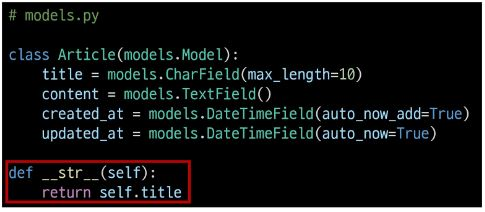

# Django(장고)

### Django 시작하기
- '웹 서비스 개발'에 필요한 것
  - 로그인, 로그아웃, 회원관리, 데이터베이스, 서버, 클라이언트, 보안 등 너무 많은 기술들이 필요
  - 모든것 직접 만들 필요 없음 잘 만들어진 것들을 가져다가 좋은 환경에서 잘 쓰기만 하면 됨
  - Django는 프론트엔드, 백엔드 둘다 가능한 풀스택 프레임워크지만 백엔드로만 쓰임, (프론트엔드 업데이트를 못따라가서 뒤쳐짐) 프론트엔드는 뷰 이용
- Framework 이해하기
  - 누군가 만들어놓은 코드를 재사용 하는 것은 이미 익숙한 개발 문화
  - 웹 서비스도 누군가 개발해 놓은 코드를 재사용하면 된다.
  - 전 세계의 수많은 개발자들이 이미 수없이 많이 개발해 봤고, 그 과정에서 자주 사용되는 부분들을 재사용 할 수 있게 좋은 구조의 코드로 만들어 두었음
  - 그러한 코드들을 모아 놓은 것, 즉 **서비스 개발에 필요한 기능들을 미리 구현해서 모아 놓은 것 = 프레임워크(Framework)**
  - Frame(뼈대, 틀) + Work(일하다)
    - 일정한 뼈대, 틀을 가지고 일하다
    - 제공받은 도구들과 뼈대, 규약을 가지고 무언가를 만드는 일
    - 특정 프로그램을 개발하기 위한 여러 도구들과 규약을 제공하는 것
  - "소프트웨어 프레임워크"는 복잡한 문제를 해결하거나 서술하는 데 사용되는 기본 개념 구조
  - 따라서, Framework를 잘 사용하기만 하면 웹 서비스 개발에 있어서 모든 것들을 하나부터 열까지 직접 개발할 필요 없이, 내가 만들고자 하는 본질(로직)에 집중해 개발할 수 있음
  - 소프트웨어의 생산성과 품질을 높임

### 장고를 배워야하는 이유
1. Python으로 작성된 프레임워크
  - Python이라는 언어의 강력함과 거대한 커뮤니티
2. 수많은 여러 유용한 기능들
3. 검증된 웹 프레임워크
  - 화해, Toss, 두나무, 당근 마켓, 요기요 등
  - 유명한 많은 서비스들이 사용한다는 것 == 안정적으로 서비스를 할 수 있다는 검증

### Web 이해하기
- WWW (World Wide Web)
  - 인터넷이란?
    - 우리가 구글에 접속할 때
      1. 웹 브라우저를 켠다
      2. 주소창에 주소를 입력한다
    - www, 즉 World Wide Web는 **'전 세계에 퍼져있는 거미줄 같은 연결망'**
- 연결 되어 있는 세계
  - 우리가 구글 홈페이지에 접속할 수 있는 이유는, 구글 본사 컴퓨터와 우리의 컴퓨터 간의 통신이 연결 되어 있기 때문
  - 전세계는 아주 두껍고 튼튼한 해저케이블로 연결 되어있음
  
  - 해양 생물로 인해 문제가 생긴다면 인터넷이 잠시 느려지거나, 마비가 될 수 있음
  - 이렇게 전 세계는 촘촘하고 거대한 유선으로 연결 되어있고, 이러한 연결로 부터 시작해 아주 많은 전봇대를 거쳐 우리집으로 인터넷이 연결됨
  - 하지만 이러한 유선 연결은 한계가 있음
    - 히말라야 정상이나, 아마존 밀림까지 케이블을 까는 것은 매우 어려운 일
    - 오지가 아니어도 개발 도상국 같은 나라에서는 충분한 인프라를 기대하기 어려움
    - "정보의 빈곤"
- 전 세계를 무선으로 연결하기
  - 스타링크 프로젝트 - Space X
    - 지구를 아주 많은 소형 위성으로 감싸서, 케이블이 아닌 위성끼리 데이터를 교환
    - 문제점
      1. Strlink Train(별 사진을 찍을 때 위성이 계속 지나가 깔끔한 사진을 찍을 수 없음)
      2. 우주 쓰레기
- 정리
  - 결국 우리가 인터넷을 이용한다는 건, 전세계의 컴퓨터가 연결되어 있는 하나의 인프라를 이용하는 것

### 클라이언트와 서버
- 클라이언트-서버 구조
  - 오늘날 우리가 사용하는 대부분의 웹 서비스는 **클라이언트-서버** 구조를 기반으로 동작
  - **클라이언트**와 **서버** 역시 하나의 컴퓨터이며 이들이 어떻게 상호작용하는지에 대한 간소화된 다이어그램은 다음과 같음
  
  - 클라이언트
    - 웹 사용자의 인터넷에 연결된 장치(예를 들어 wi-fi에 연결된 컴퓨터 또는 모바일)
    - Chrome 또는 Firefox와 같은 웹 브라우저
    - 서비스를 요청하는 주체
  - 서버
    - 웹 페이지, 사이트 또는 앱을 저장하는 컴퓨터
    - 클라이언트가 웹 페이지에 접근하려고 할 때 서버에서 클라이언트 컴퓨터로 웹 페이지 데이터를 응답해 사용자의 웹 브라우저에 표시됨
    - 요청에 대해 서비스를 응답하는 주체
  - 상호작용 예시
    - 예를 들어, 우리가 구글 홈페이지에 접속한다는 것은 무엇을 뜻하는지 알아보자
    1. 결론적으로 인터넷에 연결된 전세계 어딘가에 있는 구글 컴퓨터에게 'Google 홈페이지.html' 파일을 달라고 요청하는 것
    2. 그러면 구글 컴퓨터는 우리의 요청을 받고 'Google 홈페이지.html'파일을 인터넷을 통해서 우리 컴퓨터에게 응답해줌
    3. 그렇게 전달받은 Google 홈페이지.html 파일을 웹 브라우저가 우리가 볼 수 있도록 해석해주는 것
  - 여기서 'Google 홈페이지.html'을 달라고 요청한 컴퓨터, 웹 브라우저를 **클라이언트**라고 하고 'Google 홈페이지.html'파일을 제공한 컴퓨터, 프로그램을 **서버**라고 함
  - 어떠한 자원(resource)을 달라고 요청(request)하는 쪽을 클라이언트, 제공해주는 쪽을 서버(server)라고 함
  - **정리**
    - 우리가 사용하는 웹은 클라이언트-서버 구조로 이루어져 있음
    - 앞으로 우리가 배우는 것도 이 클라이언트-서버 구조를 만드는 방법을 배우는 것
    - 이 중에서 Django는 서버를 구현하는 웹 프레임워크

### Web browser와 Web page
- 웹 브라우저란?
  - 웹에서 페이지를 찾아 보여주고, 사용자가 하이퍼링크를 통해 다른 페이지로 이동할 수 있도록 하는 프로그램
  - 웹 페이지 파일을 우리가 보는 화면으로 바꿔주는(렌더링, rendering) 프로그램
- 웹 페이지란?
  - 웹에 있는 문서
    - 우리가 보는 화면 각각 한 장 한 장이 웹 페이지
  - 웹 페이지 종류
    1. 정적 웹 페이지
      - Static Web page
      - 있는 그대로를 제공하는 것(served as-is)을 의미
      - 우리가 지금까지 작성한 웹 페이지이며 한 번 작성된 HTML 파일의 내용이 변하지 않고 모든 사용자에게 동일한 모습으로 전달되는 것 == 서버에 미리 저장된 HTML 파일 그대로 전달된 웹 페이지 == 같은 상황에서 모든 사용자에게 동일한 정보를 표시
    2. 동적 웹 페이지
      - Dynamic Web page
      - 사용자의 요청에 따라 웹 페이지에 추가적인 수정이 되어 클라이언트에게 전달되는 웹 페이지
      - 웹 페이지의 내용을 바꿔주는 주체 == **서버**
        - 서버에서 동작하고 있는 프로그램이 웹 페이지를 변경해줌
        - 이렇게 사용자의 요청을 받아서 적절한 응답을 만들어주는 프로그램을 쉽게 만들 수 있게 도와주는 프레임워크가 바로 우리가 배울 **Django**
      - 다양한 서버 사이드 프로그래밍 언어(python, java, c++ 등) 사용 가능
      - 파일을 처리하고 데이터베이스와의 상호작용이 이루어짐
      - 이 중에서 Python을 이용해서 개발할 수 있는 프레임워크인 Django를 학습하는 것 

### Django 구조 이해하기(MTV Design Pattern)
- Design Pattern 이란?
  - 부산의 명물이라는 광안대교 같은 다리를 현수교(Suspension Bridge)라고 함
  - 교량의 양쪽 끝과 가운데 솟아있는 주탑에 케이블을 두고 상판을 메다는 형식의 공법
  - 이와 같은 방식을 사용해 인천대교, 이순신대교 등이 만들어짐
  - 여러번 짓다보니 **자주 사용되는 구조가 있다는 것**을 알게 되었고 **이를 일반화해서 하나의 공법**으로 만들어 둔 것
  - 소프트웨어에서의 관점
    - 각기 다른 기능을 가진 다양한 응용 소프트웨어를 개발할 때 공통적인 설계 문제가 존재하며, 이를 처리하는 해결책 사이에도 공통점이 있다는 것을 발견
    - 이러한 유사점을 패턴이라고 함

#### 소프트웨어 디자인 패턴
- 소프트웨어도 수십년간 전 세계의 개발자들이 계속 만들다 보니 자주 사용되는 구조와 해결책이 있다는 것을 알게 됨
- 앞서 배웠던 클라이언트-서버 구조도 소프트웨어 디자인 패턴 중 하나
- 자주 사용되는 소프트웨어의 구조를 소수의 뛰어난 엔지니어가 마치 건축의 공법처럼 일반적인 구조화를 해둔 것
- 목적
  - 특정 문맥에서 공통적으로 발생하는 문제에 대해 재사용 가능한 해결책을 제시
  - 프로그래머가 어플리케이션이나 시스템을 디자인할 때 발생하는 공통된 문제들을 해결하는데 형식화 된 가장 좋은 관행
- 장점
  - 디자인 패턴을 알고 있다면 서로 복잡한 커뮤니케이션이 매우 간단해짐
  - **다수의 엔지니어들이 일반화된 패턴으로 소프트웨어 개발을 할 수 있도록 한 규칙, 커뮤니케이션의 효율성을 높이는 기법**

#### Django에서의 디자인 패턴
- Django에도 이러한 디자인 패턴이 적용이 되어 있는데, 이 패턴을 **MTV 패턴** 이라고 함
- MTV 패턴은 **MVC 디자인 패턴**을 기반으로 조금 변형된 패턴이다.
- MVC 소프트웨어 디자인 패턴
  - MVC는 Model - View - Controller의 준말
  - 데이터 및 논리 제어를 구현하는데 널리 사용되는 소프트웨어 디자인 패턴
  - 하나의 큰 프로그램을 세가지 역할로 구분한 개발 방법론
  1. Model : 데이터와 관련된 로직을 관리
  2. View : 레이아웃과 화면을 처리
  3. Controller : 명령을 model과 view 부분으로 연결
  - 목적
    - "관심사 분리"
    - 더 나은 업무의 분리와 향상된 관리를 제공
    - 각 부분을 독맂벅으로 개발할 수 있어, 하나를 수정하고 싶을 때 모두 건들지 않아도 됨 == 개발 효율성 및 유지보수가 쉬워짐 == 다수의 멤버로 개발하기 용이함
- Django에서의 디자인 패턴
  - Django는 MVC 패턴을 기반으로 한 MTV 패턴을 사용
  - 두 패턴은 서로 크게 다른 점이 없으며 일부 역할에 대해 부르는 이름이 다름
  
  - Model
    - MVC 패턴에서 Model의 역할에 해당
    - 데이터와 관련된 로직을 관리
    - 응용프로그램의 데이터 구조를 정의하고 데이터 베이스의 기록을 관리
  - Template
    - 레이아웃과 화면을 처리
    - 화면상의 사용자 인터페이스 구조와 레이아웃을 정의
    - MVC 패턴에서 View의 역할에 해당
  - View
    - Model & Template과 관련한 로직을 처리해서 응답을 반환
    - 클라이언트의 요청에 대해 처리를 분기하는 역할
    - 동작 예시
      - 데이터가 필요하다면 model에 접근해서 데이터를 가져오고 -> 가져온 데이터를 template로 보내 화면을 구성하고 -> 구성된 화면을 응답으로 만들어 클라이언트에게 반환
    - MVC 패턴에서 Controller의 역할에 해당
  
  - **정리**
    - Django는 MTV 디자인 패턴을 가지고 있음
      - Model : 데이터 관련
      - Template : 화면 관련
      - View : Model & Template 중간 처리 및 응답 반환

### 가상환경 
```
python -m venv venv (가상환경 설정)
source ./venv/Scripts/activate (가상환경 활성화)
pip install django==3.2.13 (가상환경에 장고 설치 3.2.13(LTS)이 우리가 쓰는 버전)
pip freeze > requirements.txt (패키지 목록 생성)
pip install -r requirements.txt (파일을 이용해 패키지 한번에 설치)
```
- LTS
  - Long Term Support(장기 지원 버전)
  - 일반적인 경우보다 장기간에 걸쳐 지원하도록 고안된 소프트웨어의 버전
  - 컴퓨터 소프트웨어의 제품 수명주기 관리 정책
  - 배포자는 LTS 확정을 통해 장기적이고 안정적인 지원을 보장함

### django 프로젝트 생성
```bash
django-admin startproject firstpjt(프로젝트 이름) 
# 새로운 장고 프로젝트 생성
django-admin startproject firstpjt . 
# 해당 디렉토리에 장고 프로젝트 생성(디렉토리가 한커풀 벗겨짐)
# Project 이름에는 Python이나 Django에서 사용 중인 키워드 및 '-'(하이픈) 사용 불가
# '.'(dot)을 붙이지 않을 경우 현재 디렉토리에 프로젝트 디렉토리를 새로 생성함
python manage.py runserver (서버 실행)
# 이후 터미널 창에서 창에 있는 (http://127.0.0.1:8000/)과 같은 http파일을 열면 메인페이지 확인 가능
python manage.py startapp articles (앱 생성) 
# articles 는 앱 이름, 일반적으로 이름은 복수형으로 작성하는 것을 권장
```
#### 장고 프로젝트 구조

- __init\_\_.py
  - Python에게 이 디렉토리를 하나의 Python 패키지로 다루도록 지시
  - 별도로 추가 코드를 작성하지 않음
- ashi.py
  - Asynchronous Server Gateway Interface
  - Django 애플리케이션이 비동기식 웹 서버와 연결 및 소통하는 것을 도움
  - 추후 배포시에 사용하며 지금은 수정하지 않음
- settings.py
  - Django 프로젝트 설정을 관리
- urls.py
  - 사이트의 url과 적절한 views의 연결을 지정
- wsgi.py
  - Web Server Gateway Interface
  - Django 애플리케이션이 웹 서버와 연결 및 소통하는 것을 도움
  - 추후 배포시에 사용하며 지금은 수정하지 않음
- manage.py
  - Django 프로젝트와 다양한 방법으로 상호작용 하는 커맨드라인 유틸리티
  ```bash
  # manage.py Usage
  $ python manage.py <command> [options]
#### 애플리케이션 구조

- admin.py
  - 관리자용 페이지를 설정 하는 곳
- apps.py
  - 앱의 정보가 작성된 곳
  - 별도로 추가 코드를 작성하지 않음
- models.py
  - 애플리케이션에서 사용하는 Model을 정의하는 곳
  - MTV 패턴의 M에 해당
- test.py
  - 프로젝트의 테스트 코드를 작성하는 곳
- views.py
  - view 함수들이 정의되는 곳
  - MTV 패턴의 V에 해당
#### 애플리케이션 등록

settings.py - INSTALLED_APPS(33번째 줄)에 앱 이름 등록
- 프로젝트에서 앱을 사용하기 위해서는 반드시 INSTALLED_APPS 리스트에 추가해야 함
- INSTALLED_APPS 
  - Django installation에 활성화 된 모든 앱을 지정하는 문자열 목록

migrations - 커밋의 히스토리와 동일함, 데이터베이스의 변경 목록을 migrations에 모아둠
수업에서는 articles에서는 models와 views만 사용, firstpjt에서는 settings와 urls만 사용

### Project & Application
- Project
  - "collection of apps"
  - 프로젝트는 앱의 집합
  - 프로젝트에는 여러 앱이 포함될 수 있음
  - 앱은 여러 프로젝트에 있을 수 있음
- Application
  - 앱은 실제 요청을 처리하고 페이지를 보여주는 등의 역할을 담당
  - 일반적으로 앱은 하나의 역할 및 기능 단위로 작성하는 것을 권장함
  - **주의사항**
    - **반드시 생성 후 등록**
      - INSTALLED_APPS에 먼저 작성(등록)하고 생성하려면 앱이 생성되지 않음
    
    - 해당 순서를 지키지 않아도 문제는 없지만 추후 advanced한 내용을 대비하기 위해 지키는 것을 권장

### 요청과 응답
- URL -> VIEW -> TEMPLATE 순의 작성 순서로 코드를 작성해보고 데이터의 흐름을 이해하기
- URLs

  - URL -> VIEW -> TEMPLATE 기초 과정을 작성해보고 데이터의 흐름을 이해하기
- View

  - HTTP 요청을 수신하고 HTTP 응답을 반환하는 함수 작성
  - Template에게 HTTP 응답 서식을 맡김
- render()
```render(request, template_name, context)```
  - 주어진 템플릿을 주어진 컨텍스트 데이터와 결합하고 렌더링 된 텍스트와 함께 HttpResponse(응답) 객체를 반환하는 함수
  1. request
      - 응답을 생성하는 데 사용되는 요청 객체
  2. template_name
      - 템플릿의 전체 이름 또는 템플릿 이름의 경로
  3. context
      - 템플릿에서 사용할 데이터(딕셔너리 타입으로 작성)
- Templates

  - 실제 내용을 보여주는데 사용되는 파일
  - 파일의 구조나 레이아웃을 정의
  - Template 파일의 기본 경로
    - app 폴더 안의 templates폴더
    - app_name/templates/
  - **템플릿 폴더 이름은 반드시 templates라고 지정해야 함**
- 코드 작성 순서
  - 앞으로 Django에서의 코드 작성은 URL -> View -> Template 순으로 작성
  - 데이터의 흐름 순서
  

### Django Template
- **```데이터 표현을 제어하는 도구이자 표현에 관련된 로직```**
- Django Template을 이용한 HTML 정적 부분과 동적 컨텐츠 삽입
- Template System의 기본 목표를 숙지
- **Django Template System**
  - 데이터 표현을 제어하는 도구이자 표현에 관련된 로직을 담당
- **Django Template Language(DTL)**
  - Django Template에서 사용하는 built-in template system
  - 조건, 반복, 변수 치환, 필터 등의 기능을 제공
    - Python처럼 일부 프로그래밍 구조(if, for 등)를 사용할 수 있지만 이것은 **Python 코드로 실행되는 것이 아님**
    - Django 템플릿 시스템은 단순히 Python이 HTML에 포함된 것이 아니니 주의할 것
  - 프로그래밍적 로직이 아니라 프레젠테이션을 표현하기 위한 것임을 명심할 것
- DTL Stntax
  1. Variable
    ```py
    {{ variable }}
    ```
    - 변수 명은 영어, 숫자와 밑줄(_)의 조합으로 구성될 수 있으나 밑줄로는 시작할 수 없음
      - 공백이나 구두점 문자 또한 사용할 수 없음
    - dot(.)을 사용하여 변수 속성에 접근할 수 있음
    - render()의 세번째 인자로 {'key':value}와 같이 딕셔너리 형태로 넘겨주며, 여기서 정의한 key에 해당하는 문자열이 template에서 사용 가능한 변수명이 됨
    
    - context 데이터가 많아질 경우를 생각하면 아래와 같이 작성하는 것이 바람직함
    - context라는 이름은 다른 이름으로 사용 가능하나 관행적으로 context를 사용
    
  2. Filters
    ```py
    {{ variable|filter }}
    ```
    - 표시할 변수를 수정할 때 사용
    - 예시)
      - name 변수를 모두 소문자로 출력
      ```py
      {{ name|lower }}
      ```
    - 60개의 built-in template filters를 제공
    - chained가 가능하며 일부 필터는 인자를 받기도 함
    ```py
    {{ name|truncatewords:30 }}
    ```
    
    
  3. Tags
    ```py
    
    ```
    - 출력 텍스트를 만들거나, 반복 또는 논리를 수행하여 제어 흐름을 만드는 등 변수보다 복잡한 일들을 수행
    - 일부 태그는 시작과 종료 태그가 필요
    ```py
    
    ```
    - 일부 태그는 시작과 종료 태그가 필요
    - 약 24개의 built-in template tags를 제공
  4. Comments
    ```py
    {# #}
    ```
    - Django template에서 라인의 주석을 표현하기 위해 사용
    - 아래처럼 유효하지 않은 템플릿 코드가 포함될 수 있음
    ```py
    {#  text  #}
    ```
    - 한 줄 주석에만 사용할 수 있음 (줄 바꿈이 허용되지 않음)
    - 여러 줄 주석은 와 사이에 입력
    ```py
    
      여러 줄
      주석
    
    ```
    

### Template ingeritance
- 템플릿 상속
  - 템플릿 상속은 기본적으로 코드의 재사용성에 초점을 맞춤
  - 템플릿 상속을 사용하면 사이트의 모든 공통 요소를 포함하고, 하위 템플릿이 재정의(override)할 수 있는 블록을 정의하는 기본 'skeleton'템플릿을 만들 수 있음
  - 모든 템플릿에 부트스트랩을 적용하려면 모든 템플릿에 부트스트랩 CDN을 작성할 필요는 없음
- 템플릿 상속에 관련된 태그
  ```py
  
  ```
  - 자식(하위)템플릿이 부모 템플릿을 확장한다는 것을 알림
  - **반드시 템플릿 최상단에 작성되어야 함 (즉, 2개 이상 사용할 수 없음)**
  ```py
  
  ```
  - 하위 템플릿에서 재지정(overridden)할 수 있는 블록을 정의
  - 즉, 하위 템플릿이 채울 수 있는 공간
  - 가독성을 높이기 위해 선택적으로 endblock 태그에 이름을 지정할 수 있음(endblock 태그에 content를 빼도 똑같음)
- 예시
  - base라는 이름의 skeleton 템플릿을 작성
  - Bootstrap CDN 작성
  
  - index 템플릿에서 base 템플릿을 상속받음
  - Bootstrap이 적용되었는지 확인
  
- 추가 템플릿 경로 추가하기
  - base.html의 위치를 앱 안의 template 디렉토리가 아닌 프로젝트 최상단의 templates 디렉토리 안에 위치하고 싶으면?
  - 기본 template 경로가 아닌 다른 경로를 추가하기 위해 다음과 같은 코드 작성
  
  - app_name/templates/디렉토리 경로 외 추가 경로를 설정한 것
  - base.html의 위치를 다음과 같이 이동 후 상속에 문제가 없는지 확인
- [참고] BASE_DIR

  - settings.py에서 특정 경로를 절대 경로로 편하게 작성할 수 있도록 Django에서 미리 지정해둔 경로 값
  - "객체 지향 파일 시스템 경로"
    - 운영체제별로 파일 경로 표기법이 다르기 때문에 어떤 운영체제에서 실행되더라도 각 운영체제 표기법에 맞게 해석될 수 있도록 하기 위해 사용
    - 자세한 내용은 공식문서 확인

#### Sending and Retrieving form data(데이터를 보내고 가져오기)
- HTML form element를 통해 사용자와 애플리케이션 간의 상호작용 이해하기
- Client & Server architecture

  - 웹은 다음과 같이 가장 기본적으로 클라이언트-서버 아키텍처를 사용
    - 클라이언트(일반적으로 웹 브라우저)가 서버에 요청을 보내고, 서버는 클라이언트의 요청에 응답
  - 클라이언트 측에서 HTML form은 HTTP 요청을 서버에 보내는 가장 편리한 방법
  - 이를 통해 사용자는 HTTP 요청에서 전달할 정보를 제공할 수 있음
- Sending form data(Client)
  - HTML < form> element
    - 데이터가 전송되는 방법을 정의
    - 웹에서 사용자 정보를 입력하는 여러 방식(text, button, submit 등)을 제공하고, **사용자로부터 할당된 데이터를 서버로 전송**하는 역할을 담당
    - "데이터를 어디(action)로 어떤 방식(method)으로 보낼지"
    - 핵심 속성
      1. action
        - 입력 데이터가 전송될 URL을 지정
        - 데이터를 어디로 보낼 것인지 지정하는 것이며 이 값은 반드시 유효한 URL이어야 함
        - 만약 이 속성을 지정하지 않으면 데이터는 현재 form이 있는 페이지의 URL로 보내짐
      2. method
        - 데이터를 어떻게 보낼 것인지 정의
        - 입력 데이터의 HTTP request methods를 지정
        - HTML form 데이터는 오직 2가지 방법으로만 전송 할 수 있는데 바로 GET 방식과 POST 방식
    
  - HTML < input> element
    - 사용자로부터 데이터를 입력 받기 위해 사용
    - "type"속성에 따라 동작 방식이 달라진다.
      - input 요소의 동작 방식은 type 특성에 따라 현격히 달라지므로 각각의 type은 별도로 MDN 문서에서 참고하여 사용하도록 함
      - type을 지정하지 않은 경우, 기본값은 "text"
    - 핵심 속성
      - name
        - form을 통해 데이터를 제출(submit)했을 때 name 속성에 설정된 값을 서버로 전송하고, 서버는 name 속성에 설정된 값을 통해 사용자가 입력한 데이터 값에 접근할 수 있음
        - 주요 용도는 GET/POST 방식으로 서버에 전달하는 파라미터(name은 key, value는 value)로 매핑하는 것
          - GET 방식에서는 URL에서 ```'?key=value&key=value/'```형식으로 데이터를 전달
    
  - HTTP request methods
    - HTTP
      - HTML 문서와 같은 리소스(데이터, 자원)들을 가져올 수 있도록 해주는 프로토콜(규칙, 규약)
    - 웹에서 이루어지는 모든 데이터 교환의 기초
    - HTTP는 주어진 리소스가 수행 할 원하는 작업을 나타내는 request methods를 정의
    - 자원에 대한 행위(수행하고자 하는 동작)을 정의
    - 주어진 리소스(자원)에 수행하길 원하는 행동을 나타냄
    - HTTP Method 예시
      - GET, POST, PUT, DELETE
      - GET
        - 서버로부터 정보를 조회하는데 사용(서버에게 리소스를 요청하기 위해 사용)
        - 데이터를 가져올 때만 사용해야 함
        - 데이터를 서버로 전송할 때 Query String Parameters를 통해 전송
          - 데이터는 URL에 포함되어 서버로 보내짐
        - GET 메서드 작성
          - GET과 get 모두 대소문자 관계없이 동일하게 동작하지만 명시적 표현을 위해 대문자 사용을 권장
          - 데이터를 입력 후 submit 버튼을 누르고 URL의 변화를 확인한다.
          
  - Query String Parameters
    - 사용자가 입력 데이터를 전달하는 방법 중 하나로, url 주소에 데이터를 파라미터를 통해 넘기는 것
    - 이러한 문자열은 앰퍼샌드(&)로 연결된 key=value 쌍으로 구성되며 기본 URL과 물음표(?)로 구분됨
      - 예시
        - http://host:port/path?key=value&key=value
    - Query String이라고도 함
    - 정해진 주소 이후에 물음표를 쓰는 것으로 Query String이 시작함을 알림
    - "key=value"로 필요한 파라미터의 값을 적음
      - "="로 key와 value가 구분됨
    - 파라미터가 여러 개일 경우 "&"를 붙여 여러 개의 파라미터를 넘길 수 있음
    - 아직 어디로 보내야(action)할지 작성하지 않았다.
- Retrieving the data (Server)
  - "데이터 가져오기(검색하기)"
  - 서버는 클라이언트로 받은 key-value 쌍의 목록과 같은 데이터를 받게 됨
  - 이러한 목록에 접근하는 방법은 사용하는 특정 프레임워크에 따라 다름
  - 우리가 Django 프레임워크에서 어떻게 데이터를 가져올 수 있을지 알아볼 것
    - throw가 보낸 데이터를 catch에서 가져오기
    - catch
    
    - action
      - throw 페이지에서 form의 action 부분을 마저 작성하고 데이터를 보낸다.
      - 실습 편의를 위해 index 페이지에 throw 하이퍼 링크를 작성한다.
    
  - 데이터 가져오기
    - catch 페이지가 잘 응답되어 출력됨을 확인
    - throw 페이지의 form이 보낸 데이터는 어디에 있을까?
      - catch페이지의 url 확인(http://127.0.0.1:8000/catch/?message=데이터)
      - GET method로 보내고 있기 때문에 데이터를 서버로 전송할 때 Query String Parameters를 통해 전송
      - 즉, 데이터는 URL에 포함되어 서버로 보내짐
    - 우리가 작성해야 하는 view 함수에서는 해당 데이터에 어떻게 접근 가능할까?
    - "모든 요청 데이터는 view함수의 첫번째 인자 ```request```에 들어있다."
    - request가 어떤 객체인지 확인해보기
  - request 객체 살펴보기
    - print를 통해 살펴보기
    
    - 에러를 강제로 발생시켜 에러 페이지 하단에서 살펴보기
    
  
  - 데이터를 보낸 후 결과 확인
  
  - Request and Response objects
    - 요청과 응답 객체 흐름
      1. 페이지가 요청되면 Django는 요청에 대한 메타데이터를 포함하는 Http Request object를 생성
      2. 그리고 해당하는 적절한 view 함수를 로드하고 HttpRequest를 첫번째 인자로 전달
      3. 마지막으로 view 함수는 HttpResponse object를 반환

### Django URLs
- "Dispatcher(운행 관리원)로서의 URL 이해하기"
- 웹 어플리케이션은 URL을 통한 클라이언트의 요청에서부터 시작함
- Trailing Slashes
  - Django는 URL 끝에 /(Trailing slash)가 없다면 자동으로 붙여주는 것이 기본 설정
    - 그래서 모든 주소가 '/'로 끝나도록 구성 되어있음
    - 모든 프레임워크가 이렇게 동작하는 것은 아님
  - Django의 url 설계 철학을 통해 먼저 살펴보면 다음과 같이 설명함
    - 기술적인 측면에서 foo.com/bar와 foo.com/bar/는 서로 다른 URL이다.
    - 검색 엔진 로봇이나 웹 트래픽 분석 도구에서는 그 둘을 서로 다른 페이지로 봄
    - 그래서 Django는 URL을 정규화하여 검색 엔진 로봇이 혼동하지 않게 해야함
    - [참고] URL 정규화
      - 정규 URL(=오리지널로 평가되어야 할 URL)을 명시하는 것
      - 복수의 페이지에서 같은 콘텐츠가 존재하는 것을 방지하기 위함
      - Django에서는 자동으로 slash를 추가해 통합된 하나의 콘텐츠로 볼 수 있게 함

### Variable routing
- [참고] 라우팅 - 어떤 네트워크 안에서 통신 데이터를 보낼 때 최적의 경로를 선택하는 과정
- 필요성
  - 템플릿의 많은 부분이 중복되고, 일부분만 변경되는 상황에서 비슷한 URL과 템플릿을 계속 만들어야 하나?
- URL 주소를 변수로 사용하는 것을 의미
- URL의 일부를 변수로 지정하여 view 함수의 인자로 넘길 수 있음
- 즉, 변수 값에 따라 하나의 path()에 여러 페이지를 연결 시킬 수 있음
- 작성
  - 변수는 "<>"에 정의하며 view 함수의 인자로 할당됨
  - 기본 타입은 string이며 5가지 타입으로 명시할 수 있음
  
    1. str
      - '/'를 제외하고 비어 있지 않은 모든 문자열
      - 작성하지 않을 경우 기본 값
    2. int
      - 0 또는 양의 정수와 매치
    3. slug
    4. uuid
    5. path
  - View 함수
    - variable routing으로 할당된 변수를 인자로 받고 템플릿 변수로 사용할 수 있음
    

### APP URL mapping
- 앱이 많아졌을 때 urls.py를 각 app에 매핑하는 방법을 이해하기
- 두번째 app인 pages를 생성 및 등록 하고 진행
- app의 view 함수가 많아지면서 사용하는 path()또한 많아지고, app또한 더 많이 작성되기 때문에 프로젝트의 urls.py에서 모두 관리하는 것은 프로젝트 유지보수에 좋지 않음
- 각 앱의 view함수를 다른 이름으로 import할 수 있음

- 하나의 프로젝트의 여러 앱이 존재한다면, 각각의 앱 안에 urls.py을 만들고 프로젝트 urls.py에서 각 앱의 urls.py 파일로 URL 매핑을 위탁할 수 있음
- **각각의 app폴더 안에 urls.py를 작성**하고 다음과 같이 수정하는 것이 위보다 더 좋은 방법

- Including other URLconfs
  - urlpattern은 언제든지 다른 URLconf 모듈을 포함(include)할 수 있음
  - **include되는 앱의 url.py에 urlpatterns가 작성되어 있지 않다면 에러가 발생한다. 예를 들어 pages앱의 urlpatterns가 빈 리스트라도 작성되어 있어야 한다.**
  
  - 메인 페이지의 주소는 이렇게 바뀜
  - http://127.0.0.1:8000/index/ -> http://127.0.0.1:8000/articles/index/
- include()
  - 다른 URLconf(app1/urls.py)들을 참조할 수 있도록 돕는 함수
  - 함수 include()를 만나게 되면 URL의 그 시점까지 일치하는 부분을 잘라내고, 남은 문자열 부분을 후속 처리를 위해 include된 URLconf로 전달
- URL 구조의 변화
  - 앱의 URL을 project의 urls.py에서 관리
  
  - 복수 개의 앱의 URL을 project의 urls.py에서 관리
  
  - 각각의 앱에서 URL을 관리
  

### Naming URL patterns
- 필요성
  - "index/"의 문자열 주소를 "new-index/"로 바꿔야 한다고 가정
  - "index/" 주소를 사용했던 모든 곳을 찾아 변경해야 하는 번거로움 발생
- 링크에 URL을 직접 작성하는 것이 아니라 "path()" 함수의 name 인자를 정의해서 사용
- DTL의 Tag 중 하나인 **URL 태그**를 사용해서 "path()" 함수에 작성한 name을 사용할 수 있음
- 이를 통해 URL 설정에 정의된 특정한 경로들의 의존성을 제거할 수 있음
- Django는 URL에 이름을 지정하는 방법을 제공함으로써 view 함수와 템플릿에서 특정 주소를 쉽게 참조할 수 있도록 도움

- Built-in tag -"url"
``````
  - 주어진 URL 패턴 이름 및 선택적 매개 변수와 일치하는 절대 경로 주소를 반환
  - 템플릿에 URL을 하드 코딩하지 않고도 DRY 원칙을 위반하지 않으면서 링크를 출력하는 방법
- url태그 사용하기

- url태그 출력 확인하기
  - 마지막으로 개발자 도구를 통해 url태그가 URL 패턴 이름과 일치하는 절대 경로 주소를 반환하는 것을 확인해보기
  
- [참고] DRY 원칙
  - Don't Repeat Yourself의 약어
  - 더 품질 좋은 코드를 작성하기 위해 알고, 따르면 좋은 소프트웨어 원칙들 중 하나로 "소스 코드에서 동일한 코드를 반복하지 말자"는 의미
  - 동일한 코드가 반복된다는 것은 잠재적인 버그의 위협을 증가 시키고 반복되는 코드를 변경해야 하는 경우, 반복되는 모든 코드를 찾아서 수정해야 함
  - 이는 프로젝트 규모가 커질수록 앱의 유지보수 비용이 커짐


### Namespace
- 개체를 구분할 수 있는 범위를 나타내는 이름공간에 대한 이해
- 필요성
  - 두번째 app pages의 index 페이지를 작성해보고 어떤 문제가 발생하는지 확인해보기
  
  
  - 2가지 문제 발생
    1. articles app index 페이지에 작성한 두번째 앱 index로 이동하는 하이퍼 링크를 클릭시 현재 페이지로 다시 이동
      - URL namespace
        - URL namespace를 사용하면 서로 다른 앱에서 동일한 URL이름을 사용하는 경우에도 이름이 지정된 URL을 고유하게 사용할 수 있음
        - **app_name** attribute를 작성해 URL namespace를 설정
        
        ```
         -> 
        ```
        
        - URL 참조
          - ":"연산자를 사용하여 지정
            - 예를 들어, app_name이 articles이고 URL name이 index인 주소 참조는 **articles:index**가 됨
    2. pages app의 index url로 직접 이동해도 articles app의 index페이지가 출력됨
      - Template namespace
        - Django는 기본적으로 ```app_name/templates/```경로에 있는 templates 파일들만 찾을 수 있으며, settings.py의 INSTALLED_APPS에 작성한 app순서로 template을 검색 후 렌더링 함
        - 바로 이 속성 값이 해당 경로를 활성화하고 있음
        
        - 디렉토리 생성을 통해 물리적인 이름공간 구분
          - Django templates의 기본 경로에 app과 같은 이름의 폴더를 생성해 폴더 구조를 ```app_name/templates/app_name/```형태로 변경
          - Django templates의 기본 경로 자체를 변경할 수는 없기 때문에 물리적으로 이름 공간을 만드는 것
          
        - 템플릿 경로 변경
          - 폴더 구조 변경 후 변경된 경로로 해당하는 모든 부분을 수정하기
          
        - 반드시 Template namespace를 고려해야 하는가?
          - 만약 단일 앱으로만 이루어진 프로젝트라면 상관없음
          - 여러 앱이 되었을 때에도 템플릿 파일 이름이 겹치지 않게 하면 되지만, 앱이 많아지면 대부분은 같은 이름의 템플릿 파일이 존재하기 마련

**NoReverseMatch Error**는 해당 파일의 url 문제이므로 바로 확인할 것

### Django Model
- 개요
  - Model의 핵심 개념과 ORM을 통한 데이터베이스 조작 이해
  - Django는 웹 애플리케이션의 데이터를 구조화하고 조작하기 위한 추상적인 계층(모델)을 제공

#### Database
- 체계화된 데이터의 모임
- 검색 및 구조화 같은 작업을 보다 쉽게 하기 위해 조직화된 데이터를 수집하는 저장 시스템
- 기본 구조
  1. 스키마(Schema)
    - 뼈대(structure)
    - 데이터베이스에서 자료의 구조, 표현 방법, 관계 등을 정의한 구조
    
  2. 테이블(Table)
    - 필드와 레코드를 사용해 조직된 데이터 요소들의 집합
    - 관계(Relation)라고도 부름
    
    1. 필드(field)
      - 속성, 컬럼(Column)
      - 각 필드에는 고유한 데이터 형식이 지정됨
        - INT, TEXT 등
    2. 레코드(record)
      - 튜플, 행(Row)
      - 테이블의 데이터는 레코드에 저장됨
      - 예를 들어 해당 예시는 4명의 고객정보가 저장되어 있으며, 레코드는 4개가 존재
  - PK(Primary Key)
    - 기본 키
    - 각 레코드의 고유한 값(식별자로 사용)
    - 기술적으로 **다른 항목과 절대 중복될 수 없는 단일 값(unique)**을 가짐
    - 데이터베이스 관리 및 테이블 간 관계 설정 시 주요하게 활용 됨
    - 예시
      - 주민등록번호
        - 데이터베이스에 동일한 이름, 나이를 가진 사람들의 데이터는 존재할 수 있지만 각 사람들이 가진 주민등록번호는 절대 같을 수 없음. 즉 고유한 값을 가짐
  - 쿼리(Query)
    - 데이터를 조회하기 위한 명령어
    - 조건에 맞는 데이터를 추출하거나 조작하는 명령어(주로 테이블형 자료구조에서)
    - "Query를 날린다" -> "데이터베이스를 조작한다."

#### Model
- 개요
  - Django는 Model을 통해 데이터에 접근하고 관리
  - 단일한 데이터에 대한 정보를 가짐
  - 사용하는 데이터들의 필수적인 필드(컬럼)들과 동작(메서드, 인스턴스)들을 포함
  - 저장된 데이터베이스의 구조(layout)
  - 일반적으로 각각의 모델은 하나의 데이터베이스 테이블에 매핑(mapping)
    - 매핑 : 하나의 값을 다른 값으로 대응시키는 것
    - 모델 클래스 1개 == 데이터베이스 테이블 1개
  - Model을 통해 데이터 관리
  
- 모델 작성하기
  - 새 프로젝트(crud), 앱(articles) 작성 및 앱 등록
  
  - models.py 작성
    - 모델 클래스를 작성하는 것은 데이터베이스 ```테이블의 스키마를 정의```하는 것
    - 모델 클래스 == 테이블 스키마
    
  - 모델 이해하기
    
    - 각 모델은 django.models.Model클래스의 서브 클래스로 표현됨
      - 즉, 각 모델은 django.db.models 모듈의 Model 클래스를 상속받아 구성됨
      - ```클래스 상속 기반 형태의 Django 프레임워크 개발```
        - 프레임 워크에서는 잘 만들어진 도구를 가져다가 잘 쓰는 것
    
    - models모듈을 통해 어떠한 타입의 DB필드(컬럼)을 정의할 것인지 정의
      - 클래스 변수 title과 content은 DB필드를 나타냄
    1. 클래스 변수(속성)명
      - DB필드의 이름 (사진에서 title과 content)
    2. 클래스 변수 값(models 모듈의 Field 클래스)
      - DB 필드의 데이터 타입(사진에서 = 뒤에 있는 것)
  - Django Model Field
    - Django는 모델 필드를 통해 테이블의 필드(컬럼)에 저장할 데이터 유형(INT, TEXT 등)을 정의
    - 데이터 유형에 따라 다양한 모델 필드를 제공
      - Data Field(), CharField(), IntegerField()등
      - http://docs.djangoproject.com/en/3.2/ref/models/fields/ 참고(장고 공식문서)
    - 모델 필드
      - CharField(max_length=None, **options)
        - 길이의 제한이 있는 문자열을 넣을 때 사용
        - ```max_length```
          - 필드의 최대 길이(문자)(255가 최대 길이)
          - CharFiedld의 필수 인자(값을 넣어주면 그것이 최대 길이)
          - 데이터베이스와 Django의 유효성 검사(값을 검증하는 것)에서 활용됨
      - TextField(**options)
        - 글자의 수가 많을 때 사용 -> DB뭘 쓰는지에 따라 다름 (SQLite, Oracle, MySQL 등) 장고에서는 SQLite를 씀 -> 최대 길이는 (2^31)-1
        - max_length옵션 작성 시 사용자 입력 단계에서는 반영되지만, 모델과 데이터베이스 단계에는 적용되지 않음(CharField를 사용해야 함)
          - 실제로 저장될 때 길이에 대한 유효성을 검증하지 않음

  - **정리**
    - 모델에서 한 일
      - 클래스 생성
      - 설계도 만듦(migration)

- 데이터베이스 스키마
  - 지금까지 작성한 models.py는 다음과 같은 데이터베이스 스키마를 설계한 것
  - 이제 데이터베이스에 테이블을 생성하기 위한 ```설계도``` 작성이 필요함
  

### Migrations
- 개요
  - 모델에 대한 청사진(blueprint)을 만들고 이를 통해 테이블을 생성하는 일련의 과정
  - Django가 모델에 생긴 변화(필드 추가, 모델 삭제 등)를 DB에 반영하는 방법
- 주요 명령어
  1. makemigrations
    - 모델을 작성 혹은 변경한 것에 기반한 새로운 migration(설계도, 청사진 이하 마이그레이션)을 만들 때 사용
    - "테이블을 만들기 위한 설계도를 생성하는 것"
    ```bash
    $ python manage.py makemigrations
    ```
    - 명령어 실행 후 migrations/0001_initial.py가 생성된 것을 확인
    - "파이썬으로 작성된 설계도"
    
  2. migrate
    - makemigrations로 만든 설계도를 실제 db.sqlite3 DB파일에 반영하는 과정
    - ```db.sqlite3는 원래 있는 데이터파일, SQLite 확장파일 설치 후 파일 우클릭, open database클릭하면 탐색기 맨 밑에서 열림```
    - 결과적으로 모델에서의 변경사항들과 DB의 스키마가 동기화를 이룸
      - ```모델과 DB의 동기화```
      ```bash
      $ python manage.py migrate
      ```
    - 설계도(migration)를 실제 db.sqlite3 DB파일에 반영
    
- [참고] Migrations 기타 명령어
  1. showmigrations 
  ```bash
  $ python manage.py showmigrations
  ```
    - migrations 파일들이 migrate 됐는지 안됐는지 여부를 확인하는 용도
    - [X]표시가 있으면 migrate가 완료되었음을 의미
  2. sqlmigrate
  ```bash
  $ python manage.py sqlmigrate articles 0001
  ```
    - 해당 migrations 파일이 SQL 문으로 어떻게 해석 될 지 미리 확인할 수 있음
    - DB에서는 SQL 언어를 이용, 파이썬 언어를 이해하지 못함
  - 설계도는 어떻게 누가 해석하는가
    - makemigrations로 인해 만들어진 설계도는 파이썬으로 작성되어있음
    - SQl만 알아들을 수 있는 DB가 어떻게 설계도를 이해하고 동기화 할 수 있는가?
    - 중간에 번역을 담당하는 것이 **```ORM```**
#### ORM
- Object-Relational-Mapping
- 객체 지향 프로그래밍 언어를 사용하여 호환되지 않는 유형의 시스템 간에(Django <-> SQL)데이터를 변환하는 프로그래밍 기술
- 객체 지향 프로그래밍에서 데이터 베이스를 연동할 때, 데이터 베이스와 객체 지향 프로그래밍 언어 간의 호환되지 않는 데이터를 변환하는 프로그래밍 기법
- Django는 내장 Django ORM을 사용
- 한 마디로 SQL을 사용하지 않고 데이터베이스를 조작할 수 있게 만들어주는 매개체

- 장점
  - SQL을 잘 알지 못해도 객체지향 언어로 DB 조작이 가능
  - 객체 지향적 접근으로 인한 높은 생산성
- 단점
  - ORM만으로는 완전한(세밀한) 서비스를 구현하기 어려운 경우가 있음
- 사용하는 이유
  - ```생산성```
  - 현시대 개발에서 가장 중요한 키워드는 바로 생산성
  - 우리는 DB를 객체(object)로 조작하기 위해 ORM을 사용할 것

##### 추가 필드 정의
  - Model 변경사항 반영하기
    - models.py에 변경사항이 생겼을 때 어떤 과정의 migration이 필요할까?
    - 추가 모델 필드 작성 후 다시 한번 makemigrations 진행
    
    - 기존에 id, title, content 필드를 가진 테이블에 2개의 필드(컬럼)가 추가되는 상황
    - Django 입장에서는 이미 존재하는 테이블에 새로운 컬럼이 추가되는 요구 사항을 받았는데, 이 컬럼들은 기본적으로 빈 값을 갖고 추가될 수 없음
      - 그래서 Django는 우리에게 추가되는 컬럼에 대한 기본값을 설정해야 하니 어떻게 어떤 값을 설정할 것인지를 물어보는 과정을 진행
      - 각 보기 번호의 의미
        1) 다음 화면으로 넘어가서 새 컬럼의 기본 값을 직접 입력하는 방법
        2) 현재 과정에서 나가고 models.py 파일에 default 속성을 직접 작성하는 방법
      - "1"을 입력 후 Enter(created_at 필드에 대한 default값 설정)
    
      - 다음 화면에서 아무것도 입력하지 않고 Enter를 입력하면 Django에서 기본적으로 파이썬의 timezone 모듈의 now 메서드 반환 값을 기본 값으로 사용하도록 해줌
      
      - 새로운 (2번)설계도(마이그래이션 파일)가 생성됨, 내부의 dependencies에 1번 설계도가 적혀있음 -> 의존한다는 뜻
      
      - 새로운 설계도를 생성했기 때문에 DB와 동기화를 진행해야 함(아직 DB에는 변경사항이 반영하지 않았기 때문)
      ```bash
      $ python manage.py migrate
      ```
      
  - **반드시 기억해야 할 migration 3단계**
    1. models.py에서 변경사항이 발생하면
    2. migration 생성
      - makemigrations
    3. DB 반영(모델과 DB의 동기화)
      - migrate

  - DateTimeField()
    - Python의 datetime.datetime 인스턴스로 표시되는 날짜 및 시간을 값으로 사용하는 필드
    - DateFiled를 상속받는 클래스
    - 선택 인자
      1. auto_now_add
        - 최초 생성 일자(Useful for creation of timestamps)
        - 데이터가 실제로 만들어질 때 현재 날짜와 시간으로 자동으로 초기화 되도록 함(첫 한번만 저장)
      2. auto_now
        - 최종 수정 일자(Useflu for "last-modified" timestamps)
        - 데이터가 수정될 때 마다 현재 날짜와 시간으로 자동으로 갱신되도록 함

- **Model 정리**
  - 웹 애플리케이션의 데이터를 ```구조화``` 하고 ```조작```하기 위한 도구

#### QuerySet API
- ORM이 사용하는 메서드의 이름
- 사전 준비
  - 외부 라이브러리 설치 및 설정
    - 실습 편의를 위한 추가 라이브러리 설치 및 설정
    ```bash
    $ pip install ipython
    $ pip install django-extensions
    ```
    
    - 패키지 목록 업데이트
    ```bash
    $ pip freeze > requirements.txt
    ```
    - 참고
      - ipython
        - 파이썬 기본 쉘보다 더 강력한 파이썬 쉘
        - Django-extensions
      - django-extensions
        - Django 확장 프로그램 모음
        - shell_plus, graph model 등 다양한 확장 기능 제공
      - shell
        - 운영체제 상에서 다양한 기능과 서비스를 구현하는 인터페이스를 제공하는 프로그램
        - Shell(껍데기), 사용자와 운영 체제의 내부사이의 인터페이스를 감싸는 층이기 때문에 그러한 이름이 붙음
        - 사용자 <-> 셸 <-> 운영체제
      - Python Shell
        - 파이썬 코드를 실행해주는 인터프리터
          - 인터프리터: 코드를 한 줄 씩 읽어 내려가며 실행하는 프로그램
        - 인터렉티브 혹은 대화형 shell이라고 부름
        - python 명령어를 실행하여 그 결과를 바로 제공
        
  - Django shell
    - ORM 관련 구문 연습을 위해 파이썬 쉘 환경을 사용
    - 다만 일반 파이썬 쉘을 통해서는 장고 프로젝트 환경에 영향을 줄 수 없기 때문에 Django환경 안에서 진행할 수 있는 Django shell을 사용
    - 원래는 다음과 같은 명령어를 통해 Django shell을 사용하지만
    ```bash
    $ python manage.py shell
    ```
    - django-extension이 제공하는 더 강력한 shell_plus로 진행 -> import할 필요 없이 자동으로 모두 import해줌
    ```bash
    $ python manage.py shell_plus
    ```
    
    - 첫 ORM 명령어 사용하기
    
      - 이제 ORM 명령어의 구조와 QuerySet에 대해 알아보자
- Database API
  - Django가 제공하는 ORM을 사용해 데이터베이스를 조작하는 방법
  - Model을 정의하면 데이터를 만들고 읽고 수정하고 지울 수 있는 API를 제공
  
  - "objects" manager
    - Django 모델이 데이터베이스 쿼리 작업을 가능하게 하는 인터페이스
    - Django는 기본적으로 모든 Django 모델 클래스에 대해 objects라는 Manager 객체를 자동으로 추가함
    - 이 Manager를 통해 특정 데이터를 조작할 수 있음
    - ```DB를 Python class로 조작할 수 있도록 여러 메서드를 제공하는 manager```
  - Query
    - 데이터베이스에 특정한 데이터를 보여달라는 요청
      - 쿼리문을 작성한다 -> 원하는 데이터를 얻기 위해 데이터베이스에 요청을 보낼 코드를 작성한다.
    - 이 때, 파이썬으로 작성한 코드가 ORM에 의해 SQL로 변환되어 데이터베이스에 전달되며, 데이더베이스의 응답 데이터를 ORM이 ```QuerySet```이라는 자료 형태로 변환하여 우리에게 전달
  - QuerySet
    - 데이터베이스에게서 전달 받은 객체 목록(데이터 모음)
      - 순회가 가능한 데이터로써 1개 이상의 데이터를 불러와 사용할 수 있음(인덱스로 접근 가능)
    - Django ORM을 통해 만들어진 자료형이며, 필터를 걸거나 정렬 등을 수행할 수 있음
    - "objects" manager를 사용하여 복수의 데이터를 가져오는 queryset method를 사용할 때 반환되는 객체
    - 단, 데이터베이스가 단일한 객체를 반환할 때는 QuerySet이 아닌 모델(Class)의 인스턴스로 반환됨
  - QuerySet API
    - QuerySet과 상호작용하기 위해 사용하는 도구(메서드, 연산자 등)
    
    - 해보기
      - QuerySet API를 활용해 데이터를 생성하고, 읽고, 수정하고, 삭제해보기
      - CRUD
        - Create / Read / Update / Delete
          - 생성 / 조회 / 수정 / 삭제
        - 대부분의 컴퓨터 소프트웨어가 가지는 기본적인 데이터 처리 기능 4가지를 묶어서 일컫는 말
        - Create
          - 데이터 객체를 만드는(생성하는) 3가지 방법
            1. article = Article()
              - 클래스를 통한 인스턴스 생성
              - save 메서드를 호출해야 DB에 데이터가 저장된다(레코드 생성)
              
              
              
            2. article.title
              - 클래스 변수명과 같은 이름의 인스턴스 변수를 생성 후 값 할당
              - 인스턴스 생성 시 초기 값을 함께 작성하여 생성
              
            3. article.save()
              - 인스턴스로 save 메서드 호출(save할 필요 없음)
              - QuerySet API 중 create() 메서드 활용
              
          - ```.save()```
            - "Saving object"
            - 객체를 데이터베이스에 저장함
            - 데이터 생성 시 save를 호출하기 전에는 객체의 id 값은 None
              - id 값은 Django가 아니라 데이터베이스에서 계산되기 때문
            - 단순히 모델 클래스를 통해 인스턴스를 생성하는 것은 DB에 영향을 미치지 않기 때문에 반드시 save를 호출해야 테이블에 레코드가 생성됨
        - READ
          - QuerySet API method를 사용해 데이터를 다양하게 조회하기
          - QuerySet API method는 크게 2가지로 분류됨
            1. Methods that "return new querysets"
            2. Methods that "do not return auerysets"
          - all()
            - QuerySet return
            - 전체 데이터 조회
            
          - get()
            - 단일 데이터 조회
            - 객체를 찾을 수 없으면 DoesNotExist 예외를 발생시키고, 둘 이상의 객체를 찾으면 MultipleObjectsReturned 예외를 발생시킴
            - 위와 같은 특징을 가지고 있기 때문에 primary key와 같이 ```고유성(uniqueness)을 보장하는 조회에서 사용해야 함```
            
          - filter()
            - 지정된 조회 매개 변수와 일치하는 객체를 포함하는 새 QuerySet을 반환
            - 값이 없어도 빈 QuerySet으로 반환되기 때문에 pk를 사용하기에는 적합하지 않음
            - 조회된 객체가 없거나 1개여도 QuerySet을 반환
            
          - Field lookups
            - 특정 레코드에 대한 조건을 설정하는 방법
            - QuerySet 메서드 filter(), exclude() 및 get()에 대한 키워드 인자로 지정됨
            - 다양한 built-in lookups는 공식문서를 참고
              - https://docs.djangoproject.com/en/3.2/ref/models/querysets/#field-lookups
            
        - Update
          - 과정
            1. 수정하고자 하는 article 인스턴스 객체를 조회 후 반환 값을 저장
            2. article 인스턴스 객체의 인스턴스 변수 값을 새로운 값으로 할당
            3. save() 인스턴스 메서드 호출
            
        - Delete
          - 과정
            1. 삭제하고자 하는 article 인스턴스 객체를 조회한 후 반환 값을 저장
            2. delete() 인스턴스 메서드 호출
            
      - 참고
        -__str\_\_()
          - 표준 파이썬 클래스의 메서드인 str()을 정의하여 각각의 object가 사람이 읽을 수 있는 문자열을 반환(return)하도록 할 수 있음
          - DB에는 영향을 주지 않고 프린트에만 영향을 주기 때문에 makemigrations를 해주지 않아도 바로 반영됨
          
          - Django shell에서 변화된 출력 확인(작성 후 반드시 shell을 재시작 해야 반영됨)
          

### CRUD with view functions
- 개요
  - 이전에 익힌 QuerySet API를 통해 view 함수에서 직접 CRUD 구현하기
- 사전 준비
  - base 템플릿 작성
    - bootstrap CDN 및 템플릿 추가 경로 작성
    
  - url 분리 및 연결
    
  - index 페이지 작성
    
- READ 1 (index page)
  - 전체 게시글 조회
    - index 페이지에서는 전체 게시글을 조회해서 출력한다.
    
- CREATE
  - 개요
    - CREATE 로직을 구현하기 위해서는 몇 개의 view 함수가 필요할까?
      - 사용자의 입력을 받을 페이지를 렌더링 하는 함수 1개
        - "new" view function
      - 사용자가 입력한 데이터를 전송 받아 DB에 저장하는 함수 1개
        - "create" view function
  - New
    
    - new 페이지로 이동할 수 있는 하이퍼 링크 작성
    
  - Create
    
    - 2번째 생성 방식을 사용하는 이유
      - create 메서드가 더 간단해 보이지만 추후 데이터가 저장되기 전에 유효성 검사 과정을 거치게 될 예정
      - 유효성 검사가 진행된 후에 save 메서드가 호출되는 구조를 택하기 위함
    - 게시글 작성 후 확인
      
    - 게시글 작성 후 index 페이지로 돌아가도록 함
      
    - 2가지 문제점 발생
      1. 게시글 작성 후 index페이지가 출력되지만 게시글은 조회되지 않음
        - create 함수에서 index.html 문서를 렌더링할 때 context 데이터와 함께 렌더링 하지 않았기 때문
        - index 페이지 url로 다시 요청을 보내면 정상적으로 출력됨
      2. 게시글 작성 후 URL은 여전히 create에 머물러 있음
        - index view 함수를 통해 렌더링 된 것이 아니기 때문
        - index view 함수의 반환값이 아닌 단순히 index 페이지만 render 되었을 뿐
    - Django shortcut function - "redirect()"
      - 인자에 작성된 곳으로 요청을 보냄
      - 사용 가능한 인자
        1. view name(URL pattern name) 
        ```py
        return redirect('articles:index')
        ```
        2. absolute or relative URL 
        ```py
        return redirect('/articles/')
        ```
      - 동작 확인 후 불필요해진 create.html는 삭제
      
      

### Django Form
- 개요
  - 우리는 지금까지 HTML form, input 태그를 통해서 사용자로부터 데이터를 받았음
  - 현재 우리 Django 서버는 들어오는 요청을 모두 수용하고 있는데, 이러한 요청 중에는 비정상적인 혹은 악의적인 요청이 있다는 것을 생각해야 함
  - 이처럼 사용자가 입력한 데이터가 우리가 원하는 데이터 형식이 맞는지에 대한 ```유효성 검증```이 반드시 필요
    - 이러한 유효성 검증은 많은 부가적인 것들을 고려해서 구현해야 하는데, 이는 개발 생산성을 늦출뿐더러 쉽지 않은 작업임
  - **Django Form**은 이 과정에서 과중한 작업과 반복 코드를 줄여줌으로써 훨씬 쉽게 유효성 검증을 진행할 수 있도록 만들어 줌
- Form에 대한 Django의 역할
  - Form은 Django의 유효성 검사 도구 중 하나로 외부의 악의적 공격 및 데이터 손상에 대한 중요한 방어 수단
  - Django는 Form과 관련한 유효성 검사를 ```단순화하고 자동화```할 수 있는 기능을 제공하여, 개발자가 직접 작성하는 코드보다 더 안전하고 빠르게 수행하는 코드를 작성할 수 있음
    - 개발자가 필요한 핵심 부분만 집중할 수 있도록 돕는 프레임 워크의 특성
- Django는 Form에 관련된 작업의 세 부분을 처리
  1. 렌더링을 위한 데이터 준비 및 재구성
  2. 데이터에 대한 HTML forms 생성
  3. 클라이언트로부터 받은 데이터 수신 및 처리

#### THe Django Form Class
- 개요
  - Form Class
    -Django form 관리 시스템의 핵심
- Form Class 선언
  - Form Class를 선언하는 것은 Model Class를 선언하는 것과 비슷
  - 비슷한 이름의 필드 타입을 많이 가지고 있음 (다만 이름만 같을 뿐 같은 필드는 아님)
  - Model과 마찬가지로 상속을 통해 선언 (forms 라이브러리의 Form 클래스를 상속받음)
  - 앱 폴더에 forms.py를 생성 후 ArticleForm Class선언
  
    - forms.CharField는 max_length가 필수 요소는 아님
    - "Form Class를 forms.py에 작성하는 것은 규약이 아니다" 파일이름이 달라도 되고, models.py나 다른 어디에도 작성 가능. 다만 더 나은 유지보수의 관점 그리고 관행적으로 forms.py파일 안에 작성하는 것을 권장
  - form에는 model field와 달리 TextField가 존재하지 않음
  - 모델의 TextField처럼 사용하려면 어떻게 작성할 수 있는가
- 'new' view 함수 업데이트
  
- 'new' 템플릿 업데이트
  
  - 업데이트 후 출력 확인
    - view함수에서 정의한 ArticleForm의 인스턴스(form) 하나로 input과 label태그가 모두 렌더링 되는 것 확인
    - 각 태그의 속성 값들 또한 자동으로 설정되어 있음
    
- Form rendering options
  - label & input 태그 쌍에 대한 3가지 출력 옵션
    1. as_p()
      - 각 필드가 단락(p태그)으로 감싸져서 렌더링
    2. as_ul()
      - 각 필드가 목록 항목(li태그)으로 감싸져서 렌더링
      - ul태그는 직접 작성해야 함
    3. as_table()
      - 각 필드가 테이블(tr태그)행으로 감싸져서 렌더링
    - 우리는 특별한 상황이 아니면 as_p()만 사용
- Django의 2가지 HTML input 요소 표현
  1. Form fields
    - 입력에 대한 유효성 검사 로직을 처리
    - 템플릿에서 직접 사용됨
    ```html
    forms.Charfield()
    ```
  2. Widgets
    - 웹 페이지의 HTML input 요소 렌더링을 담당
      - input 요소의 단순한 출력 부분을 담당
    - Widhets은 반드시 form fiedls에 할당 됨
    ```html
    forms.CharField(widget=forms.Textarea)
    ```
#### Widgets
- 개요
  - Django의 HTML input element의 표현을 담당
  - 단순히 HTML 렌더링을 처리하는 것이며 유효성 검증과 아무런 관계가 없음
    - "웹 페이지에서 input element의 단순 raw한 렌더링만을 처리하는 것일 뿐"
- textarea 위젯 적용하기
  
  - 출력결과 확인
  
  - 다양한 built-in 위젯은 장고 공식홈페이지 참고
- Form fields와 widget 응용하기
  
  - 출력 결과 확인
  
  - 어떻게 조합해서 사용할 수 있는지는 장고 공식 홈페이지 참고
#### Django ModelForm
- 개요
  - Form Class를 작성하면서 든 생각
    - Model이랑 중복되는 부분이 많다
  - 이미 Article Model Class에 필드에 대한 정보를 작성했는데 이를 Form에 맵핑하기 위해 Form Class에 필드를 재정의 해야만 했음
  - ModelForm을 사용하면 이러한 Form을 더 쉽게 작성할 수 있음
- ModelForm Class
  - Model을 통해 Form Class를 만들 수 있는 helper class
  - ModelForm은 Form과 똑같은 방식으로 View 함수에서 사용
- ModelForm 선언
  - forms 라이브러리에서 파생된 ModelForm 클래스를 상속받음
  - 정의한 ModelForm 클래스 안에 Meta 클래스를 선언
  - 어떤 모델을 기반으로 form을 작성할 것인지에 대한 정보를 Meta클래스에 지정
  
- ModelForm에서의 Meta Class
  - ModelForm의 정보를 작성하는 곳
  - ModelForm을 사용할 경우 참조 할 모델이 있어야 하는데, Meta class의 model속성이 이를 구성함
    - 참조하는 모델에 정의된 fiedl 정보를 Form에 적용함
  
    model과 fields는 정해진 이름이므로 바꾸면 안됨
  - fields 속성에 '__all__'를 사용하여 모델의 모든 필드를 포함할 수 있음
  - 또는 exclude 속성을 사용하여 모델에서 포함하지 않을 필드를 지정할 수 있음
  
- 참고) Meta data
  - 데이터를 표현하기 위한 데이터
  - 예시) 사진 파일
    - 사진 데이터
    - 사진 데이터의 데이터(촬영 시각, 렌즈, 조리개 값 등)
      - 사진 데이터에 대한 데이터(==사진의 Meta data)
- 참고) 참조 값과 반환 값
  - 호출하지 않고 이름만 작성하는 이 방식은 어떤 의미?
  
  - 함수를 예시로 들면 아래와 같은 함수가 있을 때 함수의 이름을 그대로 출력하는 것과 호출 후의 결과를 비교
  
  - 첫번째 결과는 함수의 ```참조 값```을 출력
  - 두번째 결과는 함수의 ```반환 값```을 출력
  - 참조값은 함수를 호출하지 않고 함수 자체를 그대로 전달하여, 다른 함수에서 ```필요한 시점에``` 호출하는 경우
  
  - view 함수의 참조값을 그대로 넘김으로써, path 함수가 내부적으로 해당 view함수를 필요한 시점에 사용하기 위해
  - 결국 클래스도 마찬가지
  - Article이라는 클래스를 호출하지 않고(model을 인스턴스로 만들지 않고) 작성하는 이유는 ArticlForm이 해당 클래스를 필요한 시점에 사용하기 위함
  - 더불어 이 경우는 인스턴스가 필요한 것이 아닌, 실제 Articld 모델의 참조 값을 통해 해당 클래스의 필드나 속성 등을 내부적으로 참조하기 위한 이유도 있음
  - 주의사항
    - Meta 클래스는 왜 여기에 작성?
      - 클래스안에 클래스 - 파이썬에서는 Inner class 혹은 Nested class라고 하는데 이것은 중요하지 않음
      - 파이썬의 문법적 개념으로 접근하지 말 것
    - 단순히 모델 정보를 Meta라는 이름의 내부 클래스로 작성하도록 ModelForm의 설계가 이렇게 되어있을 뿐 우리는 ModelForm의 역할과 사용법을 숙지해야 함
    - 우리가 상속하고 있는 ModelForm이 궁금하다면 아래 링크의 BaseModelForm 확인
      - [modelform](https://github.com/django/django/blob/main/django/forms/models.py#L286)
#### ModelForm with view functions
- 개요
  - ModelForm으로 인한 view 함수의 구조 변화 알아보기
- CREATE
  - 유효성 검사를 통과하면
    - 데이터 저장 후
    - 상세 페이지로 리다이렉트
  - 통과하지 못하면
    - 작성 페이지로 리다이렉트
  
  - "is_valid()" method
    - 유효성 검사를 실행하고, 데이터가 유효한지 여부를 boolean으로 반환
    - 데이터 유효성 검사를 보장하기 위한 많은 테스트에 대해 Django는 is_valid()를 제공하여 개발자의 편의를 도움
  - "save()" method
    - form 인스턴스에 바인딩(데이터가 들어가다) 된 데이터를 통해 데이터베이스 객체를 만들고 저장
    - ModelForm의 하위 클래스는 키워드 인자 instance 여부를 통해 생성할 지, 수정할 지를 결정함
      - 제공되지 않은 경우 save()는 지정된 모델의 새 인스턴스를 만듦(CREATE)
      - 제공되면 save()는 해당 인스턴스를 수정(UPDATE)
      
  - form 인스턴스의 errors 속성
    - is_valid()의 반환 값이 False인 경우 form 인스턴스의 errors 속성에 값이 작성되는데, 유효성 검증을 실패한 원인이 딕셔너리 형태로 저장됨
    
    - title에 공백을 넣고 제출해보기
    
    - 이 같은 특징을 통해 다음과 같은 구조로 코드를 작성하면 유효성 검증을 실패했을 때 사용자에게 실패 결과 메세지를 출력해줄 수 있음
    
- UPDATE
  - ModelForm의 인자 instance는 수정 대상이 되는 객체(기존 객체)를 지정
  1. request.POST
    - 사용자가 form을 통해 전송한 데이터(새로운 데이터)
  2. instance
    - 수정이 되는 대상
  - edit - view 수정
  
  - edit - template 수정
  
  - update - view 수정
  
  - 참고) ModelForm 키워드 인자 data와 instance 살펴보기
    - [장고 깃허브 참고](https://github.com/django/django/blob/main/django/forms/models.py#L286)
    
- Form과 ModelForm
  - ModelForm이 Form보다 더 좋은 것이 아니라 각자 역할이 다른 것
  - 공통점은 사용자의 요청에 따라 처리한다는 것
  - Form 
    - 사용자로부터 받는 데이터가 DB와 연관되어 있지 않는 경우에 사용
    - DB에 영향을 미치지 않고 단순 데이너만 사용되는 경우
      예시) 로그인 - 사용자의 데이터를 받아 인증 과정에서만 사용 후 별도로 DB에 저장하지 않음
  - ModelForm
    - 사용자로부터 받는 데이터가 DB와 연관되어 있는 경우에 사용
    - 데이터의 유효성 검사가 끝나면 데이터를 각각 어떤 레코드에 맵핑해야 할지 이미 알고 있기 때문에 곧바로 save() 호출이 가능
      예시) 회원가입 - 사용자의 데이터를 받아 DB에 저장, 게시판 - 글을 DB에 저장
#### Widgets 활용하기
- 위젯을 작성하는 2가지 방법
  
  - 오른쪽 작성 방식을 권장
- Widgets 활용하기
  
#### Handling HTTP requests
- 개요
  - "HTTP requests 처리에 따른 view 함수 구조 변화"
  - new-create(생성), edit-update(수정)의 view 함수 역할을 보면 하나의 공통점과 하나의 차이점이 있음
  - 공통점
    - new-create는 모두 CREATE 로직을 구현하기 위한 공통 목적
    - edit-update는 모두 UPDATE 로직을 구현하기 위한 공통 목적
  - 차이점
    - new와 edit는 GET 요청에 대한 처리만을(페이지 렌더링, POST요청은 안받음), create와 update는 POST요청에 대한 처리만을(DB 조작(생성/수정)) 진행
  - 이 공통점과 차이점을 기반으로, 하나의 view 함수에서 method에 따라 로직이 분리되도록 변경
- Create
  - new와 create view 함수를 합침
  - 각각의 역할은 request.method 값을 기준으로 나뉨
  
  - 이제 불필요해진 new의 view함수와 url path 삭제
  
  - new.html -> create.html 이름 변경 및 acrion 속성 값 수정
  
  - new.html -> create.html 이름 변경으로 인한 템플릿 경로 수정
  
  - index 페이지에 있던 new 관련 링크 수정
  
  - context의 들여쓰기 위치
    - 이렇게 작성하면 if form.is_valid(): 에서 false로 평가받았을 때 이어질 코드가 없음
    
    - 반면 다음과 같이 작성하면 if form.is_valid(): 에서 false로 평가받았을 때 에러 정보가 담긴 form 인스턴스가 context로 넘어갈 수 있음
    
- UPDATE
  - edit과 update view 함수를 합침
  
  - new와 마찬가지로 불필요해진 edit의 view 함수와 url path를 삭제
  
  - edit.html -> update.html 이름변경으로 인한 관련 정보 수정
  
  
- DELETE
  - POST 요청에 대해서만 삭제가 가능하도록 수정
  

#### View decorators
- 개요
  - View decorators를 사용해 view함수를 단단하게 만들기
- 데코레이터(Decorator)
  - 기존에 작성된 함수에 기능을 추가하고 싶을 때, 해당 함수를 수정하지 않고 기능을 추가해주는 함수
  - Django는 다양한 HTTP 기능을 지원하기 위해 view함수에 적용할 수 있는 여러 데코레이터를 제공
  - 데코레이터 동작 예시
  
#### Allowed HTTP methods
- 개요
  - django.views.decorators.http의 데코레이터를 사용하여 요청 메서드를 기반으로 접근을 제한할 수 있음
  - 일치하지 않는 메서드 요청이라면 405 Method Not Allowed를 반환
  - 참고) 405 Method Not Allowed
    - 요청 방법이 서버에게 전달 되었으나 사용 불가능한 상태
  - 메서드 목록
    1. require_http_methods()
      - View 함수가 특정한 요청 method만 허용하도록 하는 데코레이터
      
    2. require_POST()
      - View 함수가 POST 요청 method만 허용하도록 하는 데코레이터
      
      - url로 delete 시도 후 서버 로그에서 405 http status code 확인 해보기
      
    3. require_safe()
      - require_GET이 있지만 Django에서는 require_safe를 사용하는 것을 권장
      
- **정리**
  - Django Form Class
    - Django 프로젝트의 주요 유효성 검사 도구
    - 공격 및 데이터 손상에 대한 중요한 방어 수단
    - 유효성 검사에 대해 개발자에게 강력한 편의를 제공
  - View 함수 구조 변화
    - HTTP requests 처리에 따른 구조 변화

#### Rendering fields manually
- [장고 공식 홈페이지 참고](https://docs.djangoproject.com/en/4.1/topics/forms/#rendering-form-error-messages)
- Looping over the form's fields
- [장고 공식 홈페이지 참고](https://docs.djangoproject.com/en/4.1/topics/forms/#looping-over-the-form-s-fields)

- 참고)
  forms.py의 위젯에서 class에 form-control(부트스트랩)을 주면 입력 창이 둥글게 바뀜
- 'Django bootstrap 5' 검색 후 installation에서 pip로 설치, requirement.txt에 추가, settings.py에 installed_app에 추가 해주면 외부 템플릿 사용 가능
  - 이후 quickstart를 보고 따라해봄[04_django의 create 참고](/articles/templates/articles/create.html)

### The Django authentication system
- 개요
  - Django authentication system(인증 시스템)은 ```인증(Authentication)```과 ```권한(Authorization)```부여를 함께 제공(처리)하며, 이러한 기능이 어느 정도 결합되어 일반적으로 인증 시스템이라고 함
  - 필수 구성은 settings.py에 이미 포함되어 있으며 INSTALLED_APPS에서 확인 가능
    - django.contrib.auth
  - 인증(Authentication)
    - 신원 확인
    - 사용자가 자신이 누구인지 확인하는 것
  - 권한, 허가(Authorization)
    - 권한 부여
    - 인증된 사용자가 수행할 수 있는 작업을 결정
- 사전 설정
  - 두번째 app accounts 생성 및 등록
  
  - auth와 관련한 경로나 키워드들을 Django 내부적으로 accounts라는 이름으로 사용하고 있기 때문에 되도록 accounts로 지정하는 것을 권장
  - 다른 이름으로 설정해도 되지만 나중에 추가 설정을 해야할 일들이 생김
  - url 분리 및 매핑
  
#### Substituting(대체) a custom User model
- 개요
  - 커스텀 User 모델로 대체하기
  - 기본 User model을 필수적으로 custom User model로 대체하는 이유 이해하기
  - Django는 기본적인 인증 시스템과 여러가지 필드가 포함된 User Model을 제공, 대부분의 개발 환경에서 기본 User Model을 Custom User Model로 대체함
  - 개발자 들이 작성하는 일부 프로젝트에서는 django에서 제공하는 built-in User model의 기본 인증 요구사항이 적절하지 않을 수 있음
    - 예를 들면 내 서비스에서 회원가입 시 username 대신 email을 식별 값으로 사용하는 것이 더 적합한 사이트인 경우는 django의 User model이 기본적으로 username를 식별 값으로 사용하기 때문에 기존 User model을 수정해야 하나 쉽지 않은 작업이기 때문
  - 그래서 Django는 현재 프로젝트에서 나타낼 User를 참조하는 ```AUTH_USER_MODEL```설정 값을 제공하여 default user model을 재정의(override)할 수 있도록 함
- AUTH_USER_MODEL
  - 프로젝트에서 User를 나타내는데 사용하는 모델
  - 프로젝트가 진행되는 동안(모델을 만들고 마이그레이션 한 후) 변경할 수 없음
  - 프로젝트 시작 시 설정하기 위한 것이며, 참조하는 모델은 첫 번째 마이그레이션에서 사용할 수 있어야 함
    - 즉, 첫번째 마이그레이션 전에 확정 지어야 하는 값
  - 다음과 같은 기본값을 가지고 있음
  
- 참고) settings의 로드 구조
  - AUTH_USER_MODEL은 settings.py에서 보이지 않는데 어디에 기본 값이 작성되어 있는가
    - 우리가 작성하는 settings.py는 사실 global_settings.py를 상속받아 재정의하는 파일이기 때문
    - [장고 깃헙 참고](https://github.com/django/django/blob/main/django/conf/global_settings.py)
#### How to substituting a custom User model
- 개요
  - custom User model로 대체하기
  - 대체하는 과정을 외우기 어려울 경우 해당 공식문서를 보며 순서대로 진행하는 것을 권장
    - [장고 공홈 참고](https://docs.djangoproject.com/en/3.2/topics/auth/customizing/#substituting-a-custom-user-model)
- 대체하기
  - AbstractUser를 상속받는 커스텀 User 클래스 작성
  - 기존 User 클래스도 AbstractUser를 상속받기 때문에 커스텀 User 클래스도 완전히 같은 모습을 가지게 됨
    - [장고 깃헙 참고](https://github.com/django/django/blob/main/django/contrib/auth/models.py#L405)
  
  - Django 프로젝트에서 User를 나타내는데 사용하는 모델을 방금 생성한 커스텀 User모델로 지정
  
  - admin.py에 커스텀 User모델을 등록
    - 기본 User 모델이 아니기 때문에 등록하지 않으면 admin site에 출력되지 않음
    
  - 참고) User 모델 상속 관계
    
  - 참고) AbstractUser
    - 관리자 권한과 함께 완전한 기능을 가지고 있는 User model을 구현하는 추상 기본 클래스
    - Abstract base classes(추상 기본 클래스)
      - 몇가지 공통 정보를 여러 다른 모델에 넣을 때 사용하는 클래스
      - 데이터베이스 테이블을 만드는 데 사용되지 않으며, 대신 다른 모델의 기본 클래스로 사용되는 경우 해당 필드가 하위 클래스의 필드에 추가 됨
      - [Abstract base classes 파이썬 공홈 참고](https://docs.python.org/3/library/abc.html)
  - 주의) 프로젝트 중간에 AUTH_USER_MODEL 변경하기
    - 모델 관계에 영향을 미치기 때문에 훨씬 더 어려운 작업이 필요
      - 예를 들면 변경사항이 자동으로 수행될 수 없기 때문에 DB스키마를 직접 수정하고, 이전 사용자 테이블에서 데이터를 이동하고, 일부 마이그레이션을 수동으로 다시 적용해야하는 등
    - 결론은 중간 변경은 권장하지 않음(```프로젝트 처음에 진행하기```) 
  - 데이터 베이스 초기화
    - 수업 진행을 위한 데이터베이스 초기화 후 마이그레이션(프로젝트 중간일 경우)
      1. migrations파일 삭제
        - migrations폴더 및 __init\_\_.py는 삭제하지 않음
        - 번호가 붙은 파일만 삭제
      2. db.sqlite3 삭제
      3. migratios 진행
        - makemigrations
        - migrate
  - custom User로 변경된 테이블 확인
    - 이제 auth_user 테이블이 아니라 accounts_user 테이블을 사용하게 됨
    
  - 반드시 User모델을 대체해야 할까?
    - Django는 새 프로젝트를 시작하는 경우 비록 기본 User 모델이 충분하더라고 커스텀 User 모델을 설정하는 것을 ```강력하게 권장```
    - 커스텀 User 모델은 ```기본 User 모델과 동일하게 작동 하면서도 필요한 경우 나중에 맞춤 설정할 수 있기 때문```
      - 단, User 모델 대체 작업은 프로젝트의 모든 migrations 혹은 첫 migrate를 실행하기 전에 이 작업을 마쳐야 함
#### HTTP Cookies
- 개요
  -로그인과 로그아웃을 이해하기 전 반드시 알아야 하는 HTTP Cookies에 대해 알아보기
- HTTP
  - Hyper Text Transfer Protocol
  - Html 문서와 같은 리소스들을 가져올 수 있도록 해주는 프로토콜(규칙, 규약)
  - 웹(WWW)에서 이루어지는 모든 데이터 교환의 기초
  - 클라이언트 - 서버 프로토콜이라고도 부름
  - 요청과 응답
    - 요청(requests)
      - 클라이언트(브라우저)에 의해 전송되는 메시지
    - 응답(response)
      - 서버에서 응답으로 전송되는 메시지
  - **특징**
    1. **비 연결 지향(connectionless)**
      - 서버는 요청에 대한 응답을 보낸 후 연결을 끊음
        - 예를 들어 우리가 네이버 메인 페이지를 보고 있을 때 우리는 네이버 서버와 연결되어 있는 것이 아님
        - 네이버 서버는 우리에게 메인페이지를 응답하고 연결을 끊은 것
    2. **무상태(stateless)**
      - 연결을 끊는 순간 클라이언트와 서버 간의 통신이 끝나며 상태 정보가 유지되지 않음
      - 클라이언트 서버가 주고받는 메시지들은 서로 완전히 독립적
    - 어떻게 로그인 상태를 유지할까?
      - 그런데 우리가 로그인을 하고 웹 사이트를 사용할 때 페이지를 이동해도 로그인 상태가 유지됨
      - 서버와 클라이언트 간 지속적인 상태 유지를 위해 ```쿠키와 세션```이 존재
- 쿠키(Cookie)
  - 개요
    - HTTP쿠키는 ```상태가 있는 세션```을 만들도록 해줌
  - 개념
    - 서버가 사용자의 웹 브라우저에 전송하는 작은 데이터 조각
    - 사용자가 웹사이트를 방문할 경우 해당 웹사이트의 서버를 통해 사용자의 컴퓨터에 설치되는 작은 기록 정보 파일
      1. 브라우저(클라이언트)는 쿠키를 로컬에 KEY_VALUE의 데이터 형식으로 저장
      2. 이렇게 쿠키를 저장해 놓았다가, ```동일한 서버에 재요청 시 저장된 쿠키를 함께 전송```
    - 쿠키는 두 요청이 동일한 브라우저에서 들어왔는지 아닌지를 판단할 때 주로 사용됨
      - 이를 이용해 사용자의 로그인 상태를 유지할 수 있음
      - 상태가 없는(stateless) HTTP 프로토콜에서 상태 정보를 기억 시켜 주기 때문
    - 즉, 웹 페이지에 접속하면 웹 페이지를 응답한 서버로부터 쿠키를 받아 브라우저에 저장하고, 클라이언트가 같은 서버에 재요청 시마다 요청과 함께 저장해 두었던 쿠키도 함께 전송
  - 쿠키 사용 예시
    
  - 쿠키 사용 목적
    1. 세션 관리(Session management)
      - 로그인, 아이디 자동완성, 공지 하루 안보기, 팝업 체크, 장바구니 등의 정보 관리
    2. 개인화(Personalization)
      - 사용자 선호, 테마 등의 설정
    3. 트래킹(Tracking)
      - 사용자 행동을 기록 및 분석
  - 쿠키를 이용한 장바구니 예시
    - 장바구니에 상품 담기
    
    - 개발자 도구 - Network 탭 - cartView.pang 확인
    - 서버는 응답과 함께 set-cookie 응답 헤더를 브라우저에게 전송
    - 이 헤더는 클라이언트에게 쿠키를 저장하라고 전달
    
    - Cookie 데이터 자세히 확인
    
    - 메인 페이지로 이동 - 장바구니 유지 상태 확인
    - 서버로 전송되는 모든 요청에 브라우저는 Cookie HTTP 헤더를 사용해 서버로 이전에 저장했던 모든 쿠키들을 함께 전송(장바구니 정보를 매 요청마다 보내는 것)
    
    - 개발자 도구 - Application 탭 - Storage - Cookies
    - 마우스 우측 버튼 - Clear 후 새로고침
    
    - 빈 장바구니로 변경된 것을 확인
    
  - 세션(Session)
    - 사이트와 특정 브라우저 사이의 "state(상태)"를 유지시키는 것
    - 클라이언트가 서버에 접속하면 서버가 특정 session id를 발급하고, 클라이언트는 session id를 쿠키에 저장
      - 클라이언트가 다시 동일한 서버에 접속하면 요청과 함께 쿠키(session id가 저장된)를 서버에 전달
      - 쿠키는 요청 때마다 서버에 함께 전송 되므로 서버에서 session id를 확인해 알맞은 로직을 처리
    - session id는 세션을 구별하기 위해 필요하며, 쿠키에는 session id만 저장
  - 세션을 이용한 Gitlab 예시
    - [깃랩](https://lab.ssafy.com/users/sign_in?auto_sign_in=false)
    - Project ssafy가 아닌 lab.ssafy에서 로그인해야 함
    
    - 로그인 진행
    
    - 개발자 도구 - Application 탭
    - Gitlab 서버로부터 받아 저장된 session 쿠키 확인
    
    - session 삭제 후 페이지 새로고침
    - 로그아웃 상태로 변경된 것 확인
    
  - 쿠키 Lifetime(수명)
    1. Session cookie
      - 현재 세션(current session)이 종료되면 삭제됨
      - 브라우저 종료와 함께 세션이 삭제됨
    2. Persistent cookies
      - Expires 속성에 지정된 날짜 혹은 Max-Age 속성에 지정된 기간이 지나면 삭제됨
  - Session in Django
    - Djanog는 ```database-backed sessions 저장 방식```을 기본 값으로 사용
      - session 정보는 Django DB의 ```django_session 테이블```에 저장
      - 설정을 옽해 다른 저장방식으로 변경 가능
        - [참고](https://docs.djangoproject.com/en/3.2/topics/http/sessions/)
      - Django는 특정 session id를 포함하는 쿠키를 사용해서 각각의 브라우저와 사이트가 연결된 session을 알아냄
      - Django는 우리가 session 메커니즘(복잡한 동작원리)에 대부분을 생각하지 않게끔 많은 도움을 줌
### Authentication in Web requests
- 개요
  - Django가 제공하는 인증 관련 built-in forms 익히기
  - [참고](https://docs.djangoproject.com/en/3.2/topics/auth/default/#module-django.contrib.auth.forms)
- Login
  - 개요
    - 로그인은 ```Session을 Create```하는 과정
  - AuthenitcationForm
    - 로그인을 위한 built-in form
      - 로그인 하고자 하는 사용자 정보를 입력 받음
      - 기본적으로 username과 password를 받아 데이터가 유효한지 검증
    - request를 첫번째 인자로 취함
    - [장고 깃헙 참고](https://github.com/django/django/blob/main/django/contrib/auth/forms.py#L174)
  - 로그인 페이지
  
  - login()
    - login(request, user, backend=None)
    - 인증된 사용자를 로그인 시키는 로직으로 view 함수에서 사용
    - 현재 세션에 연결하려는 인증된 사용자가 있는 경우 사용
    - HttpRequest 객체와 User 객체가 필요
  - 로그인 로직 작성
    - 로그인 페이지 작성
    - view 함수 login과의 충돌을 방지하기 위해 import한 login 함수 이름을 auth_login으로 변경해서 사용
    
  - get_user()
    - AuthenticationForm의 인스턴스 메서드
    - 유효성 검사를 통과했을 경우 로그인 한 사용자 객체를 반환
    - [장고 깃헙 참고](https://github.com/django/django/blob/main/django/contrib/auth/forms.py#L244)
  - 세션 데이터 확인하기
    - 로그인 후 개발자 도구와 DB에서 django로부터 발급받은 세션 확인(로그인 관리자 계정을 만든 후 진행)
    1. django_session 테이블에서 확인
    
    2. 브라우저에서 확인
      - 개발자도구 - Application - Cookies
      
  - 로그인 링크 작성
    - 실습 편의를 위해 base 템플릿에 로그인 페이지로 이동할 수 있는 하이퍼 링크 작성
    
### Authentication with User
- 개요
  - 템플릿에서 인증 관련 데이터를 출력하는 방법
- 현재 로그인 되어있는 유저정보 출력하기
  - 템플릿에서 인증 관련 데이터를 출력하는 방법
  
  - 어떻게 base 템플릿에서 context 데이터 없이 user 변수를 사용할 수 있는 걸까?
    - settings.py의 ```context processors``` 설정 값 때문
    
- context processors
  - 템플릿이 렌더링 될 때 호출 가능한 컨텍스트 데이터 목록
  - 작성된 컨텍스트 데이터는 기본적으로 템플릿에서 사용 가능한 변수로 포함됨
  - 즉, django에서 자주 사용하는 데이터 목록을 미리 템플릿에 로드 해 둔 것
  
  - 현재 user 변수를 담당하는 프로세서는 django.contrib.auth.context_processors.auth
  - 이 외에 더 많은 Built-in template context processors들은 공식 문서를 참고
  - [공식문서](https://docs.djangoproject.com/en/3.2/ref/templates/api/#built-in-template-context-processors)
  
- django.contrib.auth.context_processors.auth
  - 현재 로그인한 사용자를 나타내는 User 클래스의 인스턴스가 템플릿 변수{{ user }}에 저장됨
    - 클라이언트가 로그인하지 않은 경우 AnonymousUser 클래스의 인스턴스로 생성
  

### Logout
- 개요
  - 로그아웃은 ```Session을 Delete```하는 과정
- logout()
  - logout(request)
  - HttpRequest 객체를 인자로 받고 반환 값이 없음
  - 사용자가 로그인하지 않은 경우 오류를 발생시키지 않음
  - 다음 2가지 일을 처리한다.
    1. 현재 요청에 대한 session data를 DB에서 삭제
    2. 클라이언트의 쿠키에서도 session id를 삭제
    - 이는 다른 사람이 동일한 웹 브라우저를 사용하여 로그인하고, 이전 사용자의 세션 데이터에 액세스하는 것을 방지하기 위함
- 로그아웃 로직 작성하기

- 로그아웃 출력 확인 및 테스트


### Authentication with User
- 개요
  - User Object와 User CRUD에 대한 이해
    - 회원 가입, 회원 탈퇴, 회원정보 수정, 비밀번호 변경
- 회원 가입
  - User를 ```Create```하는 것이며 ```UserCreationForm``` built-in form을 사용
  - UserCreationForm
    - 주어진 username과 password로 권한이 없는 새 user를 생성하는 ModelForm
    - 3개의 필드를 가짐
      1. username(from the user model)
      2. password1
      3. password2
    - [장고 깃헙 참고](https://github.com/django/django/blob/stable/3.2.x/django/contrib/auth/forms.py#L75)
  - 회원가입 페이지 작성
  
  - 회원가입 링크 작성 후 페이지 확인
  
  - 회원가입 로직 작성
  
  - 회원가입 진행 후 에러 페이지를 확인
    - 회원가입에 사용하는 UserCreationForm이 우리가 대체한 커스텀 유저 모딜이 아닌 기존 유저 모델로 인해 작성된 클래스이기 때문
    [장고 깃헙 참고](https://github.com/django/django/blob/main/django/contrib/auth/forms.py#L106)
    
### Custom user & Built-in auth forms
- 개요
  - Custom user와 기존 Built-in auth forms 간의 관계
  - Custom user로 인한 Built-in auth forms 변경
- AbstractBaseUser의 모든 subclass와 호환되는 forms
  - 아래 Form 클래스는 User 모델을 대체하더라도 커스텀 하지 않아도 사용 가능
    1. AuthenticationForm
    2. SetPasswordForm
    3. PasswordChangeForm
    4. AdminPasswordChangeForm
  - 기존 User모델을 참조하는 Form이 아니기 때문
  - 커스텀 유저 모델을 사용하려면 다시 작성하거나 확장해야 하는 forms
    1. UserCreationForm
    2. UserChangeForm
    - 두 form 모두 ```class Meta: model = User```가 등록된 form이기 때문에 반드시 커스텀(확장)해야 함
  - UserCreationForm() 커스텀 하기
  
  - get_user_model()
    - ```현재 프로젝트에서 활성화된 사용자 모델(active user model)```을 반환
    - 직접 참조하지 않는 이유
      - 예를 들어 기존 User 모델이 아닌 User 모델을 커스텀 한 상황에서는 커스텀 User 모델을 자동으로 반환해주기 때문
    - Django는 User클래스를 직접 참조하는 대신 **get_user_model()**을 사용해 참조해야 한다고 강조하고 있음
    - User model 참조에 대한 자세한 내용은 추후 모델 관계 수업에서 다룰 예정
  - CustomUserCreationForm()으로 대체하기
  
  - 회원가입 진행 후 테이블 확인
  
  - 회원가입 후 곧바로 로그인 진행
  
  - 참고) UserCreationForm의 save 메서드
    - user를 반환하는 것을 확인
    - [장고 깃헙 참고](https://github.com/django/django/blob/main/django/contrib/auth/forms.py#L139)
    

### 회원 탈퇴
- 개요
  - 회원 탈퇴하는 것은 DB에서 유저를 Delete하는 것과 같음
- 회원 탈퇴 로직 작성

- 참고) 탈퇴 하면서 해당 유저의 세션 정보도 함께 지우고 싶을 경우
  - 탈퇴(1) 후 로그아웃(2)의 순서가 바뀌면 안됨
    - 먼저 로그아웃 해버리면 해당 요청 객체 정보가 없어지기 때문에 탈퇴에 필요한 정보 또한 없어지기 때문
    
### 회원정보 수정
- 개요
  - 회원정보 수정은 User를 Update하는 것이며 ```UserChangeForm``` built-in form을 사용
- UserChangeForm
  - 사용자의 정보 및 권한을 변경하기 위해 admin 인터페이스에서 사용되는 ModelForm
  - UserChangeForm 또한 ModelForm이기 때문에 instance 인자로 기존 user 데이터 정보를 받는 구조 또한 동일함
  - 이미 이전에 CustomUserChangeForm으로 확장했기 때문에 CustomUserChangeForm을 사용하기
- 회원정보 수정 페이지 작성

- 회원정보 수정 페이지 링크 작성

- 회원정보 수정 페이지 확인

- UserChangeForm 사용 시 문제점
  - 일반 사용자가 접근해서는 안 될 정보들(fields)까지 모두 수정이 가능해짐
    - admin 인터페이스에서 사용되는 ModelForm이기 때문
  - 따라서 UserChangeForm을 상속받아 작성해 두었던 서브 클래스 CUstomUserChangeForm에서 접근 가능한 필드를 조정해야 함
- CustomUserChangeForm fields 재정의
  - User 모델의 fields명은 어떻게 알 수 있나?
  
  - 수정하고자 하는 필드 작성 후 출력 변화 확인
  
- User model 상속 구조 살펴보기
  1. UserChangeForm 클래스 구조 확인
    - Meta 클래스를 보면 User라는 model을 참조하는 ModelForm이라는 것을 확인할 수 있음
    - [장고 깃헙 참고](https://github.com/django/django/blob/main/django/contrib/auth/forms.py#L147)
  2. User 클래스 구조 확인
    - 실제로 User 클래스는 Meta클래스를 제외한 코드가 없고 AbstractUser 클래스를 상속 받고있음
    - [장고 깃헙 참고](https://github.com/django/django/blob/main/django/contrib/auth/models.py#L405)
  3. AbstractUser클래스 구조 확인
    - 클래스 변수면들을 확인해보면 회원수정 페이지에서 봤던 필드들과 일치한다는 것을 확인할 수 있음
    - [장고 깃헙 참고](https://github.com/django/django/blob/main/django/contrib/auth/models.py#L334)
  4. 마지막으로 공식문서의 User 모델 Fields 확인
    - [장고 공홈](https://docs.djangoproject.com/en/3.2/ref/contrib/auth/#user-model)
- 회원정보 수정 로직 작성
  - 작성 후 실제 회원정보가 수정되었는지 확인
  

### 비밀번호 변경
- PasswordChangeForm
  - 사용자가 비밀번호를 변경할 수 있도록 하는 Form
  - 이전 비밀번호를 입력하여 비밀번호를 변경할 수 있도록 함
  - 이전 비밀멉호를 입력하지 않고 비밀번호를 설정할 수 있는 SetPasswordForm을 상속받는 서브 클래스
  - 회원정보 수정 페이지에서 비밀번호 변경 form 주소를 확인해보기
    - /accounts/password/
    
  - 비밀번호 변경 페이지 작성
  
  - 참고) SetPasswordForm 살펴보기
    - PasswordChangeForm은 SetPasswordForm의 하위 클래스이기 때문에 SepPasswordForm을 확인
    
  - 비밀번호 변경 로직 작성
    - 작성 후 비밀번호 변경 확인
      - 변경 후 로그인 상태가 지속되지 못하는 문제 발생
      
  - 암호 변경 시 세션 무효화 방지하기
    - 비밀번호가 변경되면 기존 세션과의 회원 인증 정보가 일치하지 않게 되어 버려 로그인 상태가 유지되지 못함
    - 비밀번호는 잘 변경되었으나 비밀번호가 변경 되면서 기존 세션과의 회원 인증 정보가 일치하지 않기 때문
  - update_session_auth_hash()
    - update_session_auth_hash(request, user)
    - 현재 요청(current request)과 새 session data가 파생 될 업데이트 된 사용자 객체를 가져오고, session data를 적절하게 업데이트해줌
    - 암호가 변경되어도 로그아웃 되지 않도록 새로운 password의 session data로 session을 업데이트
  - update_session_auth_hash() 작성
  

### Limiting access to logged-in users
- 개요
  - 로그인 사용자에 대한 접근 제한하기
  - 로그인 사용자에 대해 접근을 제한하는 2가지 방법
    1. The raw way
      - ```is_authenticated``` attribute
    2. The ```login_reauired``` decorator
- is_authenticated
  - User modeld의 속성(attributes)중 하나
  - 사용자가 인증 되었는지 여부를 알 수 있는 방법
  - 모든 User 인스턴스에 대해 항상 True인 읽기 전용 속성
    - AnonymousUser에 대해서는 항상 False
  - 일반적으로 request.user에서 이 속성을 사용(request.user.is_authenticated)
    - 권한(permission)과는 관련이 없으며, 사용자가 활성화 상태(active)이거나 유효한 세션(valid session)을 가지고 있는지도 확인하지 않음
  - 참고) is_authenticated 코드 살펴보기
    - [장고 깃헙 참고](https://github.com/django/django/blob/main/django/contrib/auth/base_user.py#L56)
    
  - is_authenticated 적용하기
    - 로그인과 비로그인 상태에서 출력되는 링크를 다르게 설정하기
    
    - 인증된 사용자만 게시글 작성 링크를 볼 수 있도록 처리하기
    - 하지만 아직 비로그인 상태로도 URL을 직접 입력하면 게시글 작성 페이지로 갈 수 있음
    
    - 인증된 사용자라면 로그인 로직을 수행할 수 없도록 처리
    

  